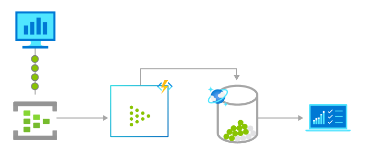

# Azure Functions scenarios

We often build systems to react to a series of critical events. Whether you're building a web API, responding to database changes, processing  event data streams, or even managing message queues - Azure Functions can be used to implement them.

In many cases, a function [integrates with an array of cloud services](./functions-triggers-bindings.md) to provide feature-rich implementations.

The following are a common, _but by no means exhaustive_, set of scenarios for Azure Functions.

Choose your development language at the top of the article.

::: zone pivot="programming-language-csharp,programming-language-javascript"
## Process file uploads

There are several ways to use functions to process files into or out of a blob storage container. To learn more about options for triggering on a blob container, see [Working with blobs](./storage-considerations.md#working-with-blobs) in the best practices documentation. 

The following tutorial uses an Event Grid trigger to resize an image in a blob container:

::: zone-end
::: zone pivot="programming-language-csharp" 
+ [Upload and analyze a file with Azure Functions and Blob Storage](../storage/blobs/blob-upload-function-trigger.md?tabs=dotnet)
::: zone-end
::: zone pivot="programming-language-javascript" 
+ [Upload and analyze a file with Azure Functions and Blob Storage](../storage/blobs/blob-upload-function-trigger.md?tabs=nodejsv10)
::: zone-end

## Real-time stream processing

Huge amounts of telemetry data is collected from a massive cloud app. That data is processed in near real-time and stored in a DB for use in an analytics dashboard.

::: zone pivot="programming-language-csharp,programming-language-python,programming-language-javascript" 
## Data processing and AI

Functions can connect to other services to help process data and perform other AI-related tasks.
::: zone-end
::: zone pivot="programming-language-csharp"
+ Sample: [Text Summarization using AI Cognitive Language Service](https://github.com/Azure-Samples/function-csharp-ai-textsummarize)
::: zone-end
::: zone pivot="programming-language-javascript"
+ Training: [Create a custom skill for Azure Cognitive Search](/training/modules/create-enrichment-pipeline-azure-cognitive-search)
::: zone-end
::: zone pivot="programming-language-python"
+ Tutorial: [Apply machine learning models in Azure Functions with Python and TensorFlow](./functions-machine-learning-tensorflow.md)
+ Tutorial: [Deploy a pretrained image classification model to Azure Functions with PyTorch](./machine-learning-pytorch.md)
::: zone-end

## Run scheduled tasks 

Functions provides a great way to run your code based on a [cron schedule](./functions-bindings-timer.md#usage) that you define. To learn more, see [Create a function in the Azure portal that runs on a schedule](./functions-create-scheduled-function.md). For example, a financial services customer database is analyzed for duplicate entries every 15 minutes, to avoid multiple communications being sent out to same customers.

::: zone pivot="programming-language-csharp,programming-language-java"
## Build a scalable web API

An HTTP triggered function defines an HTTP endpoint. These endpoints run function code that can connect to other services directly or by using binding extensions. You can compose the endpoints into a web-based API. For examples, see the following:
::: zone-end
::: zone pivot="programming-language-csharp" 
+ Article: [Create serverless APIs in Visual Studio using Azure Functions and API Management integration](./openapi-apim-integrate-visual-studio.md) 
+ Training: [Expose multiple function apps as a consistent API by using Azure API Management](/training/modules/build-serverless-api-with-functions-api-management/)
+ Sample: [Web Application with a C# API and Azure SQL DB on Static Web Apps and Functions](/samples/azure-samples/todo-csharp-sql-swa-func/todo-csharp-sql-swa-func/)
::: zone-end
::: zone pivot="programming-language-java"
+ Training: [Develop Java serverless Functions on Azure using Maven](/training/modules/develop-azure-functions-app-with-maven-plugin/)
::: zone-end  
   
::: zone pivot="programming-language-javascript"
## Respond to a GitHub webhook

You can create an HTTP triggered function endpoint that can consume a webhook, such as GitHub webhooks. In this way, you can create functions that process data from GitHub events. To learn more, see [Monitor GitHub events by using a webhook with Azure Functions](/training/modules/monitor-github-events-with-a-function-triggered-by-a-webhook/).
::: zone-end  

::: zone pivot="programming-language-csharp" 
## Build a serverless workflow

Functions is often the compute component in a serverless workflow topology, such as a Logic Apps workflow. You can also create long-running orchestrations using the Durable Functions extension. 
::: zone-end

::: zone pivot="programming-language-csharp" 
+ Tutorial: [Create a function to integrate with Azure Logic Apps](./functions-twitter-email.md)
+ Quickstart: [Create your first durable function in Azure using C#](./durable/durable-functions-create-first-csharp.md)
+ Training: [Deploy serverless APIs with Azure Functions, Logic Apps, and Azure SQL Database](/training/modules/deploy-backend-apis/)
::: zone-end
::: zone pivot="programming-language-javascript" 
+ Quickstart: [Create your first durable function in Azure using JavaScript](./durable/quickstart-js-vscode.md)
+ Training: [Deploy serverless APIs with Azure Functions, Logic Apps, and Azure SQL Database](/training/modules/deploy-backend-apis/)
::: zone-end
::: zone pivot="programming-language-python" 
+ Quickstart: [Create your first durable function in Azure using Python](./durable/quickstart-python-vscode.md)
+ Training: [Deploy serverless APIs with Azure Functions, Logic Apps, and Azure SQL Database](/training/modules/deploy-backend-apis/)
::: zone-end
::: zone pivot="programming-language-java" 
+ Quickstart: [Create your first durable function in Azure using Java](./durable/quickstart-java.md)
::: zone-end
::: zone pivot="programming-language-powershell" 
+ Quickstart: [Create your first durable function in Azure using PowerShell](./durable/quickstart-powershell-vscode.md)
::: zone-end

::: zone pivot="programming-language-csharp,programming-language-javascript,programming-language-python" 
## Respond to database changes

There are processes where you might need to log, audit, or perform some other operation when stored data changes. Functions triggers provide a good way to get notified of data changes to initial such an operation. Consider the following examples:
::: zone-end

::: zone pivot="programming-language-csharp" 
+ Article: [Connect Azure Functions to Azure Cosmos DB using Visual Studio Code](functions-add-output-binding-cosmos-db-vs-code.md?pivots=programming-language-csharp&tabs=isolated-process)
+ Article: [Connect Azure Functions to Azure SQL Database using Visual Studio Code](functions-add-output-binding-azure-sql-vs-code.md?pivots=programming-language-csharp&tabs=isolated-process)
+ Article: [Use Azure Functions to clean-up an Azure SQL Database](./functions-scenario-database-table-cleanup.md)
::: zone-end
::: zone pivot="programming-language-javascript" 
+ Article: [Connect Azure Functions to Azure Cosmos DB using Visual Studio Code](functions-add-output-binding-cosmos-db-vs-code.md?pivots=programming-language-javascript)
+ Article: [Connect Azure Functions to Azure SQL Database using Visual Studio Code](functions-add-output-binding-azure-sql-vs-code.md?pivots=programming-language-javascript)
::: zone-end
::: zone pivot="programming-language-python" 
+ Article: [Connect Azure Functions to Azure Cosmos DB using Visual Studio Code](functions-add-output-binding-cosmos-db-vs-code.md?pivots=programming-language-python)
+ Article: [Connect Azure Functions to Azure SQL Database using Visual Studio Code](functions-add-output-binding-azure-sql-vs-code.md?pivots=programming-language-python)
::: zone-end

## Create reliable message systems 

You can use Functions with Azure messaging services to create event-driven messaging systems. For example, you can use triggers on Azure Storage queues as a way to chain together a series of function executions. The following article shows how to write output to a storage queue.

::: zone pivot="programming-language-csharp" 
+ Article: [Connect Azure Functions to Azure Storage using Visual Studio Code](functions-add-output-binding-storage-queue-vs-code.md?pivots=programming-language-csharp&tabs=isolated-process)
+ Article: [Create a function triggered by Azure Queue storage (Azure portal)](functions-create-storage-queue-triggered-function.md)
::: zone-end
::: zone pivot="programming-language-javascript" 
+ Article: [Connect Azure Functions to Azure Storage using Visual Studio Code](functions-add-output-binding-storage-queue-vs-code.md?pivots=programming-language-javascript)
+ Article: [Create a function triggered by Azure Queue storage (Azure portal)](functions-create-storage-queue-triggered-function.md)
+ Training: [Chain Azure Functions together using input and output bindings](/training/modules/chain-azure-functions-data-using-bindings/)
::: zone-end
::: zone pivot="programming-language-python" 
+ Article: [Connect Azure Functions to Azure Storage using Visual Studio Code](functions-add-output-binding-storage-queue-vs-code.md?pivots=programming-language-python)
+ Article: [Create a function triggered by Azure Queue storage (Azure portal)](functions-create-storage-queue-triggered-function.md)
::: zone-end
::: zone pivot="programming-language-java" 
+ Article: [Connect Azure Functions to Azure Storage using Visual Studio Code](functions-add-output-binding-storage-queue-vs-code.md?pivots=programming-language-java)
+ Article: [Create a function triggered by Azure Queue storage (Azure portal)](functions-create-storage-queue-triggered-function.md)
::: zone-end
::: zone pivot="programming-language-powershell" 
+ Article: [Connect Azure Functions to Azure Storage using Visual Studio Code](functions-add-output-binding-storage-queue-vs-code.md?pivots=programming-language-powershell)
+ Article: [Create a function triggered by Azure Queue storage (Azure portal)](functions-create-storage-queue-triggered-function.md)
+ Training: [Chain Azure Functions together using input and output bindings](/training/modules/chain-azure-functions-data-using-bindings/)
::: zone-end

## Process data in real-time 

Your functions can use low-latency event triggers, like Event Grid, and real-time outputs like SignalR to process data in near-real-time.  
 
::: zone pivot="programming-language-csharp" 
+ Tutorial: [Trigger Azure Functions on blob containers using an event subscription](functions-event-grid-blob-trigger.md?pivots=programming-language-csharp)
::: zone-end
::: zone pivot="programming-language-javascript" 
+ Tutorial: [Trigger Azure Functions on blob containers using an event subscription](functions-event-grid-blob-trigger.md?pivots=programming-language-javascript)
+ Training: [Enable automatic updates in a web application using Azure Functions and SignalR Service](/training/modules/automatic-update-of-a-webapp-using-azure-functions-and-signalr/)
::: zone-end
::: zone pivot="programming-language-python" 
+ Tutorial: [Trigger Azure Functions on blob containers using an event subscription](functions-event-grid-blob-trigger.md?pivots=programming-language-python)
::: zone-end
::: zone pivot="programming-language-java" 
+ Tutorial: [Trigger Azure Functions on blob containers using an event subscription](functions-event-grid-blob-trigger.md?pivots=programming-language-java)
::: zone-end
::: zone pivot="programming-language-powershell" 
+ Tutorial: [Trigger Azure Functions on blob containers using an event subscription](functions-event-grid-blob-trigger.md?pivots=programming-language-powershell)
::: zone-end

## Next steps

> [!div class="nextstepaction"]
> [Getting started with Azure Functions](./functions-get-started.md)

