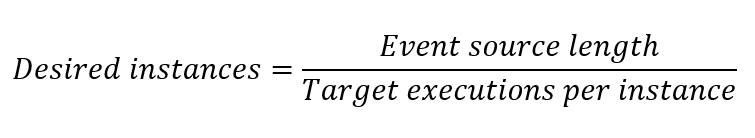

# Target-based scaling

Target-based scaling provides a fast and intuitive scaling model for customers and is currently supported for the following extensions:

- Service Bus queues and topics
- Storage Queues
- Event Hubs
- Azure Cosmos DB

Target-based scaling replaces the previous Azure Functions incremental scaling model as the default for these extension types. Incremental scaling added or removed a maximum of one worker at [each new instance rate](event-driven-scaling.md#understanding-scaling-behaviors), with complex decisions for when to scale. In contrast, target-based scaling allows scale up of four instances at a time, and the scaling decision is based on a simple target-based equation:



The default _target executions per instance_ values come from the SDKs used by the Azure Functions extensions. You don't need to make any changes for target-based scaling to work.

## Considerations

The following considerations apply when using target-based scaling:

+ Target-based scaling is enabled by default for function apps on the Consumption plan or for Premium plans, but you can [opt-out](#opting-out). Event-driven scaling isn't supported when running on Dedicated (App Service) plans. 
+ Your [function app runtime version](set-runtime-version.md) must be 4.3.0 or a later version.
+ Target Based Scaling is enabled by default on function app runtime 4.19.0 or a later version.
+ When using target-based scaling, the `functionAppScaleLimit` site setting is still honored. For more information, see [Limit scale out](event-driven-scaling.md#limit-scale-out).
+ To achieve the most accurate scaling based on metrics, use only one target-based triggered function per function app.
+ When multiple functions in the same function app are all requesting to scale out at the same time, a sum across those functions is used to determine the change in desired instances. Functions requesting to scale-out override functions requesting to scale-in.
+ When there are scale-in requests without any scale-out requests, the max scale in value is used. 

## Opting out

Target-based scaling is enabled by default for function apps hosted on a Consumption plan or on a Premium plans. To disable target-based scaling and fall back to incremental scaling, add the following app setting to your function app:

|          App Setting          | Value |
| ----------------------------- | ----- |
|`TARGET_BASED_SCALING_ENABLED` |   0   |

## Customizing target-based scaling

You can make the scaling behavior more or less aggressive based on your app's workload by adjusting _target executions per instance_. Each extension has different settings that you can use to set _target executions per instance_. 

This table summarizes the `host.json` values that are used for the _target executions per instance_ values and the defaults:

| Extension                                                      | host.json values                                                  | Default Value |
| -------------------------------------------------------------- | ----------------------------------------------------------------- | ------------- |
| Service Bus (Extension v5.x+, Single Dispatch)                 | extensions.serviceBus.maxConcurrentCalls                          |       16      |
| Service Bus (Extension v5.x+, Single Dispatch Sessions Based)  | extensions.serviceBus.maxConcurrentSessions                       |       8       |
| Service Bus (Extension v5.x+, Batch Processing)                | extensions.serviceBus.maxMessageBatchSize                         |       1000    |
| Service Bus (Functions v2.x+, Single Dispatch)                 | extensions.serviceBus.messageHandlerOptions.maxConcurrentCalls    |       16      |
| Service Bus (Functions v2.x+, Single Dispatch Sessions Based)  | extensions.serviceBus.sessionHandlerOptions.maxConcurrentSessions |       2000    |
| Service Bus (Functions v2.x+, Batch Processing)                | extensions.serviceBus.batchOptions.maxMessageCount                |       1000    |
| Event Hubs (Extension v5.x+)                                   | extensions.eventHubs.maxEventBatchSize                            |       10      |
| Event Hubs (Extension v3.x+)                                   | extensions.eventHubs.eventProcessorOptions.maxBatchSize           |       10      |
| Event Hubs (if defined)                                        | extensions.eventHubs.targetUnprocessedEventThreshold              |       n/a     |
| Storage Queue                                                  | extensions.queues.batchSize                                       |       16      |

For Azure Cosmos DB _target executions per instance_ is set in the function attribute:

| Extension         | Function trigger setting | Default Value | 
| ----------------- | ------------------------ | ------------- |
| Azure Cosmos DB   | maxItemsPerInvocation    |  100          |

To learn more, see the [example configurations for the supported extensions](#supported-extensions).

## Premium plan with runtime scale monitoring enabled

In [runtime scale monitoring](functions-networking-options.md?tabs=azure-cli#premium-plan-with-virtual-network-triggers), the extensions handle target-based scaling. Hence, in addition to the function app runtime version requirement, your extension packages must meet the following minimum versions:

| Extension Name | Minimum Version Needed | 
| -------------- | ---------------------- |
| Storage Queue  |         5.1.0          |
| Event Hubs     |         5.2.0          |
| Service Bus    |         5.9.0          |
| Azure Cosmos DB      |         4.1.0          |

## Dynamic concurrency support

Target-based scaling introduces faster scaling, and uses defaults for _target executions per instance_. When using Service Bus or Storage queues, you can also enable [dynamic concurrency](functions-concurrency.md#dynamic-concurrency). In this configuration, the _target executions per instance_ value is determined automatically by the dynamic concurrency feature. It starts with limited concurrency and identifies the best setting over time.

## Supported extensions

The way in which you configure target-based scaling in your host.json file depends on the specific extension type. This section provides the configuration details for the extensions that currently support target-based scaling.

### Service Bus queues and topics

The Service Bus extension support three execution models, determined by the `IsBatched` and `IsSessionsEnabled` attributes of your Service Bus trigger. The default value for `IsBatched` and `IsSessionsEnabled` is `false`.

| Execution Model                            | IsBatched | IsSessionsEnabled | Setting Used for _target executions per instance_ |
| ------------------------------------------ | --------- | ----------------- | ------------------------------------------------- |
| Single dispatch processing                 | false     | false             | maxConcurrentCalls                                |
| Single dispatch processing (session-based) | false     | true              | maxConcurrentSessions                             |
| Batch processing                           | true      | false             | maxMessageBatchSize or maxMessageCount            |

> [!NOTE]
> **Scale efficiency:** For the Service Bus extension, use _Manage_ rights on resources for the most efficient scaling. With _Listen_ rights scaling reverts to incremental scale because the queue or topic length can't be used to inform scaling decisions. To learn more about setting rights in Service Bus access policies, see [Shared Access Authorization Policy](../service-bus-messaging/service-bus-sas.md#shared-access-authorization-policies).


#### Single dispatch processing

In this model, each invocation of your function processes a single message. The `maxConcurrentCalls` setting governs _target executions per instance_. The specific setting depends on the version of the Service Bus extension.

# [v5.x+](#tab/v5)

Modify the `host.json` setting `maxConcurrentCalls`, as in the following example:

```json
{
    "version": "2.0",
    "extensions": {
        "serviceBus": {
            "maxConcurrentCalls": 16
        }
    }
}
```

# [v2.x+](#tab/v2)

Modify the `host.json` setting `maxConcurrentCalls` in `messageHandlerOptions`, as in the following example:

```json
{
    "version": "2.0",
    "extensions": {
        "serviceBus": {
            "messageHandlerOptions": {
                "maxConcurrentCalls": 16
            }
        }
    }
}
```
---

#### Single dispatch processing (session-based)

In this model, each invocation of your function processes a single message. However, depending on the number of active sessions for your Service Bus topic or queue, each instance leases one or more sessions. The specific setting depends on the version of the Service Bus extension.

# [v5.x+](#tab/v5)

Modify the `host.json` setting `maxConcurrentSessions` to set _target executions per instance_, as in the following example:

```json
{
    "version": "2.0",
    "extensions": {
        "serviceBus": {
            "maxConcurrentSessions": 8
        }
    }
}
```

# [v2.x+](#tab/v2)

Modify the `host.json` setting `maxConcurrentSessions` in `sessionHandlerOptions`  to set _target executions per instance_, as in the following example:

```json
{
    "version": "2.0",
    "extensions": {
        "serviceBus": {
            "sessionHandlerOptions": {
                "maxConcurrentSessions": 2000
            }
        }
    }
}
```
---

#### Batch processing

In this model, each invocation of your function processes a batch of messages. The specific setting depends on the version of the Service Bus extension.

# [v5.x+](#tab/v5)

Modify the `host.json` setting `maxMessageBatchSize`  to set _target executions per instance_, as in the following example:
```json
{
    "version": "2.0",
    "extensions": {
        "serviceBus": {
            "maxMessageBatchSize": 1000
        }
    }
}
```

# [v2.x+](#tab/v2)

Modify the `host.json` setting `maxMessageCount` in `batchOptions`  to set _target executions per instance_, as in the following example:

```json
{
    "version": "2.0",
    "extensions": {
        "serviceBus": {
            "batchOptions": {
                "maxMessageCount": 1000
            }
        }
    }
}
```
---

### Event Hubs

For Azure Event Hubs, Azure Functions scales based on the number of unprocessed events distributed across all the partitions in the event hub. By default, the `host.json` attributes used for _target executions per instance_ are `maxEventBatchSize` and `maxBatchSize`. However, if you choose to fine-tune target-based scaling, you can define a separate parameter `targetUnprocessedEventThreshold` that overrides to set _target executions per instance_ without changing the batch settings. If `targetUnprocessedEventThreshold` is set, the total unprocessed event count is divided by this value to determine the number of instances, which is then be rounded up to a worker instance count that creates a balanced partition distribution.

> [!NOTE]
> Since Event Hubs is a partitioned workload, the target instance count for Event Hubs is capped by the number of partitions in your event hub. 

The specific setting depends on the version of the Event Hubs extension.

# [v5.x+](#tab/v5)

Modify the `host.json` setting `maxEventBatchSize` to set _target executions per instance_, as in the following example:

```json
{
    "version": "2.0",
    "extensions": {
        "eventHubs": {
            "maxEventBatchSize" : 10
        }
    }
}
```

When defined in `host.json`, `targetUnprocessedEventThreshold` is used as _target executions per instance_ instead of `maxEventBatchSize`, as in the following example:

```json
{
    "version": "2.0",
    "extensions": {
        "eventHubs": {
            "targetUnprocessedEventThreshold": 23
        }
    }
}
```

# [v3.x+](#tab/v2)

For **v3.x+** of the Event Hubs extension, modify the `host.json` setting `maxBatchSize` under `eventProcessorOptions` to set _target executions per instance_:
```json
{
    "version": "2.0",
    "extensions": {
        "eventHubs": {
            "eventProcessorOptions": {
                "maxBatchSize": 10
            }
        }
    }
}
```

When defined in `host.json`, `targetUnprocessedEventThreshold` is used as _target executions per instance_ instead of `maxBatchSize`, as in the following example:

```json
{
    "version": "2.0",
    "extensions": {
        "eventHubs": {
            "targetUnprocessedEventThreshold": 23
        }
    }
}
```
---

### Storage Queues

For **v2.x+** of the Storage extension, modify the `host.json` setting `batchSize` to set _target executions per instance_:
```json
{
    "version": "2.0",
    "extensions": {
        "queues": {
            "batchSize": 16
        }
    }
}
```

> [!NOTE]
> **Scale efficiency:** For the storage queue extension, messages with [visibilityTimeout](/rest/api/storageservices/put-message#uri-parameters) are still counted in _event source length_ by the Storage Queue APIs. This can cause overscaling of your function app. Consider using Service Bus queues que scheduled messages, [limiting scale out](event-driven-scaling.md#limit-scale-out), or not using visibilityTimeout for your solution.


### Azure Cosmos DB

Azure Cosmos DB uses a function-level attribute, `MaxItemsPerInvocation`. The way you set this function-level attribute depends on your function language.

# [C#](#tab/csharp)

For a compiled C# function, set `MaxItemsPerInvocation` in your trigger definition, as shown in the following examples for an in-process C# function:

```C#
namespace CosmosDBSamplesV2
{
    public static class CosmosTrigger
    {
        [FunctionName("CosmosTrigger")]
        public static void Run([CosmosDBTrigger(
            databaseName: "ToDoItems",
            collectionName: "Items",
            MaxItemsPerInvocation: 100,
            ConnectionStringSetting = "CosmosDBConnection",
            LeaseCollectionName = "leases",
            CreateLeaseCollectionIfNotExists = true)]IReadOnlyList<Document> documents,
            ILogger log)
        {
            if (documents != null && documents.Count > 0)
            {
                log.LogInformation($"Documents modified: {documents.Count}");
                log.LogInformation($"First document Id: {documents[0].Id}");
            }
        }
    }
}

```

# [Java](#tab/java) 

Java example pending.

# [JavaScript/PowerShell/Python](#tab/node+powershell+python)

For Functions languages that use `function.json`, the `MaxItemsPerInvocation` parameter is defined in the specific binding, as in this Azure Cosmos DB trigger example:

```json
{
  "bindings": [
    {
      "type": "cosmosDBTrigger",
      "maxItemsPerInvocation": 100,
      "connection": "MyCosmosDb",
      "leaseContainerName": "leases",
      "containerName": "collectionName",
      "databaseName": "databaseName",
      "leaseDatabaseName": "databaseName",
      "createLeaseContainerIfNotExists": false,
      "startFromBeginning": false,
      "name": "input"
    }
  ]
}
```

Examples for the Python v2 programming model and the JavaScript v4 programming model aren't yet available.

---

> [!NOTE]
> Since Azure Cosmos DB is a partitioned workload, the target instance count for the database is capped by the number of physical partitions in your container. To learn more about Azure Cosmos DB scaling, see [physical partitions](../cosmos-db/nosql/change-feed-processor.md#dynamic-scaling) and [lease ownership](../cosmos-db/nosql/change-feed-processor.md#dynamic-scaling).

## Next steps

To learn more, see the following articles:

+ [Improve the performance and reliability of Azure Functions](./performance-reliability.md)
+ [Azure Functions reliable event processing](./functions-reliable-event-processing.md)
