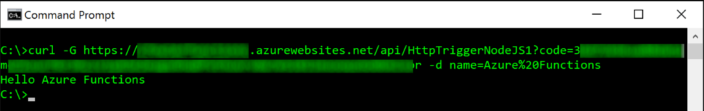
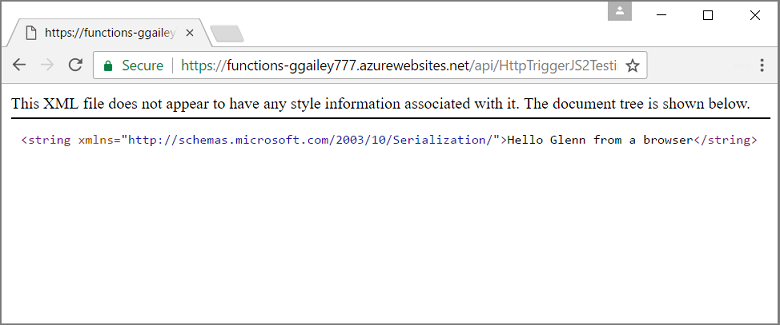
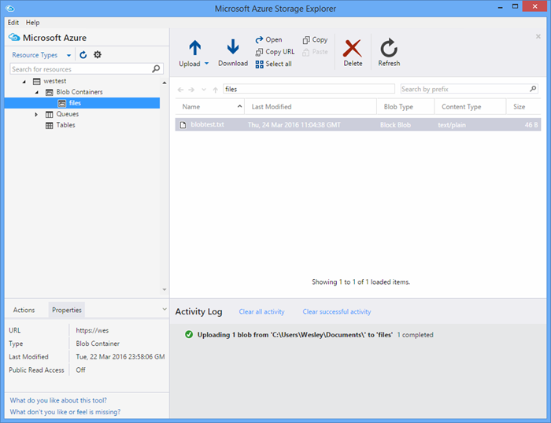

<properties
   pageTitle="Testing Azure Functions | Microsoft Azure"
   description="Test your Azure Functions using Postman, cURL, and Node.js."
   services="functions"
   documentationCenter="na"
   authors="wesmc7777"
   manager="erikre"
   editor=""
   tags=""
   keywords="azure functions, functions, event processing, webhooks, dynamic compute, serverless architecture, testing"/>

<tags
   ms.service="functions"
   ms.devlang="multiple"
   ms.topic="article"
   ms.tgt_pltfrm="multiple"
   ms.workload="na"
   ms.date="03/30/2016"
   ms.author="wesmc"/>

# Testing Azure Functions

## Overview

In this tutorial, we will walk through different approaches to testing functions. We will define a http trigger function that accepts input through a query string parameter, or the request body. The default **HttpTrigger Node.js Function** template code supports a `name` query string parameter. We will also add code to support that parameter along with `address` information for the user in the request body.

## Create a function for testing

For most of this tutorial, we will use a slightly modified version of the **HttpTrigger Nodejs Function** template that is available when creating a new function.  You can review the [Create your first Azure Function tutorial](functions-create-first-azure-function.md) if you need help creating a new function.  Just choose the **HttpTrigger Nodejs Function** template when creating the test function in the [Azure Portal].

The default function template is basically a hello world function that echos back the name from the request body or query string parameter, `name=<your name>`.  We will update the code to also allow you to provide the name and an address as JSON content in the request body. Then the function will echo these back to the client when available.   

Update the function with the following code which we will use for testing:

	module.exports = function(context, req) {
	    context.log("Node.js HTTP trigger function processed a request. RequestUri=%s", req.originalUrl);
	    context.log("Request Headers = " + JSON.stringify(req.headers));    
	
	    if (req.query.name || (req.body && req.body.name)) {
	        if (typeof req.query.name != "undefined") {
	            context.log("Name was provided as a query string param..."); 
	            ProcessNewUserInformation(context, req.query.name);
	        }
	        else {
	            context.log("Processing user info from request body..."); 
	            ProcessNewUserInformation(context, req.body.name, req.body.address);
	        }
	    }
	    else {
	        context.res = {
	            status: 400,
	            body: "Please pass a name on the query string or in the request body"
	        };
	    }
	    context.done();
	};
	
	function ProcessNewUserInformation(context, name, address)
	{    
	    context.log("Processing User Information...");            
	    context.log("name = " + name);            
	    echoString = "Hello " + name;
	    
	    if (typeof address != "undefined")
	    {
	        echoString += "\n" + "The address you provided is " + address;
	        context.log("address = " + address);            
	    }
	    
	    context.res = {
	            // status: 200, /* Defaults to 200 */
	            body: echoString
	        };
	}

## Test a function with Tools

### Test with cURL

Often when testing software, it's not necessary to look any further than the command-line to help debug your application, this is no different with functions.

To test the function above, copy the **Function Url** from the portal. It will have the following form: 

    https://<Your Function App>.azurewebsites.net/api/<Your Function Name>?code=<your access code>
    
This is the Url for triggering your function, we can test this by using the cURL command on the command-line to make a Get (`-G` or `--get`) request against our function:

    curl -G https://<Your Function App>.azurewebsites.net/api/<Your Function Name>?code=<your access code>
    
This particular example above requires a query string parameter which can be passed as Data (`-d`) in the cURL command:

    curl -G https://<Your Function App>.azurewebsites.net/api/<Your Function Name>?code=<your access code> -d name=<Enter a name here>
    
Hit enter and you will see the output of the function on the command-line.

In the portal **Logs** window, output similar to the following is logged while executing the function:

    2016-04-05T21:55:09  Welcome, you are now connected to log-streaming service.
    2016-04-05T21:55:30.738 Function started (Id=ae6955da-29db-401a-b706-482fcd1b8f7a)
    2016-04-05T21:55:30.738 Node.js HTTP trigger function processed a request. RequestUri=https://functionsExample.azurewebsites.net/api/HttpTriggerNodeJS1?code=XXXXXXX&name=Azure Functions
    2016-04-05T21:55:30.738 Function completed (Success, Id=ae6955da-29db-401a-b706-482fcd1b8f7a)

### Test with a browser

Functions that do not require parameters, or only need query string parameters, can be tested using a browser.

To test the function we defined above, copy the **Function Url** from the portal. It will have the following form:

	https://<Your Function App>.azurewebsites.net/api/<Your Function Name>?code=<your access code>

Append the `name` query string parameter as follows, using an actual name for the `<Enter a name here>` placeholder.

	https://<Your Function App>.azurewebsites.net/api/<Your Function Name>?code=<your access code>&name=<Enter a name here>

Paste the URL into your browser and you should get a response similar to the following.

In the portal **Logs** window, output similar to the following is logged while executing the function:

	2016-03-23T07:34:59  Welcome, you are now connected to log-streaming service.
	2016-03-23T07:35:09.195 Function started (Id=61a8c5a9-5e44-4da0-909d-91d293f20445)
	2016-03-23T07:35:10.338 Node.js HTTP trigger function processed a request. RequestUri=https://functionsExample.azurewebsites.net/api/WesmcHttpTriggerNodeJS1?code=XXXXXXXXXX==&name=Wes from a browser
	2016-03-23T07:35:10.338 Request Headers = {"cache-control":"max-age=0","connection":"Keep-Alive","accept":"text/html","accept-encoding":"gzip","accept-language":"en-US"}
	2016-03-23T07:35:10.338 Name was provided as a query string param.
	2016-03-23T07:35:10.338 Processing User Information...
	2016-03-23T07:35:10.369 Function completed (Success, Id=61a8c5a9-5e44-4da0-909d-91d293f20445)

### Test with Postman

The recommended tool to test most of your functions is Postman. To install Postman, see [Get Postman](https://www.getpostman.com/). Postman provides control over many more attributes of an HTTP request.

> [AZURE.TIP] Use the REST Client in which you are comfortable. Here are some alternatives to Postman:  
> 
> * [Fiddler](http://www.telerik.com/fiddler)  
> * [Paw](https://luckymarmot.com/paw)  

To test the function with a request body in Postman: 

1. Launch Postman from the **Apps** button in the upper left of corner of a Chrome browser window.
2. Copy your **Function Url** and paste it into Postman. It includes the access code query string parameter.
3. Change the HTTP method to **POST**.
4. Click **Body** > **raw** and add JSON request body similar to the following:

		{
		    "name" : "Wes testing with Postman",
		    "address" : "Seattle, W.A. 98101"
		}

5. Click **Send**.

The following image shows testing the simple echo function example in this tutorial. 

In the portal **Logs** window, output similar to the following is logged while executing the function:

	2016-03-23T08:04:51  Welcome, you are now connected to log-streaming service.
	2016-03-23T08:04:57.107 Function started (Id=dc5db8b1-6f1c-4117-b5c4-f6b602d538f7)
	2016-03-23T08:04:57.763 Node.js HTTP trigger function processed a request. RequestUri=https://functions841def78.azurewebsites.net/api/WesmcHttpTriggerNodeJS1?code=XXXXXXXXXX==
	2016-03-23T08:04:57.763 Request Headers = {"cache-control":"no-cache","connection":"Keep-Alive","accept":"*/*","accept-encoding":"gzip","accept-language":"en-US"}
	2016-03-23T08:04:57.763 Processing user info from request body...
	2016-03-23T08:04:57.763 Processing User Information...
	2016-03-23T08:04:57.763 name = Wes testing with Postman
	2016-03-23T08:04:57.763 address = Seattle, W.A. 98101
	2016-03-23T08:04:57.795 Function completed (Success, Id=dc5db8b1-6f1c-4117-b5c4-f6b602d538f7)
    
### Test a blob trigger using Storage Explorer

You can test a blob trigger function using [Microsoft Azure Storage Explorer](http://storageexplorer.com/).

1. In the [Azure Portal] for your Functions app, create a new C# or Node blob trigger function. Set the path to monitor to the name of your blob container. For example:

		files

2. Click the **+** button to select or create the storage account you want to use. Then click **Create**.

3. Create a text file with the following text and save it:

		A text file for blob trigger function testing.

4. Run [Microsoft Azure Storage Explorer](http://storageexplorer.com/) and connect to the blob container in the storage account being monitored.

5. Click the **Upload** button and upload the text file.

	

	The default blob trigger function code will report the processing of the blob in the logs:

		2016-03-24T11:30:10  Welcome, you are now connected to log-streaming service.
		2016-03-24T11:30:34.472 Function started (Id=739ebc07-ff9e-4ec4-a444-e479cec2e460)
		2016-03-24T11:30:34.472 C# Blob trigger function processed: A text file for blob trigger function testing.
		2016-03-24T11:30:34.472 Function completed (Success, Id=739ebc07-ff9e-4ec4-a444-e479cec2e460)

## Test a function within functions

### Test with the functions portal run button

The portal provides a **Run** button which will allow you to do some limited testing. You can provide a request body using the run button but, you can't provide query string parameters or update request headers.

Test the HTTP trigger function we created earlier by adding a JSON string similar to the following in the **Request body** field then click the **Run** button.

	{
		"name" : "Wes testing Run button",
		"address" : "USA"
	} 

In the portal **Logs** window, output similar to the following is logged while executing the function:

	2016-03-23T08:03:12  Welcome, you are now connected to log-streaming service.
	2016-03-23T08:03:17.357 Function started (Id=753a01b0-45a8-4125-a030-3ad543a89409)
	2016-03-23T08:03:18.697 Node.js HTTP trigger function processed a request. RequestUri=https://functions841def78.azurewebsites.net/api/wesmchttptriggernodejs1
	2016-03-23T08:03:18.697 Request Headers = {"connection":"Keep-Alive","accept":"*/*","accept-encoding":"gzip","accept-language":"en-US"}
	2016-03-23T08:03:18.697 Processing user info from request body...
	2016-03-23T08:03:18.697 Processing User Information...
	2016-03-23T08:03:18.697 name = Wes testing Run button
	2016-03-23T08:03:18.697 address = USA
	2016-03-23T08:03:18.744 Function completed (Success, Id=753a01b0-45a8-4125-a030-3ad543a89409)

### Test with a timer trigger

Some functions, can't be truly tested with the tools mentioned previously. For example, a queue trigger function which runs when a message is dropped into [Azure Queue Storage](../storage/storage-dotnet-how-to-use-queues.md). You could always write code to drop a message into your queue and an example of this in a console project is provided below. However, there is another approach you can use to test with functions directly.  

You could use a timer trigger configured with a queue output binding. That timer trigger code could then write the test messages to the queue. This section will walk through through an example. 

For more in-depth information on using bindings with Azure Functions, see the [Azure Functions developer reference](functions-reference.md). 

#### Create queue trigger for testing

To demonstrate this approach, we will first create a queue trigger function that we want to test for a queue named `queue-newusers`. This function will process name and address information for a new user dropped into Azure queue storage. 

> [AZURE.NOTE] If you use a different queue name, make sure the name you use conforms to the [Naming Queues and MetaData](https://msdn.microsoft.com/library/dd179349.aspx) rules.  Otherwise, you will get a HTTP Status code 400 : Bad Request. 

1. In the [Azure Portal] for your Functions app, click **New Function** > **QueueTrigger - C#**.
2. Enter the queue name to be monitored by the queue funcion 

		queue-newusers 

3. Click the **+** (add) button to select or create the storage account you want to use. Then click **Create**.
4. Leave this portal browser window opened so you can monitor the log entries for the default queue function template code.

#### Create a timer trigger to drop a message in the queue

1. Open the [Azure Portal] in a new browser window and navigate to your Function app.
2. Click **New Function** > **TimerTrigger - C#**. Enter a cron expression to set how often the timer code will execute testing your queue function. Then click **Create**. If you want the test to run every 30 seconds you can use the following [CRON expression](https://wikipedia.org/wiki/Cron#CRON_expression):

		*/30 * * * * *

2. Click the **Integrate** tab for your new timer trigger.
3. Under **Output**, click the **+ New Output** button. Then click **queue** and the **Select** button.
4. Note the name you use for the **queue message object** you will use this in the timer function code.

		myQueue

4. Enter the queue name where the message will be sent: 

		queue-newusers 

3. Click the **+** (add) button to select the storage account you used previously with the queue trigger. Then click **Save**.
4. Click the **Develop** tab for your timer trigger.
5. You can use the following code for the C# timer function as long as you used the same queue message object name shown above. Then click **Save**

		using System;
		
		public static void Run(TimerInfo myTimer, out String myQueue, TraceWriter log)
		{
		    String newUser = 
		    "{\"name\":\"User testing from C# timer function\",\"address\":\"XYZ\"}";
		
		    log.Verbose($"C# Timer trigger function executed at: {DateTime.Now}");   
		    log.Verbose($"{newUser}");   
		    
		    myQueue = newUser;
		}

At this point C# timer function will execute every 30 seconds if you used the example cron expression. The logs for the timer function will report each execution:

	2016-03-24T10:27:02  Welcome, you are now connected to log-streaming service.
	2016-03-24T10:27:30.004 Function started (Id=04061790-974f-4043-b851-48bd4ac424d1)
	2016-03-24T10:27:30.004 C# Timer trigger function executed at: 3/24/2016 10:27:30 AM
	2016-03-24T10:27:30.004 {"name":"User testing from C# timer function","address":"XYZ"}
	2016-03-24T10:27:30.004 Function completed (Success, Id=04061790-974f-4043-b851-48bd4ac424d1)

In the browser window for the queue function, you will see the each message being processed:

	2016-03-24T10:27:06  Welcome, you are now connected to log-streaming service.
	2016-03-24T10:27:30.607 Function started (Id=e304450c-ff48-44dc-ba2e-1df7209a9d22)
	2016-03-24T10:27:30.607 C# Queue trigger function processed: {"name":"User testing from C# timer function","address":"XYZ"}
	2016-03-24T10:27:30.607 Function completed (Success, Id=e304450c-ff48-44dc-ba2e-1df7209a9d22)
	
## Test a function with Code

### Test a HTTP trigger function with Code: Node.js

You can use Node.js code to execute a http request to test your Azure Function. 

Make sure to set:

- The `host` in the request options to your function app host
- Your function name in the `path`.
- Your access code (`<your code>`) in the `path`.

Code Example:

	var http = require("http");
	
	var nameQueryString = "name=Wes%20Query%20String%20Test%20From%20Node.js";
	
	var nameBodyJSON = {
	    name : "Wes testing with Node.JS code",
	    address : "Dallas, T.X. 75201"
	};
	
	var bodyString = JSON.stringify(nameBodyJSON);
	
	var options = {
	  host: "functions841def78.azurewebsites.net",
	  //path: "/api/HttpTriggerNodeJS2?code=sc1wt62opn7k9buhrm8jpds4ikxvvj42m5ojdt0p91lz5jnhfr2c74ipoujyq26wab3wk5gkfbt9&" + nameQueryString,
	  path: "/api/HttpTriggerNodeJS2?code=sc1wt62opn7k9buhrm8jpds4ikxvvj42m5ojdt0p91lz5jnhfr2c74ipoujyq26wab3wk5gkfbt9",
	  method: "POST",
	  headers : {
	      "Content-Type":"application/json",
	      "Content-Length": Buffer.byteLength(bodyString)
	    }    
	};
	
	callback = function(response) {
	  var str = ""
	  response.on("data", function (chunk) {
	    str += chunk;
	  });
	
	  response.on("end", function () {
	    console.log(str);
	  });
	}
	
	var req = http.request(options, callback);
	console.log("*** Sending name and address in body ***");
	console.log(bodyString);
	req.end(bodyString);

Output:

	C:\Users\Wesley\testing\Node.js>node testHttpTriggerExample.js
	*** Sending name and address in body ***
	{"name" : "Wes testing with Node.JS code","address" : "Dallas, T.X. 75201"}
	Hello Wes testing with Node.JS code
	The address you provided is Dallas, T.X. 75201
		
In the portal **Logs** window, output similar to the following is logged while executing the function:

	2016-03-23T08:08:55  Welcome, you are now connected to log-streaming service.
	2016-03-23T08:08:59.736 Function started (Id=607b891c-08a1-427f-910c-af64ae4f7f9c)
	2016-03-23T08:09:01.153 Node.js HTTP trigger function processed a request. RequestUri=http://functionsExample.azurewebsites.net/api/WesmcHttpTriggerNodeJS1/?code=XXXXXXXXXX==
	2016-03-23T08:09:01.153 Request Headers = {"connection":"Keep-Alive","host":"functionsExample.azurewebsites.net"}
	2016-03-23T08:09:01.153 Name not provided as query string param. Checking body...
	2016-03-23T08:09:01.153 Request Body Type = object
	2016-03-23T08:09:01.153 Request Body = [object Object]
	2016-03-23T08:09:01.153 Processing User Information...
	2016-03-23T08:09:01.215 Function completed (Success, Id=607b891c-08a1-427f-910c-af64ae4f7f9c)
    

### Test a queue trigger function with Code: C# #

We mentioned earlier that you could test a queue trigger by using code to drop a message in your queue. The following example code is based off the C# code presented in the [Getting started with Azure Queue storage](../storage/storage-dotnet-how-to-use-queues.md) tutorial. Code for other languages is also available from that link.

To test this code in a console app you must:

- [Configure your storage connection string in the app.config file](../storage/storage-dotnet-how-to-use-queues.md#setup-a-storage-connection-string).
- This code accepts the name and address for a new user as command-line arguments during runtime. Pass a `name` and `address` as parameters to the app. For example, `C:\myQueueConsoleApp\test.exe "Wes testing queues" "in a console app"`

Example C# code:

    static void Main(string[] args)
    {
        string name = null;
        string address = null;
        string queueName = "queue-newusers";
        string JSON = null;

        if (args.Length > 0)
        {
            name = args[0];
        }
        if (args.Length > 1)
        {
            address = args[1];
        }

        // Retrieve storage account from connection string
        CloudStorageAccount storageAccount = CloudStorageAccount.Parse(ConfigurationManager.AppSettings["StorageConnectionString"]);

        // Create the queue client
        CloudQueueClient queueClient = storageAccount.CreateCloudQueueClient();

        // Retrieve a reference to a queue
        CloudQueue queue = queueClient.GetQueueReference(queueName);

        // Create the queue if it doesn't already exist
        queue.CreateIfNotExists();

        // Create a message and add it to the queue.
        if (name != null)
        {
            if (address != null)
                JSON = String.Format("{{\"name\":\"{0}\",\"address\":\"{1}\"}}", name, address);
            else
                JSON = String.Format("{{\"name\":\"{0}\"}}", name);
        }

        Console.WriteLine("Adding message to " + queueName + "...");
        Console.WriteLine(JSON);

        CloudQueueMessage message = new CloudQueueMessage(JSON);
        queue.AddMessage(message);
    }

In the browser window for the queue function, you will see the each message being processed:

	2016-03-24T10:27:06  Welcome, you are now connected to log-streaming service.
	2016-03-24T10:27:30.607 Function started (Id=e304450c-ff48-44dc-ba2e-1df7209a9d22)
	2016-03-24T10:27:30.607 C# Queue trigger function processed: {"name":"Wes testing queues","address":"in a console app"}
	2016-03-24T10:27:30.607 Function completed (Success, Id=e304450c-ff48-44dc-ba2e-1df7209a9d22)

<!-- URLs. -->

[Azure Portal]: https://portal.azure.com
