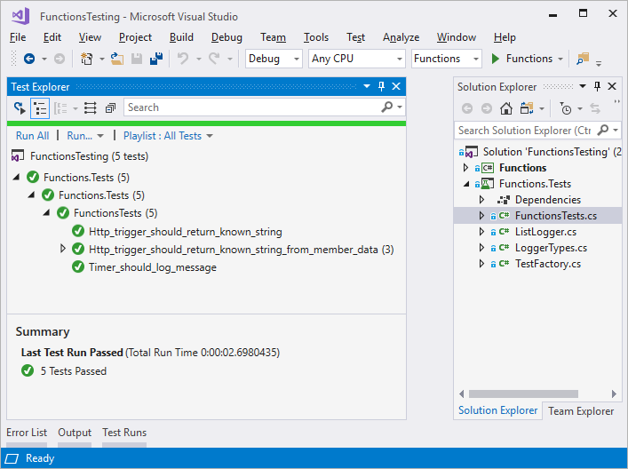
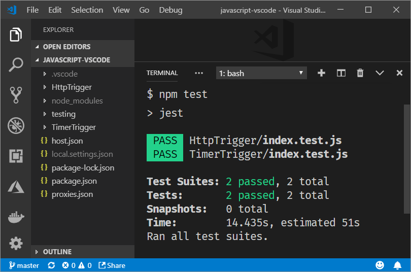

# Strategies for testing your code in Azure Functions

This article demonstrates how to create automated tests for Azure Functions.

Testing all code is recommended, however you may get the best results by wrapping up a Function's logic and creating tests outside the Function. Abstracting logic away limits a Function's lines of code and allows the Function to be solely responsible for calling other classes or modules. This article, however, demonstrates how to create automated tests against an HTTP and timer-triggered functions.

The content that follows is split into two different sections meant to target different languages and environments. You can learn to build tests in:

- [C# in Visual Studio with xUnit](#c-in-visual-studio)
- [JavaScript in VS Code with Jest](#javascript-in-vs-code)

The sample repository is available on [GitHub](https://github.com/Azure-Samples/azure-functions-tests).

## C# in Visual Studio

The following example describes how to create a C# Function app in Visual Studio and run and tests with [xUnit](https://xunit.github.io).



### Setup

To set up your environment, create a Function and test app. The following steps help you create the apps and functions required to support the tests:

1. [Create a new Functions app](./functions-create-first-azure-function.md) and name it **Functions**
2. [Create an HTTP function from the template](./functions-create-first-azure-function.md) and name it **MyHttpTrigger**.
3. [Create a timer function from the template](./functions-create-scheduled-function.md) and name it **MyTimerTrigger**.
4. [Create an xUnit Test app](https://xunit.github.io/docs/getting-started-dotnet-core) in the solution and name it **Functions.Tests**.
5. Use NuGet to add a reference from the test app to [Microsoft.AspNetCore.Mvc](https://www.nuget.org/packages/Microsoft.AspNetCore.Mvc/)
6. [Reference the *Functions* app](https://docs.microsoft.com/visualstudio/ide/managing-references-in-a-project?view=vs-2017) from *Functions.Tests* app.

### Create test classes

Now that the projects are created, you can create the classes used to run the automated tests.

Each function takes an instance of [ILogger](https://docs.microsoft.com/dotnet/api/microsoft.extensions.logging.ilogger) to handle message logging. Some tests either don't log messages or have no concern for how logging is implemented. Other tests need to evaluate messages logged to determine whether a test is passing.

You'll create a new class named `ListLogger` which holds an internal list of messages to evaluate during a testing. To implement the required `ILogger` interface, the class needs a scope. The following class mocks a scope for the test cases to pass to the `ListLogger` class.

Create a new class in *Functions.Tests* project named **NullScope.cs** and enter the following code:

```csharp
using System;

namespace Functions.Tests
{
    public class NullScope : IDisposable
    {
        public static NullScope Instance { get; } = new NullScope();

        private NullScope() { }

        public void Dispose() { }
    }
}
```

Next, create a new class in *Functions.Tests* project named **ListLogger.cs** and enter the following code:

```csharp
using Microsoft.Extensions.Logging;
using System;
using System.Collections.Generic;
using System.Text;

namespace Functions.Tests
{
    public class ListLogger : ILogger
    {
        public IList<string> Logs;

        public IDisposable BeginScope<TState>(TState state) => NullScope.Instance;

        public bool IsEnabled(LogLevel logLevel) => false;

        public ListLogger()
        {
            this.Logs = new List<string>();
        }

        public void Log<TState>(LogLevel logLevel,
                                EventId eventId,
                                TState state,
                                Exception exception,
                                Func<TState, Exception, string> formatter)
        {
            string message = formatter(state, exception);
            this.Logs.Add(message);
        }
    }
}
```

The `ListLogger` class implements the following members as contracted by the `ILogger` interface:

- **BeginScope**: Scopes add context to your logging. In this case, the test just points to the static instance on the `NullScope` class to allow the test to function.

- **IsEnabled**: A default value of `false` is provided.

- **Log**: This method uses the provided `formatter` function to format the message and then adds the resulting text to the `Logs` collection.

The `Logs` collection is an instance of `List<string>` and is initialized in the constructor.

Next, create a new file in *Functions.Tests* project named **LoggerTypes.cs** and enter the following code:

```csharp
namespace Functions.Tests
{
    public enum LoggerTypes
    {
        Null,
        List
    }
}
```

This enumeration specifies the type of logger used by the tests.

Now create a new class in *Functions.Tests* project named **TestFactory.cs** and enter the following code:

```csharp
using Microsoft.AspNetCore.Http;
using Microsoft.AspNetCore.Http.Internal;
using Microsoft.Extensions.Logging;
using Microsoft.Extensions.Logging.Abstractions;
using Microsoft.Extensions.Primitives;
using System.Collections.Generic;

namespace Functions.Tests
{
    public class TestFactory
    {
        public static IEnumerable<object[]> Data()
        {
            return new List<object[]>
            {
                new object[] { "name", "Bill" },
                new object[] { "name", "Paul" },
                new object[] { "name", "Steve" }

            };
        }

        private static Dictionary<string, StringValues> CreateDictionary(string key, string value)
        {
            var qs = new Dictionary<string, StringValues>
            {
                { key, value }
            };
            return qs;
        }

        public static HttpRequest CreateHttpRequest(string queryStringKey, string queryStringValue)
        {
            var context = new DefaultHttpContext();
            var request = context.Request;
            request.Query = new QueryCollection(CreateDictionary(queryStringKey, queryStringValue));
            return request;
        }

        public static ILogger CreateLogger(LoggerTypes type = LoggerTypes.Null)
        {
            ILogger logger;

            if (type == LoggerTypes.List)
            {
                logger = new ListLogger();
            }
            else
            {
                logger = NullLoggerFactory.Instance.CreateLogger("Null Logger");
            }

            return logger;
        }
    }
}
```

The `TestFactory` class implements the following members:

- **Data**: This property returns an [IEnumerable](https://docs.microsoft.com/dotnet/api/system.collections.ienumerable) collection of sample data. The key value pairs represent values that are passed into a query string.

- **CreateDictionary**: This method accepts a key/value pair as arguments and returns a new `Dictionary` used to create `QueryCollection` to represent query string values.

- **CreateHttpRequest**: This method creates an HTTP request initialized with the given query string parameters.

- **CreateLogger**: Based on the logger type, this method returns a logger class used for testing. The `ListLogger` keeps track of logged messages available for evaluation in tests.

Finally, create a new class in *Functions.Tests* project named **FunctionsTests.cs** and enter the following code:

```csharp
using Microsoft.AspNetCore.Mvc;
using Microsoft.Extensions.Logging;
using Xunit;

namespace Functions.Tests
{
    public class FunctionsTests
    {
        private readonly ILogger logger = TestFactory.CreateLogger();

        [Fact]
        public async void Http_trigger_should_return_known_string()
        {
            var request = TestFactory.CreateHttpRequest("name", "Bill");
            var response = (OkObjectResult)await MyHttpTrigger.Run(request, logger);
            Assert.Equal("Hello, Bill. This HTTP triggered function executed successfully.", response.Value);
        }

        [Theory]
        [MemberData(nameof(TestFactory.Data), MemberType = typeof(TestFactory))]
        public async void Http_trigger_should_return_known_string_from_member_data(string queryStringKey, string queryStringValue)
        {
            var request = TestFactory.CreateHttpRequest(queryStringKey, queryStringValue);
            var response = (OkObjectResult)await MyHttpTrigger.Run(request, logger);
            Assert.Equal($"Hello, {queryStringValue}. This HTTP triggered function executed successfully.", response.Value);
        }

        [Fact]
        public void Timer_should_log_message()
        {
            var logger = (ListLogger)TestFactory.CreateLogger(LoggerTypes.List);
            MyTimerTrigger.Run(null, logger);
            var msg = logger.Logs[0];
            Assert.Contains("C# Timer trigger function executed at", msg);
        }
    }
}
```

The members implemented in this class are:

- **Http_trigger_should_return_known_string**: This test creates a request with the query string values of `name=Bill` to an HTTP function and checks that the expected response is returned.

- **Http_trigger_should_return_string_from_member_data**: This test uses xUnit attributes to provide sample data to the HTTP function.

- **Timer_should_log_message**: This test creates an instance of `ListLogger` and passes it to a timer functions. Once the function is run, then the log is checked to ensure the expected message is present.

If you want to access application settings in your tests, you can use [System.Environment.GetEnvironmentVariable](./functions-dotnet-class-library.md#environment-variables).

### Run tests

To run the tests, navigate to the **Test Explorer** and click **Run all**.


### Debug tests

To debug the tests, set a breakpoint on a test, navigate to the **Test Explorer** and click **Run > Debug Last Run**.

## JavaScript in VS Code

The following example describes how to create a JavaScript Function app in VS Code and run and tests with [Jest](https://jestjs.io). This procedure uses the [VS Code Functions extension](https://marketplace.visualstudio.com/items?itemName=ms-azuretools.vscode-azurefunctions) to create Azure Functions.



### Setup

To set up your environment, initialize a new Node.js app in an empty folder by running `npm init`.

```bash
npm init -y
```

Next, install Jest by running the following command:

```bash
npm i jest
```

Now update _package.json_ to replace the existing test command with the following command:

```bash
"scripts": {
    "test": "jest"
}
```

### Create test modules

With the project initialized, you can create the modules used to run the automated tests. Begin by creating a new folder named *testing* to hold the support modules.

In the *testing* folder add a new file, name it **defaultContext.js**, and add the following code:

```javascript
module.exports = {
    log: jest.fn()
};
```

This module mocks the *log* function to represent the default execution context.

Next, add a new file, name it **defaultTimer.js**, and add the following code:

```javascript
module.exports = {
    IsPastDue: false
};
```

This module implements the `IsPastDue` property to stand is as a fake timer instance. Timer configurations like NCRONTAB expressions are not required here as the test harness is simply calling the function directly to test the outcome.

Next, use the VS Code Functions extension to [create a new JavaScript HTTP Function](/azure/developer/javascript/tutorial-vscode-serverless-node-01) and name it *HttpTrigger*. Once the function is created, add a new file in the same folder named **index.test.js**, and add the following code:

```javascript
const httpFunction = require('./index');
const context = require('../testing/defaultContext')

test('Http trigger should return known text', async () => {

    const request = {
        query: { name: 'Bill' }
    };

    await httpFunction(context, request);

    expect(context.log.mock.calls.length).toBe(1);
    expect(context.res.body).toEqual('Hello Bill');
});
```

The HTTP function from the template returns a string of "Hello" concatenated with the name provided in the query string. This test creates a fake instance of a request and passes it to the HTTP function. The test checks that the *log* method is called once and the returned text equals "Hello Bill".

Next, use the VS Code Functions extension to create a new JavaScript Timer Function and name it *TimerTrigger*. Once the function is created, add a new file in the same folder named **index.test.js**, and add the following code:

```javascript
const timerFunction = require('./index');
const context = require('../testing/defaultContext');
const timer = require('../testing/defaultTimer');

test('Timer trigger should log message', () => {
    timerFunction(context, timer);
    expect(context.log.mock.calls.length).toBe(1);
});
```

The timer function from the template logs a message at the end of the body of the function. This test ensures the *log* function is called once.

### Run tests

To run the tests, press **CTRL + ~** to open the command window, and run `npm test`:

```bash
npm test
```


### Debug tests

To debug your tests, add the following configuration to your *launch.json* file:

```json
{
  "type": "node",
  "request": "launch",
  "name": "Jest Tests",
  "disableOptimisticBPs": true,
  "program": "${workspaceRoot}/node_modules/jest/bin/jest.js",
  "args": [
      "-i"
  ],
  "internalConsoleOptions": "openOnSessionStart"
}
```

Next, set a breakpoint in your test and press **F5**.

## Next steps

Now that you've learned how to write automated tests for your functions, continue with these resources:

- [Manually run a non HTTP-triggered function](./functions-manually-run-non-http.md)
- [Azure Functions error handling](./functions-bindings-error-pages.md)
- [Azure Function Event Grid Trigger Local Debugging](./functions-debug-event-grid-trigger-local.md)
