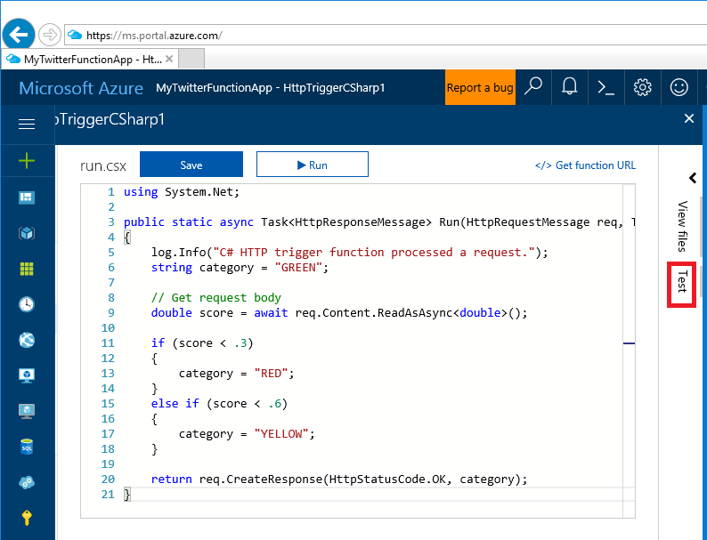

# Create your first logic app workflow 

This quickstart will show you how to create a logic app in the Azure portal that:

* Checks for new tweets using a keyword you supply.
* Uses the **Detect Sentiment** connector to estimate the tweets sentiment (from poor to very good).
* Use an Azure function to process the tweet sentiment into three categories (RED, YELLOW or GREEN).
* Uses a condition to check if the sentiment is RED (poor).
* Sends an email if the condtion is RED.

The following image shows the completed app in the **Logic App Designer**.


## Log in to Azure

Log in to the [Azure portal](https://portal.azure.com/).

## Create a Cognitive Services account

A Cognitive Services account is required to detect the sentiment of tweets we will be monitoring. 

1. Navigate to **New > Intelligence + analytics > Cognitive  Services**. Set each required field:


 * **API type** : **Text Analytics API**
 * **Pricing tier** : **F0 (5K Calls per 30 days)**. If you run out of calls, set to a higer tier.

 

1. Select **Keys** to show the keys. You'll need a key in a later step.

 

## Create an Azure Function App

<!-- TODO make Azure Function App  a link -->

Create an Azure Function App to categorize the tweet sentiment into three categories (RED, YELLOW or GREEN).

1. Select **New > Compute > Function App**

 

1. Complete the **Function App** input fields:

  * **App name** : Use a name you can associate with this project.
  * **Resource Group** : Select the resource group you previously created.
  * **Hosting Plan** : Select **Consumption Plan**, which  is billed based on resource consumption and executions. <!-- TODO link to https://azure.microsoft.com/en-us/pricing/details/functions/ -->
  * **Location** : Select a location you used previously.
  * Select **Create**.

1. Once the Function App deploys, add a function:

 

1. Replace the contents of the *run.csx* file with the following code:

```c#
using System.Net;

public static async Task<HttpResponseMessage> Run(HttpRequestMessage req, TraceWriter log)
{
    log.Info("C# HTTP trigger function processed a request.");
    string category = "GREEN";

    // Get request body
    double score = await req.Content.ReadAsAsync<double>();

    if (score < .3)
    {
        category = "RED";
    }
    else if (score < .6)
    {
        category = "YELLOW";
    }

    return req.CreateResponse(HttpStatusCode.OK, category);
}
```

  Save the change.

1. Select **Test** (shown in red above).
1. Enter 0.2 in the **Request body** text box and then select **Run**. The output shows "RED" and the HTTP status is 200 OK.

 

## Create a logic app

1. In the Azure Portal, click the **New > Web + Mobile > Logic App**


1. In the **Create logic app** blade, enter each field, and the select **Create**.


 Once the logic app is created, it opens in the designer.

1. Select the **Blank Logic App** template.


## Add a trigger to twitter

The **Logic App Designer** displays many services and triggers you can connect to.

1. Select the **Twitter** service.


1. Select the **When a new tweet is posted** trigger.


1. Sign in to your twitter account.


1. Enter your password and select **Authorize app**.


1. Enter the search text, frequency and interval. If you specify a popular term (such as #football, #soccer, or #futbol), you can quickly use all your [TODO]. #Azure every 15 minutes works pretty well:


1. Select **New Step**, and then **Add an action**.


1. Add the **Text Analytics** connector.


1. Select the **Detect Sentiment** action. The sentiment rating is often good, but it sometimes misinterperts the text.


1. Create the Detect Sentiment action:

  * Enter a connection name such as **MyKey**.
  * Copy and paste the key you created in the [Create a Cognitive Services account](#create-a-cognitive-services-account) step. 
  * Select **Create**.
  * Save the app.


1. Select the **Tweet text** icon for the **Text to analyze**


 Save the app.


## Add an Azure Function

In this section, we'll add the Azure Function we created previously that categorized tweet sentiment as RED, YELLOW or GREEN.

1. In the Logic Apps Designer, select **New step**, and then select **Add an action**.
1. Select **Azure Functions**.
1. Select **Choose an Azure function**.


1. Select the Azure Function you previously created.
1. Select **Score** to populate the **Request Body**.


1. Save the app.


