# Create a function that integrates with Azure Logic Apps

Azure Functions integrates with Azure Logic Apps in the Logic Apps Designer. This integration lets you use the computing power of Functions in orchestrations with other Azure and third-party services. 

This tutorial shows you how to use Functions with Logic Apps and Microsoft Cognitive Services on Azure to analyze sentiment from Twitter posts. An HTTP triggered function categorizes tweets as green, yellow, or red based on the sentiment score. An email is sent when poor sentiment is detected. 

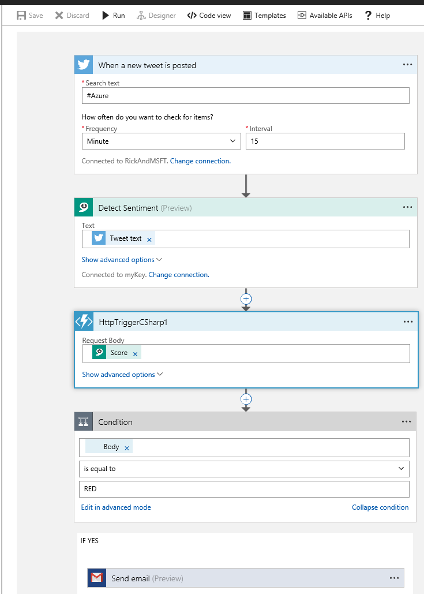

In this tutorial, you learn how to:

> [!div class="checklist"]
> * Create a Cognitive Services API Resource.
> * Create a function that categorizes tweet sentiment.
> * Create a logic app that connects to Twitter.
> * Add sentiment detection to the logic app. 
> * Connect the logic app to the function.
> * Send an email based on the response from the function.

## Prerequisites

+ An active [Twitter](https://twitter.com/) account. 
+ An [Outlook.com](https://outlook.com/) account (for sending notifications).
+ This topic uses as its starting point the resources created in [Create your first function from the Azure portal](functions-create-first-azure-function.md).  
If you haven't already done so, complete these steps now to create your function app.

## Create a Cognitive Services resource

The Cognitive Services APIs are available in Azure as individual resources. Use the Text Analytics API to detect the sentiment of the tweets being monitored.

1. Sign in to the [Azure portal](https://portal.azure.com/).

2. Click **Create a resource** in the upper left-hand corner of the Azure portal.

3. Click **AI + Analytics** > **Text Analytics API**. Then, use the settings as specified in the table, accept the terms, and check **Pin to dashboard**.

    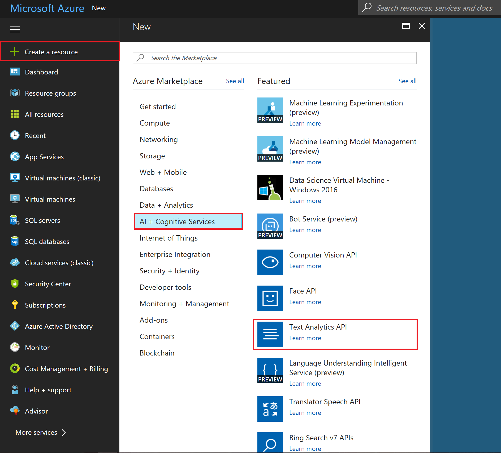

    | Setting      |  Suggested value   | Description                                        |
    | --- | --- | --- |
    | **Name** | MyCognitiveServicesAccnt | Choose a unique account name. |
    | **Location** | West US | Use the location nearest you. |
    | **Pricing tier** | F0 | Start with the lowest tier. If you run out of calls, scale to a higher tier.|
    | **Resource group** | myResourceGroup | Use the same resource group for all services in this tutorial.|

4. Click **Create** to create your resource. After it is created, select your new Cognitive Services resource pinned to the dashboard. 

5. In the left navigation column, click **Keys**, and then copy the value of **Key 1** and save it. You use this key to connect the logic app to your Cognitive Services API. 
 
    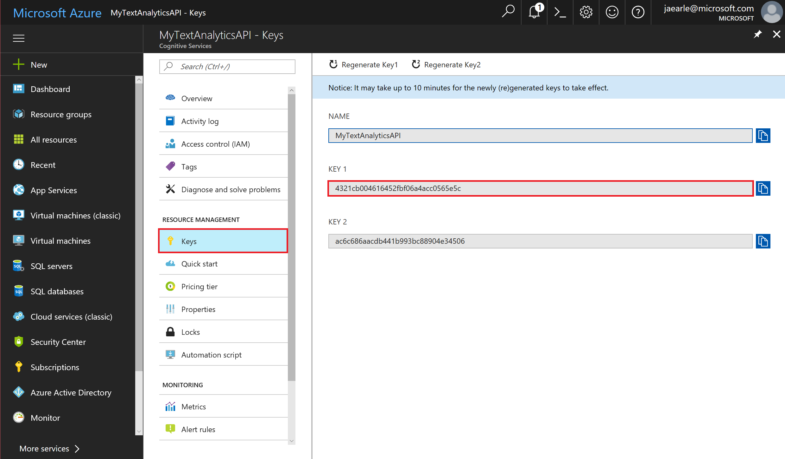

## Create the function app

Functions provides a great way to offload processing tasks in a logic apps workflow. This tutorial uses an HTTP triggered function to process tweet sentiment scores from Cognitive Services and return a category value.  

[!INCLUDE [Create function app Azure portal](../../includes/functions-create-function-app-portal.md)]

## Create an HTTP triggered function  

1. Expand your function app and click the **+** button next to **Functions**. If this is the first function in your function app, select **Custom function**. This displays the complete set of function templates.

    

2. In the search field, type `http` and then choose **C#** for the HTTP trigger template. 

    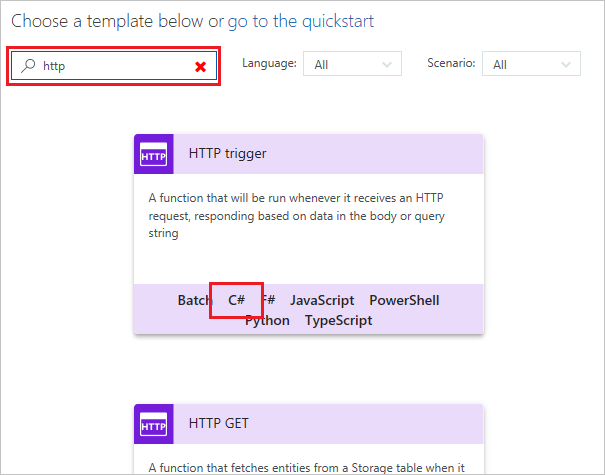

    All subsequent functions added to the function app use the C# language templates.

3. Type a **Name** for your function, choose `Function` for **[Authentication level](functions-bindings-http-webhook.md#http-auth)**, and then select **Create**. 

    

    This creates a C# script function using the HTTP Trigger template. Your code appears in a new window as `run.csx`.

4. Replace the contents of the `run.csx` file with the following code, then click **Save**:

    ```csharp
    #r "Newtonsoft.Json"
    
    using System;
    using System.Net;
    using Microsoft.AspNetCore.Mvc;
    using Microsoft.Extensions.Primitives;
    using Newtonsoft.Json;
    
    public static async Task<IActionResult> Run(HttpRequest req, ILogger log)
    {
        string category = "GREEN";
    
        string requestBody = await new StreamReader(req.Body).ReadToEndAsync();
        log.LogInformation(string.Format("The sentiment score received is '{0}'.", requestBody));
    
        double score = Convert.ToDouble(requestBody);
    
        if(score < .3)
        {
            category = "RED";
        }
        else if (score < .6) 
        {
            category = "YELLOW";
        }
    
        return requestBody != null
            ? (ActionResult)new OkObjectResult(category)
            : new BadRequestObjectResult("Please pass a value on the query string or in the request body");
    }
    ```
    This function code returns a color category based on the sentiment score received in the request. 

4. To test the function, click **Test** at the far right to expand the Test tab. Type a value of `0.2` for the **Request body**, and then click **Run**. A value of **RED** is returned in the body of the response. 

    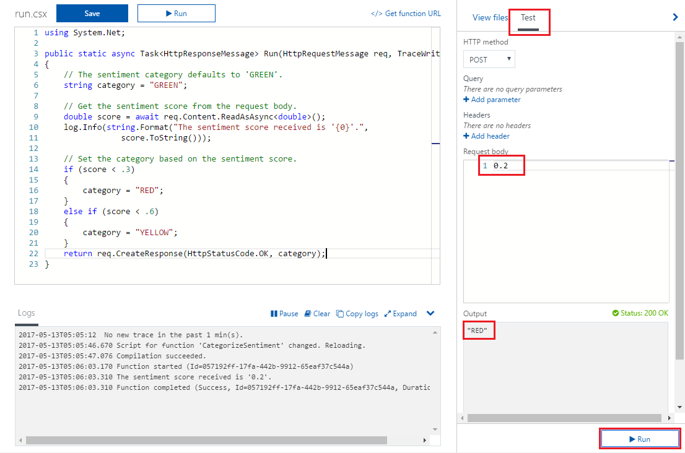

Now you have a function that categorizes sentiment scores. Next, you create a logic app that integrates your function with your Twitter and Cognitive Services API. 

## Create a logic app   

1. In the Azure portal, click the **New** button found on the upper left-hand corner of the Azure portal.

2. Click **Enterprise Integration** > **Logic App**. Then, use the settings as specified in the table, check **Pin to dashboard**, and click **Create**.
 
4. Then, type a **Name** like `TweetSentiment`,  use the settings as specified in the table, accept the terms, and check **Pin to dashboard**.

    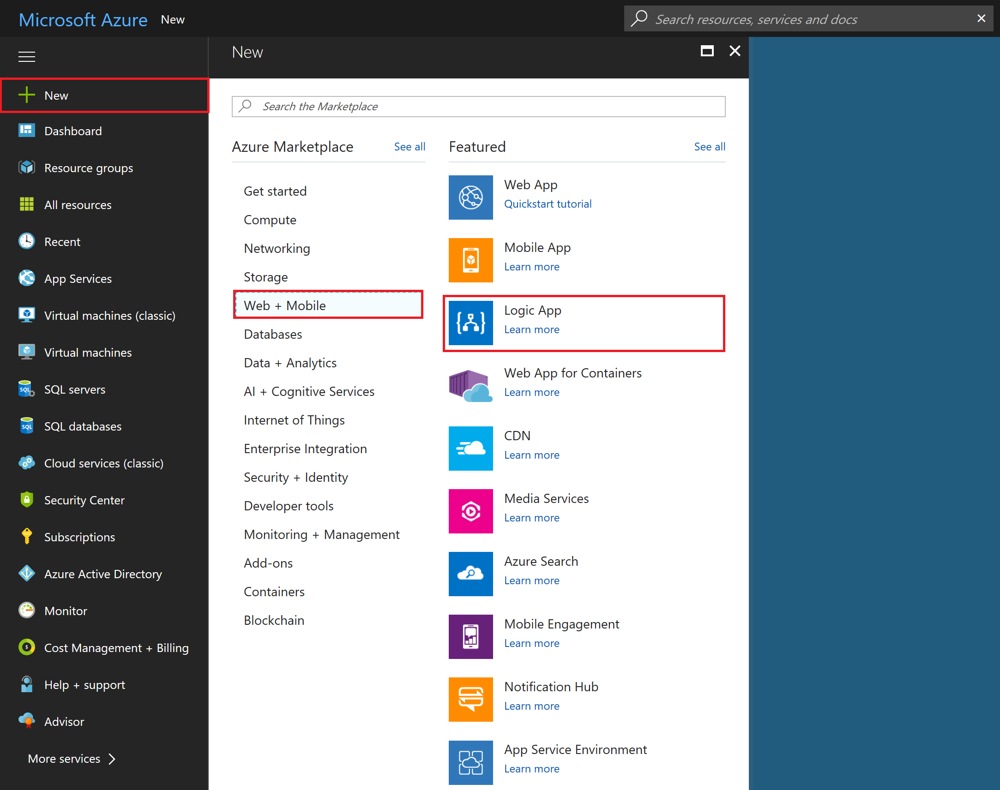

    | Setting      |  Suggested value   | Description                                        |
    | ----------------- | ------------ | ------------- |
    | **Name** | TweetSentiment | Choose an appropriate name for your app. |
    | **Resource group** | myResourceGroup | Choose the same existing resource group as before. |
    | **Location** | East US | Choose a location close to you. |    

4. Choose **Pin to dashboard**, and then click **Create** to create your logic app. 

5. After the app is created, click your new logic app pinned to the dashboard. Then in the Logic Apps Designer, scroll down and click the **Blank Logic App** template. 

    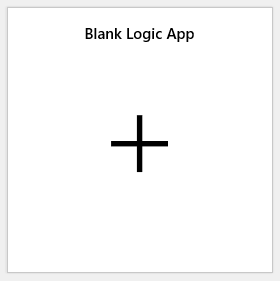

You can now use the Logic Apps Designer to add services and triggers to your app.

## Connect to Twitter

First, create a connection to your Twitter account. The logic app polls for tweets, which trigger the app to run.

1. In the designer, click the **Twitter** service, and click the **When a new tweet is posted** trigger. Sign in to your Twitter account and authorize Logic Apps to use your account.

2. Use the Twitter trigger settings as specified in the table. 

    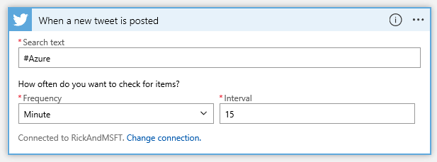

    | Setting      |  Suggested value   | Description                                        |
    | ----------------- | ------------ | ------------- |
    | **Search text** | #Azure | Use a hashtag that is popular enough to generate new tweets in the chosen interval. When using the Free tier and your hashtag is too popular, you can quickly use up the transaction quota in your Cognitive Services API. |
    | **Frequency** | Minute | The frequency unit used for polling Twitter.  |
    | **Interval** | 15 | The time elapsed between Twitter requests, in frequency units. |

3.  Click  **Save** to connect to your Twitter account. 

Now your app is connected to Twitter. Next, you connect to text analytics to detect the sentiment of collected tweets.

## Add sentiment detection

1. Click **New Step**, and then **Add an action**.

    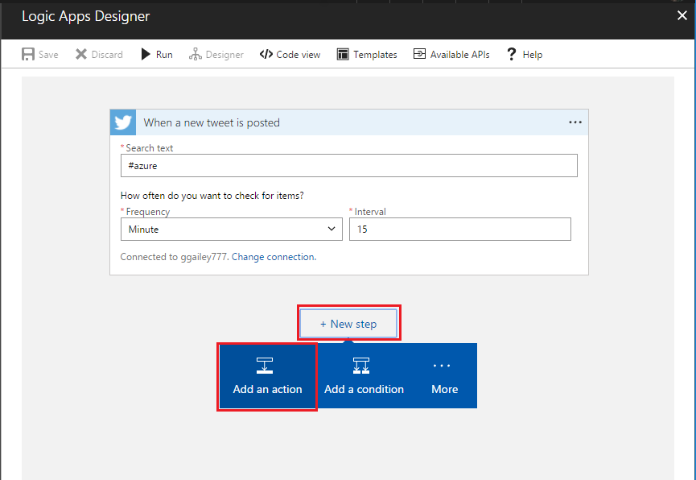

2. In **Choose an action**, click **Text Analytics**, and then click the **Detect sentiment** action.

    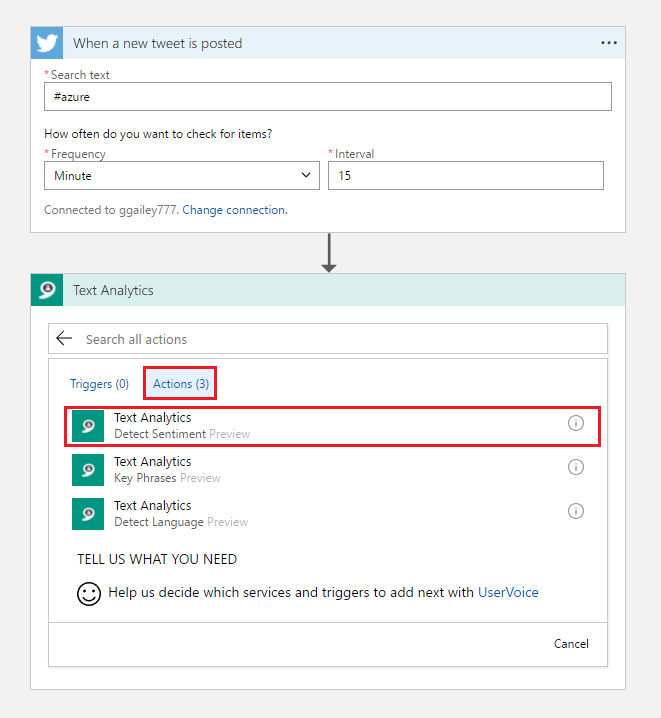

3. Type a connection name such as `MyCognitiveServicesConnection`, paste the key for your Cognitive Services API that you saved, and click **Create**.  

4. Click **Text to analyze** > **Tweet text**, and then click **Save**.  

    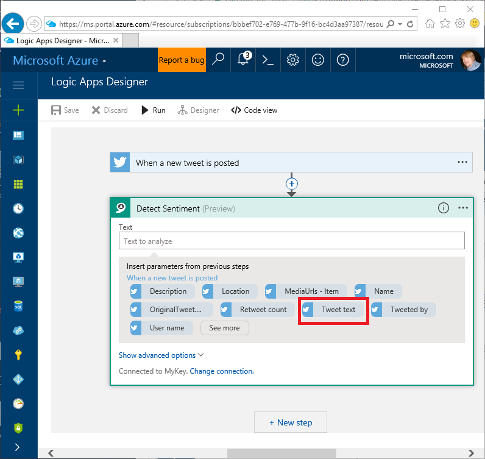

Now that sentiment detection is configured, you can add a connection to your function that consumes the sentiment score output.

## Connect sentiment output to your function

1. In the Logic Apps Designer, click **New step** > **Add an action**, and then click **Azure Functions**. 

2. Click **Choose an Azure function**, select the **CategorizeSentiment** function you created earlier.  

    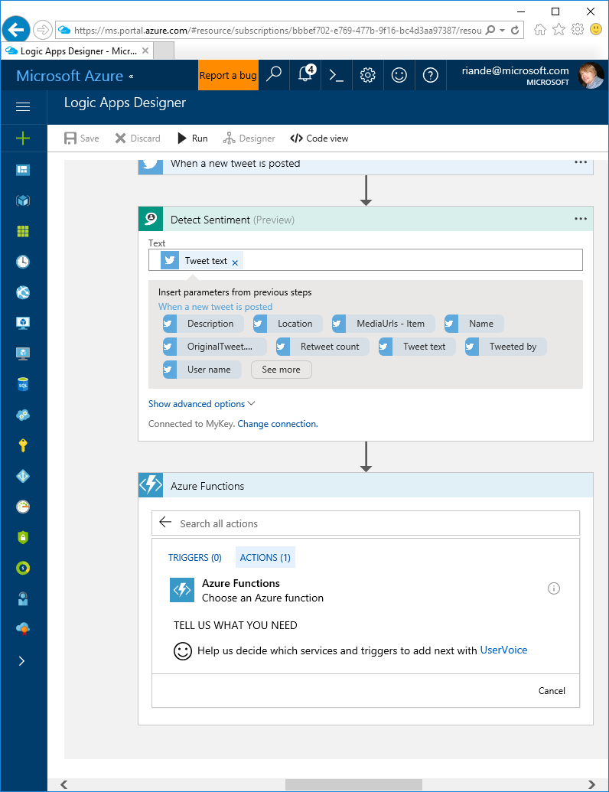

3. In **Request Body**, click **Score** and then **Save**.

    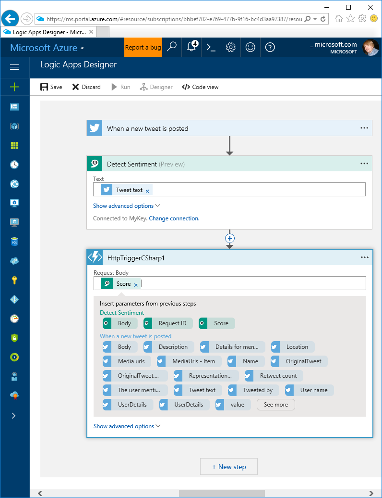

Now, your function is triggered when a sentiment score is sent from the logic app. A color-coded category is returned to the logic app by the function. Next, you add an email notification that is sent when a sentiment value of **RED** is returned from the function. 

## Add email notifications

The last part of the workflow is to trigger an email when the sentiment is scored as _RED_. This topic uses an Outlook.com connector. You can perform similar steps to use a Gmail or Office 365 Outlook connector.   

1. In the Logic Apps Designer, click **New step** > **Add a condition**. 

2. Click **Choose a value**, then click **Body**. Select **is equal to**, click **Choose a value** and type `RED`, and click **Save**. 

    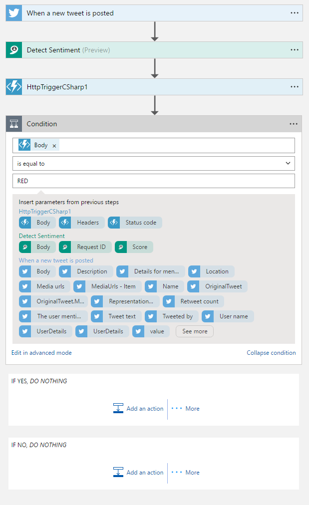

3. In **IF TRUE**, click **Add an action**, search for `outlook.com`, click **Send an email**, and sign in to your Outlook.com account.
    
    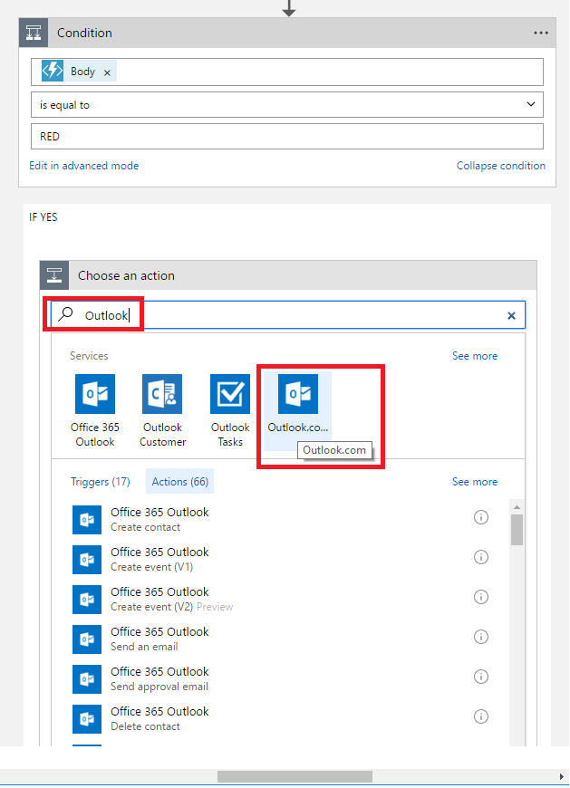

    > [!NOTE]
    > If you don't have an Outlook.com account, you can choose another connector, such as Gmail or Office 365 Outlook

4. In the **Send an email** action, use the email settings as specified in the table. 

    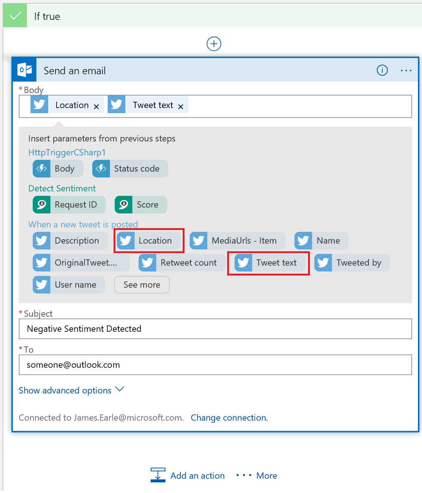

    | Setting      |  Suggested value   | Description  |
    | ----------------- | ------------ | ------------- |
    | **To** | Type your email address | The email address that receives the notification. |
    | **Subject** | Negative tweet sentiment detected  | The subject line of the email notification.  |
    | **Body** | Tweet text, Location | Click the **Tweet text** and **Location** parameters. |

5.  Click **Save**.

Now that the workflow is complete, you can enable the logic app and see the function at work.

## Test the workflow

1. In the Logic App Designer, click **Run** to start the app.

2. In the left column, click **Overview** to see the status of the logic app. 
 
    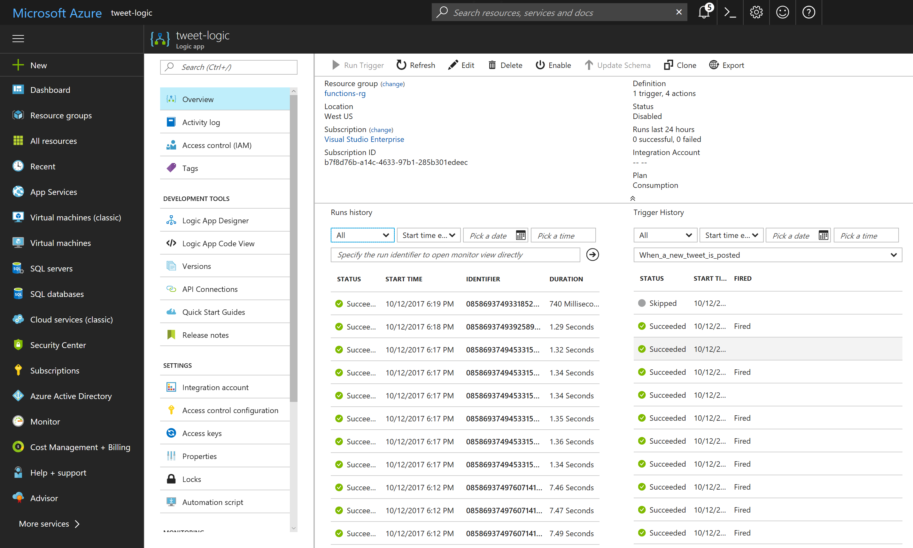

3. (Optional) Click one of the runs to see details of the execution.

4. Go to your function, view the logs, and verify that sentiment values were received and processed.
 
    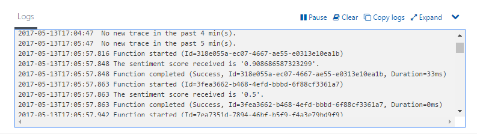

5. When a potentially negative sentiment is detected, you receive an email. If you haven't received an email, you can change the function code to return RED every time:

        return req.CreateResponse(HttpStatusCode.OK, "RED");

    After you have verified email notifications, change back to the original code:

        return req.CreateResponse(HttpStatusCode.OK, category);

    > [!IMPORTANT]
    > After you have completed this tutorial, you should disable the logic app. By disabling the app, you avoid being charged for executions and using up the transactions in your Cognitive Services API.

Now you have seen how easy it is to integrate Functions into a Logic Apps workflow.

## Disable the logic app

To disable the logic app, click **Overview** and then click **Disable** at the top of the screen. This stops the logic app from running and incurring charges without deleting the app. 

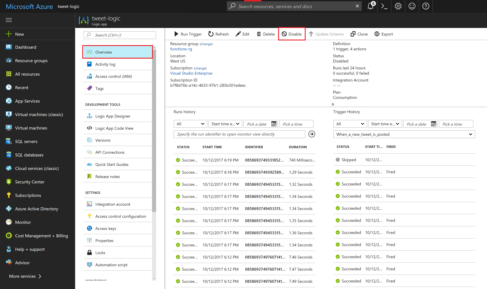

## Next steps

In this tutorial, you learned how to:

> [!div class="checklist"]
> * Create a Cognitive Services API Resource.
> * Create a function that categorizes tweet sentiment.
> * Create a logic app that connects to Twitter.
> * Add sentiment detection to the logic app. 
> * Connect the logic app to the function.
> * Send an email based on the response from the function.

Advance to the next tutorial to learn how to create a serverless API for your function.

> [!div class="nextstepaction"] 
> [Create a serverless API using Azure Functions](functions-create-serverless-api.md)

To learn more about Logic Apps, see [Azure Logic Apps](../logic-apps/logic-apps-overview.md).

