# Building a serverless social media dashboard in Azure

[Azure Functions](functions-overview.md) integrates with [Azure Logic Apps](../logic-apps/logic-apps-what-are-logic-apps.md) to enable you to build complex orchestrations with other Azure and third-party services. This topic demonstrates how to trigger a logic app from a social media feed and analyze the text with [Azure Cognitive Services](../cognitive-services/Welcome.md).

This article shows you how to create a logic app in the Azure portal that:

> [!div class="checklist"]
> * Checks for new tweets using a keyword or hashtag you supply.
> * Uses the **Detect Sentiment** connector to estimate the tweets sentiment (from poor to good).
> * Uses an Azure function to process the tweet sentiment into three categories (RED, YELLOW, or GREEN - for poor, neutral, and good).
> * Uses a condition to check if the sentiment is RED (poor).
> * If the condition is RED, sends an email.

The following image shows a portion of the logic app in the designer:


## Prerequisites

* An Azure account. If you don't have an Azure subscription, create a [free account](https://azure.microsoft.com/free/) before you begin.
* A twitter account.
* 
 
 
[!INCLUDE [functions-create-function-app-portal](../../includes/functions-create-function-app-portal2.md)]

### Create a function to categorize the tweet sentiment

Once the function app deployment completes, open the new function app. In this section, you create a function to categorize tweet sentiment into three categories (RED, YELLOW, or GREEN - for bad, neutral, and good).


Keep the default **Webhook + API**, **CSharp**, and then select **Create this function**.

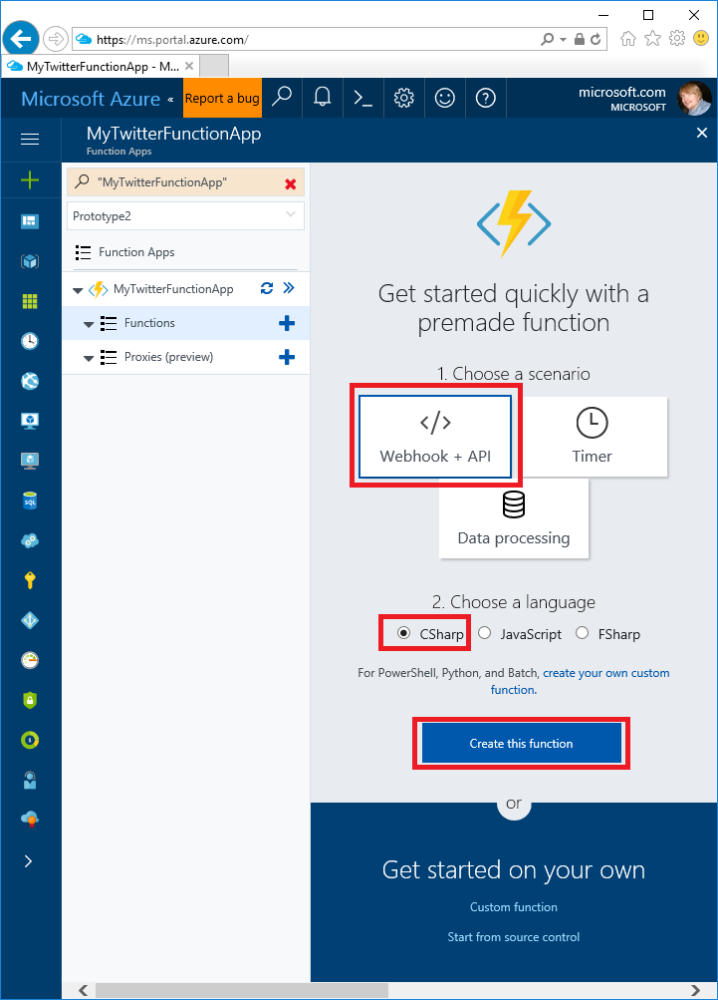

You created a Webhook/API (also known as HTTP trigger) function that can be called on demand by the app you are building. If you wanted to create a function that runs on a schedule, you would create a Timer function.

Replace the contents of the *run.csx* file with the following code:

```c#
using System.Net;

public static async Task<HttpResponseMessage> Run(HttpRequestMessage req, TraceWriter log)
{
    log.Info("C# HTTP trigger function processed a request.");
    string category = "GREEN";

    // Get request body.
    double score = await req.Content.ReadAsAsync<double>();

    if (score < .3)
    {
        category = "RED";
    }
    else if (score < .6)
    {
        category = "YELLOW";
    }

    return req.CreateResponse(HttpStatusCode.OK, category);
}
```

Save the change.

### Test the function

Select **Test** (on the right of the code box).  Enter 0.2 in the **Request body** text box and then select **Run**. The output shows "RED" and the HTTP status is 200 OK.

 

## Create a Cognitive Services account

A Cognitive Services account is required to detect the sentiment of tweets we are monitoring.

Navigate to **New > Intelligence + analytics > Cognitive  Services**. Set each required field:


| Field               | Sample value | Comment |
| ----------------- | ------------ | ------------- |
| Account name | MyCognitiveServicesAccnt | Enter a unique name. |
| API type | Text Analytics API | Select Text Analytics |
| Location | West US | Currently only **West US** is available |
| Pricing tier | F0 | If you run out of calls, set to a higher tier.|
| Resource group | rg1 | Use the resource group you previously specified.|

Select **Keys**. You need a key in a later step.

 

## Create a logic app

In the Azure portal, click the **New >  Enterprise Integration > Logic App**


In the **Create logic app** blade, enter each field, and the select **Create**.

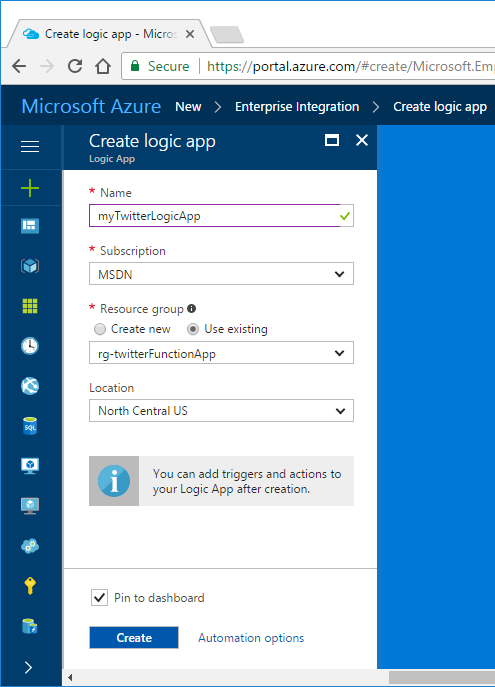

Once the logic app is created, it opens in the designer. Select the **Blank Logic App** template.


## Add a trigger to twitter

The **Logic App Designer** displays many services and triggers you can connect to.

Select the **Twitter** service.

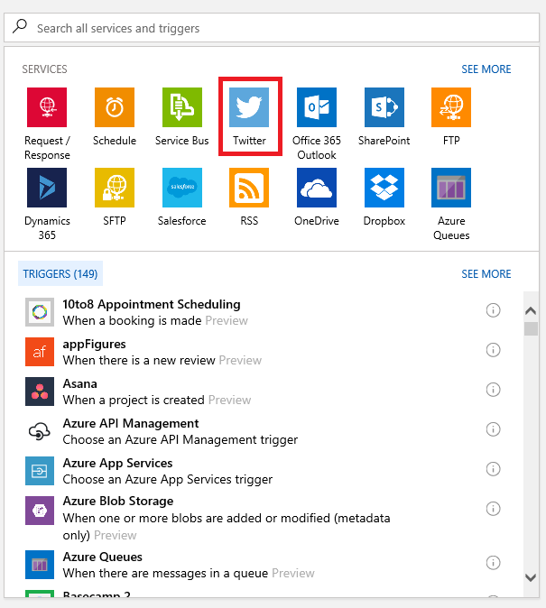

Select the trigger **When a new tweet is posted**.

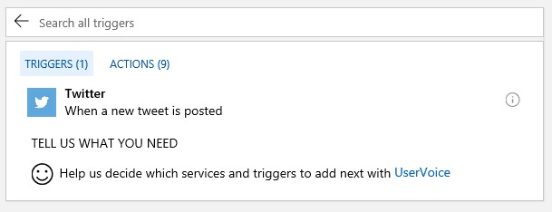

Sign in to your twitter account.

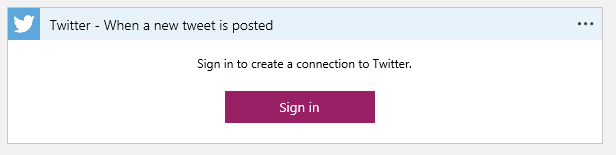

Enter your password and select **Authorize app**.

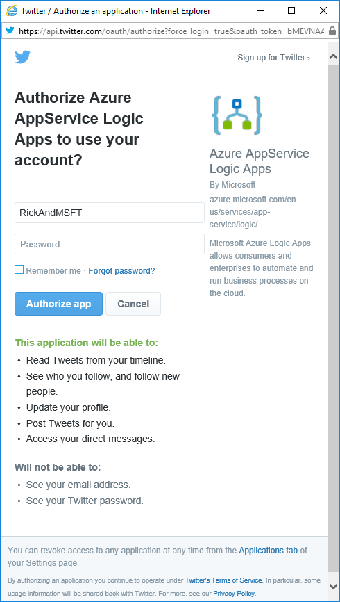

Enter the search text, frequency, and interval. If you specify a popular hashtag (such as #football, #soccer, or #futbol), you can quickly use all your allotted service calls in your cognitive services account. If you run out of calls, you can increase the pricing tier. 

Search for #Azure every 15 minutes:


Save the app.

### Add a **Text Analytics** connector

The text analytics connector detects the tweets sentiment.

Select **New Step**, and then **Add an action**.


Add the **Text Analytics** connector.

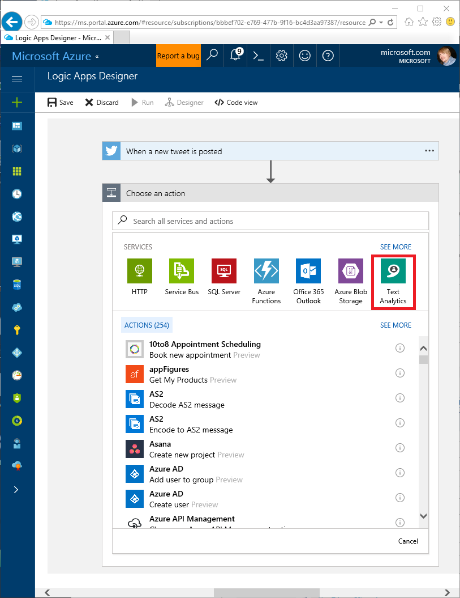

Select the **Detect Sentiment** action. The sentiment rating is often accurate, but it sometimes misinterprets the text.


### Create the Detect Sentiment action

  * Enter a connection name such as **MyKey**.
  * Copy and paste the key you created in the [Create a Cognitive Services account](#create-a-cognitive-services-account) step.
  * Select **Create**.
  * Save the app.

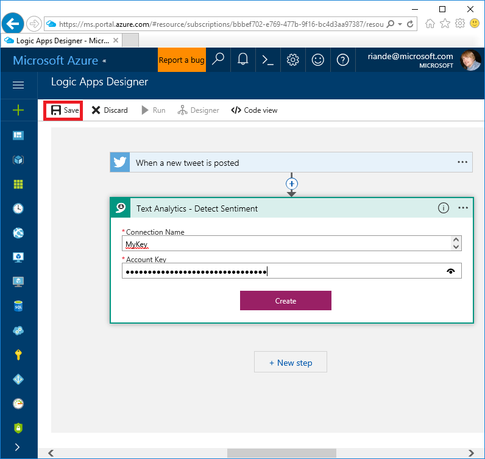

Select the **Tweet text** icon for the **Text to analyze**


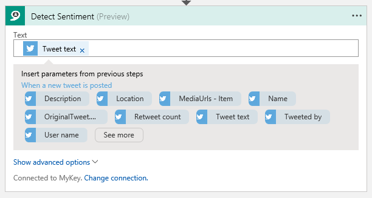

Save the app.

## Connect to the Azure function

In this section, you add the function you created previously that categorized tweet sentiment as RED, YELLOW, or GREEN.

* In the Logic Apps Designer, select **New step**, and then select **Add an action**.
* Select **Azure Functions**.
* Select **Choose an Azure function**.


* Select the Azure Function you previously created.
* Select **Score** to populate the **Request Body**.


Save the app.

## Add email notification

In this section, we add a conditional check for negative sentiment tweets (condition RED).

* Select **New step**.
* Select **Add a condition**.
* Select **Body** in the first **Choose a value** text box.
* Enter "RED" in the second  **Choose a value** text box.
* Save the app.


* In the **IF YES, DO NOTHING** box select **Add an action**.
* Enter Outlook or Gmail in the **Search all services and actions** box. Outlook is used in this tutorial. See [Add a Gmail action] (../logic-apps/logic-apps-create-a-logic-app.md#add-an-action-that-responds-to-your-trigger) for Gmail instructions. Note: If you have a personal [Microsoft account](https://account.microsoft.com/account), you can use that for the Outlook.com account.


Select **Outlook.com Send an email**.

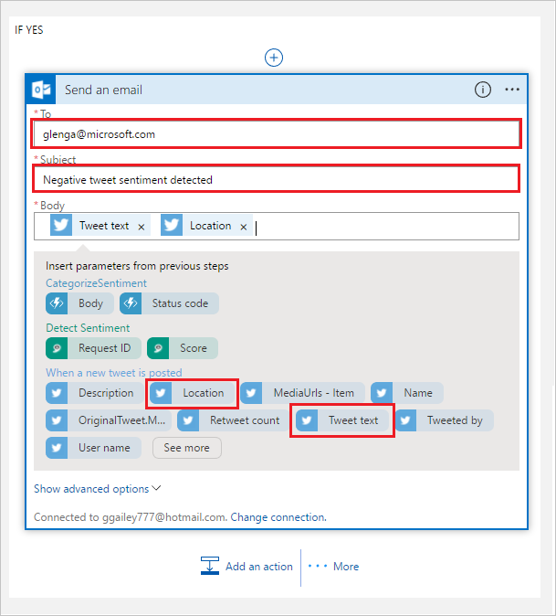

Sign into Outlook.com.

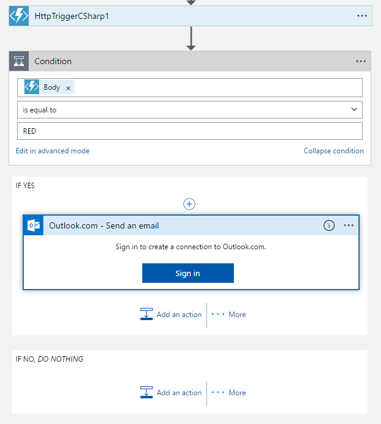

Enter the following items:

   * **To**: The email the message should be sent to.
   * **Subject**: Score.
   * **Body**: The location and the Tweet text.

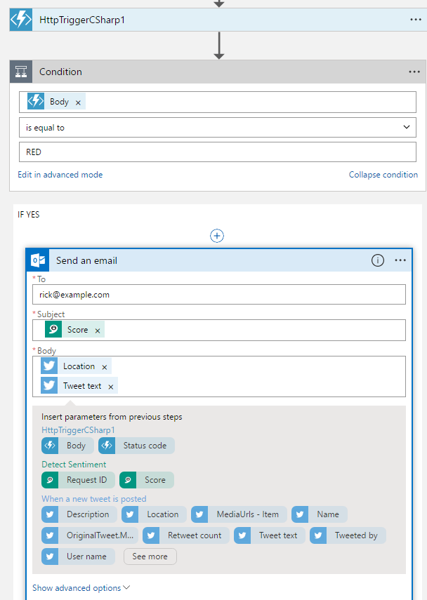

Save the app.
Select **Run** to start the app.

### Check the status

In the Logic app blade, select **Overview**, and then select a row in the **Runs history** column:


The following image shows the run details when the condition was not true, email was not sent.

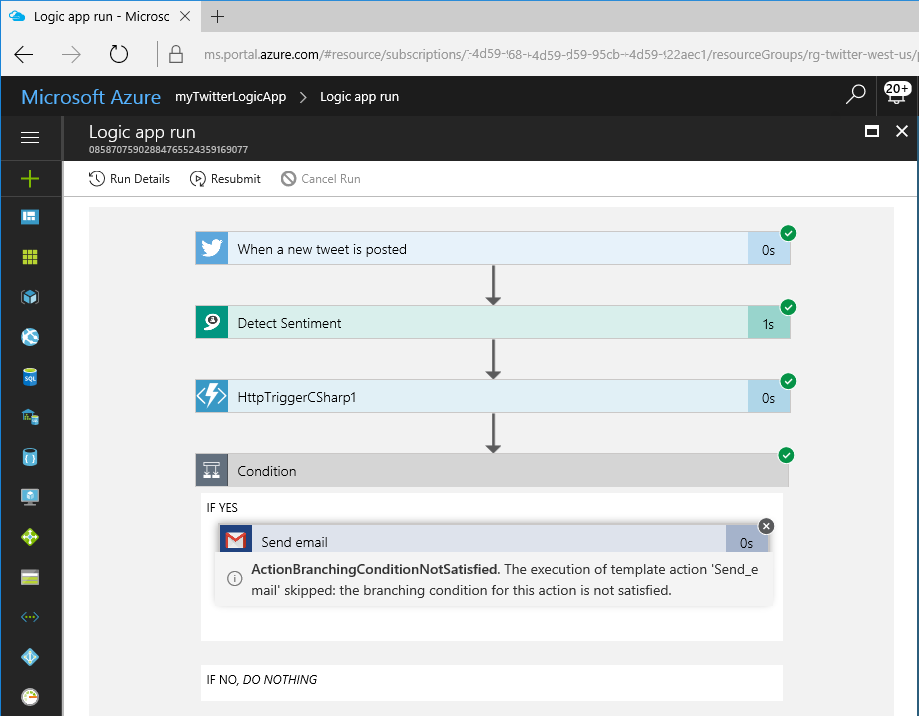

If want to immediately test the **Send an email** function:

* Change the **INPUTS**  in the first step (**When a new tweet is posted**) to a popular term, such as #football, #soccer, or #futbol.

Processing popular terms consumes more resources than less popular terms. You might want to change your search term after you've verified email is working.

The following image shows the run details when the condition was true, and email was sent.


You can select any of the service boxes to show more information on the data used for the run. Select the **When a new tweet is posted**, it shows the search text and all the outputs, even those outputs we're not using.

## Next steps

*  [Introduction to Azure Functions](functions-overview.md)
*  [Azure Logic Apps](../logic-apps/logic-apps-what-are-logic-apps.md)
*  [Add conditions and run workflows](../logic-apps/logic-apps-use-logic-app-features.md)
*  [Logic app templates](../logic-apps/logic-apps-use-logic-app-templates.md)
*  [Create logic apps from Azure Resource Manager templates](../logic-apps/logic-apps-arm-provision.md)

## Get help

To ask questions, answer questions, and learn what other Azure Logic Apps users are doing,
visit the [Azure Logic Apps forum](https://social.msdn.microsoft.com/Forums/en-US/home?forum=azurelogicapps).

To help improve Azure Logic Apps and connectors, vote on or submit ideas at the
[Azure Logic Apps user feedback site](http://aka.ms/logicapps-wish).
