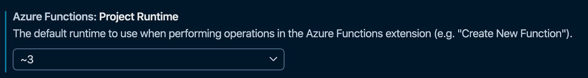

# Azure Functions runtime versions overview

The major versions of the Azure Functions runtime are related to the version of .NET on which the runtime is based. The following table indicates the current version of the runtime, the release level, and the related .NET version. 

| Runtime version | Release level<sup>1</sup> | .NET version | 
| --------------- | ------------- | ------------ |
| 3.x | GA | .NET Core 3.1 | 
| 2.x | GA | .NET Core 2.2 |
| 1.x | GA<sup>2</sup> | .NET Framework 4.6<sup>3</sup> |

<sup>1</sup> GA releases are supported for production scenarios.   
<sup>2</sup> Version 1.x is in maintenance mode. Enhancements are provided only in later versions.   
<sup>3</sup> Only supports development in the Azure portal or locally on Windows computers.

This article details some of the differences between the various versions, how you can create each version, and how to change versions.

## Languages

Starting with version 2.x, the runtime uses a language extensibility model, and all functions in a function app must share the same language. The language of functions in a function app is chosen when creating the app and is maintained in the [FUNCTIONS\_WORKER\_RUNTIME](functions-app-settings.md#functions_worker_runtime) setting. 

Azure Functions 1.x experimental languages can't use the new model, so they aren't supported in 2.x. 
The following table indicates which programming languages are currently supported in each runtime version.

[!INCLUDE [functions-supported-languages](../../includes/functions-supported-languages.md)]

For more information, see [Supported languages](supported-languages.md).

## <a name="creating-1x-apps"></a>Run on a specific version

By default, function apps created in the Azure portal and by the Azure CLI are set to version 2.x. You can modify this version as needed. You can only change the runtime version to 1.x after you create your function app but before you add any functions.  Moving between 2.x and 3.x is allowed even with apps that have functions, but it is still recommended to test in a new app first.

## Migrating from 1.x to later versions

You may choose to migrate an existing app written to use the version 1.x runtime to instead use a newer version. Most of the changes you need to make are related to changes in the language runtime, such as C# API changes between .NET Framework 4.7 and .NET Core. You'll also need to make sure your code and libraries are compatible with the language runtime you choose. Finally, be sure to note any changes in trigger, bindings, and features highlighted below. For the best migration results, you should create a new function app in a new version and port your existing version 1.x function code to the new app.  

While it's possible to do an "in-place" upgrade by manually updating the app configuration, going from 1.x to a higher version includes some breaking changes. For example, in C#, the debugging object is changed from `TraceWriter` to `ILogger`. By creating a new version 3.x project, you start off with updated functions based on the latest version 3.x templates.

### Changes in triggers and bindings after version 1.x

Starting with version 2.x, you must install the extensions for specific triggers and bindings used by the functions in your app. The only exception for this HTTP and timer triggers, which don't require an extension.  For more information, see [Register and install binding extensions](./functions-bindings-register.md).

There are also a few changes in the *function.json* or attributes of the function between versions. For example, the Event Hub `path` property is now `eventHubName`. See the [existing binding table](#bindings) for links to documentation for each binding.

### Changes in features and functionality after version 1.x

A few features were removed, updated, or replaced after version 1.x. This section details the changes you see in later versions after having used version 1.x.

In version 2.x, the following changes were made:

* Keys for calling HTTP endpoints are always stored encrypted in Azure Blob storage. In version 1.x, keys were stored in Azure File storage be default. When upgrading an app from version 1.x to version 2.x, existing secrets that are in file storage are reset.

* The version 2.x runtime doesn't include built-in support for webhook providers. This change was made to improve performance. You can still use HTTP triggers as endpoints for webhooks.

* The host configuration file (host.json) should be empty or have the string `"version": "2.0"`.

* To improve monitoring, the WebJobs dashboard in the portal, which used the [`AzureWebJobsDashboard`](functions-app-settings.md#azurewebjobsdashboard) setting is replaced with Azure Application Insights, which uses the [`APPINSIGHTS_INSTRUMENTATIONKEY`](functions-app-settings.md#appinsights_instrumentationkey) setting. For more information, see [Monitor Azure Functions](functions-monitoring.md).

* All functions in a function app must share the same language. When you create a function app, you must choose a runtime stack for the app. The runtime stack is specified by the [`FUNCTIONS_WORKER_RUNTIME`](functions-app-settings.md#functions_worker_runtime) value in application settings. This requirement was added to improve footprint and startup time. When developing locally, you must also include this setting in the [local.settings.json file](functions-run-local.md#local-settings-file).

* The default timeout for functions in an App Service plan is changed to 30 minutes. You can manually change the timeout back to unlimited by using the [functionTimeout](functions-host-json.md#functiontimeout) setting in host.json.

* HTTP concurrency throttles are implemented by default for Consumption plan functions, with a default of 100 concurrent requests per instance. You can change this in the [`maxConcurrentRequests`](functions-host-json.md#http) setting in the host.json file.

* Because of [.NET Core limitations](https://github.com/Azure/azure-functions-host/issues/3414), support for F# script (.fsx) functions has been removed. Compiled F# functions (.fs) are still supported.

* The URL format of Event Grid trigger webhooks has been changed to `https://{app}/runtime/webhooks/{triggerName}`.

## Migrating from 2.x to 3.x

Azure Functions version 3.x is highly backwards compatible to version 2.x.  Many apps should be able to safely upgrade to 3.x without any code changes.  While moving to 3.x is encouraged, be sure to run extensive tests before changing the major version in production apps.

### Breaking changes between 2.x and 3.x

The following are the changes to be aware of before upgrading a 2.x app to 3.x.

#### JavaScript

* Output bindings assigned through `context.done` or return values now behave the same as setting in `context.bindings`.

* Timer trigger object is camelCase instead of PascalCase

* Event Hub triggered functions with `dataType` binary will receive an array of `binary` instead of `string`.

* The HTTP request payload can no longer be accessed via `context.bindingData.req`.  It can still be accessed as an input parameter, `context.req`, and in `context.bindings`.

* Node.js 8 is no longer supported and will not execute in 3.x functions.

#### .NET

* [Synchronous server operations are disabled by default](https://docs.microsoft.com/dotnet/core/compatibility/2.2-3.0#http-synchronous-io-disabled-in-all-servers).

### Changing version of apps in Azure

The version of the Functions runtime used by published apps in Azure is dictated by the [`FUNCTIONS_EXTENSION_VERSION`](functions-app-settings.md#functions_extension_version) application setting. The following major runtime version values are supported:

| Value | Runtime target |
| ------ | -------- |
| `~3` | 3.x |
| `~2` | 2.x |
| `~1` | 1.x |

>[!IMPORTANT]
> Don't arbitrarily change this setting, because other app setting changes and changes to your function code may be required.

### Locally developed application versions

You can make the following updates to function apps to locally change the targeted versions.

#### Visual Studio runtime versions

In Visual Studio, you select the runtime version when you create a project. Azure Functions tools for Visual Studio supports the three major runtime versions. The correct version is used when debugging and publishing based on project settings. The version settings are defined in the `.csproj` file in the following properties:

##### Version 1.x

```xml
<TargetFramework>net461</TargetFramework>
<AzureFunctionsVersion>v1</AzureFunctionsVersion>
```

##### Version 2.x

```xml
<TargetFramework>netcoreapp2.1</TargetFramework>
<AzureFunctionsVersion>v2</AzureFunctionsVersion>
```

##### Version 3.x

```xml
<TargetFramework>netcoreapp3.1</TargetFramework>
<AzureFunctionsVersion>v3</AzureFunctionsVersion>
```

> [!NOTE]
> Azure Functions 3.x and .NET requires the `Microsoft.Sdk.NET.Functions` extension be at least `3.0.0`.

###### Updating 2.x apps to 3.x in Visual Studio

You can open an existing function targeting 2.x and move to 3.x by editing the `.csproj` file and updating the values above.  Visual Studio manages runtime versions automatically for you based on project metadata.  However, it's possible if you have never created a 3.x app before that Visual Studio doesn't yet have the templates and runtime for 3.x on your machine.  This may present itself with an error like "no Functions runtime available that matches the version specified in the project."  To fetch the latest templates and runtime, go through the experience to create a new function project.  When you get to the version and template select screen, wait for Visual Studio to complete fetching the latest templates.  Once the latest .NET Core 3 templates are available and displayed you should be able to run and debug any project configured for version 3.x.

> [!IMPORTANT]
> Version 3.x functions can only be developed in Visual Studio if using Visual Studio version 16.4 or newer.

#### VS Code and Azure Functions Core Tools

[Azure Functions Core Tools](functions-run-local.md) is used for command line development and also by the [Azure Functions extension](https://marketplace.visualstudio.com/items?itemName=ms-azuretools.vscode-azurefunctions) for Visual Studio Code. To develop against version 3.x, install version 3.x of the Core Tools. Version 2.x development requires version 2.x of the Core Tools, and so on. For more information, see [Install the Azure Functions Core Tools](functions-run-local.md#install-the-azure-functions-core-tools).

For Visual Studio Code development, you may also need to update the user setting for the `azureFunctions.projectRuntime` to match the version of the tools installed.  This setting also updates the templates and languages used during function app creation.  To create apps in `~3` you would update the `azureFunctions.projectRuntime` user setting to `~3`.



#### Maven and Java apps

You can migrate Java apps from version 2.x to 3.x by [installing the 3.x version of the core tools](functions-run-local.md#install-the-azure-functions-core-tools) required to run locally.  After verifying that your app works correctly running locally on version 3.x, update the app's `POM.xml` file to modify the `FUNCTIONS_EXTENSION_VERSION` setting to `~3`, as in the following example:

```xml
<configuration>
    <resourceGroup>${functionResourceGroup}</resourceGroup>
    <appName>${functionAppName}</appName>
    <region>${functionAppRegion}</region>
    <appSettings>
        <property>
            <name>WEBSITE_RUN_FROM_PACKAGE</name>
            <value>1</value>
        </property>
        <property>
            <name>FUNCTIONS_EXTENSION_VERSION</name>
            <value>~3</value>
        </property>
    </appSettings>
</configuration>
```

## Bindings

Starting with version 2.x, the runtime uses a new [binding extensibility model](https://github.com/Azure/azure-webjobs-sdk-extensions/wiki/Binding-Extensions-Overview) that offers these advantages:

* Support for third-party binding extensions.

* Decoupling of runtime and bindings. This change allows binding extensions to be versioned and released independently. You can, for example, opt to upgrade to a version of an extension that relies on a newer version of an underlying SDK.

* A lighter execution environment, where only the bindings in use are known and loaded by the runtime.

With the exception of HTTP and timer triggers, all bindings must be explicitly added to the function app project, or registered in the portal. For more information, see [Register binding extensions](./functions-bindings-expressions-patterns.md).

The following table shows which bindings are supported in each runtime version.

[!INCLUDE [Full bindings table](../../includes/functions-bindings.md)]

[!INCLUDE [Timeout Duration section](../../includes/functions-timeout-duration.md)]

## Next steps

For more information, see the following resources:

* [Code and test Azure Functions locally](functions-run-local.md)
* [How to target Azure Functions runtime versions](set-runtime-version.md)
* [Release notes](https://github.com/Azure/azure-functions-host/releases)
