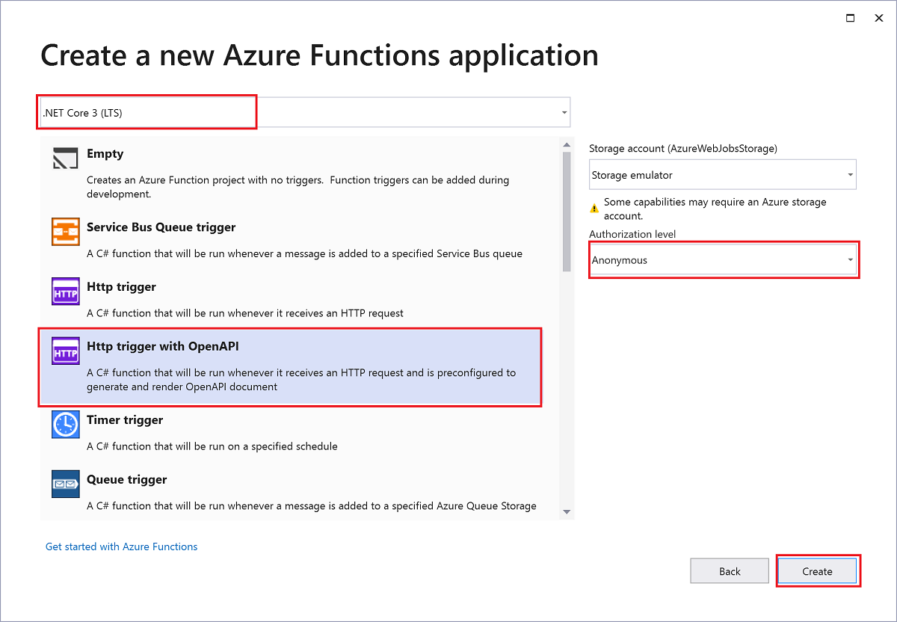
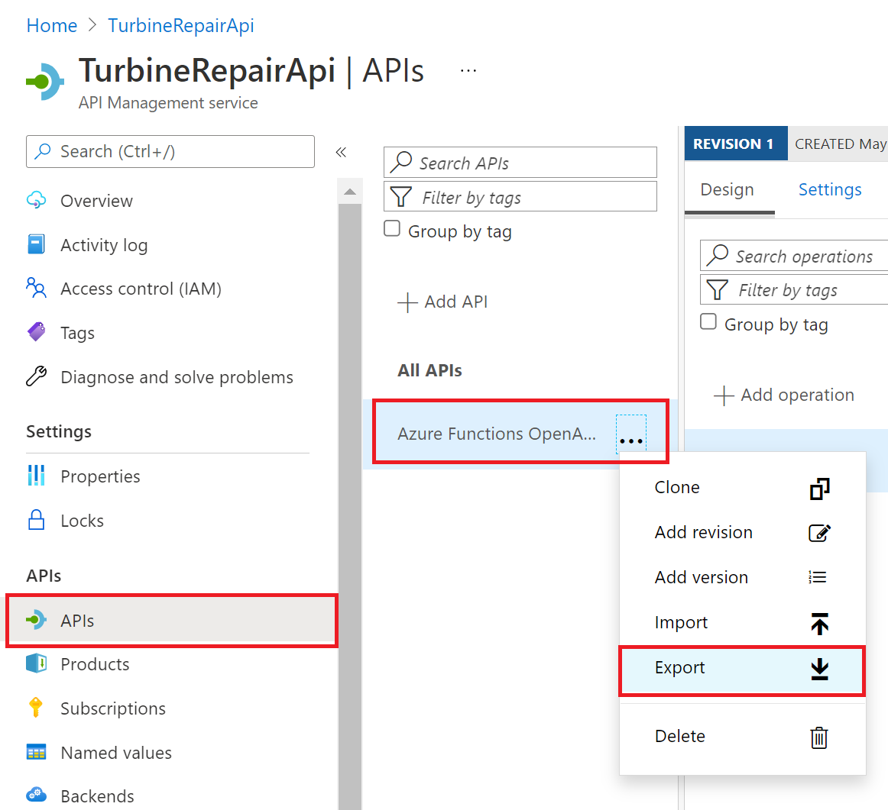

# Create serverless APIs in Visual Studio using Azure Functions and API Management integration

REST APIs are often described using an OpenAPI definition. This file contains information about operations in an API and how the request and response data for the API should be structured.

In this tutorial, you learn how to:

> [!div class="checklist"]
> * Create a serverless function project in Visual Studio
> * Test function APIs locally using built-in OpenAPI functionality
> * Publish project to a function app in Azure with API Management integration 
> * Get the access key for the function and set it in API Management
> * Download the OpenAPI definition file

The serverless function you create provides an API that lets you determine whether an emergency repair on a wind turbine is cost-effective. Because both the function app and API Management instance you create use consumption plans, your cost for completing this tutorial is minimal.

> [!NOTE]
> The OpenAPI and API Management integration featured in this article is currently only supported for [in-process](functions-dotnet-class-library.md) C# class library functions. [Isolated worker process](dotnet-isolated-process-guide.md) C# class library functions and all other language runtimes should instead [use Azure API Management integration from the portal](functions-openapi-definition.md). 

## Prerequisites

+ [Visual Studio 2022](https://azure.microsoft.com/downloads/). Make sure you select the **Azure development** workload during installation. 

+ An active [Azure subscription](../guides/developer/azure-developer-guide.md#understanding-accounts-subscriptions-and-billing), create a [free account](https://azure.microsoft.com/free/dotnet/) before you begin.

## Create a Functions project

The Azure Functions project template in Visual Studio creates a project that you can publish to a function app in Azure. You'll also create an HTTP triggered function supports OpenAPI definition file (formerly Swagger file) generation.

1. From the Visual Studio menu, select **File** > **New** > **Project**.

1. In **Create a new project**, enter *functions* in the search box, choose the **Azure Functions** template, and then select **Next**.

1. In **Configure your new project**, enter a **Project name** for your project like `TurbineRepair`, and then select **Create**. 

1. For the **Create a new Azure Functions application** settings, use the values in the following table:

    | Setting      | Value  | Description                      |
    | ------------ |  ------- |----------------------------------------- |
    | **Functions worker** | **.NET 6** | This value creates a function project that runs in-process on version 4.x of the Azure Functions runtime, which is required for OpenAPI file generation.    |
    | **Function template** | **HTTP trigger with OpenAPI** | This value creates a function triggered by an HTTP request, with the ability to generate an OpenAPI definition file.  |
    | **Use Azurite for runtime storage account (AzureWebJobsStorage)**  | **Selected** | You can use the emulator for local development of HTTP trigger functions. Because a function app in Azure requires a storage account, one is assigned or created when you publish your project to Azure. |
    | **Authorization level** | **Function** | When running in Azure, clients must provide a key when accessing the endpoint. For more information about keys and authorization, see [function access keys](functions-bindings-http-webhook-trigger.md#authorization-keys). |
    
    

1. Select **Create** to create the function project and HTTP trigger function, with support for OpenAPI. 

Visual Studio creates a project and class named `Function1` that contains boilerplate code for the HTTP trigger function type. Next, you replace this function template code with your own customized code. 

## Update the function code

The function uses an HTTP trigger that takes two parameters:

| Parameter name | Description|
| ---- | ---- |
| *hours* | The estimated time to make a turbine repair, up to the nearest whole hour. |
| *capacity* | The capacity of the turbine, in kilowatts. |

The function then calculates how much a repair costs, and how much revenue the turbine could make in a 24-hour period. Parameters are supplied either in the query string or in the payload of a POST request. 

In the Function1.cs project file, replace the contents of the generated class library code with the following code:

:::code language="csharp" source="~/functions-openapi-turbine-repair/TurbineRepair/Function1.cs":::

This function code returns a message of `Yes` or `No` to indicate whether an emergency repair is cost-effective. It also returns the revenue opportunity that the turbine represents and the cost to fix the turbine.

## Run and verify the API locally

When you run the function, the OpenAPI endpoints make it easy to try out the function locally using a generated page. You don't need to provide function access keys when running locally.

1. Press F5 to start the project. When Functions runtime starts locally, a set of OpenAPI and Swagger endpoints are shown in the output, along with the function endpoint.  

1. In your browser, open the RenderSwaggerUI endpoint, which should look like `http://localhost:7071/api/swagger/ui`. A page is rendered, based on your OpenAPI definitions.

1. Select **POST** > **Try it out**, enter values for `hours` and `capacity` either as query parameters or in the JSON request body, and select **Execute**. 

    :::image type="content" source="media/openapi-apim-integrate-vs/swagger-ui-post.png" alt-text="Swagger UI for testing the TurbineRepair API":::

1. When you enter integer values like 6 for `hours` and 2500 for `capacity`, you get a JSON response that looks like the following example:
   
    :::image type="content" source="media/openapi-apim-integrate-vs/swagger-ui-response.png" alt-text="Response JSON data from the TurbineRepair function.":::

Now you have a function that determines the cost-effectiveness of emergency repairs. Next, you publish your project and API definitions to Azure.

## Publish the project to Azure

Before you can publish your project, you must have a function app in your Azure subscription. Visual Studio publishing creates a function app the first time you publish your project. It can also create an API Management instance that integrates with your function app to expose the TurbineRepair API.

1. In **Solution Explorer**, right-click the project and select **Publish** and in **Target**, select **Azure** then **Next**.

1. For the **Specific target**, choose **Azure Function App (Windows)** to create a function app that runs on Windows, then select **Next**.

1. In **Function Instance**, choose **+ Create a new Azure Function...**.

    :::image type="content" source="media/openapi-apim-integrate-vs/publish-new-resource.png" alt-text="Create a new function app instance":::

1. Create a new instance using the values specified in the following table:

    | Setting      | Value  | Description                                |
    | ------------ |  ------- | -------------------------------------------------- |
    | **Name** | Globally unique name | Name that uniquely identifies your new function app. Accept this name or enter a new name. Valid characters are: `a-z`, `0-9`, and `-`. |
    | **Subscription** | Your subscription | The Azure subscription to use. Accept this subscription or select a new one from the drop-down list. |
    | **[Resource group](../azure-resource-manager/management/overview.md)** | Name of your resource group |  The resource group in which to create your function app. Select an existing resource group from the drop-down list or choose **New** to create a new resource group.|
    | **[Plan Type](functions-scale.md)** | Consumption | When you publish your project to a function app that runs in a [Consumption plan](consumption-plan.md), you pay only for executions of your functions app. Other hosting plans incur higher costs. |
    | **Location** | Location of the service | Choose a **Location** in a [region](https://azure.microsoft.com/regions/) near you or other services your functions access. |
    | **[Azure Storage](storage-considerations.md)** | General-purpose storage account | An Azure Storage account is required by the Functions runtime. Select **New** to configure a general-purpose storage account. You can also choose an existing account that meets the [storage account requirements](storage-considerations.md#storage-account-requirements).  |

    :::image type="content" source="media/openapi-apim-integrate-vs/create-function-app-with-storage.png" alt-text="Create a new function app in Azure with Storage":::

1. Select **Create** to create a function app and its related resources in Azure. Status of resource creation is shown in the lower left of the window. 

1. Back in **Functions instance**, make sure that **Run from package file** is checked. Your function app is deployed using [Zip Deploy](functions-deployment-technologies.md#zip-deploy) with [Run-From-Package](run-functions-from-deployment-package.md) mode enabled. This deployment method is recommended for your functions project, since it results in better performance. 

1. Select **Next**, and in **API Management** page, also choose **+ Create an API Management API**.

1.  Create an **API in API Management** by using values in the following table:

    | Setting      | Value  | Description                                |
    | ------------ |  ------- | -------------------------------------------------- |
    | **API name** | TurbineRepair | Name for the API. |
    | **Subscription name** | Your subscription | The Azure subscription to use. Accept this subscription or select a new one from the drop-down list. |
    | **Resource group** | Name of your resource group | Select the same resource group as your function app from the drop-down list.   |
    | **API Management service** | New instance | Select **New** to create a new API Management instance in the serverless tier.   |

    :::image type="content" source="media/openapi-apim-integrate-vs/create-api-management-api.png" alt-text="Create API Management instance with API":::

1. Select **Create** to create the API Management instance with the TurbineRepair API from the function integration.

1. select **Finish**, verify the Publish page says **Ready to publish**, and then select **Publish** to deploy the package containing your project files to your new function app in Azure. 

    After the deployment completes, the root URL of the function app in Azure is shown in the **Publish** tab. 

## Get the function access key

1. In the **Publish** tab, select the ellipses (**...**) next to **Hosting** and select **Open in Azure portal**. The function app you created is opened in the Azure portal in your default browser. 

1. Under **Functions**, select **Functions** > **TurbineRepair** then select **Function keys**. 

    :::image type="content" source="media/openapi-apim-integrate-vs/get-function-keys.png" alt-text="Get an access key for the TurbineRepair function":::

1. Under **Function keys**, select **default** and copy the **value**. You can now set this key in API Management so that it can access the function endpoint.

## Configure API Management

1. In the **Publish** tab, select the ellipses (**...**) next to **Hosting** and select **Open API in Azure portal**. The API Management instance you created is opened in the Azure portal in your default browser. This API Management instance is already linked to your function app. 

1. Under **APIs**, select **OpenAPI Document on Azure Functions** > **POST Run**, then under **Inbound processing** select **Add policy**.

    :::image type="content" source="media/openapi-apim-integrate-vs/apim-add-policy.png" alt-text="Add an inbound policy to the API":::

1. Below **Inbound processing**, in **Set query parameters**, type `code` for **Name**, select **+Value**, paste in the copied function key, and select **Save**. API Management includes the function key when it passes calls through to the function endpoint.

    :::image type="content" source="media/openapi-apim-integrate-vs/inbound-processing-rule.png" alt-text="Provide Function credentials to the API inbound processing rule":::

Now that the function key is set, you can call the API to verify that it works when hosted in Azure.

## Verify the API in Azure

1. In the API, select the **Test** tab and then **POST Run**, enter the following code in the **Request body** > **Raw**, and select **Send**:

    ```json
    {
        "hours": "6",
        "capacity": "2500"
    }
    ```

    :::image type="content" source="media/openapi-apim-integrate-vs/api-management-test-function-api.png" alt-text="OpenAPI test page in the API Management API":::

    As before, you can also provide the same values as query parameters. 

1. Select **Send**, and then view the **HTTP response** to verify the same results are returned from the API.

## Download the OpenAPI definition

If your API works as expected, you can download the OpenAPI definition.

1. 1. Under **APIs**, select **OpenAPI Document on Azure Functions**, select the ellipses (**...**), and select **Export**.
   
   

2. Choose the means of API export, including OpenAPI files in various formats. You can also [export APIs from Azure API Management to the Power Platform](../api-management/export-api-power-platform.md). 

## Clean up resources

In the preceding steps, you created Azure resources in a resource group. If you don't expect to need these resources in the future, you can delete them by deleting the resource group.
 
From the Azure portal menu or **Home** page, select **Resource groups**. Then, on the **Resource groups** page, select the group you created.

On the **myResourceGroup** page, make sure that the listed resources are the ones you want to delete.

Select **Delete resource group**, type the name of your group in the text box to confirm, and then select **Delete**.

## Next steps

You've used Visual Studio 2022 to create a function that is self-documenting because of the [OpenAPI Extension](https://github.com/Azure/azure-functions-openapi-extension) and integrated with API Management. You can now refine the definition in API Management in the portal. You can also [learn more about API Management](../api-management/api-management-key-concepts.md).

> [!div class="nextstepaction"]
> [Edit the OpenAPI definition in API Management](../api-management/edit-api.md)
