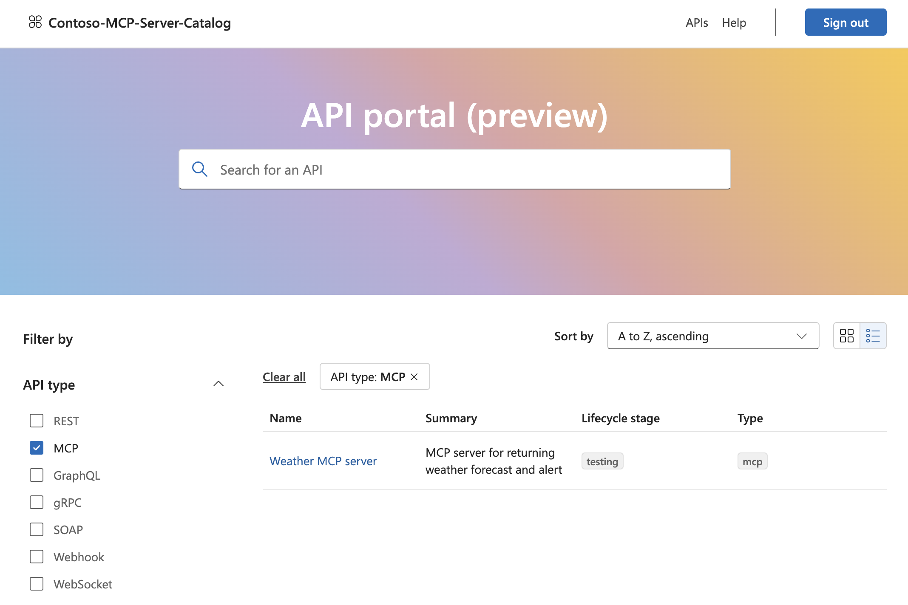

# Register MCP servers hosted in Azure Functions in Azure API Center

After hosting your MCP server remotely on Azure Functions, register it on Azure API Center. Azure API Center maintains an inventory (or registry) of remote MCP servers so that they're easily discoverable across your organization. All registered MCP servers appear in the API Center portal for teams in your organization. 

> [!TIP]
> The API Center name becomes your private tool catalog name in the registry filter. Choose an informative name that helps users identify your organization's tool catalog.

## Prerequisites

- An MCP server hosted on Azure Functions. To create one, see [Host an MCP server on Azure Functions](functions-mcp-tutorial.md).

## Register the server

1. Open the server app in the [Azure portal](https://portal.azure.com) and select the **AI (preview)** tab.

1. Select **Connect Azure API Center** in the **Azure API Center** section.

1. In the side pane that opens, either choose an existing API Center or create a new one. Fill out the required fields.

1. Select **Connect**.

## Publish the API Center portal

If your API Center portal isn't already published, publish it so your team can discover the registered server:

1. Select the API Center name to go to the resource.

1. On the left menu, find **API Center portal**.

1. Select **Configure Entra ID**, then follow the **Quick setup** flow.

1. Once Microsoft Entra ID is configured, select the **Save + publish** button at the top.

1. Select the **View API Center portal** button next to the publish button.

1. In the portal that opens, sign in with your email. Depending on your tenant's policy, you might need admin approval to grant consent.

After signing in, you should see the server listed in the API Center portal. Click into the server to see details, including the server endpoint.

