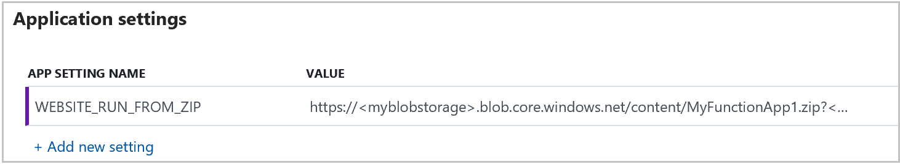

# Run your Azure Functions from a package file

> [!NOTE]
> The functionality described in this article is not available for Functions on Linux.

In Azure, you can run your functions directly from a deployment package file in your function app. The other option is to deploy your files in the `d:\home\site\wwwroot` directory of your function app.

This article describes the benefits of running your functions from a package. It also shows how to enable this functionality in your function app.

## Benefits of running from a package file
  
There are several benefits to running from a package file:

+ Reduces the risk of file copy locking issues.
+ Can be deployed to a production app (with restart).
+ You can be certain of the files that are running in your app.
+ Improves the performance of [Azure Resource Manager deployments](functions-infrastructure-as-code.md).
+ May reduce cold-start times, particularly for JavaScript functions with large npm package trees.

For more information, see [this announcement](https://github.com/Azure/app-service-announcements/issues/84).

## Enabling functions to run from a package

To enable your function app to run from a package, you just add a `WEBSITE_RUN_FROM_PACKAGE` setting to your function app settings. The `WEBSITE_RUN_FROM_PACKAGE` setting can have one of the following values:

| Value  | Description  |
|---------|---------|
|**`<url>`**  | Location of a specific package file you want to run. When using Blob storage, you should use a private container with a [Shared Access Signature (SAS)](../vs-azure-tools-storage-manage-with-storage-explorer.md#attach-a-storage-account-by-using-a-shared-access-signature-sas) to enable the Functions runtime to access to the package. You can use the [Azure Storage Explorer](https://azure.microsoft.com/features/storage-explorer/) to upload package files to your Blob storage account.         |
| **`1`**  | Run from a package file in the `d:\home\data\SitePackages` folder of your function app. This option requires the folder to also have a file named `packagename.txt`. This file contains only the name of the package file in folder, without any whitespace. |

The following shows a function app configured to run from a .zip file hosted in Azure Blob storage:

> [!NOTE]
> Currently, only .zip package files are supported.

## Integration with zip deployment

[Zip deployment][Zip deployment for Azure Functions] is a feature of Azure App Service that lets you deploy your function app project to the `wwwroot` directory. The project is packaged as a .zip deployment file. The same APIs can be used to deploy your package to the `d:\home\data\SitePackages` folder. With the `WEBSITE_RUN_FROM_PACKAGE` app setting value of `1`, the zip deployment APIs copy your package to the `d:\home\data\SitePackages` folder instead of extracting the files to `d:\home\site\wwwroot`. It also creates the `packagename.txt` file. The function app is then run from the package after a restart, and `wwwroot` becomes read-only. For more information about zip deployment, see [Zip deployment for Azure Functions](deployment-zip-push.md).

## Adding the WEBSITE_RUN_FROM_PACKAGE setting

[!INCLUDE [Function app settings](../../includes/functions-app-settings.md)]

## Next steps

> [!div class="nextstepaction"]
> [Continuous deployment for Azure Functions](functions-continuous-deployment.md)

[Zip deployment for Azure Functions]: deployment-zip-push.md
