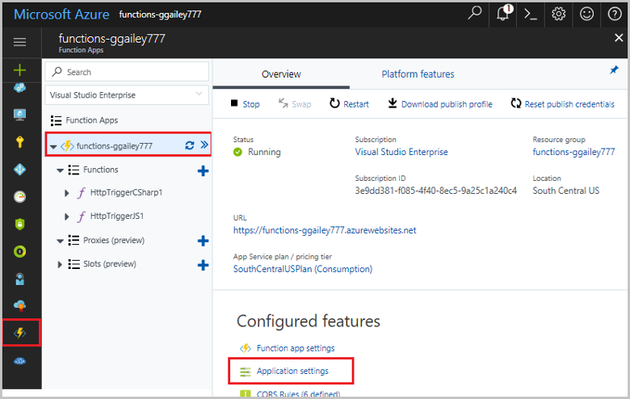
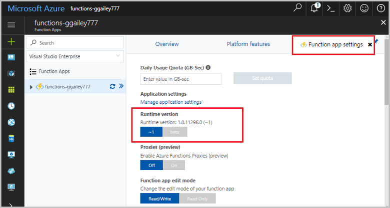
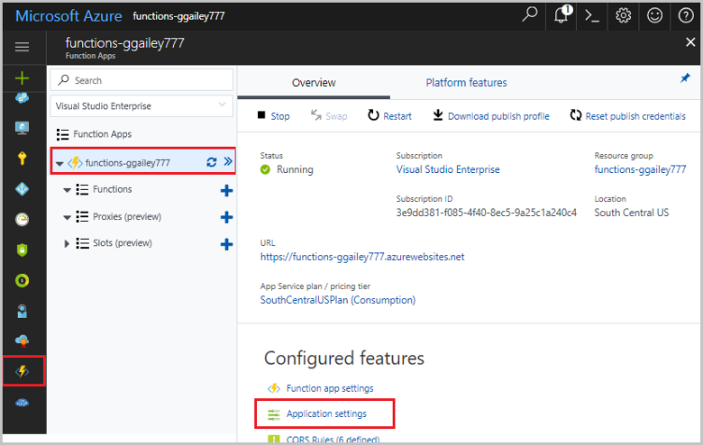
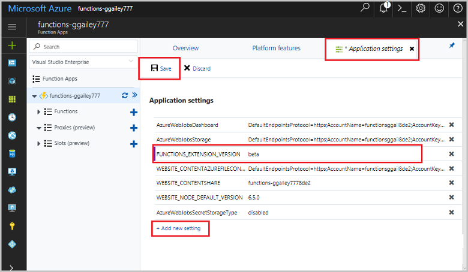

# How to target Azure Functions runtime versions

A function app runs on a specific version of the Azure Functions runtime. There are two major versions: [1.x and 2.x](functions-versions.md). This article explains how to configure a function app in Azure to run on the version you choose. For information about how to configure a local development environment for a specific version, see [Code and test Azure Functions locally](functions-run-local.md).

## Automatic and manual version updates

Functions lets you target a specific version of the runtime by using the `FUNCTIONS_EXTENSION_VERSION` application setting in a function app. The function app is kept on the specified major version until you explicitly choose to move to a new version.

If you specify only the major version ("~2" for 2.x or "~1" for 1.x), the function app is automatically updated to new minor versions of the runtime when they become available. New minor versions do not introduce breaking changes. If you specify a minor version (for example, "2.0.12345"), the function app is kept on that version until you explicitly change it. 

When a new version is publicly available, a prompt in the portal gives you the chance to move up to that version. After moving to a new version, you can always use the `FUNCTIONS_EXTENSION_VERSION` application setting to move back to a previous version.

A change to the runtime version causes a function app to restart.

The values you can set in the `FUNCTIONS_EXTENSION_VERSION` app setting to enable automatic updates are currently "~1" for the 1.x runtime and "~2" for 2.x.

## View the current runtime version

Use the following procedure to view the runtime version currently used by a function app. 

1. In the [Azure portal](https://portal.azure.com), navigate to the function app, and under **Configured Features**, choose **Function app settings**. 

    

2. In the **Function app settings** tab, locate the **Runtime version**. Note the specific runtime version and the requested major version. In the example below, the FUNCTIONS\_EXTENSION\_VERSION app setting is set to `~1`.
 
   

## Target a version using the portal

When you need to target a version other than the current major version or version 2.0, set the `FUNCTIONS_EXTENSION_VERSION` application setting.

1. In the [Azure portal](https://portal.azure.com), navigate to your function app, and under **Configured Features**, choose **Application settings**.

    

2. In the **Application settings** tab, find the `FUNCTIONS_EXTENSION_VERSION` setting and change the value to a valid version of the 1.x runtime or `~2` for version 2.0. A tilde with major version means use the latest version of that major version (for example, "~1"). 

    

3. Click **Save** to save the application setting update. 

## Target a version using Azure CLI

 You can also set the `FUNCTIONS_EXTENSION_VERSION` from the Azure CLI. Using the Azure CLI, update the application setting in the function app with the [az functionapp config appsettings set](/cli/azure/functionapp/config/appsettings#set) command.

```azurecli-interactive
az functionapp config appsettings set --name <function_app> \
--resource-group <my_resource_group> \
--settings FUNCTIONS_EXTENSION_VERSION=<version>
```
In this code, replace `<function_app>` with the name of your function app. Also replace `<my_resource_group>` with the name of the resource group for your function app. Replace `<version>` with a valid version of the 1.x runtime or `~2` for version 2.x. 

You can run this command from the [Azure Cloud Shell](../cloud-shell/overview.md) by choosing **Try it** in the preceding code sample. You can also use the [Azure CLI locally](/cli/azure/install-azure-cli) to execute this command after executing [az login](/cli/azure/reference-index#az-login) to sign in.

## Next steps

> [!div class="nextstepaction"]
> [Target the 2.0 runtime in your local development environment](functions-run-local.md)

> [!div class="nextstepaction"]
> [See Release notes for runtime versions](https://github.com/Azure/azure-webjobs-sdk-script/releases)
