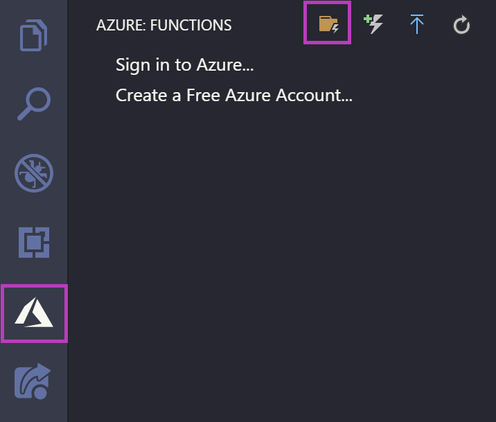
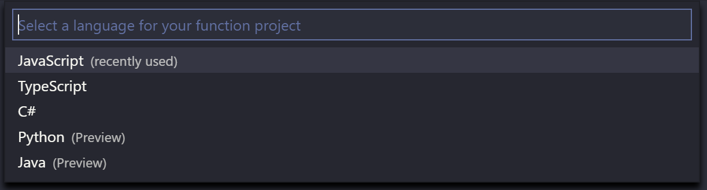
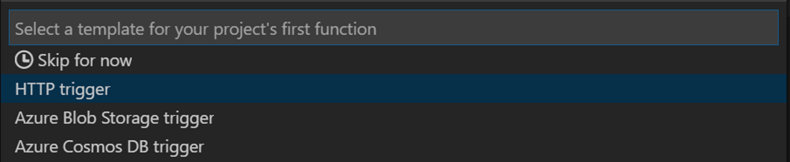
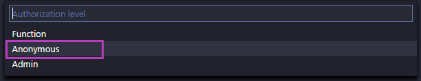
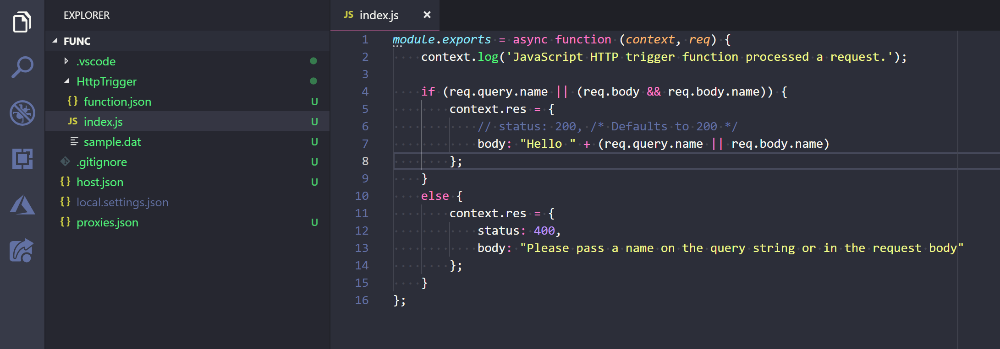

# Create your local Function App

First, create a local Azure Functions application. An Azure Functions app can contain many Functions with various triggers - this tutorial focuses on HTTP triggers, which allow you to handle to incoming HTTP traffic.

In the Activity Bar, click on the Azure logo to show the **AZURE Functions** explorer and click the **Create Project** icon.

Choose an empty directory for the app then select JavaScript for the language of your Functions App.

When prompted, choose HTTP trigger, enter `HttpTriggerJS` as the name, and choose **Anonymous** authentication.

Upon completion, a new directory is created within your Function app named `HttpTriggerJS` that includes `index.js`and `functions.json` files. The `index.js` file contains the source code that responds to the HTTP request and `functions.json` contains the [binding configuration](https://docs.microsoft.com/en-us/azure/azure-functions/functions-triggers-bindings) for the HTTP trigger.

## Next steps

Next, you'll run your app locally to verify everything is working.

> [!div class="nextstepaction"]
> [I've created the Function app](./tutorial-javascript-vscode-run-app.md)
> [!div class="nextstepaction"]
> [I ran into an issue](https://www.research.net/r/PWZWZ52?tutorial=node-deployment-azure-functions&step=create-app)
