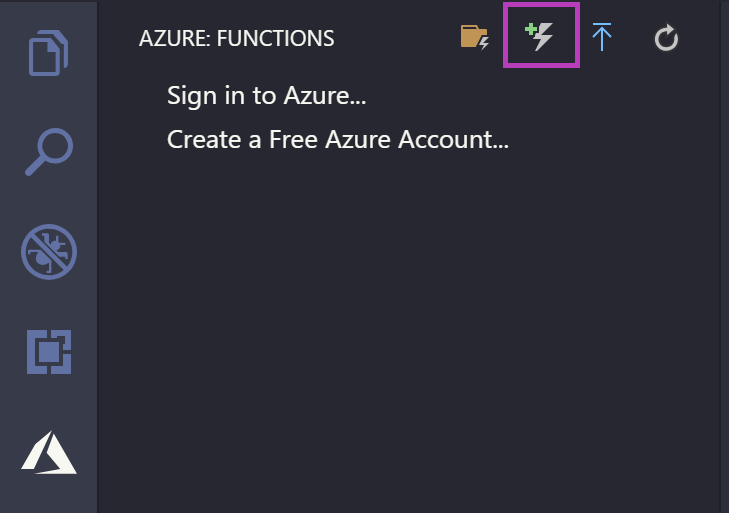

# Add a Function to your App

Next, create a Function that handles HTTP requests.

From the **AZURE FUNCTIONS** explorer, click the **Create Function** icon.

Select the directory you currently have open - it's the default option so press ENTER. When prompted, choose HTTP trigger, use the default name of `HttpTriggerJS`, and choose **Anonymous** authentication.

Upon completion, a new directory is created within your Function app named `HttpTriggerJS` that includes `index.js`and `functions.json` files. The `index.js` file contains the source code that responds to the HTTP request and `functions.json` contains the [binding configuration](https://docs.microsoft.com/en-us/azure/azure-functions/functions-triggers-bindings) for the HTTP trigger.

Next, run your app locally to verify everything is working.

---

> [!div class="nextstepaction"]
> [I've created the Function](./tutorial-javascript-vscode-run-app.md)

> [!div class="nextstepaction"]
> [I ran into an issue](https://www.research.net/r/PWZWZ52?tutorial=node-deployment-azurefunctions&step=create-function)
