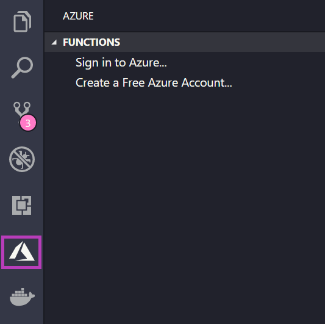
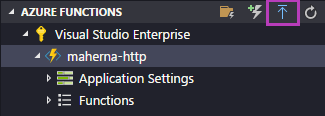
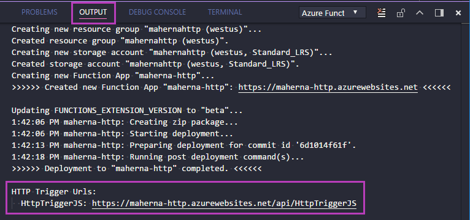
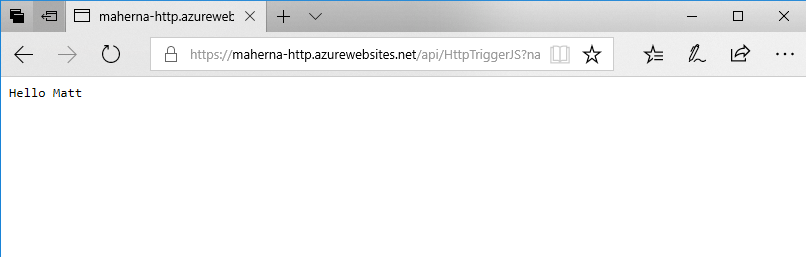

# Deploy your App using Azure Functions

If you don't have an Azure account, [sign up today](https://azure.microsoft.com/en-us/free/serverless?utm_source=campaign&utm_campaign=vscode-tutorial-functions-extension&mktingSource=vscode-tutorial-functions-extension) for a free account with $200 in Azure credits to try out any combination of services.

Once created, sign in to your Azure account - in the Activity Bar, click on the Azure logo to show the **Azure Functions** explorer. Click **Sign in to Azure...** and choose your account in the browser.

In the **AZURE FUNCTIONS** explorer, click the blue up arrow icon to deploy your app to Azure Functions.

> [!TIP]
> You can also deploy from the **Command Palette** (CTRL + SHIFT + P) by typing 'deploy to function app' and running the **Azure Functions: Deploy to Function App** command.

From here, follow the prompts. Choose the directory that you currently have open, select your Azure subscription, and then choose **Create New Function App**.

1. Type a globally unique name for your Function App and press ENTER. Valid characters for a function app name are 'a-z', '0-9', and '-'.

2. Choose **Create New Resource Group**, type a Resource Group name, like 'myResourceGroup' and press ENTER.

3. Choose a location in a [region](https://azure.microsoft.com/en-us/regions/) near you or near other services you may need to access.

4. Choose **Create New Storage Account**, type a globally unique name of the new storage account used by your function app and press Enter. Storage account names must be between 3 and 24 characters in length and may contain numbers and lowercase letters only.

Function app creation starts after you choose your Storage account.

The Output panel shows the Azure resources that were created in your subscription.

> [!TIP]
> A storage account is not required for HTTP trigger functions, other function triggers (e.g. Storage) do, however, require a storage account.

## Browse the website

The **Output** panel will open during deployment to indicate the status of the operation. When the operation completes, find the app you created in the **AZURE FUNCTIONS** explorer. Then, expand the **Functions** node to expose the HttpTriggerJS function, right-click it, and choose **Copy Function Url**. Paste the URL into your browser along add the `?name=Matt` query parameter and press ENTER to see the response.

## Updating the App

Next, make some changes to your Function and add new Functions with other Triggers. When you have the code running correctly in your local environment, click the blue up arrow **Deploy to Function App** button to deploy your changes.

> [!TIP]
> When deploying, the entire Functions application is deploy so changes to all individual Functions will be deployed at once.

## Next steps

Congratulations, you've successfully completed this quickstart! Be sure to check out the other Azure extensions:

* [Azure App Service](https://marketplace.visualstudio.com/items?itemName=ms-azuretools.vscode-azureappservice)
* [Cosmos DB](https://marketplace.visualstudio.com/items?itemName=ms-azuretools.vscode-cosmosdb)
* [Docker Tools](https://marketplace.visualstudio.com/items?itemName=PeterJausovec.vscode-docker)
* [Azure CLI Tools](https://marketplace.visualstudio.com/items?itemName=ms-vscode.azurecli)
* [Azure Resource Manager Tools](https://marketplace.visualstudio.com/items?itemName=msazurermtools.azurerm-vscode-tools)

You can get them all by installing the
[Node Pack for Azure](https://marketplace.visualstudio.com/items?itemName=ms-vscode.vscode-node-azure-pack) extension pack.

## Next steps

> [!div class="nextstepaction"]
> [I'm done!](./functions-monitoring.md)
> [!div class="nextstepaction"]
> [I ran into an issue](https://www.research.net/r/PWZWZ52?tutorial=node-deployment-azure-functions&step=deploy-app)
