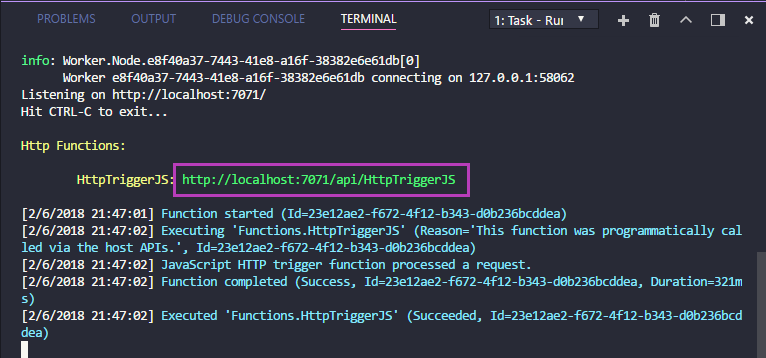
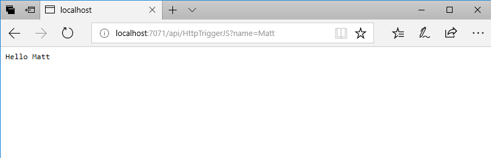
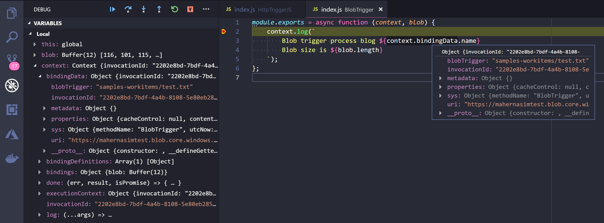

# Run and test your App locally

Upon creating the Function application, the necessary VS Code launch configuration was added to your project. To run the project locally, press `F5`. This action will launch and attach to the Azure Functions host, which is the same runtime that runs on Azure. That way, you can be sure that your source code runs the same locally as it does when deployed.

Press `F5` to launch the debugger. Output from the Functions Core tools is displayed in the VS Code Integrate Terminal panel. Once the host has started up, the local URL for your Function is written out. `Ctrl+Click` (`Cmd+Click` on macOS) the URL to open it in your browser.

The default HTTP template parses a `name` query parameter to customize the response, add `?name=<yourname>` to the URL in your browser to see the response output correctly.

Now that your Function is running locally, make some changes and set a breakpoint to see how Functions works. Learn more about the bindings that are available on [docs](https://docs.microsoft.com/en-us/azure/azure-functions/functions-triggers-bindings#supported-bindings). Keep in mind that all available bindings will run within the Azure Functions extension. This includes triggers from other services such as Azure Storage, as seen below.

## Next steps

Next, you'll set up your Azure account and publish the Function App from the extension.

> [!div class="nextstepaction"]
> [I ran the Function App](./tutorial-javascript-vscode-deploy-app.md)
> [!div class="nextstepaction"]
> [I ran into an issue](https://www.research.net/r/PWZWZ52?tutorial=node-deployment-azure-functions&step=run-app)
