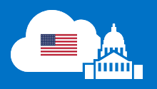

<properties
	pageTitle="Title | Microsoft Azure"
	description="This provides a comparision of features and guidance on developing applications for Azure Government"
	services=""
	documentationCenter=""
	authors="ryansoc"
	manager=""
	editor=""/>

<tags
	ms.service="multiple"
	ms.devlang="na"
	ms.topic="article"
	ms.tgt_pltfrm="na"
	ms.workload="azure-government"
	ms.date="10/29/2015"
	ms.author="ryansoc"/>

#  Azure Government Technical Information

## Overview

Azure Government is enabling U.S. Government & their partners to transform their mission-critical workloads to a trusted hyper-scale cloud.  

Microsoft provides a number of tools to create and deploy cloud applications to Microsoft’s global Azure service (“Global Service”) and Microsoft Azure Government services.

When creating and deploying applications to the Azure Government Services, as opposed to the Global Service, developers need to know the key differences of the two services.  Specifically around setting up and configuring their programming environment, configuring endpoints, writing applications, and deploying them as services to Azure Government.

The information accessible from this site summarizes those differences and supplements the information available on the [Azure Government](http://www.azure.com/gov "Azure Government") site and the [Microsoft Azure Technical Library](http://msdn.microsoft.com/cloud-app-development-msdn "MSDN") on MSDN. Official information may also be available in many other locations such as the [Microsoft Azure Trust Center](https://azure.microsoft.com/support/trust-center/ "Microsoft Azure Trust Center"/), [Azure Documentation Center](https://azure.microsoft.com/documentation/) and in [Azure Blogs](https://azure.microsoft.com/blog/ "Azure Blogs"/).

This content is intended for customers, partners and developers who are deploying to Microsoft Azure Government.

##  General Guidance for Developers
Because most of the technical content that is available currently assumes that applications are being developed for the Global Service rather than for Microsoft Azure Government, it’s important for you to ensure that developers are aware of key differences for applications developed to be hosted in Azure Government.

- First, there are services and feature differences, this means that certain features that are in specific regions of the Global Service may not be available in Azure Government.

- Second, for features that are offered in Azure Government, there are configuration differences from the Global Service.  Therefore, you should review your sample code, configurations and steps to ensure that you are building and executing within the Azure Government Cloud Services environment.

- Third, you should refer to the Azure Government Technical services documentation available from this site for information that identifies the Azure Government boundary and customer regulated/controlled data guidance and best practices.
