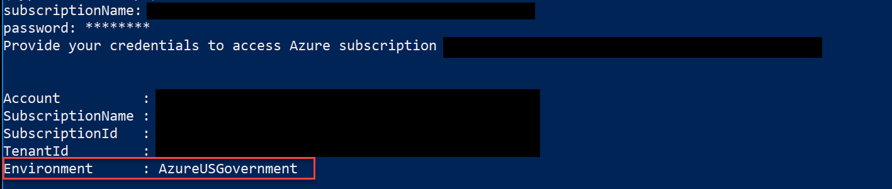
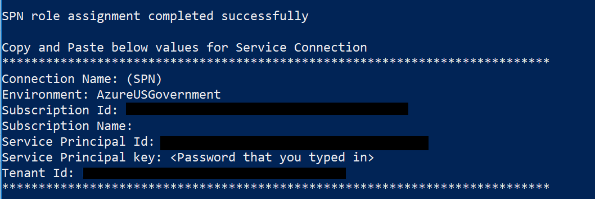
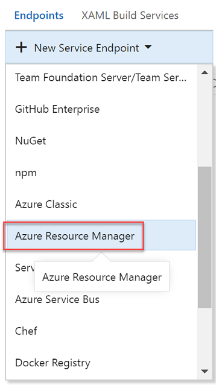
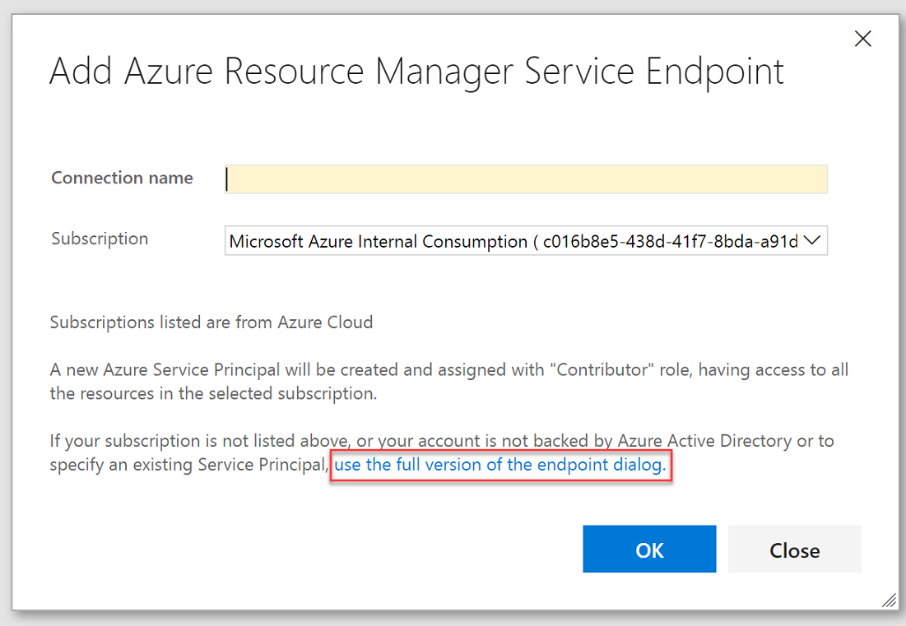
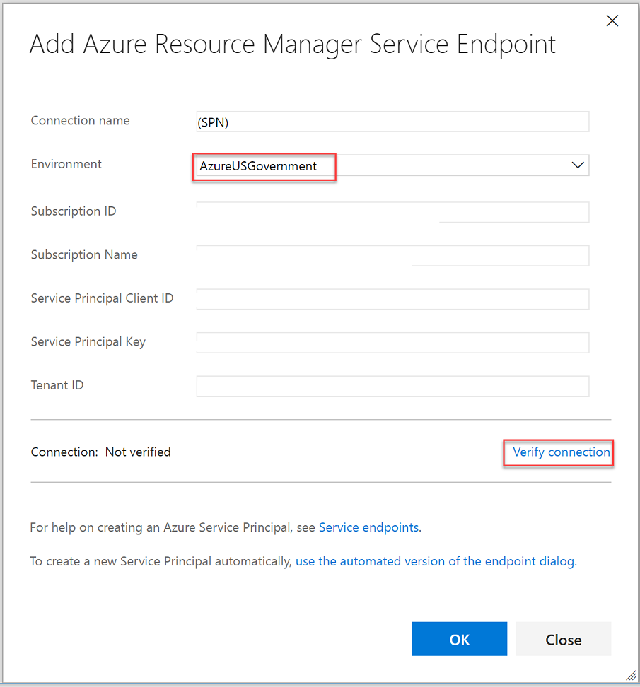
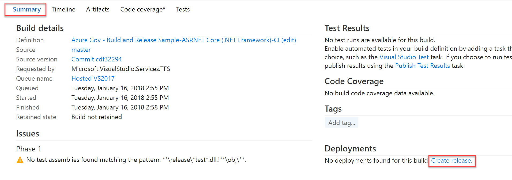
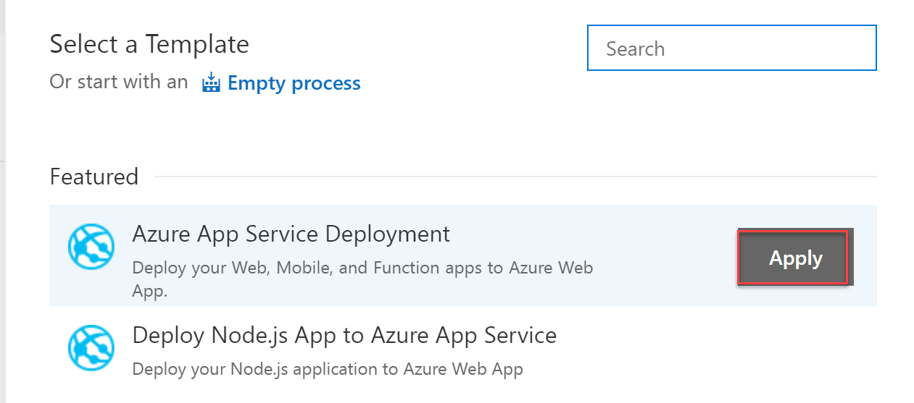

---
title: Connect to Azure Government from Azure DevOps Service | Microsoft Docs
description: Information on configuring continuous deployment to your applications hosted with a subscription in Azure Government by connecting from global Azure DevOps Service.
services: azure-government
cloud: gov
documentationcenter: ''
author: yujhongmicrosoft
manager: zakramer

ms.assetid: fb11f60c-5a70-46a9-82a0-abb2a4f4239b
ms.service: azure-government
ms.devlang: na
ms.topic: article
ms.tgt_pltfrm: na
ms.workload: azure-government
ms.date: 9/18/18
ms.author: yujhong

---
# Deploy an app in Azure Government with global Azure Pipelines

The tutorial below will help you set up continuous deployment to your web app running in Azure Government using Azure DevOps Service.
Continuous deployment (CD) means starting an automated deployment process whenever a code change is made to your application or whenever a new successful build is available. 
Azure DevOps Service is used by teams to configure continuous deployment for their applications hosted in their Azure subscriptions.
Refer to [this tutorial](https://docs.microsoft.com/azure/devops/pipelines/get-started-yaml?view=vsts) for an overview of CI/CD with Azure DevOps Service.

[Azure Pipelines](https://docs.microsoft.com/vsts/build-release/overview) is a service that enables continuous deployment for various applications. We can use this service for applications running in Azure Government by defining [service endpoints](https://docs.microsoft.com/azure/devops/pipelines/library/service-endpoints?view=vsts) for Azure Government. 

> [!NOTE]
> Azure DevOps Service is not available in Azure Government Clouds. This tutorial highlights how to configure a CI/CD pipeline in a global Azure account to deploy apps to Azure Government clouds, artifact storage, build, and (or) deployment orchestration for the app that would execute outside the government cloud.   
> 
> 

To learn more about Azure DevOps Service, click [here](https://docs.microsoft.com/azure/devops/user-guide/what-is-vsts?view=vsts). 

## Prerequisites

Before starting this tutorial, you must have the following:
+ An active Azure Government subscription.
If you don't have an Azure Government subscription, create a [free account](https://azure.microsoft.com/overview/clouds/government/) before you begin.
+ Create an [Azure DevOps organization and project](https://docs.microsoft.com/azure/devops/user-guide/sign-up-invite-teammates?view=vsts) if you don't already have one.
+ Installed and set up [Azure Powershell](https://docs.microsoft.com/powershell/azure/install-azurerm-ps?view=azurermps-5.1.1)

## Create Azure Government app service 

[Create an App service in your Azure Government subscription](documentation-government-howto-deploy-webandmobile.md). 
The following steps will set up a CD process to deploy to this Web App. 

## Set up Build and Source control integration
Follow through one of the quickstarts below to set up a Build for your specific type of app: 

- [ASP.NET 4 app](https://docs.microsoft.com/azure/devops/pipelines/apps/aspnet/build-aspnet-4?view=vsts)
- [ASP.NET Core app](https://docs.microsoft.com/azure/devops/pipelines/languages/dotnet-core?view=vsts&tabs=yaml)
- [Node.js app with Gulp](https://docs.microsoft.com/azure/devops/pipelines/languages/javascript?view=vsts&tabs=yaml)

## Generate a service principal 

1. Download or copy and paste [this powershell script](https://github.com/Microsoft/vsts-rm-documentation/blob/master/Azure/SPNCreation.ps1) into an IDE or editor. 
2. Open up the file and navigate to the `param` parameter. Replace the `$environmentName` variable with 
AzureUSGovernment." This sets the service principal to be created in Azure Government.
3. Open your Powershell window and run the following command. This command sets a policy that enables running local files. 

    ```Set-ExecutionPolicy -Scope Process -ExecutionPolicy Bypass```

    When you are asked whether you want to change the execution policy, enter "A" (for "Yes to All").

4. Navigate to the directory that has the edited script above. 
5. Edit the following command with the name of your script and run:
    `./<name of script file you saved> `
6. The "subscriptionName" parameter can be found by logging into your Azure Government subscription with `Connect-AzureRmAccount -EnvironmentName AzureUSGovernment` and then running `Get-AzureSubscription`. 
7. When prompted for the "password" parameter, enter your desired password. 
8. After providing your Azure Government subscription credentials, you should see the following: 

    > [!NOTE]
    > The Environment variable should be "AzureUSGovernment"
    > 
    > 

    
9. After the script has run you should see your service connection values. Copy these values as we will need them when setting up our endpoint. 

    

## Configure the Azure DevOps Services Endpoint

> [!NOTE]
> Make sure that you add the endpoint soon after running the Powershell script above, as the key expires. 
> If not, you navigate to the [Azure Government portal](https://portal.azure.us) -> AAD -> App registrations -> Add Key
>

1. Navigate to your Team Project from your Visual Studio Account. 
2. Navigate to the Services tab and click on "New Service Endpoint".    
3. Choose "Azure Resource Manager" from the dropdown menu. 

    
4. Click on the blue text in order to set up the service principal. 
	
    
5. Fill out the dialog with "AzureUSGovernment" for the "Environment" parameter and choose a friendly name for "Connection Name". Fill out the rest of dialog with the Service Connection values generated in **Step 9 of the "Generate a Service Principal" section above**. Click "Verify Connection" in the bottom right corner, make sure it says "Verified", and then click "Ok".

    

## Define a Release Process

1. After you have completed the steps above, we can now [define the release process](https://docs.microsoft.com/azure/devops/pipelines/apps/cd/deploy-webdeploy-webapps?view=vsts#cd) for our build.
2. Choose the link to the completed build (for example, Build 1634). In the build's Summary tab under Deployments, choose "Create release". This starts a new release definition that's automatically linked to the build definition.

    
3. Select the Azure App Service Deployment template and choose Next.

    
	In "Source..." make sure your CI build definition for the Web deploy package is selected as the artifact source.
4. Select the Continuous deployment check box, and then choose Create.
5. Select the Deploy Azure App Service task and configure it as follows:
 	- Azure Subscription: Select the endpoint configured earlier
	- App Service Name: the name of the web app (the part of the URL without .azurewebsites.us).
	- Deploy to Slot: make sure this is cleared (the default)
	- Virtual Application: leave blank
	- Web Deploy Package: $(System.DefaultWorkingDirectory)\**\*.zip (the default)
	- Advanced: Take App Offline: If you run into locked .DLL problems when you test the release, as explained below, try selecting this check box.
		
	
6. Edit the name of the release definition, choose Save, and choose OK. The default environment is named Environment1, which you can edit by clicking directly on the name.
	
Now that your pipeline has been constructed, you can [deploy changes](https://docs.microsoft.com/azure/devops/pipelines/apps/cd/deploy-webdeploy-webapps?view=vsts#deploy) to your applications in Azure Government. 

## Q&A
* Do I need a build agent?
You need at least one [agent](https://www.visualstudio.com/en-us/docs/build/concepts/agents/agents) to run your deployments. By default, the build and deployment processes are configured to use the [hosted agents](https://www.visualstudio.com/en-us/docs/build/concepts/agents/hosted). Configuring a private agent would limit data sharing outside of Azure Government.
* I use Azure DevOps Service on-premises. Can I configure CD on my Server to target Azure Government?
Currently, Azure DevOps Service cannot be used to deploy to an Azure Government Cloud. This capability will be added in the next update of Azure DevOps Service.

## Next steps
* Subscribe to the [Azure Government blog](https://blogs.msdn.microsoft.com/azuregov/)
* Get help on Stack Overflow by using the "[azure-gov](https://stackoverflow.com/questions/tagged/azure-gov)" tag
* Give us feedback or request new features via the [Azure Government feedback forum](https://feedback.azure.com/forums/558487-azure-government)