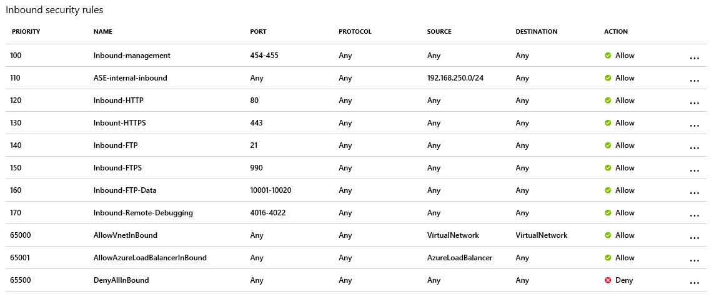
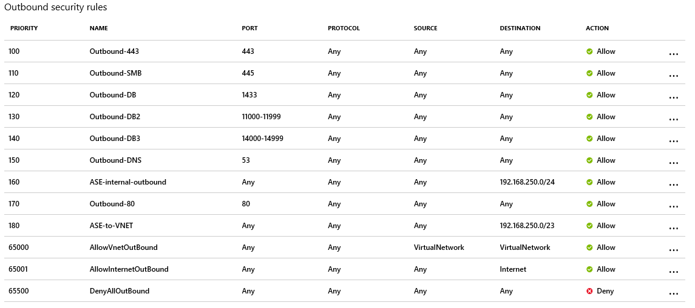

# App Service Environment reference for DoD customers connected to the DISA CAP

This article explains the baseline configuration of an App Service Environment (ASE) with an internal load balancer (ILB) for customers who use the DISA CAP to connect to Azure Government.

## Environment configuration

### Assumptions

The customer has deployed an ASE with an ILB and has implemented an ExpressRoute connection to the DISA Cloud Access Point (CAP).

### Route table

When creating the ASE via the portal, a route table with a default route of 0.0.0.0/0 and next hop “Internet” is created. 
However, since DISA advertises a default route out the ExpressRoute circuit, the User Defined Route (UDR) should either be deleted, or remove the default route to internet.  

You will need to create new routes in the UDR for the management addresses in order to keep the ASE healthy. For Azure Government ranges see [App Service Environment management addresses](https://docs.microsoft.com/azure/app-service/environment/management-addresses
)

* Rule 1: 23.97.29.209 --> Internet
* Rule 2: 23.97.0.17 --> Internet 
* Rule 3: 23.97.16.184 --> Internet 
* Rule 4: 13.72.180.105 --> Internet
* Rule 5: 13.72.53.37 --> Internet

Make sure the UDR is applied to the subnet your ASE is deployed to. 

### Network security group (NSG)

The ASE will be created with inbound and outbound security rules as shown below.  The inbound security rules MUST allow ports 454-455 with an ephemeral source port range (*).

The images below describe the default NSG rules created during the ASE creation.  For more information, see [Networking considerations for an App Service Environment](https://docs.microsoft.com/azure/app-service/environment/network-info#network-security-groups)

### Service Endpoints 

Depending on the storage you use, you will be required to enable Service Endpoints for SQL and Azure Storage to access them without going back down to the DISA BCAP. You also need to enable EventHub Service Endpoint for ASE logs. [Learn more](https://docs.microsoft.com/azure/app-service/environment/network-info#service-endpoints).

## FAQs

Some configuration changes may take some time to take effect.  Allow for several hours for changes to routing, NSGs, ASE Health, etc. to propagate and take effect, or optionally you can reboot the ASE. 

## Resource manager template sample

> [!NOTE]
> In order to deploy non-RFC 1918 IP addresses in the portal you must pre-stage the VNet and Subnet for the ASE. You can use a Resource Manager Template to deploy the ASE with non-RFC1918 IPs as well.
   

This template deploys an **ILB ASE** into the Azure Government or Azure DoD regions.

## Next steps
[Azure Government overview](documentation-government-welcome.md)
