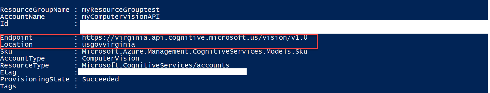

# Cognitive Services on Azure Government – Computer Vision, Face, Translator Text APIs

To see an overview of Cognitive Services on Azure Government, [click here](documentation-government-services-aiandcognitiveservices.md).

> [!IMPORTANT]
> Billing for the Computer Vision API, Face API, and Translator Text API will begin on 11/1/2018.

## Prerequisites
* Install and Configure [Azure PowerShell](https://docs.microsoft.com/powershell/azure/install-azurerm-ps?view=azurermps-4.4.0)
* Connect [PowerShell with Azure Government](documentation-government-get-started-connect-with-ps.md)

## Part 1: Provision Cognitive Services Accounts

In order to access any of the Cognitive Services APIs, you must first provision a Cognitive Services account for each of the APIs you want to access. **Cognitive Services is not yet supported in the Azure Government Portal**, but you can use Azure PowerShell to access the APIs and services. 

> [!NOTE]
> You must go through the process of creating an account and retrieving a key(explained below) **for each** of the APIs you want to access.
> 
> 

1. Make sure that you have the **Cognitive Services resource provider registered on your account**. 

You can do this by **running the following PowerShell command:**

   ```PowerShell
   Get-AzureRmResourceProvider
   ```
   If you do **not see `Microsoft.CognitiveServices`**, you have to register the resource provider by **running the following command**:
   ```PowerShell
   Register-AzureRmResourceProvider -ProviderNamespace Microsoft.CognitiveServices
   ```
2. In the PowerShell command below, replace "rg-name", "name-of-your-api", and "location-of-resourcegroup" with your relevant account information. 

   Replace the "type of API" tag with any of the three following APIs you want to access:
       * ComputerVision
       * Face
       * TextTranslation

   ```PowerShell
   New-AzureRmCognitiveServicesAccount -ResourceGroupName 'rg-name' -name 'name-of-your-api' -Type <type of API> -SkuName S0 -Location 'location-of-resourcegroup'
   ```
   Example: 

   ```PowerShell
   New-AzureRmCognitiveServicesAccount -ResourceGroupName 'resourcegrouptest' -name 'myFaceAPI' -Type Face -SkuName S0 -Location 'usgovvirginia'
   ```

   After you run the command, you should see something like this: 

   

3. Copy and save the "Endpoint" attribute somewhere as you will need it when making calls to the API. 

### Retrieve Account Key

You must retrieve an account key to access the specific API. 

In the PowerShell command below, replace the "youraccountname" tag with the name that you gave the Account that you created above. Replace the 'rg-name' tag with the name of your resource group.

```PowerShell
Get-AzureRmCognitiveServicesAccountKey -Name <youraccountname> -ResourceGroupName 'rg-name'
```

Example:
```PowerShell
Get-AzureRmCognitiveServicesAccountKey -Name myFaceAPI -ResourceGroupName 'resourcegrouptest'
```
Copy and save the first key somewhere as you will need it to make calls to the API.


Now you are ready to make calls to the APIs. 

## Part 2: API Quickstarts 
The Quickstarts below will help you to get started with the APIs available through Cognitive Services in Azure Government.

## Computer Vision API
### Prerequisites

* Get the Microsoft Computer Vision API Windows SDK [here](https://github.com/Microsoft/Cognitive-vision-windows).

* Make sure Visual Studio has been installed:
    -   [Visual Studio 2017 version 15.3](https://www.visualstudio.com/vs/preview/), including the **Azure development** workload.
    
    >[!NOTE] 
    > After you install or upgrade to Visual Studio 2017 version 15.3, you might also need to manually update the Visual Studio 		2017 tools for Azure Functions. You can update the tools from the **Tools** menu under **Extensions and Updates...** > 			**Updates** > **Visual Studio Marketplace** > **Azure Functions and Web Jobs Tools** > **Update**. 
    >
    >
    
### Variations
* The URI for accessing the Face API in Azure Government is :
   - `https://(resource-group-location).api.cognitive.microsoft.us/face/v1.0`
   - The main difference between this URI and the URI used in Commercial Azure is the ending of **.us** and the location at the beginning of the uri


### Analyze an Image With Computer Vision API using C# <a name="AnalyzeImage"> </a>

With the [Analyze Image method](https://westcentralus.dev.cognitive.microsoft.com/docs/services/56f91f2d778daf23d8ec6739/operations/56f91f2e778daf14a499e1fa), you can extract visual features based on image content. You can upload an image or specify an image URL and choose which features to return, including:
* A detailed list of tags related to the image content.
* A description of image content in a complete sentence.
* The coordinates, gender, and age of any faces contained in the image.
* The ImageType (clip art or a line drawing).
* The dominant color, the accent color, or whether an image is black & white.
* The category defined in this [taxonomy](../cognitive-services/computer-vision/category-taxonomy.md).
* Does the image contain adult or sexually suggestive content?

### Analyze an image C# example request

1. Create a new Console solution in Visual Studio.
2. Replace Program.cs with the following code.
3. Change the `uriBase` to the "Endpoint" attribute that you saved from Part 1, and keep the "/analyze" after the endpoint.
4. Replace the `subscriptionKey` value with your valid subscription key.
5. Run the program.

```csharp
using System;
using System.IO;
using System.Net.Http;
using System.Net.Http.Headers;
using System.Text;

namespace VisionApp1
{
        static class Program
        {
            // **********************************************
            // *** Update or verify the following values. ***
            // **********************************************

            // Replace the subscriptionKey string value with your valid subscription key.
            const string subscriptionKey = "<subscription key>";

            //Copy and paste the "Endpoint" attribute that you saved before into the uriBase string "/analyze" at the end. 
            //Example: https://virginia.api.cognitive.microsoft.us/vision/v1.0/analyze
  
            const string uriBase = "<endpoint>/analyze";
            
            static void Main()
            {
                // Get the path and filename to process from the user.
                Console.WriteLine("Analyze an image:");
                Console.Write("Enter the path to an image you wish to analyze: ");
                string imageFilePath = Console.ReadLine();

                // Execute the REST API call.
                MakeAnalysisRequest(imageFilePath);

                Console.WriteLine("\nPlease wait a moment for the results to appear. Then, press Enter to exit...\n");
                Console.ReadLine();
            }


            /// <summary>
            /// Gets the analysis of the specified image file by using the Computer Vision REST API.
            /// </summary>
            /// <param name="imageFilePath">The image file.</param>
            static async void MakeAnalysisRequest(string imageFilePath)
            {
                HttpClient client = new HttpClient();

                // Request headers.
                client.DefaultRequestHeaders.Add("Ocp-Apim-Subscription-Key", subscriptionKey);

                // Request parameters. A third optional parameter is "details".
                string requestParameters = "visualFeatures=Categories,Description,Color&language=en";

                // Assemble the URI for the REST API Call.
                string uri = uriBase + "?" + requestParameters;

                HttpResponseMessage response;

                // Request body. Posts a locally stored JPEG image.
                byte[] byteData = GetImageAsByteArray(imageFilePath);

                using (ByteArrayContent content = new ByteArrayContent(byteData))
                {
                    // This example uses content type "application/octet-stream".
                    // The other content types you can use are "application/json" and "multipart/form-data".
                    content.Headers.ContentType = new MediaTypeHeaderValue("application/octet-stream");

                    // Execute the REST API call.
                    response = await client.PostAsync(uri, content);

                    // Get the JSON response.
                    string contentString = await response.Content.ReadAsStringAsync();

                    // Display the JSON response.
                    Console.WriteLine("\nResponse:\n");
                    Console.WriteLine(JsonPrettyPrint(contentString));
                }
            }


            /// <summary>
            /// Returns the contents of the specified file as a byte array.
            /// </summary>
            /// <param name="imageFilePath">The image file to read.</param>
            /// <returns>The byte array of the image data.</returns>
            static byte[] GetImageAsByteArray(string imageFilePath)
            {
                FileStream fileStream = new FileStream(imageFilePath, FileMode.Open, FileAccess.Read);
                BinaryReader binaryReader = new BinaryReader(fileStream);
                return binaryReader.ReadBytes((int)fileStream.Length);
            }


            /// <summary>
            /// Formats the given JSON string by adding line breaks and indents.
            /// </summary>
            /// <param name="json">The raw JSON string to format.</param>
            /// <returns>The formatted JSON string.</returns>
            static string JsonPrettyPrint(string json)
            {
                if (string.IsNullOrEmpty(json))
                    return string.Empty;

                json = json.Replace(Environment.NewLine, "").Replace("\t", "");

                StringBuilder sb = new StringBuilder();
                bool quote = false;
                bool ignore = false;
                int offset = 0;
                int indentLength = 3;

                foreach (char ch in json)
                {
                    switch (ch)
                    {
                        case '"':
                            if (!ignore) quote = !quote;
                            break;
                        case '\'':
                            if (quote) ignore = !ignore;
                            break;
                    }

                    if (quote)
                        sb.Append(ch);
                    else
                    {
                        switch (ch)
                        {
                            case '{':
                            case '[':
                                sb.Append(ch);
                                sb.Append(Environment.NewLine);
                                sb.Append(new string(' ', ++offset * indentLength));
                                break;
                            case '}':
                            case ']':
                                sb.Append(Environment.NewLine);
                                sb.Append(new string(' ', --offset * indentLength));
                                sb.Append(ch);
                                break;
                            case ',':
                                sb.Append(ch);
                                sb.Append(Environment.NewLine);
                                sb.Append(new string(' ', offset * indentLength));
                                break;
                            case ':':
                                sb.Append(ch);
                                sb.Append(' ');
                                break;
                            default:
                                if (ch != ' ') sb.Append(ch);
                                break;
                        }
                    }
                }

                return sb.ToString().Trim();
            }
        }
    }
```
### Analyze an Image response

A successful response is returned in JSON. Following is an example of a successful response:

```json

{
   "categories": [
      {
         "name": "people_baby",
         "score": 0.52734375
      },
      {
         "name": "people_young",
         "score": 0.4375
      }
   ],
   "description": {
      "tags": [
         "person",
         "indoor",
         "clothing",
         "woman",
         "white",
         "table",
         "food",
         "girl",
         "smiling",
         "posing",
         "holding",
         "black",
         "sitting",
         "young",
         "plate",
         "hair",
         "wearing",
         "cake",
         "large",
         "shirt",
         "dress",
         "eating",
         "standing",
         "blue"
      ],
      "captions": [
         {
            "text": "a woman posing for a picture",
            "confidence": 0.460196158842535
         }
      ]
   },
   "requestId": "7c20cc50-f5eb-453b-abb5-98378917431c",
   "metadata": {
      "width": 721,
      "height": 960,
      "format": "Jpeg"
   },
   "color": {
      "dominantColorForeground": "Black",
      "dominantColorBackground": "White",
      "dominantColors": [
         "White"
      ],
      "accentColor": "7C4F57",
      "isBWImg": false
   }
}
```
For more information, please see [public documentation](../cognitive-services/computer-vision/index.yml) and [public API documentation](https://westus.dev.cognitive.microsoft.com/docs/services/56f91f2d778daf23d8ec6739/operations/56f91f2e778daf14a499e1fa) for Computer Vision API.

## Face API
### Prerequisites
* Get the Microsoft Face API Windows SDK [here](https://www.nuget.org/packages/Microsoft.ProjectOxford.Face/)

* Make sure Visual Studio has been installed:
    -   [Visual Studio 2017 version 15.3](https://www.visualstudio.com/vs/preview/), including the **Azure development** workload.
    
    >[!NOTE] 
    > After you install or upgrade to Visual Studio 2017 version 15.3, you might also need to manually update the Visual Studio 		2017 tools for Azure Functions. You can update the tools from the **Tools** menu under **Extensions and Updates...** > 			**Updates** > **Visual Studio Marketplace** > **Azure Functions and Web Jobs Tools** > **Update**. 
    >
    >
    
### Variations 
* The URI for accessing the Face API in Azure Government is :
   - `https://(resource-group-location).api.cognitive.microsoft.us/face/v1.0`
   - The main difference between this URI and the URI used in Commercial Azure is the ending of **.us** and the location at the beginning of the uri

### Detect Faces in images with Face API using C# <a name="Detect"> </a>
Use the [Face - Detect method](https://westcentralus.dev.cognitive.microsoft.com/docs/services/563879b61984550e40cbbe8d/operations/563879b61984550f30395236) 
to detect faces in an image and return face attributes including:
* Face ID: Unique ID used in several Face API scenarios. 
* Face Rectangle: The left, top, width, and height indicating the location of the face in the image.
* Landmarks: An array of 27-point face landmarks pointing to the important positions of face components.
* Facial attributes including age, gender, smile intensity, head pose, and facial hair. 

### Face detect C# example request

The sample is written in C# using the Face API client library. 

1. Create a new Console solution in Visual Studio.
2. Replace Program.cs with the following code.
3. Replace the `subscriptionKey` value with the key value that you retrieved above.
4. Change the `uriBase` value to the "Endpoint" attribute you retrieved above.
5. Run the program.
6. Enter the path to an image on your hard drive.

```csharp

using System;
using System.IO;
using System.Net.Http;
using System.Net.Http.Headers;
using System.Text;

namespace FaceApp1
{

    static class Program
    {
        // **********************************************
        // *** Update or verify the following values. ***
        // **********************************************
         
        // Replace the subscriptionKey string value with your valid subscription key.
        const string subscriptionKey = "<subscription key>";

        //Copy and paste the "Endpoint" attribute that you saved before into the uriBase string "/detect" at the end. 
        //Example: https://virginia.api.cognitive.microsoft.us/face/v1.0/detect
        const string uriBase ="<endpoint>/detect";

        static void Main()
        {
            // Get the path and filename to process from the user.
            Console.WriteLine("Detect faces:");
            Console.Write("Enter the path to an image with faces that you wish to analzye: ");
            string imageFilePath = Console.ReadLine();

            // Execute the REST API call.
            MakeAnalysisRequest(imageFilePath);

            Console.WriteLine("\nPlease wait a moment for the results to appear. Then, press Enter to exit...\n");
            Console.ReadLine();
        }


        /// <summary>
        /// Gets the analysis of the specified image file by using the Computer Vision REST API.
        /// </summary>
        /// <param name="imageFilePath">The image file.</param>
        static async void MakeAnalysisRequest(string imageFilePath)
        {
            HttpClient client = new HttpClient();

            // Request headers.
            client.DefaultRequestHeaders.Add("Ocp-Apim-Subscription-Key", subscriptionKey);

            // Request parameters. A third optional parameter is "details".
            string requestParameters = "returnfaceId=true&returnfaceLandmarks=false&returnfaceAttributes=age,gender,headPose,smile,facialHair,glasses,emotion";

            // Assemble the URI for the REST API Call.
            string uri = uriBase + "?" + requestParameters;

            HttpResponseMessage response;

            // Request body. Posts a locally stored JPEG image.
            byte[] byteData = GetImageAsByteArray(imageFilePath);

            using (ByteArrayContent content = new ByteArrayContent(byteData))
            {
                // This example uses content type "application/octet-stream".
                // The other content types you can use are "application/json" and "multipart/form-data".
                content.Headers.ContentType = new MediaTypeHeaderValue("application/octet-stream");

                // Execute the REST API call.
                response = await client.PostAsync(uri, content);

                // Get the JSON response.
                string contentString = await response.Content.ReadAsStringAsync();

                // Display the JSON response.
                Console.WriteLine("\nResponse:\n");
                Console.WriteLine(JsonPrettyPrint(contentString));
            }
        }


        /// <summary>
        /// Returns the contents of the specified file as a byte array.
        /// </summary>
        /// <param name="imageFilePath">The image file to read.</param>
        /// <returns>The byte array of the image data.</returns>
        static byte[] GetImageAsByteArray(string imageFilePath)
        {
            FileStream fileStream = new FileStream(imageFilePath, FileMode.Open, FileAccess.Read);
            BinaryReader binaryReader = new BinaryReader(fileStream);
            return binaryReader.ReadBytes((int)fileStream.Length);
        }


        /// <summary>
        /// Formats the given JSON string by adding line breaks and indents.
        /// </summary>
        /// <param name="json">The raw JSON string to format.</param>
        /// <returns>The formatted JSON string.</returns>
        static string JsonPrettyPrint(string json)
        {
            if (string.IsNullOrEmpty(json))
                return string.Empty;

            json = json.Replace(Environment.NewLine, "").Replace("\t", "");

            StringBuilder sb = new StringBuilder();
            bool quote = false;
            bool ignore = false;
            int offset = 0;
            int indentLength = 3;

            foreach (char ch in json)
            {
                switch (ch)
                {
                    case '"':
                        if (!ignore) quote = !quote;
                        break;
                    case '\'':
                        if (quote) ignore = !ignore;
                        break;
                }

                if (quote)
                    sb.Append(ch);
                else
                {
                    switch (ch)
                    {
                        case '{':
                        case '[':
                            sb.Append(ch);
                            sb.Append(Environment.NewLine);
                            sb.Append(new string(' ', ++offset * indentLength));
                            break;
                        case '}':
                        case ']':
                            sb.Append(Environment.NewLine);
                            sb.Append(new string(' ', --offset * indentLength));
                            sb.Append(ch);
                            break;
                        case ',':
                            sb.Append(ch);
                            sb.Append(Environment.NewLine);
                            sb.Append(new string(' ', offset * indentLength));
                            break;
                        case ':':
                            sb.Append(ch);
                            sb.Append(' ');
                            break;
                        default:
                            if (ch != ' ') sb.Append(ch);
                            break;
                    }
                }
            }

            return sb.ToString().Trim();
        }
    }
}
```
### Face detect response

A successful response is returned in JSON. Following is an example of a successful response: 

```json
Response:
[
   {
      "faceId": "0ed7f4db-1207-40d4-be2e-84694e42d682",
      "faceRectangle": {
         "top": 60,
         "left": 83,
         "width": 361,
         "height": 361
      },
      "faceAttributes": {
         "smile": 0.284,
         "headPose": {
            "pitch": 0.0,
            "roll": -12.2,
            "yaw": -16.7
         },
         "gender": "female",
         "age": 16.5,
         "facialHair": {
            "moustache": 0.0,
            "beard": 0.0,
            "sideburns": 0.0
         },
         "glasses": "NoGlasses",
         "emotion": {
            "anger": 0.003,
            "contempt": 0.001,
            "disgust": 0.001,
            "fear": 0.002,
            "happiness": 0.284,
            "neutral": 0.694,
            "sadness": 0.012,
            "surprise": 0.004
         }
      }
   }
]
```
For more information, please see [public documentation](../cognitive-services/Face/index.yml), and [public API documentation](https://westus.dev.cognitive.microsoft.com/docs/services/563879b61984550e40cbbe8d/operations/563879b61984550f30395236) for Face API.

## Text Translation API 
### Prerequisites

* Make sure Visual Studio has been installed:
    -   [Visual Studio 2017 version 15.3](https://www.visualstudio.com/vs/preview/), including the **Azure development** workload.
    
    >[!NOTE] 
    > After you install or upgrade to Visual Studio 2017 version 15.3, you might also need to manually update the Visual Studio 		2017 tools for Azure Functions. You can update the tools from the **Tools** menu under **Extensions and Updates...** > 			**Updates** > **Visual Studio Marketplace** > **Azure Functions and Web Jobs Tools** > **Update**. 
    >
    >
    
### Variations
* The URI for accessing the Text Translation API in Azure Government is: 
   - `https://dev.microsofttranslator.us/translate?api-version=3.0`
### Text Translation Method
This sample will use the [Text Translation - Translate method](../cognitive-services/translator/reference/v3-0-translate.md) to translate a string of text from a language into another specified language. There are multiple [language codes](https://api.cognitive.microsofttranslator.com/languages?api-version=3.0&scope=translation,dictionary,transliteration) that can be used with the Text Translation API. 

### Text Translation C# example request

The sample is written in C#. 

1. Create a new Console solution in Visual Studio.
2. Replace Program.cs with the corresponding code below.
3. Replace the `subscriptionKey` value with the key value that you retrieved above.
4. Replace the `text` value with text that you want to translate.
5. Run the program.

You can also test out different languages and texts by replacing the "text", "from", and "to" variables in Program.cs. 

```csharp
using System;
using Microsoft.Azure.CognitiveServices.Language.TextAnalytics;
using Microsoft.Azure.CognitiveServices.Language.TextAnalytics.Models;
using System.Collections.Generic;
using Microsoft.Rest;
using System.Net.Http;
using System.Threading;
using System.Threading.Tasks;
using System.Net;
using System.IO;
using Newtonsoft.Json;
using System.Text;

namespace TextTranslator
{
    class Program
    {
        static string host = "https://dev.microsofttranslator.us";
        static string path = "/translate?api-version=3.0";
        // Translate to German.
        static string params_ = "&to=de";

        static string uri = host + path + params_;

        // NOTE: Replace this example key with a valid subscription key.
        static string key = "PASTE KEY HERE";

        static string text = "Hello world!";

        async static void Translate()
        {
            System.Object[] body = new System.Object[] { new { Text = text } };
            var requestBody = JsonConvert.SerializeObject(body);

            using (var client = new HttpClient())
            using (var request = new HttpRequestMessage())
            {
                request.Method = HttpMethod.Post;
                request.RequestUri = new Uri(uri);
                request.Content = new StringContent(requestBody, Encoding.UTF8, "application/json");
                request.Headers.Add("Ocp-Apim-Subscription-Key", key);

                var response = await client.SendAsync(request);
                var responseBody = await response.Content.ReadAsStringAsync();
                var result = JsonConvert.SerializeObject(JsonConvert.DeserializeObject(responseBody), Formatting.Indented);

                Console.OutputEncoding = UnicodeEncoding.UTF8;
                Console.WriteLine(result);
            }
        }

        static void Main(string[] args)
        {
            Translate();
            Console.ReadLine();
        }
    }
}
```
For more information, please see [public documentation](../cognitive-services/translator/translator-info-overview.md) and [public API documentation](https://docs.microsoft.com/azure/cognitive-services/Translator/reference/v3-0-reference) for Translator Text API.

### Next Steps
* Subscribe to the [Azure Government blog](https://blogs.msdn.microsoft.com/azuregov/)
* Get help on Stack Overflow by using the "[azure-gov](https://stackoverflow.com/questions/tagged/azure-gov)" tag
* Give us feedback or request new features via the [Azure Government feedback forum](https://feedback.azure.com/forums/558487-azure-government)
