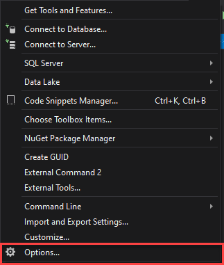
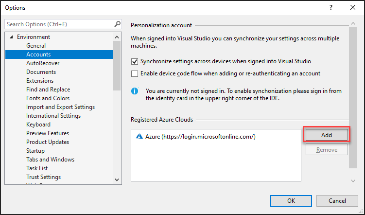
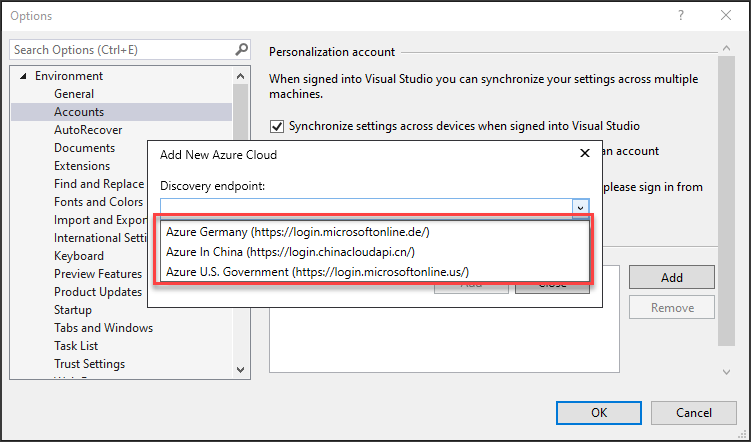
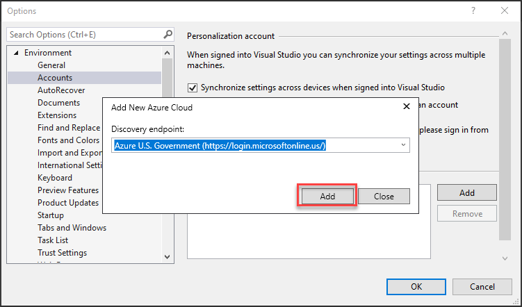
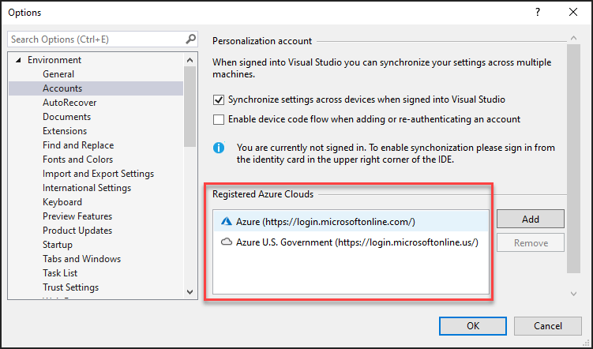
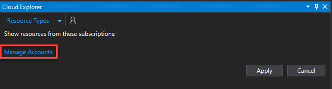
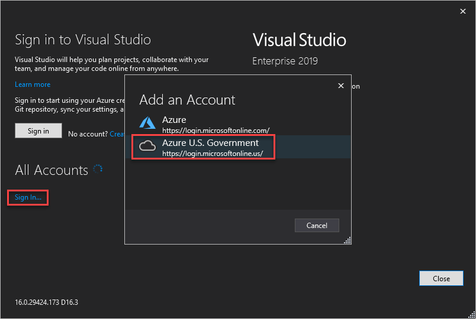

# Quickstart: Connect to Azure Government with Visual Studio

Microsoft Azure Government delivers a dedicated cloud with world-class security and compliance, enabling US government agencies and their partners to transform their workloads to the cloud. To manage your Azure Government cloud workloads and applications you can connect to Azure Government using different tools, as described in the following video.  

> [!VIDEO https://www.youtube.com/embed/Q3kx4cmRkCA]

This quickstart shows how to connect to your Azure Government accounts and subscriptions with Visual Studio. If you don't have an Azure Government subscription, create a [free account](https://azure.microsoft.com/global-infrastructure/government/request/) before you begin.

## Prerequisites

- Review [Guidance for developers](./documentation-government-developer-guide.md).  This article discusses Azure Government's unique URLs and endpoints for managing your environment. You must know about these endpoints in order to connect to Azure Government. 
- Review [Compare Azure Government and global Azure](./compare-azure-government-global-azure.md) and click on a service of interest to see variations between Azure Government and global Azure.
- Install <a href="https://www.visualstudio.com/downloads/" target="_blank">Visual Studio 2019</a>.

## Sign in to Azure Government

1. Open up Visual Studio and click **Tools** > **Options**. 

   

2. Then navigate to **Environment** > **Accounts** and under *Registered Azure Clouds* you can see which cloud endpoints you already have registered. In order to add Azure Government, you must click the *Add* button and you will see the dropdown below:

   
   

3. From this dropdown, you can choose *Azure U.S. Government* and click add. Once you have done this, you should be able to see *Azure U.S. Government* under *Registered Azure Clouds*. 

   
   

4. Then you can click on the blue *Manage Accounts* link in the top-left corner and choose *Azure U.S. Government* to access an Azure Government account. 

   
   

5. You are prompted to sign in. Once you have entered your credentials, you will be able to see your account and subscriptions populate on the left-hand side. Now you are free to manage and interact with your Azure Government resources in Visual Studio!

## Next steps

This quickstart showed you how to use Visual Studio to connect to Azure Government. Once you are connected to Azure Government, you may want to explore Azure services. Make sure you check out the variations, described in [Compare Azure Government and global Azure](./compare-azure-government-global-azure.md). To learn more about Azure services, continue to the Azure documentation.

> [!div class="nextstepaction"]
> [Azure documentation](../index.yml)
