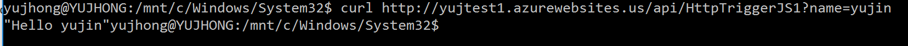
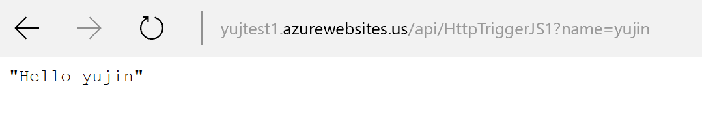
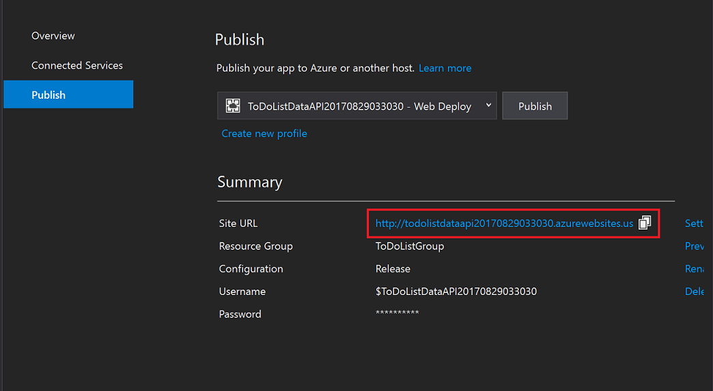
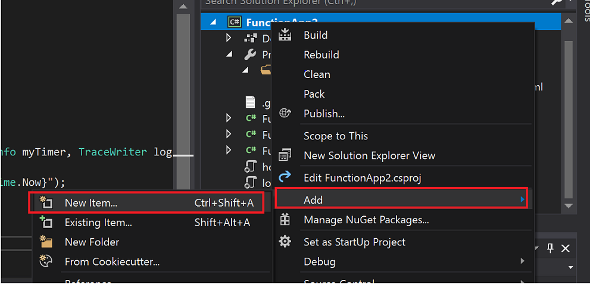
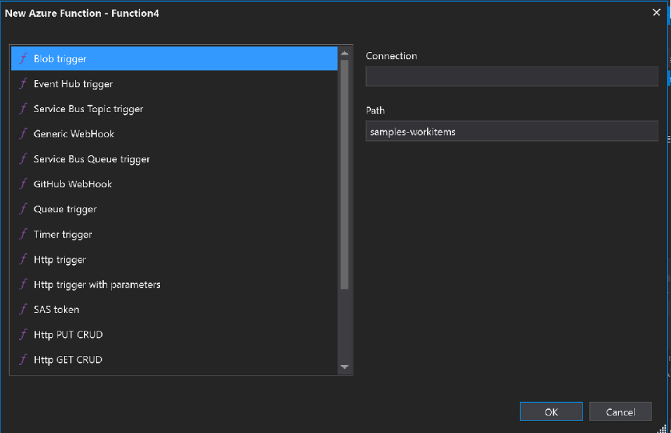
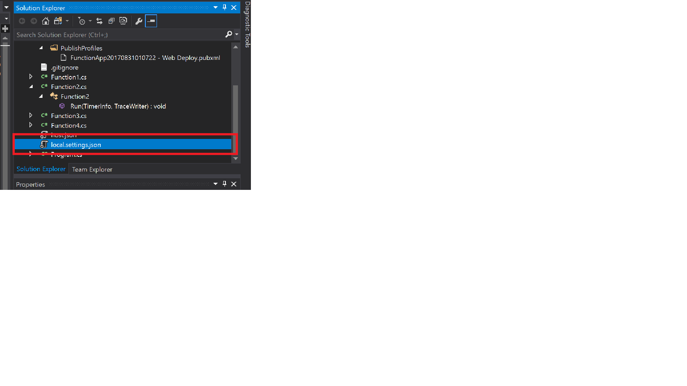
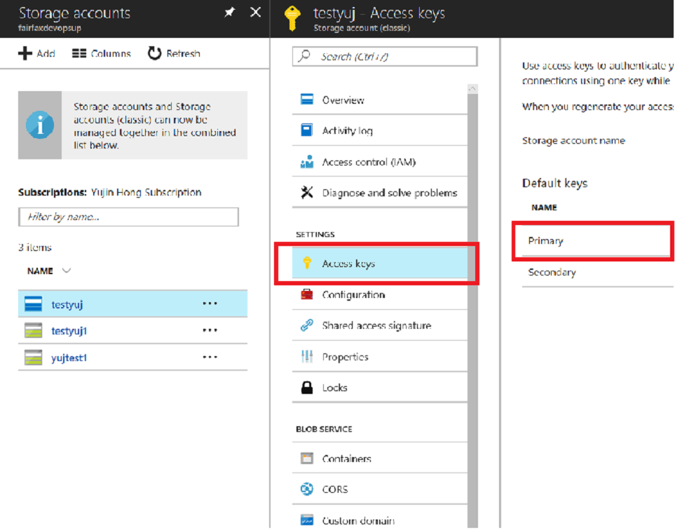
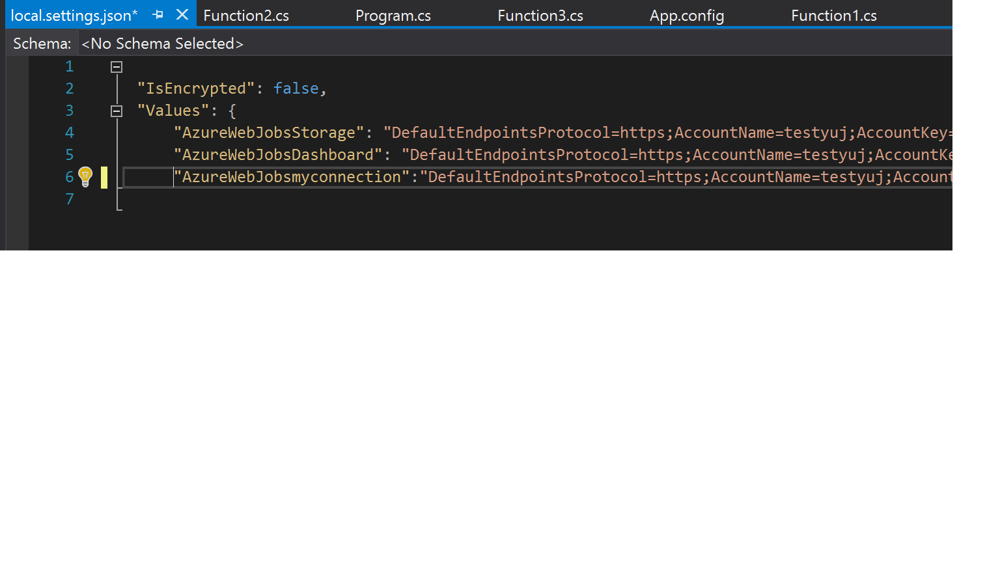
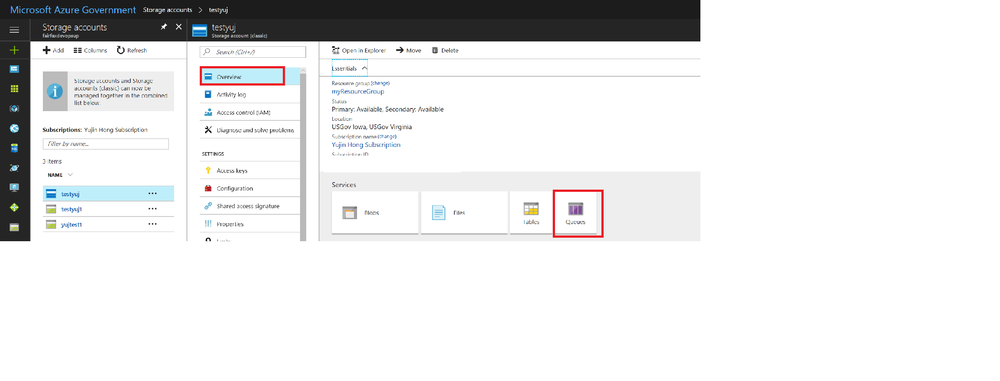
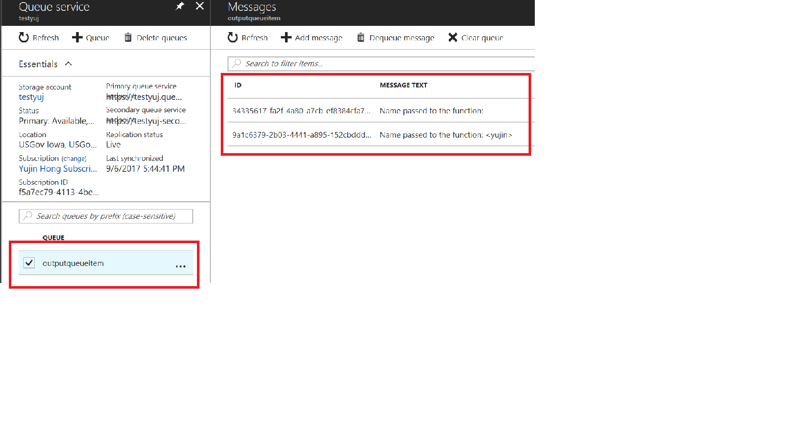

# Azure Government Functions Quickstarts for Government
The series of Quickstarts below will help you get started using Azure Functions on Azure Government. Using Azure Functions with Azure Government is similar to using it with the Azure commercial platform, with a [few exceptions](documentation-government-compute.md#azure-functions).

To learn more about Azure Functions, click [here](https://docs.microsoft.com/en-us/azure/azure-functions/functions-overview). 

## Create function - Azure CLI

### Prerequisites

Before running this sample, you must have the following:

+ An active [GitHub](https://github.com) account. 
+ An active Azure Government subscription.
If you don't have an Azure Government subscription, create a [free account](https://azure.microsoft.com/en-us/overview/clouds/government/) before you begin.

+ Installed [CLI 2.0](https://docs.microsoft.com/en-us/cli/azure/install-azure-cli?view=azure-cli-latest). 

	>**Note:**
	>This topic requires the Azure CLI version 2.0 or later. Run `az --version` to find the version you have. If you need to install or upgrade, see [Install Azure CLI 2.0](https://docs.microsoft.com/en-us/cli/azure/install-azure-cli?view=azure-cli-latest). 
	>
	>

### Launch Azure Cloud Shell

You must first connect to Azure Government with Azure Command Line Interface (CLI) by following [these steps](https://docs.microsoft.com/en-us/azure/azure-government/documentation-government-get-started-connect-with-cli). 

	
Log in to the Azure Government cloud through CLI: 

```
az login

```
### Create a Resource Group with CLI

> [!NOTE]
> If you want to use an already existing Resource Group, you may skip this section. You can also create a Resource Group through the [Azure Government portal](https://portal.azure.us) instead of using CLI. 
> 
> 

Create a resource group with the [az group create](https://docs.microsoft.com/en-us/cli/azure/group?view=azure-cli-latest#az_group_create). An Azure resource group is a logical container into which Azure resources like function apps, databases, and storage accounts are deployed and managed.

The following example creates a resource group named `myResourceGroup` with the location set to `usgovvirginia`.
If you are not using Cloud Shell, sign in first using the `az login` shown above.

```azurecli-interactive
az group create --name myResourceGroup --location usgovvirginia
```
### Create an Azure Storage Account

> [!NOTE]
> If you want to use an already existing storage account, you may skip this section. You can also create a storage account through the [Azure Government portal](https://portal.azure.us) instead of using CLI. 
> 
> 

Functions uses an Azure Storage account to maintain state and other information about your functions. Create a storage account in the resource group you created by using the [az storage account create](https://docs.microsoft.com/en-us/azure/storage/common/storage-azure-cli#create-a-new-storage-account) command.

In the following command, substitute a globally unique storage account name where you see the `<storage_name>` placeholder. Storage account names must be between 3 and 24 characters in length and may contain numbers and lowercase letters only.

```azurecli-interactive
§ az storage account create --name <storage_name> --location usgovvirginia --resource-group myResourceGroup --sku Standard_LRS
```

After the storage account has been created, the Azure CLI shows information similar to the following example:

```json
{
  "creationTime": "2017-04-15T17:14:39.320307+00:00",
  "id": "/subscriptions/bbbef702-e769-477b-9f16-bc4d3aa97387/resourceGroups/myresourcegroup/...",
  "kind": "Storage",
  "location": "usgovvirginia",
  "name": "myfunctionappstorage",
  "primaryEndpoints": {
    "blob": "https://myfunctionappstorage.blob.core.usgovcloudapi.net/",
    "file": "https://myfunctionappstorage.file.core.usgovcloudapi.net/",
    "queue": "https://myfunctionappstorage.queue.core.usgovcloudapi.net/",
    "table": "https://myfunctionappstorage.table.core.usgovcloudapi.net/"
  },
     ....
    // Remaining output has been truncated for readability.
}
```
### Create a function app

You must have a function app to host the execution of your functions. The function app provides an environment for serverless execution of your function code. It lets you group functions as logical unit for easier management, deployment, and sharing of resources. Create a function app by using the [az functionapp create](https://docs.microsoft.com/en-us/cli/azure/functionapp?view=azure-cli-latest#az_functionapp_create) command.

Before creating your function app, you must create an [App Service plan](https://docs.microsoft.com/en-us/azure/azure-functions/functions-scale#app-service-plan) that hosts your function app. 
This can be done with the following command that creates a plan named "testPlan".

```azurecli-interactive
az appservice plan create --resource-group myResourceGroup --name testPlan
```

In the following command substitute a unique function app name where you see the `<app_name>` placeholder and the storage account name for  `<storage_name>`. The `<app_name>` is used as the default DNS domain for the function app, and so the name needs to be unique across all apps in Azure. 

```azurecli-interactive
az functionapp create --name <app_name> --storage-account  <storage_name>  --resource-group myResourceGroup \
--plan testPlan
```
>[!NOTE] By default, a function app is created with the App Service plan, which means that dedicated VMs are allocated to your App Service apps and the functions host is always running.
For more information about the App Service plan, [click here](../azure-functions/functions-scale.md#app-service-plan). 
>
>

After the function app has been created, the Azure CLI shows information similar to the following example:

```json
{
  "availabilityState": "Normal",
  "clientAffinityEnabled": true,
  "clientCertEnabled": false,
  "containerSize": 1536,
  "dailyMemoryTimeQuota": 0,
  "defaultHostName": "quickstart.azurewebsites.us",
  "enabled": true,
  "enabledHostNames": [
    "quickstart.azurewebsites.us",
    "quickstart.scm.azurewebsites.us"
  ],
   ....
    // Remaining output has been truncated for readability.
}
```

Now that you have a function app, you can deploy the actual function code from the [GitHub sample repository](https://github.com/Azure-Samples/functions-quickstart).

### Deploy your function code
 This Quickstart connects to a [sample repository in GitHub](https://github.com/Azure-Samples/functions-quickstart) that contains a sample function. As before, in the following code replace the `<app_name>` placeholder with the name of the function app you created. 

```azurecli-interactive
az functionapp deployment source config --name <app_name> --resource-group myResourceGroup --branch master \
--repo-url https://github.com/Azure-Samples/functions-quickstart \
--manual-integration 
```
After the deployment source been set, the Azure CLI shows information similar to the following example (null values removed for readability):
```json
{
  "branch": "master",
  "deploymentRollbackEnabled": false,
  "id": "/subscriptions/bbbef702-e769-477b-9f16-bc4d3aa97387/resourceGroups/myResourceGroup/...",
  "isManualIntegration": true,
  "isMercurial": false,
  "location": "USGov Virginia",
  "name": "quickstart",
  "repoUrl": "https://github.com/Azure-Samples/functions-quickstart",
  "resourceGroup": "myResourceGroup",
  "type": "Microsoft.Web/sites/sourcecontrols"
}
```
### Test the function

Use cURL to test the deployed function on a Mac or Linux computer or using Bash on Windows, which you can [install](https://msdn.microsoft.com/en-us/commandline/wsl/install_guide).  

Execute the following cURL command, replacing the `<app_name>` placeholder with the name of your function app. Append the query string `&name=<yourname>` to the URL.

```bash
curl http://<app_name>.azurewebsites.net/api/HttpTriggerJS1?name=<yourname>
```
 
  

If you don't have cURL available in your command line, enter the same URL in the address of your web browser. Again, replace the `<app_name>` placeholder with the name of your function app, and append the query string `&name=<yourname>` to the URL and execute the request. 

    http://<app_name>.azurewebsites.net/api/HttpTriggerJS1?name=<yourname>

  

### Create function using Visual Studio 

Before starting, first check to make sure that your Visual Studio is [connected to the Azure Government environment](https://docs.microsoft.com/en-us/azure/azure-government/documentation-government-get-started-connect-with-vs). 

Once that is confirmed, the steps to create a function using Visual Studio to Azure Government are essentially the same as creating one in Azure commercial, which can be found [here](../azure-functions/functions-create-your-first-function-visual-studio). 

### Test your function in Azure Government 


    The URL that calls your HTTP triggered function looks like this:

        http://<functionappname>.azurewebsites.us/api/<functionname>?name=<yourname> 

Paste this new URL for the HTTP request into your browser's address bar. The following image shows the response in the browser to the remote GET request returned by the function: 

   

## Create Trigger Functions - Visual Studio
Learn how to create a trigger function in Azure Government using Visual Studio. 

### Prerequisites

* Make sure Visual Studio has been installed:
    -   [Visual Studio 2017 version 15.3](https://www.visualstudio.com/vs/preview/), including the **Azure development** workload.
    
    >[!NOTE] After you install or upgrade to Visual Studio 2017 version 15.3, you might also need to manually update the Visual Studio 		2017 tools for Azure Functions. You can update the tools from the **Tools** menu under **Extensions and Updates...** > 			**Updates** > **Visual Studio Marketplace** > **Azure Functions and Web Jobs Tools** > **Update**. 
    >
    >
* Function app running in Visual Studio
    - To create one, complete the Quickstart section above, [Create function using Visual Studio](documentation-government-functions#create-function-using-visual-studio). 

### Create trigger function

1. Open up your function app in Visual Studio and right click on the app itself, not the solution. 
Go down to the "Add" button and click on "New Item" as shown below.
    
    
2. Click on "Azure Function" and you will see this screen:
    
    
    
    As you can see there are multiple types of trigger functions that you can create, such as Timer, Generic and GitHub Webhook, Blob, and Queue. We will create a Timer trigger function for the sake of this tutorial. 
    
3. Click on the Timer trigger and create, and you should be able to see the new function in your Visual Studio. 
4. In the Solution Explorer on the right, you should be able to see and open up the "local.settings.json" file.

    
    In order to connect the trigger function to Azure Government we need to define the connection property app settings that are defined in this file. 
5. Go to your [Azure Government portal](https://portal.azure.us) and click on "Storage Accounts" from the left side-bar. 

    
    
    Click on the storage account that corresponds to this function app and you will see an "Access keys" section under "Settings".
    Once you navigate to this section you will be able to see two Default keys: Primary and Secondary.

    
6. Copy the Connection String for your Primary key, go back to your "local.settings.json" file and paste the string for all of the values in the "Values" parameter. Also make sure "AccountName" = your storage account name. 

    
7. Once this has been set, you can run your Timer trigger function. 

## Integrate Storage using Visual Studio

You can connect to external service data from your function in Visual Studio. 
Learn how to update an existing function by adding an output binding that sends messages to Azure Queue storage. 

### Prerequisites

* Make sure Visual Studio has been installed:

   -   [Visual Studio 2017 version 15.3](https://www.visualstudio.com/vs/preview/), including the **Azure development** workload.
    
    >[!NOTE] After you install or upgrade to Visual Studio 2017 version 15.3, you might also need to manually update the Visual Studio 		2017 tools for Azure Functions. You can update the tools from the **Tools** menu under **Extensions and Updates...** > 			**Updates** > **Visual Studio Marketplace** > **Azure Functions and Web Jobs Tools** > **Update**. 
    >
    >

* This tutorial requires a running function app. If you do not have one, you can follow the Quickstart section above titled "Create function- Visual Studio". 
* This tutorial also requires an Azure Queue, if you have not created one you can do so by following [these steps](https://docs.microsoft.com/en-us/azure/storage/queues/storage-dotnet-how-to-use-queues).

### Update the function code 

In order to connect the function to your output Queue, you must create an output binding. 
1. Open your function in Visual Studio
2.  For a C# function, update your function definition as follows to add the output Queue storage binding parameter (replace the <QueueName> placeholder with the name of your output Queue). Skip this step for a JavaScript function.
	
	```csharp
	public static async Task<HttpResponseMessage> Run([HttpTrigger(AuthorizationLevel.Function, "get", "post", Route = null)]HttpRequestMessage req,TraceWriter log,[Queue("<QueueName>", Connection = "myconnection")] ICollector<string> <QueueName>)
	{
	…
	}
	        
	```
3. Add the following code to the function just before the method returns in order to write to the output Queue. Use the appropriate snippet for the language of your function.

    ```javascript
	context.bindings.<QueueName> = "Name passed to the function: " + (req.query.name || req.body.name);
	```
	
	```cs
	<QueueName>.Add("Name passed to the function: " + name);     
	```
### Test your function

1. Run your function on Visual Studio.

2. Navigate to the Azure Government [portal](https://portal.azure.us) and click on the Storage Account explorer from the menu on the left-hand side. 
3. On the Overview page click on the "Queues" button in order to see the different Queues. 

    
4. Click on your Queue and you should be able to see the output of your function.

    

### Clean up resources

Use the following command to delete all resources created by this quickstart:

```azurecli-interactive
az group delete --name myResourceGroup
```
Type `y` when prompted.
