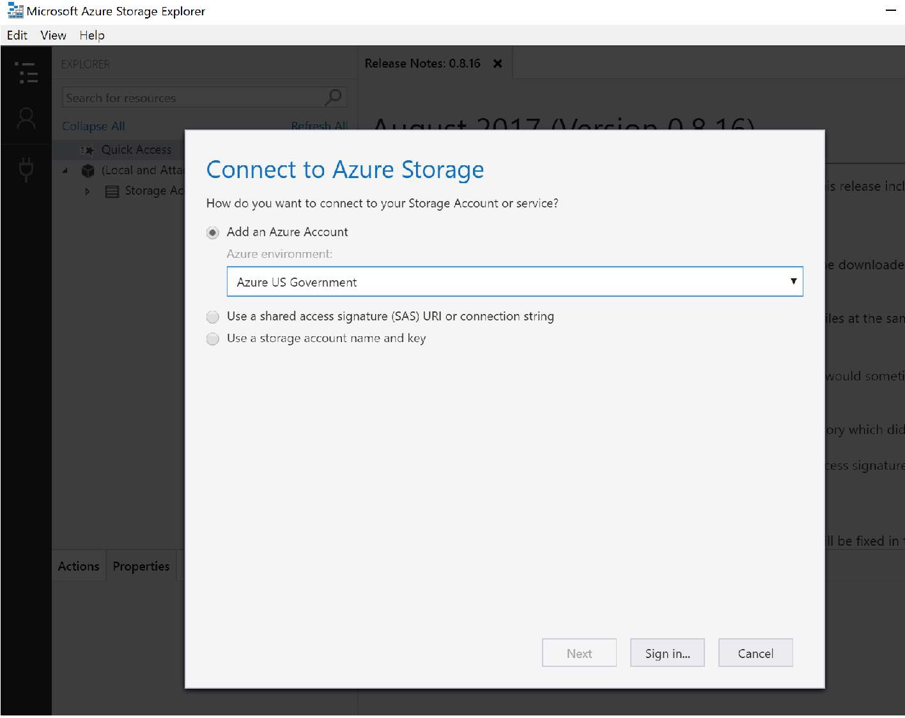
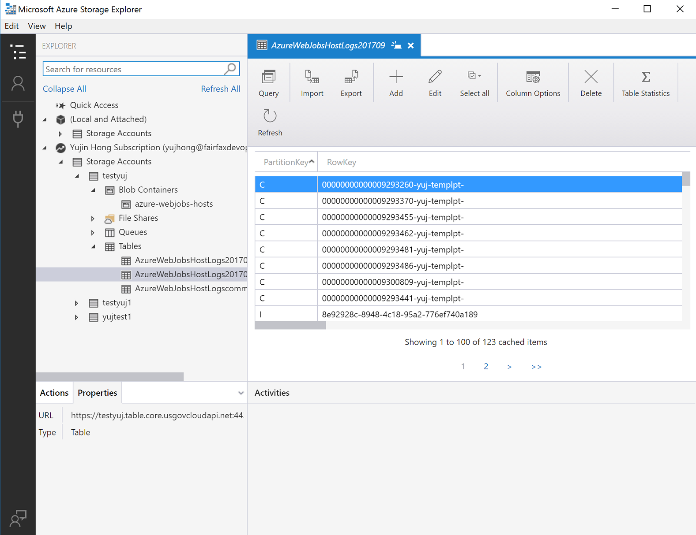
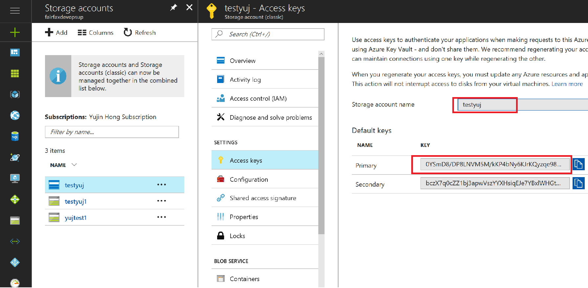

# Develop with Storage API on Azure Government

Azure Government uses the same underlying technologies as commercial Azure, enabling you to use the development tools you're already familiar with.
To use these services in Azure Government, you must define different endpoint mappings, as shown below for the Storage service. 

If you don't have an Azure Government subscription, create a [free account](https://azure.microsoft.com/global-infrastructure/government/request/) before you begin.

## Prerequisites

* Review [Guidance for developers](documentation-government-developer-guide.md).<br/> This article discusses Azure Government's unique URLs and endpoints for managing your environment. You must know about these endpoints to connect to Azure Government. 
* Review [Compare Azure Government and global Azure](compare-azure-government-global-azure.md) and click on a service of interest to see variations between Azure Government and global Azure.
* Download and install the latest version of Azure Storage Explorer [here](https://azure.microsoft.com/features/storage-explorer/). 

## Connecting Storage Explorer to Azure Government
[The Microsoft Azure Storage Explorer](https://azure.microsoft.com/features/storage-explorer/) is a cross-platform tool for working with Azure Storage. Government customers can now take advantage of all the latest features of the Azure Storage Explorer such as creating and managing blobs, queues, tables, and file shares.

### Getting Started with Storage Explorer
1. Open the Azure Storage Explorer desktop application.

2. You'll be prompted to add an Azure account; in the dropdown choose the "Azure US Government" option:

    
3. Sign in to your Azure Government account and you can see all of your resources. The Storage Explorer should look similar to the screenshot below. Click on your Storage Account to see the blob containers, file shares, Queues, and Tables. 

    

For more information on Azure Storage Explorer, navigate [here](../vs-azure-tools-storage-manage-with-storage-explorer.md?toc=%2fazure%2fstorage%2fblobs%2ftoc.json).

## Connecting to the Storage API 

### Prerequisites
* Have an active Azure Government subscription.
If you don't have an Azure Government subscription, create a [free account](https://azure.microsoft.com/global-infrastructure/government/request/) before you begin.
* Download Visual Studio 2019

### Getting Started with Storage API
One important difference to note when connecting with the Storage API is that the URL for storage is different than the URL for storage in commercial Azure – specifically, the domain ends with "core.usgovcloudapi.net", rather than "core.windows.net".

These endpoint differences must be taken into account when you connect to storage in Azure Government with C#.
1. Go to the [Azure Government portal](https://portal.azure.us) and select your storage account and then click the "Access Keys" tab:

    
2. Copy/paste the storage account connection string.

#### C# 
1. Open up Visual Studio and create a new project. Add a reference to the [Azure Data Tables SDK for C#](https://github.com/Azure/azure-sdk-for-net/tree/main/sdk/tables/Azure.Data.Tables). This package contains classes we will need to connect to your storage table account.

2. Add these two lines of C# code to connect:
    ```cs
    var credentials = new TableSharedKeyCredential(storageAccountName, Environment.GetEnvironmentVariable("STORAGE_ACCOUNT_KEY"));
    var storageTableUri = Environment.GetEnvironmentVariable("STORAGE_TABLE_URI");
    var tableServiceClient = new TableServiceClient(new Uri(storageTableUri), credentials);   
    ```

3. At this point, we can interact with storage as we normally would. For example, if we want to retrieve a specific entity from our table storage we could do it like this:

   ```cs
    var tableClient = tableServiceClient.GetTableClient("Contacts");
    ContactEntity contact = tableClient.GetEntity<ContactEntity>("gov-partition1", "0fb52a6c-3784-4dc5-aa6d-ecda4426dbda");
    Console.WriteLine($"Contact: {contact.FirstName} {contact.LastName}");
    ```

#### Java
1. Download the [Azure Data Tables SDK for Java](https://github.com/Azure/azure-sdk-for-java/tree/main/sdk/tables/azure-data-tables) and configure your project correctly.
2. Create a "test" class where we'll access Azure Table Storage using the Azure Data Tables API. 
 Copy and paste the code below, and **paste** your Storage Account connection string into the `AZURE_STORAGE_CONNECTION_STRING` environment variable. 
    ```java
    import com.azure.data.tables.implementation.ModelHelper;
    import com.azure.data.tables.models.*;
    import java.util.HashMap;
    public class test {
        public static final String storageConnectionString = System.getEnv(AZURE_STORAGE_CONNECTION_STRING);
        public static void main(String[] args) {
        try
        {
            // Create the table service client.
            TableServiceClient tableServiceClient = new TableServiceClientBuilder()
                .connectionString(storageConnectionString)
                .buildClient();
            // Create the table if it doesn't exist.
            String tableName = "Contacts";
            TableClient tableClient = tableServiceClient.createTableIfNotExists(tableName);
            // Create a new customer entity.
            TableEntity customer1 = ModelHelper.createEntity(new HashMap<String, Object>() {{
                put("PartitionKey", "Brown");
                put("RowKey", "Walter");
                put("Email", "Walter@contoso.com");
            }});
            // Insert table entry into table
            tableClient.createEntity(customer1);
        }
        catch (Exception e)
        {
            // Output the stack trace.
            e.printStackTrace();
        }
      }    
    }   
    ```

#### Node.js
1. Download the [Azure Storage Blob SDK for Node.js](https://github.com/Azure/azure-sdk-for-js/tree/main/sdk/storage/storage-blob) and configure your application correctly.
2. The following code below connects to Azure Blob Storage and creates a Container using the Azure Storage API. 
    **Paste** your Azure Storage account connection string into the `AZURE_STORAGE_CONNECTION_STRING` environment variable. 

    ```javascript
    var { BlobServiceClient } = require("@azure/storage-blob");
    var storageConnectionString = process.env["AZURE_STORAGE_CONNECTION_STRING"];
    var blobServiceClient = BlobServiceClient.fromConnectionString(storageConnectionString);
    var containerClient = blobServiceClient.getContainerClient('testing');
    containerClient.createIfNotExists();
    ```

#### Python
1. Download the [Azure Storage Blob SDK for Python](https://github.com/Azure/azure-sdk-for-python/tree/main/sdk/storage/azure-storage-blob).
2. When using the Storage SDK for Python to connect to Azure Government, **Paste** in your Azure storage connection string in `AZURE_STORAGE_CONNECTION_STRING` environment variable.
    
    ```python
    # Create the BlobServiceClient that is used to call the Blob service for the storage account
    connection_string = os.getenv("AZURE_STORAGE_CONNECTION_STRING")
    blob_service_client = BlobServiceClient.from_connection_string(conn_str=connection_string)
    container_name ='ml-gov-demo'
    container = blob_service_client.get_container_client(container=container_name)
    generator = container.list_blobs()
    for blob in generator:
        print("\t Blob name: " + blob.name)
    ```

#### PHP
1. Download the [Azure Storage SDK for PHP](https://github.com/Azure/azure-sdk-for-php).
2. The code below accesses Azure Table Storage using the Azure Storage API.
   In the `connectionString` variable, you'll notice that there's a `TableEndpoint` parameter. 
   Depending on which service you're using, you must define the parameter and set it to the endpoint for that service:
   
   - BlobEndpoint= //ends with 'blob.core.usgovcloudapi.net'
   - QueueEndpoint= //ends with 'queue.core.usgovcloudapi.net'
   - TableEndpoint= //ends with 'table.core.usgovcloudapi.net'
     >[!Note]
     > You can find these endpoints by navigating to your Storage Account from the [portal](https://portal.azure.us). 
     > **Paste** in your storage account name, key, and service endpoint in the `connectionString` variable. 
     >
    
     ```php
     <?php
     require_once "vendor/autoload.php";
     use WindowsAzure\Common\ServicesBuilder;
     use MicrosoftAzure\Storage\Common\ServiceException; 
     $connectionString = 'DefaultEndpointsProtocol=http;AccountName=<accountname>;AccountKey=<accountkey>;TableEndpoint=http://<storageaccountname>.table.core.usgovcloudapi.net/';

     $tableRestProxy = ServicesBuilder::getInstance()->createTableService($connectionString);
     try {
     // Create table.
     $tableRestProxy->createTable("test");
     }
     catch(ServiceException $e){
     $code = $e->getCode();
     $error_message = $e->getMessage();
     }
     ?>
     ```

## Get help and provide feedback

* Read more about [Azure Storage](../storage/index.yml). 
* Subscribe to the [Azure Government blog](https://blogs.msdn.microsoft.com/azuregov/)
* Get help on Stack Overflow by using the "[azure-gov](https://stackoverflow.com/questions/tagged/azure-gov)" tag
* Give us feedback or request new features via the [Azure Government feedback forum](https://feedback.azure.com/forums/558487-azure-government)
