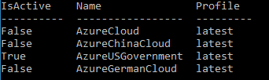

# Quickstart: Connect to Azure Government with Azure CLI

Microsoft Azure Government delivers a dedicated cloud with world-class security and compliance, enabling US government agencies and their partners to transform their workloads to the cloud. To manage your Azure Government cloud workloads and applications you can connect to the Azure Government using different tools, as described in the following video.  

This quickstart shows how to use the Azure CLI to access and start managing resources in Azure Government.  

> [!VIDEO https://www.youtube.com/embed/Q3kx4cmRkCA]

If you don't have an Azure Government subscription, create a [free account](https://azure.microsoft.com/global-infrastructure/government/request/) before you begin.

## Prerequisites

* Review [Guidance for developers](documentation-government-developer-guide.md).<br/> This article discusses Azure Government's unique URLs and endpoints for managing your environment. You must know about these endpoints in order to connect to Azure Government. 
* Review [Compare Azure Government and global Azure](compare-azure-government-global-azure.md) and click on a service of interest to see variations between Azure Government and global Azure.

## Install Azure CLI 

Install the Azure CLI locally by following the instructions in [Install the Azure CLI](https://docs.microsoft.com/cli/azure/install-az-cli2). 

In Azure Government, there is no equivalent to **Azure Cloud Shell** that you can find in the Azure portal. 

## Connect with Azure CLI

Connect to Azure Government by setting the cloud with the name `AzureUSGovernment`.

```azurecli
az cloud set --name AzureUSGovernment
```

Once the cloud has been set, you can continue logging in:

```azurecli
az login
```

When you type `login`, a browser is launched for you to log in. Choose your Azure Government account and log in with appropriate credentials.

## Confirm 

To confirm the cloud has correctly been set to `AzureUSGovernment`, run:

```azurecli
az cloud list --output table
```

The `isActive` flag for the `AzureUSGovernment` item should be set to `true`.



## List US Government regions

You use the same command as for global Azure.

```azurecli
az account list-locations
```

## Next steps

This quickstart showed you how to use CLI to connect to Azure Government. Once you are connected to Azure Government, you may want to explore Azure services. Make sure you check out the variations, described in [Compare Azure Government and global Azure](compare-azure-government-global-azure.md). To learn more about Azure services continue to the Azure documentation.

> [!div class="nextstepaction"]
> [Azure documentation](https://docs.microsoft.com/azure/).
