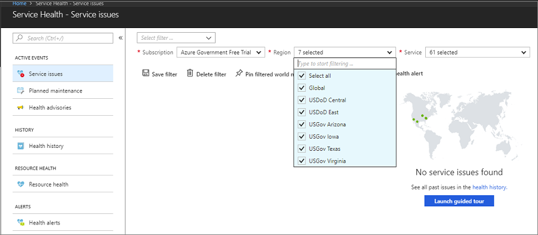

# Quickstart: Connect to Azure Government using portal

Microsoft Azure Government delivers a dedicated cloud with world-class security and compliance, enabling US government agencies and their partners to transform their workloads to the cloud. To manage your Azure Government cloud workloads and applications you can connect to the Azure Government using different tools, as described in the following video.  

This quickstart shows how to use the Azure Government portal to access and start managing resources in Azure Government. The Azure Government portal is the primary way most people will connect to their Azure Government environment.

> [!VIDEO https://www.youtube.com/embed/Q3kx4cmRkCA]

If you don't have an Azure Government subscription, create a [free account](https://azure.microsoft.com/global-infrastructure/government/request/) before you begin.

## Prerequisites

* Review [Guidance for developers](documentation-government-developer-guide.md).  This article discusses Azure Government's unique URLs and endpoints for managing your environment. You must know about these endpoints in order to connect to Azure Government. 
* Review [Compare Azure Government and global Azure](compare-azure-government-global-azure.md) and click on a service of interest to see variations between Azure Government and global Azure.

## Sign in to Azure Government

To connect, browse to the portal at [https://portal.azure.us](https://portal.azure.us). 

Sign in using your Azure Government credentials. Once you sign it, you should see "Microsoft Azure Government" in the upper left of the main navigation bar.

## Check out Service health

You can take a look at Azure Government regions and their health status by clicking on **Sevice Health**.

Currently, you can choose from 6 available government-only datacenter regions.

## Next steps

This quickstart showed you how to use portal to connect to Azure Government. Once you are connected to Azure Government, you may want to explore Azure services. Make sure you check out the variations, described in [Compare Azure Government and global Azure](compare-azure-government-global-azure.md). To learn more about Azure services continue to the Azure documentation.

> [!div class="nextstepaction"]
> [Azure documentation](https://docs.microsoft.com/azure/).
