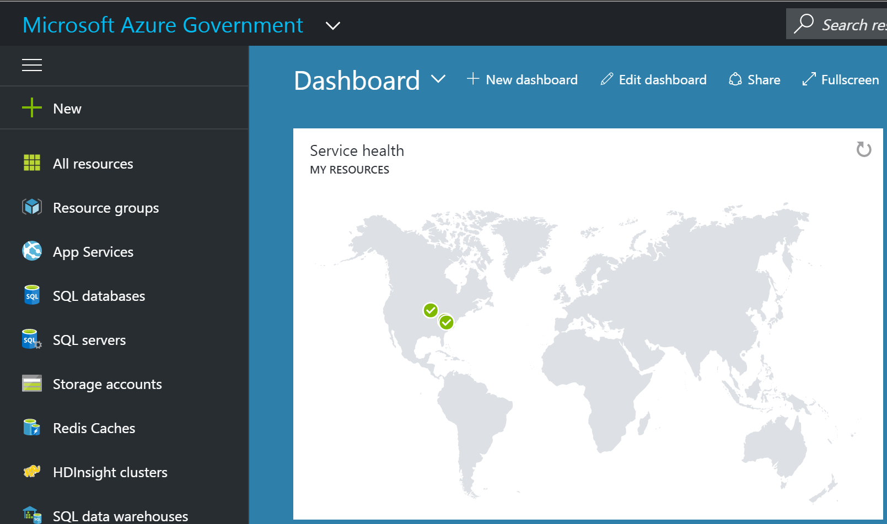

<!--
# Managing and connecting to your subscription in Azure Government
(possible move to Dev Guide) Azure Government has unique URLs and endpoints for managing your environment. It is important to use the right connections to manage your environment through the portal or PowerShell. Once you are connected to the Azure Government environment, the normal operations for managing a service works if the component has been deployed.
-->
# Connecting with the Azure Government Portal

The portal is the primary way that most people connect to Azure Government.  To connect, browse to the portal at [https://portal.azure.us](https://portal.azure.us).  The classic Azure portal can be accessed via [https://manage.windowsazure.us](https://manage.windowsazure.us).

Subscriptions can be created for your account by connecting to [https://account.windowsazure.us](https://account.windowsazure.us).

Once you log in, you should see "Microsoft Azure Government" in the upper left of the main navigation bar.

Figure 1: Azure Government Portal

### Next steps
For more information about Azure Government, see the following resources:

* [Connect to Azure Government with PowerShell](documentation-government-get-started-connect-with-ps.md)
* [Connect to Azure Government with Azure CLI](documentation-government-get-started-connect-with-cli.md)
