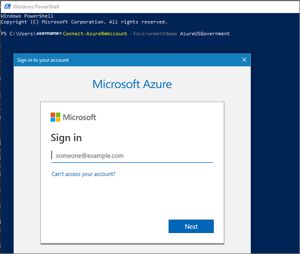

 
# Quickstart: Connect to Azure Government with PowerShell

Microsoft Azure Government delivers a dedicated cloud with world-class security and compliance, enabling US government agencies and their partners to transform their workloads to the cloud. To manage your Azure Government cloud workloads and applications you can connect to the Azure Government using different tools, as described in the following video.  

This quickstart shows how to use PowerShell to access and start managing resources in Azure Government.  

> [!VIDEO https://www.youtube.com/embed/Q3kx4cmRkCA]

If you don't have an Azure Government subscription, create a [free account](https://azure.microsoft.com/global-infrastructure/government/request/) before you begin.

[!INCLUDE [updated-for-az](../../includes/updated-for-az.md)]

## Prerequisites

* Review [Guidance for developers](documentation-government-developer-guide.md).<br/> This article discusses Azure Government's unique URLs and endpoints for managing your environment. You must know about these endpoints in order to connect to Azure Government. 
* Review [Compare Azure Government and global Azure](compare-azure-government-global-azure.md) and click on a service of interest to see variations between Azure Government and global Azure.

## Install PowerShell

Install PowerShell on your local machine. For more information, check out the [Introduction to Azure PowerShell](https://docs.microsoft.com/powershell/azure/overview).

In Azure Government, there is no equivalent to **Azure Cloud Shell** that you can find in the Azure portal. 

## Specifying Azure Government as the *environment* to connect to

When you start PowerShell, you have to tell Azure PowerShell to connect to Azure Government by specifying an environment parameter. The parameter ensures that PowerShell is connecting to the correct endpoints. The collection of endpoints is determined when you connect log in to your account.  Different APIs require different versions of the environment switch:

| Connection type | Command |
| --- | --- |
| [Azure](/powershell/module/az.accounts/Connect-AzAccount) commands |`Connect-AzAccount -EnvironmentName AzureUSGovernment` |
| [Azure Active Directory](/powershell/module/azuread/connect-azuread?view=azureadps-2.0) commands |`Connect-AzureAD -AzureEnvironmentName AzureUSGovernment` |
| [Azure (Classic deployment model)](/powershell/module/servicemanagement/azure/add-azureaccount?view=azuresmps-3.7.0) commands |`Add-AzureAccount -Environment AzureUSGovernment` |
| [Azure Active Directory (Classic deployment model)](/previous-versions/azure/jj151815(v=azure.100)) commands |`Connect-MsolService -AzureEnvironment UsGovernment` |



## Get current regions 

To list the available regions in Azure Government, run the following commands and print the current list:

```powershell
Get-AzLocation

Get-AzureLocation # For classic deployment model 
```

> [!NOTE]
> The Azure Government region display names have no spaces between `US` and `Gov` or `US` and `DoD` when using the `Location` parameter.

| Common Name | Display Name | Location Name |
| --- | --- | --- |
| US Gov Virginia |`USGov Virginia` | `usgovvirginia` |
| US Gov Iowa |`USGov Iowa` | `usgoviowa` |
| US Gov Texas |`USGov Texas` | `usgovtexas` |
| US Gov Arizona |`USGov Arizona` | `usgovarizona` |
| US DoD East |`USDoD East` | `usdodeast` |
| US DoD Central |`USDoD Central` | `usdodcentral` |

## Next steps

This quickstart showed you how to use PowerShell to connect to Azure Government. Once you are connected to Azure Government, you may want to explore Azure services. Make sure you check out the variations, described in [Compare Azure Government and global Azure](compare-azure-government-global-azure.md). To learn more about Azure services continue to the Azure documentation.

> [!div class="nextstepaction"]
> [Azure documentation](https://docs.microsoft.com/azure/).
