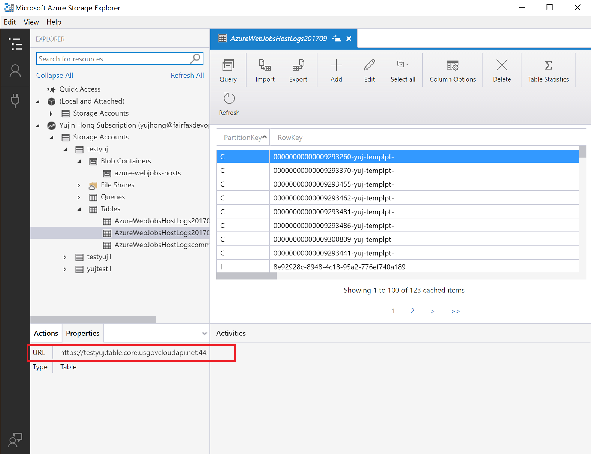

# Connect with Storage in Azure Government

## Overview 
Azure Government uses the same underlying technologies as commercial Azure, enabling you to use the development tools you’re already familiar with.

However, Azure Government provides a physical and network-isolated instance of Azure which results in a higher level of compliance and security. As a result of this, we use different physical endpoints for our services such as Azure Storage. ### Microsoft Azure Storage Explorer

[The Microsoft Azure Storage Explorer](https://azure.microsoft.com/en-us/features/storage-explorer/) is a cross-platform tool for working with Azure Storage. Government customers will now be able to take advantage of all the latest features of the Azure Storage Explorer such as being able to create and manage blobs, queues, tables, and file shares.

### Quickstart- Storage Explorer with Azure Government

#### Prerequisites
* Download and install the latest version of Azure Storage Explorer [here](https://azure.microsoft.com/en-us/features/storage-explorer/). 
* Have an active Azure Government subscription.
If you don't have an Azure Government subscription, create a [free account](https://azure.microsoft.com/en-us/overview/clouds/government/) before you begin.

#### Getting Started with Storage Explorer
1. Open the Azure Storage Explorer desktop application.

2. You will be prompted to add an Azure account; in the dropdown choose the “Azure US Government” option:

    
3. Log in to your Azure Government account and you will be able to see all of your resources. The Storage Explorer should look similar to the screenshot below. Click on your Storage Account to see the blob containers, file shares, Queues, and Tables. 

    

For more information on Azure Storage Explorer, click [here](https://docs.microsoft.com/en-us/azure/vs-azure-tools-storage-manage-with-storage-explorer?toc=%2fazure%2fstorage%2fblobs%2ftoc.json).
### Quickstart - Connect VS with Storage Account

#### Prerequisites
* Download Visual Studio 2017 and Connect to Azure Government. For more information, click [here](documentation-government-get-started-connect-with-vs). 
* Have an active Azure Government subscription.
If you don't have an Azure Government subscription, create a [free account](https://azure.microsoft.com/en-us/overview/clouds/government/) before you begin.

The Azure Storage Explorer is great for quickly connecting to your storage accounts. However the URL for storage is different than the URL for storage in commercial Azure – specifically, the domain ends with “core.usgovcloudapi.net”, rather than “core.windows.net”.



These endpoint differences must be taken into account when you connect to storage in Azure Government with C#.
1. Go to the [Azure Government portal](https://portal.azure.us) and select your storage account and then click the “Access Keys” tab:

    
2. Copy/paste the storage account name and key.
3. Open up Visual Studio and create a new project. Add a reference to the [WindowsAzure.Storage NuGet package](https://www.nuget.org/packages/WindowsAzure.Storage/). This NuGet package contains classes we will need to connect to your storage account.

4. Add these 2 lines of C# code to connect:
	```cs
	var credentials = new StorageCredentials(storageAccountName, storageAccountKey);

    var storageAccount = new CloudStorageAccount(credentials, "core.usgovcloudapi.net", useHttps: true);   
	```

    -   Notice on the second line we had to use a [particular constructor for the CloudStorageAccount](https://docs.microsoft.com/en-us/dotnet/api/microsoft.windowsazure.storage.cloudstorageaccount.-ctor?redirectedfrom=MSDN&view=azurestorage-8.1.3#Microsoft_WindowsAzure_Storage_CloudStorageAccount__ctor_Microsoft_WindowsAzure_Storage_Auth_StorageCredentials_System_String_System_Boolean) – enabling us to explicitly pass in the endpoint suffix of “core.usgovcloudapi.net”. This constructor is the **only difference** your code requires to connect to storage in Azure Government as compared with commercial Azure.

5. At this point, we can interact with storage as we normally would. For example, if we want to retrieve a specific record from our table storage we could do it like this:

   ```cs
    var tableClient = storageAccount.CreateCloudTableClient();

    var table = tableClient.GetTableReference("Contacts");
    var retrieveOperation = TableOperation.Retrieve<ContactEntity>("gov-partition1", "0fb52a6c-3784-4dc5-aa6d-ecda4426dbda");
    var result = await table.ExecuteAsync(retrieveOperation);
    var contact = result.Result as ContactEntity;
    Console.WriteLine($"Contact: {contact.FirstName} {contact.LastName}");
    ```
For more information on Azure Storage, [click here](https://docs.microsoft.com/en-us/azure/storage/). 
