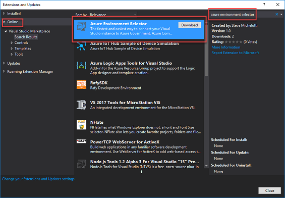
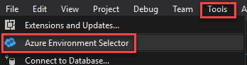
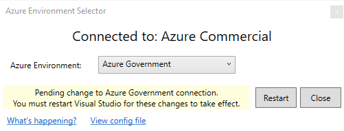
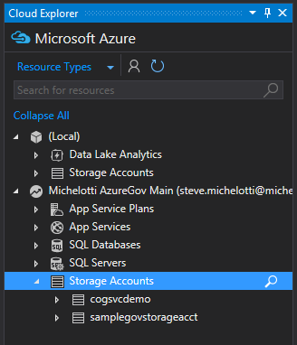

# Develop with Visual Studio

Visual Studio is used by developers to easily manage their Azure subscriptions while building solutions. Visual Studio does not currently allow you to configure a connection to Azure Government in the user interface. 

The following video demonstrates how to use the VS 2017 extension that enables you to switch between different Azure environments. It walks you through installation and showing how easy it is to connect to Azure Government. The same steps are described in this article. The topic also shows how you can achieve the same configuration manually. 

> [!VIDEO https://channel9.msdn.com/blogs/Azure-Government/Azure-Environment-Selector-Visual-Studio-Extension/player]

If you don't have an Azure Government subscription, create a [free account](https://azure.microsoft.com/global-infrastructure/government/request/) before you begin.

## Prerequisites

* Review [Guidance for developers](documentation-government-developer-guide.md).  This article discusses Azure Government's unique URLs and endpoints for managing your environment. You must know about these endpoints in order to connect to Azure Government. 
* Review [Compare Azure Government and global Azure](compare-azure-government-global-azure.md) and click on a service of interest to see variations between Azure Government and global Azure.

## Visual Studio 2017

### Automatically configuring your target using a Visual Studio Extension 

>[!NOTE] 
>This is the recommended way to connect to Azure Government through Visual Studio. 
>

The Visual Studio extension allows for quickly and easily switching between Azure environments. 
This can be installed like any other extension in Visual Studio: 

1. In the **Tools** menu, open **Extension and Updates**
2. Click the **Online** tab on the left and **Search "*azure environment selector*"**.
3. **Download** the package, as shown in the screenshot below.

         

4. **Restart Visual Studio** to complete the installation of the extension.
5. Once Visual Studio restarts, in the **Tools** menu, open the newly available **Azure Environment Selector**:

      

6. In the Azure Environment Selector dialog, select **Azure Government** from the dropdown:

      

From here, you can restart Visual Studio and the change will take effect. Once Visual Studio restarts, you will now be able to connect to other environments with VS tools such as the Cloud Explorer (shown below connected to Azure Government), Server Explorer, the main Visual Studio login, and the Visual Studio Solution Explorer.

 
### Manually configuring your target 

>[!NOTE] 
>If you have successfully completed the extension installation above, you do not need to complete this section.
>

#### Manually creating a configuration file for Azure Government 
Create a file named **AadProvider.Configuration.json** with the following content:

        {
          "AuthenticationQueryParameters": null,
          "AsmEndPoint": "https://management.core.usgovcloudapi.net/",
          "Authority": "https://login.microsoftonline.us/",
          "AzureResourceManagementEndpoint": "https://management.usgovcloudapi.net",
          "AzureResourceManagementAudienceEndpoints": [ "https://management.core.usgovcloudapi.net" ],
          "ClientIdentifier": "872cd9fa-d31f-45e0-9eab-6e460a02d1f1",
          "EnvironmentName": "AzureUSGovernment",
          "GraphEndpoint": "https://graph.windows.net",
          "MsaHomeTenantId": "f8cdef31-a31e-4b4a-93e4-5f571e91255a",
          "NativeClientRedirect": "urn:ietf:wg:oauth:2.0:oob",
          "PortalEndpoint": "https://portal.azure.us/",
          "ResourceEndpoint": "https://management.core.usgovcloudapi.net",
          "ValidateAuthority": true,
          "VisualStudioOnlineEndpoint": "https://app.vssps.visualstudio.com/",
          "VisualStudioOnlineAudience": "499b84ac-1321-427f-aa17-267ca6975798"
        }

#### Manually updating Visual Studio for Azure Government

1.	Close Visual Studio
2.	Place **AadProvider.Configuration.json** created in the previous step into **%localappdata%\\.IdentityService\AadConfigurations**.  Create this folder if not present.
3.	Launch Visual Studio and begin using your Azure Government account.

> [!NOTE]
> With the configuration file, only Azure Government subscriptions are accessible.  You still see subscriptions that you configured previously but they do not work because Visual Studio is now connected to Azure Government instead of global Azure.  Remove the file to connect to Azure Commercial.
> 
> 

#### Manually reverting Visual Studio Connection to Azure Government
To enable Visual Studio to connect to global Azure, you need to remove the configuration file setting that enables connection to Azure Government.

1.	Close Visual Studio
2.	Delete this folder: **%localappdata%\.IdentityService\AadConfigurations**
3.	Restart Visual Studio and begin using your global Azure account.

> [!NOTE]
> Once this configuration has been reverted, your Azure Government subscriptions no longer accessible.
> 
>

## Visual Studio 2015

Visual Studio 2015 requires a registry change for Visual Studio to connect to Azure Government. Once this registry key is set, Visual Studio connects to Azure Government instead of global Azure.

### Updating Visual Studio for Azure Government
To enable Visual Studio to connect to Azure Government, you need to update the registry.

1. Close Visual Studio
2. Create a text file named **VisualStudioForAzureGov.reg**
3. Copy and paste the following text into **VisualStudioForAzureGov.reg**:
   
        Windows Registry Editor Version 5.00
   
        [HKEY_CURRENT_USER\Software\Microsoft\VSCommon\ConnectedUser]
        "AadInstance"="https://login.microsoftonline.us/"
        "adaluri"="https://management.core.usgovcloudapi.net"
        "AzureRMEndpoint"="https://management.usgovcloudapi.net"
        "AzureRMAudienceEndpoint"="https://management.core.usgovcloudapi.net"
        "EnableAzureRMIdentity"="true"
        "GraphUrl"="graph.windows.net"
4. Save and then run the file by double-clicking it.  You are prompted to merge the file into your registry.
5. Launch Visual Studio and begin using [Cloud Explorer](../vs-azure-tools-resources-managing-with-cloud-explorer.md) with your Azure Government account.

> [!NOTE]
> Once this registry key is set, only Azure Government subscriptions are accessible.  You still see subscriptions that you configured previously but they do not work because Visual Studio is now connected to Azure Government instead of global Azure.  See the following section for steps to revert the changes.
> 
> 

### Reverting Visual Studio Connection to Azure Government
To enable Visual Studio to connect to global Azure, you need to remove the registry settings that enable connection to Azure Government.

1. Close Visual Studio
2. Create a text file named **VisualStudioForAzureGov_Remove.reg**
3. Copy and paste the following text into **VisualStudioForAzureGov_Remove.reg**:
   
        Windows Registry Editor Version 5.00
   
        [HKEY_CURRENT_USER\Software\Microsoft\VSCommon\ConnectedUser]
        "AadInstance"=-
        "adaluri"=-
        "AzureRMEndpoint"=-
        "AzureRMAudienceEndpoint"=-
        "EnableAzureRMIdentity"=-
        "GraphUrl"=-
4. Save and then run the file by double-clicking it.  You are prompted to merge the file into your registry.
5. Launch Visual Studio

> [!NOTE]
> Once this registry key has been reverted, your Azure Government subscriptions show but are not accessible.  They can safely be removed.
> 
> 

## Next steps

[Develop with Azure DevOps Services](documentation-government-get-started-connect-with-vsts.md)
[Develop with SQL Server Management Studio](documentation-government-connect-ssms.md)
