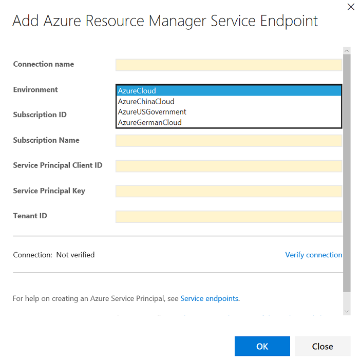

---

title: Connect to Azure Government from Visual Studio Team Services | Microsoft Docs
description: Information on configuring continuous deployment to your applications hosted with a subscription in Azure Government by connecting from Visual Studio Team Services
services: azure-government
cloud: gov
documentationcenter: ''
author: shashban
manager: gopinach

ms.assetid: 
ms.service: azure-government
ms.devlang: na
ms.topic: article
ms.tgt_pltfrm: na
ms.workload: azure-government
ms.date: 
ms.author: shashban

---

# Connecting from Visual Studio Team Services
Continuous deployment (CD) means starting an automated deployment process whenever a code change is made to your application or whenever a new successful build is available. 
Visual Studio Team Services is used by teams to configure continuous deployment for their applications hosted in their Azure subscriptions.
Refer to [CI/CD for newbies](https://www.visualstudio.com/en-us/docs/build/get-started/ci-cd-part-1) for an overview of CI/CD with Team Services.

> [!NOTE]
> Visual Studio Team Services itself is not available in Azure Government Clouds. When CD is configured using Team Services to deploy apps to Azure Government clouds, artifact storage, build, and (or) deployment orchestration for the app would execute outside the government cloud.   
> 
> 

## Deploy your application to Azure 
You can deploy your application to Azure by adding [deployment tasks](https://www.visualstudio.com/en-us/docs/build/define/build#deploy) to the build or the release workflows for your application. 
Teams can manage the target Azure subscriptions for deployments using [service endpoints](https://www.visualstudio.com/en-us/docs/build/concepts/library/service-endpoints). 
To enable connection to a subscription in the Azure Government Clouds, the Environment parameter in the service endpoint connection needs to be correctly set.

## Configure an Azure Resource Manager service endpoint
Azure Resource Manager service endpoint defines and secures a connection to a Microsoft Azure subscription using Service Principal Authentication (SPA). 
It is required when the target resources in Azure are "Resource Manager" based. 

Figure 1: Configure an Azure Resource Manager service endpoint

## Configure an Azure Classic service endpoint
Azure Classic service endpoint defines and secures a connection to a Microsoft Azure subscription using Azure credentials or an Azure management certificate. 
It is required when the target resources in Azure are "Classic" like Azure Cloud Services. 

Figure 2: Configure an Azure Classic service endpoint

## Q&A
* Do I need a build agent?
You need at least one [agent](https://www.visualstudio.com/en-us/docs/build/concepts/agents/agents) to run your deployments. By default, the build and deployment processes are configured to use the [hosted agents](https://www.visualstudio.com/en-us/docs/build/concepts/agents/hosted). Configuring a private agent would limit data sharing outside of Azure Government.
* I use Team Foundation Server on-premises. Can I configure CD on my TFS Server to target Azure Government?
Currently, Team Foundation Server cannot be used to deploy to an Azure Government Cloud. This capability will be added in the next update of TFS 2017.
