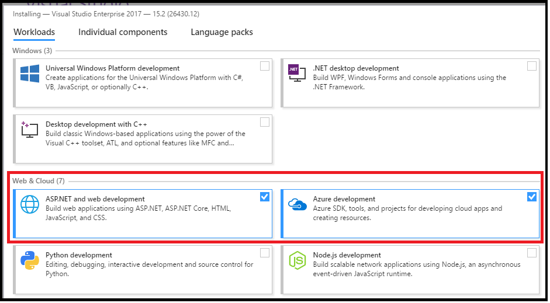
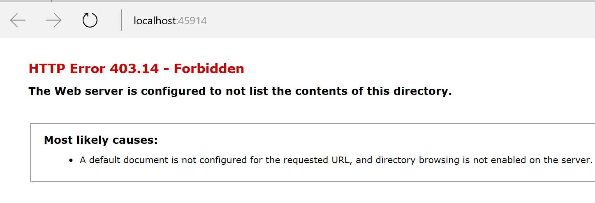
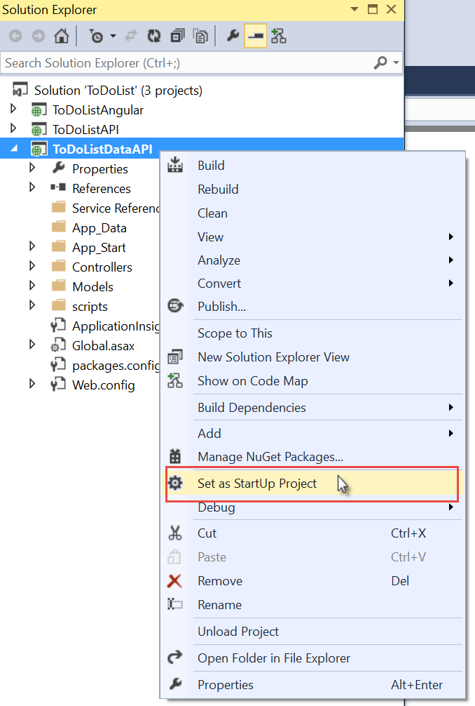
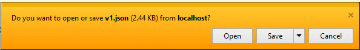
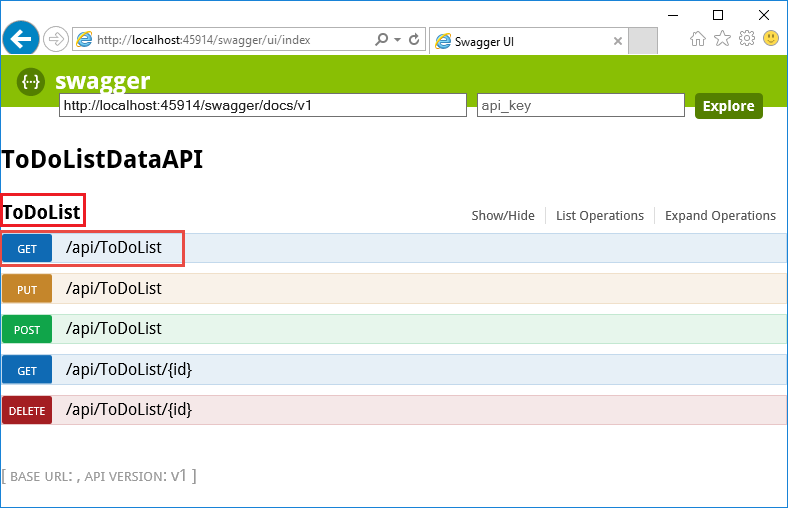
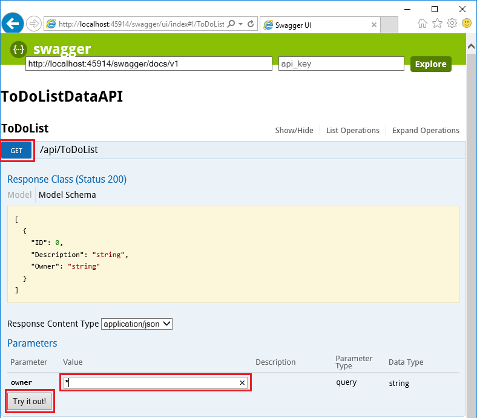
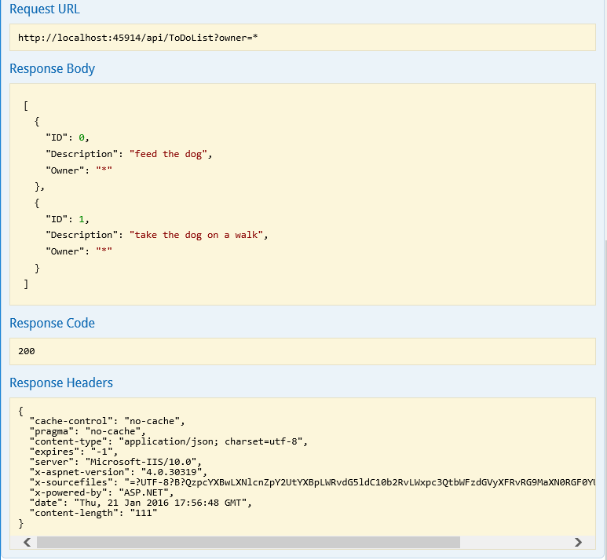
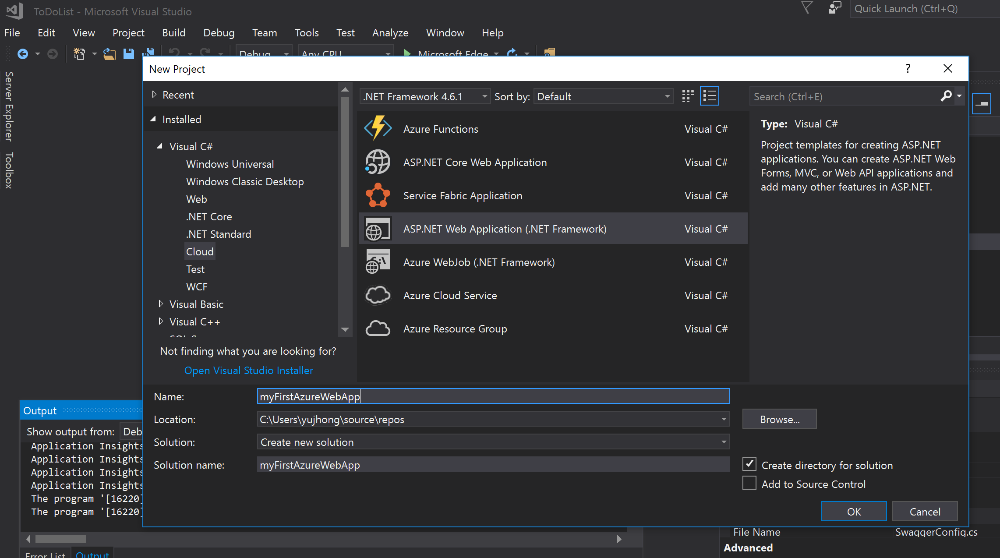
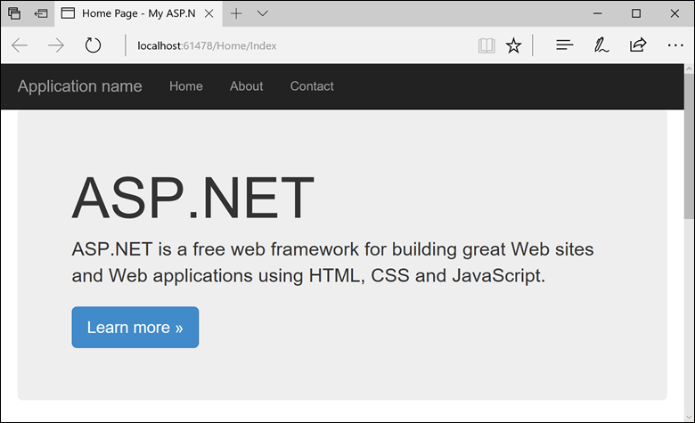
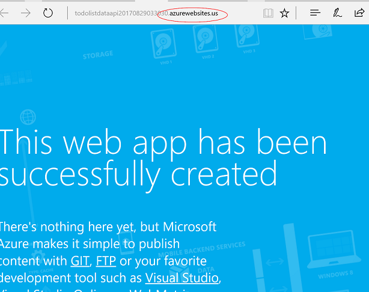

# Deploy to Azure App Services using Visual Studio 2017
This article describes how to deploy an Azure App Services app (API App, Web App, Mobile App) to Azure Government using Visual Studio 2017.

## Prerequisites
* See [Visual Studio prerequisites] (../app-service-api/app-service-api-dotnet-get-started.md#prerequisites) to install and configure Visual Studio 2017 and Azure SDK.
* Follow [these instructions] (documentation-government-get-started-connect-with-vs.md) to configure Visual Studio to connect to Azure Government account.

## Open App project in Visual Studio

* If you have an existing app solution/project running locally in Visual Studio, you can skip this section and complete the Deploy To Azure Government section below.

* If not, download a sample application or create your own by completing the sections below. 

Run the app in Visual Studio to make sure it works locally.

> [!NOTE]
> If using the sample application, complete the ["Use Swagger API metadata and UI"](../app-service-api/app-service-api-dotnet-get-started.md#use-swagger-api-metadata-and-ui) section to run the app in Visual Studio. 
> 
> 

### Prerequisites

* Install [Visual Studio 2017](https://www.visualstudio.com/downloads/) with the following workloads:
    - **ASP.NET and web development**
    - **Azure development**
    

* Azure account - You can [Open an Azure account for free](https://azure.microsoft.com/free/?WT.mc_id=A261C142F) or [Activate Visual Studio subscriber benefits](https://azure.microsoft.com/pricing/member-offers/msdn-benefits-details/?WT.mc_id=A261C142F).

### Download and run Sample Application 
1. Download the [Azure-Samples/app-service-api-dotnet-to-do-list](https://github.com/Azure-Samples/app-service-api-dotnet-todo-list) repository.
    -   You can click the **Download ZIP** button or clone the repository on your local machine.

2. Open the ToDoList solution in Visual Studio 2017.
    -   You will need to trust each solution.
    
3. Build the solution (CTRL + SHIFT + B)  to restore the NuGet packages.
	   
    -   If you want to see the application in operation before you deploy it, you can run it locally. Make sure that ToDoListDataAPI is your startup project and run the solution. You should expect to see a HTTP 403 error in your browser.

    

4. Set the ToDoListDataAPI project (**not** the ToDoListAPI project) as the startup project.

    
5. Press F5 or click **Debug > Start Debugging** to run the project in debug mode.
The browser opens and shows the HTTP 403 error page.
6.  In your browser address bar, add `swagger/docs/v1` to the end of the line, and then press Return.(The URL is `http://localhost:45914/swagger/docs/v1`.)
    -   This is the default URL used by Swashbuckle to return Swagger 2.0 JSON metadata for the API.
		If you're using Internet Explorer, the browser prompts you to download a *v1.json* file.

		
		
		If you're using Chrome, Firefox, or Edge, the browser displays the JSON in the browser window. Different browsers handle JSON differently, and your browser window may not look exactly like the example.

		
7. Close the browser and stop Visual Studio debugging.
	In the ToDoListDataAPI project in **Solution Explorer**, open the *App_Start\SwaggerConfig.cs* file, then scroll down to line 174 and uncomment the following code.
	   
	        /*
	            })
	        .EnableSwaggerUi(c =>
	            {
	        */
	   
    -   The code you've uncommented enables the Swagger UI that you use in the following steps. When you create a Web API project by using the API app project template, this code is commented out by default as a security measure.
8. Run the project again.
9.  In your browser address bar, add `swagger` to the end of the line, and then press Return. (The URL is `http://localhost:45914/swagger`.)
10. When the Swagger UI page appears, click **ToDoList** to see the methods available.
	   
	
11.  Click the first **Get** button in the list.
12. In the **Parameters** section, enter an asterisk as the value of the `owner` parameter, and then click **Try it out**.
	    
	
	    
	The Swagger UI calls the ToDoList Get method and displays the response code and JSON results.
	    
	
13. Click **Post**, and then click the box under **Model Schema**.
    -   Clicking the model schema prefills the input box where you can specify the parameter value for the Post method. (If this doesn't work in Internet Explorer, use a different browser or enter the parameter value manually in the next step.)  
	    
	
14.  Change the JSON in the `todo` parameter input box so that it looks like the following example, or substitute your own description text:
	    
		{
	    	"ID": 2,
	    	"Description": "buy the dog a toy",
	    	"Owner": "*"
		}

15. Click **Try it out**.
	    
	The ToDoList API returns an HTTP 204 response code that indicates success.
16.  Click the first **Get** button, and then in that section of the page click the **Try it out** button.
	    
    The Get method response now includes the new to do item.
17. Close the browser and stop Visual Studio debugging.

If all of these steps were successfully completed then your application is ready to be deployed to Azure Government. 
	
### Create Web App in Visual Studio
1.  In Visual Studio, create a project by selecting **File > New > Project**. 
2. In the **New Project** dialog, select **Visual C# > Web > ASP.NET Web Application (.NET Framework)**.
3. Name the application _myFirstAzureWebApp_, and then select **OK**.

    
	
4. You can deploy any type of ASP.NET web app to Azure. For this quickstart, select the **MVC** template, and make sure authentication is set to **No Authentication**.
Select **OK**.

    	
5. From the menu, select **Debug > Start without Debugging** to run the web app locally.

    
If the browser page looks like the screenshot above then the application is running successfully and ready to be deployed to Azure Government. 

## Deploy to Azure Government
Once **Visual Studio is configured to connect to Azure Government account** (already done in prerequisites section), instructions to deploy to app services are exactly same as for Azure Public.

> [!NOTE]
> In order to check if Visual Studio is connected to Azure Government, go to the "Tools" tab and click on the Azure Environment Selector extension to see what environment you are connected to.
>    
> 

To deploy the app, follow [these steps](https://docs.microsoft.com/en-us/azure/app-service-api/app-service-api-dotnet-get-started#createapiapp).

Once the app has been successfully deployed to Azure Government, the url should end with "azurewebsites.us"(as shown below).  

  

### References
* [Deploy an ASP.NET web app to Azure App Service, using Visual Studio] (../app-service-web/app-service-web-get-started-dotnet.md)
* For other ways to deploy, see [Deploy your app to Azure App Service] (../app-service-web/web-sites-deploy.md)
* For general App Service documentation, see [App Service - API Apps Documentation] (../app-service-api/index.md)

## Next steps
For supplemental information and updates, subscribe to the [Microsoft Azure Government Blog](https://blogs.msdn.microsoft.com/azuregov/).
