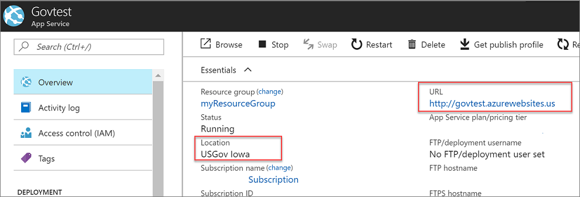
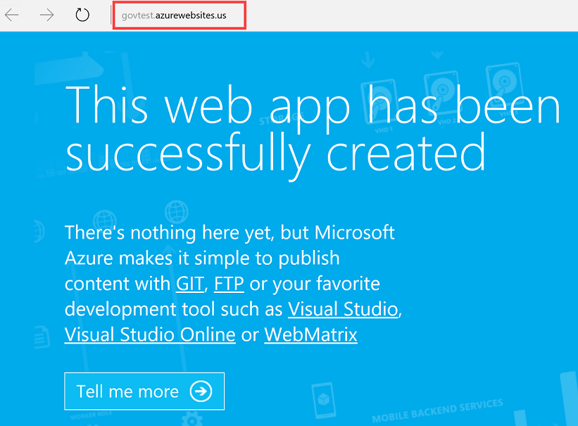
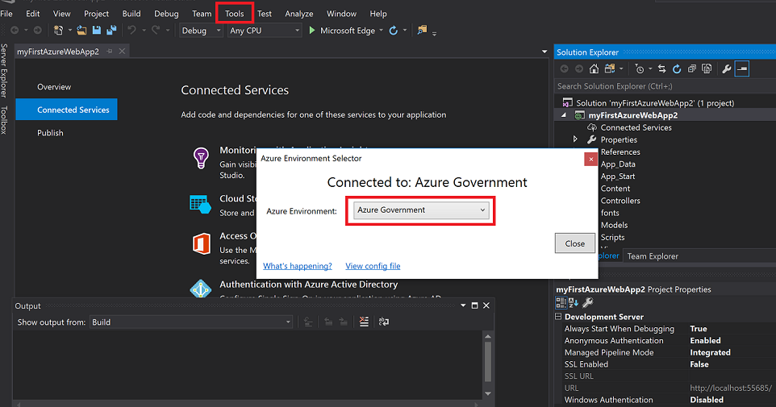
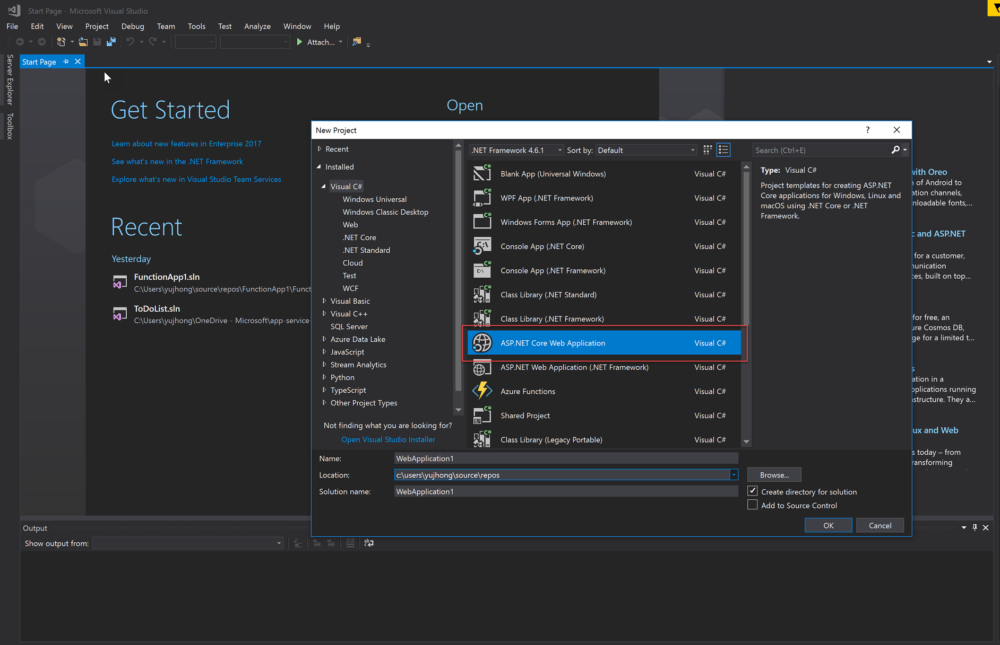

# Tutorial: Deploy an Azure App Services app

Microsoft Azure Government delivers a dedicated cloud with world-class security and compliance, enabling US government agencies and their partners to transform their workloads to the cloud. For example, your may want to provistion and deploy a web app in the Azure Government cloud. To learn more about Azure App Service and see end-to-end scenarios, see [App Service - API Apps Documentation](../app-service/index.yml)

This article describes how to deploy an Azure App Services app (API App, Web App, Mobile App) to Azure Government using Visual Studio 2017.

In this tutorial, you learn how to:

> [!div class="checklist"]
> * Connect to Azure Government
> * Provision a Web App
> * Deploy using VS

If you don't have an Azure Government subscription, create a [free account](https://azure.microsoft.com/global-infrastructure/government/request/) before you begin.

## Prerequisites

* Review [Guidance for developers](documentation-government-developer-guide.md).  This article discusses Azure Government's unique URLs and endpoints for managing your environment. You must know about these endpoints in order to connect to Azure Government. 
* Review [Compare Azure Government and global Azure](compare-azure-government-global-azure.md) and click on a service of interest to see variations between Azure Government and global Azure.
* See [Visual Studio prerequisites](../app-service/app-service-web-get-started-dotnet.md#prerequisites) to install and configure Visual Studio 2017 and Azure SDK.
* Follow [these instructions](documentation-government-get-started-connect-with-vs.md) to configure Visual Studio to connect to Azure Government account.

## Sign in to Azure Government 

To connect, browse to the portal at [https://portal.azure.us](https://portal.azure.us) and sign in with your Azure Government credentials. 

Once you sign in, you should see "Microsoft Azure Government" in the upper left of the main navigation bar.

## Provision a Web App 

In the Azure Government portal, click the **Create a resource** button on the top left-hand corner and choose to create **Web App**:

In the **Web App** dialog, specify the name of your app and a resource group name. In this case, **myResourceGroup**.

When creating the Web App, you must also have an App Service Plan. When creating a new App Service Plan, you should be able to see the different Azure Government regions in the **App Service Environment** box. If your subscription has not been approved for DoD regions, you will not see all of the DoD regions.

Once the app has been successfully created go into the **App Services** section and you will be able to see your new web app.
Click on your web app and you should see that the url ends in **azurewebsites.us**, and the location should also be an Azure Government region.

When you click on your app url, a blue page will appear:

## Deploy a Web App to Azure Government
Once **Visual Studio is configured to connect to Azure Government account** (already done in prerequisites section), you can deploy it to Azure Government using [Visual Studio](documentation-government-get-started-connect-with-vs.md): 

> [!NOTE]
> In order to check if Visual Studio is connected to Azure Government, go to the **Tools** tab and click on the Azure Environment Selector extension to see what environment you are connected to.
>
> 

### Publish using Azure Active Directory User Authentication from Visual Studio
Open up Visual Studio and click File -> New -> Project. We will create an ASP.NET Core Web Application but Azure Web Apps supports a variety of web technologies as you can see on the page.

Right click on your web app and click **Publish**.

We will use the existing Web App we have created in the preceding section, so choose the **select existing** box. 

To deploy an app and also have Visual Studio provision a new Azure Web App during the publish process, click **create new**.

Once your web app has been published to Azure Government, you will see this screen, with the URL ending in **azurewebsites.us**. 

We just published our app to the existing Azure Web App that we previously created. 

## Clean up resources

In the preceding steps, you created Azure resources in a resource group. If you don't expect to need these resources in the future, you can delete them by deleting the resource group.

From the left menu in the Azure Government portal, select Resource groups and then select **myResourceGroup**.

On the resource group page, make sure that the listed resources are the ones you want to delete.

Select **Delete**, type **myResourceGroup** in the text box, and then select **Delete**.

## Next steps

> [!div class="nextstepaction"]
> For supplemental information and updates, subscribe to the [Microsoft Azure Government Blog](https://blogs.msdn.microsoft.com/azuregov/).

