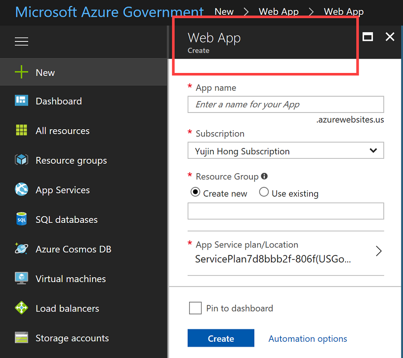
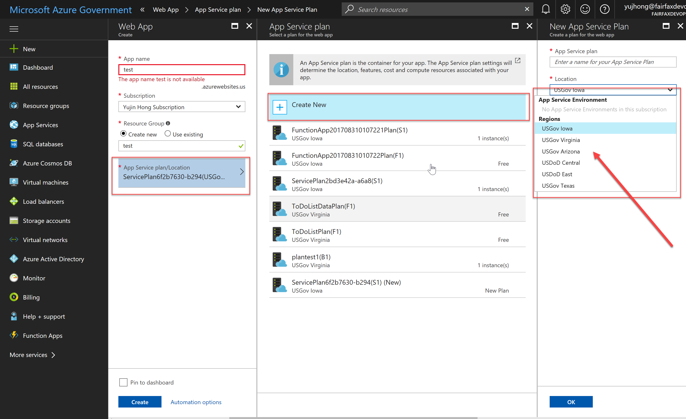
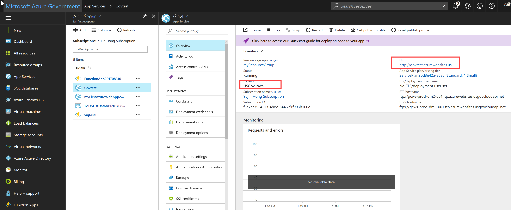
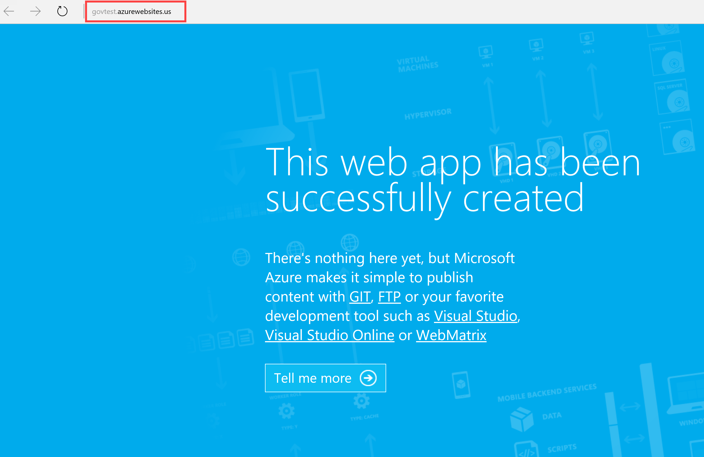
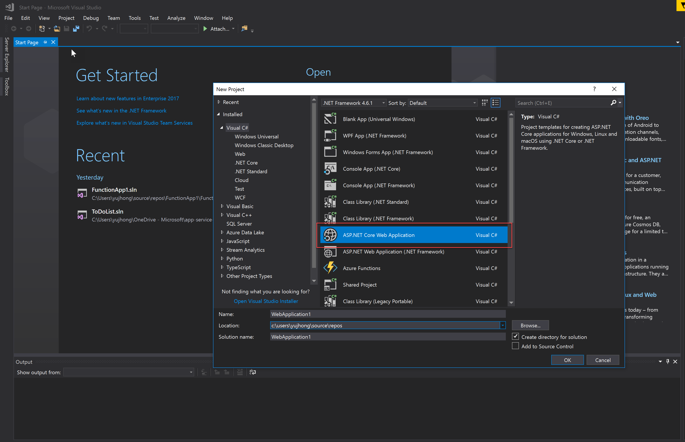
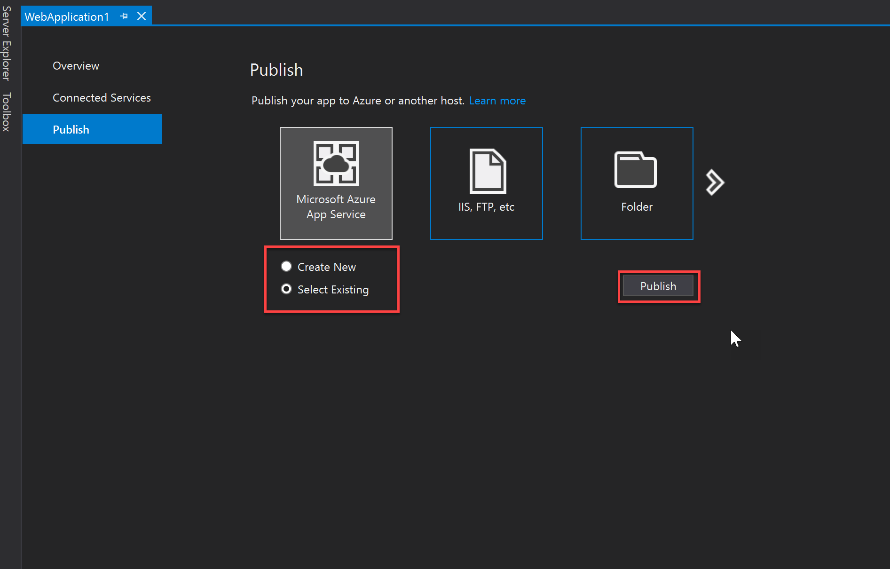
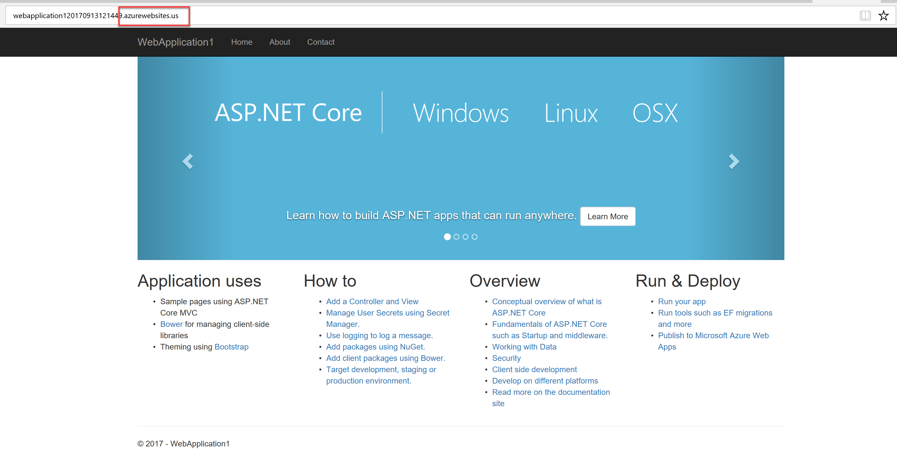
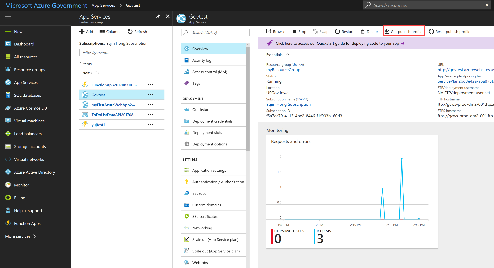
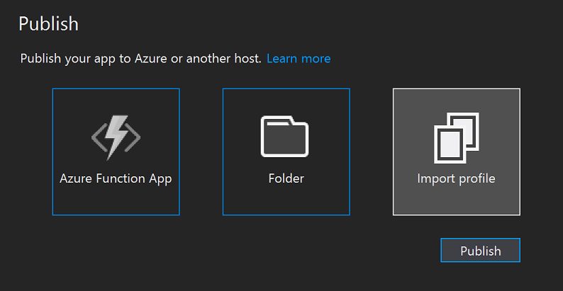
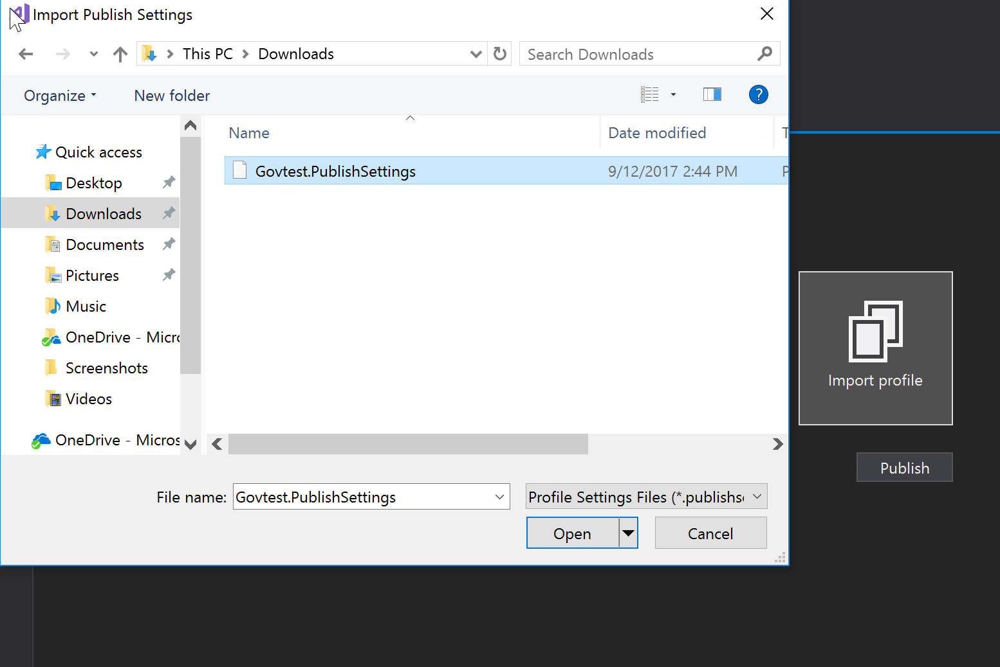

# Deploy to Azure App Services using Visual Studio 2017
This article describes how to deploy an Azure App Services app (API App, Web App, Mobile App) to Azure Government using Visual Studio 2017.

## Prerequisites
* See [Visual Studio prerequisites] (../app-service-api/app-service-api-dotnet-get-started.md#prerequisites) to install and configure Visual Studio 2017 and Azure SDK.
* Follow [these instructions] (documentation-government-get-started-connect-with-vs.md) to configure Visual Studio to connect to Azure Government account.

## Provision a Web App in the Azure Government Portal
Log in to the [Azure Government Portal](https://portal.azure.us). 
Click the "New" button on the top left-hand corner and choose to create "Web App":

When creating the Web App you must also have an App Service Plan. When creating a new App Service Plan, you should be able to see the different Azure Government regions in the "App Service Environment" box. You may not see all of the DoD regions shown below if your subscription has not been approved for DoD regions.

Once the app has been successfully created go into the "App Services" section and you will be able to see your new web app.
Click on your web app and you should see that the url ends in "azurewebsites.us", and the location should also be an Azure Government region.

When you click on your app url a blue page will appear:

## Deploy a Web App to Azure Government
Once **Visual Studio is configured to connect to Azure Government account** (already done in prerequisites section), there are two ways of deploying to Azure Government using [Visual Studio](documentation-government-get-started-connect-with-vs.md): 

   1. Direct publish with Azure Active Directory user authetication
   2. Publish with "Publish Profile" option(which can be found in the portal)

> [!NOTE]
> In order to check if Visual Studio is connected to Azure Government, go to the "Tools" tab and click on the Azure Environment Selector extension to see what environment you are connected to.
>
> 

### Publish using Azure Active Directory User Authentication from Visual Studio
Open up Visual Studio and click File -> New -> Project. We will create an ASP.NET Core Web Application but Azure Web Apps supports a variety of web technologies as you can see on the page.

Right click on your web app and click "Publish".
There are two different options, to use an existing Web App or create a new one. We will use the existing Web App we have created above in the section above, so choose the "select existing" box. 
To deploy an app and also have Visual Studio provision a new Azure Web App during the publish process, click "create new" and follow [these steps](https://docs.microsoft.com/en-us/azure/app-service-api/app-service-api-dotnet-get-started#createapiapp).

Once your web app has been published to Azure Government, you should be able to see this screen, with the URL ending in "azurewebsites.us". 

We just published our app to the existing Azure Web App that we previously created. 

### Deploy using Publish profile
Log in to the [Azure Government Portal](https://portal.azure.us). 
Click on "App Services" and choose your web app that you want to deploy. Then Click the "Get publish profile" button at the top of the page and download(take note of where the file was downloaded):

Open up Visual Studio and right click on your app solution. 

Choose the "Import Profile" option and select the publish profile file from the location where you previously downloaded it. Click "publish". 
Now you will be able to upload the publish profile that you downloaded from the portal.

If you navigate to the url you should be able to see this screen.

The app has now been deployed to Azure Government. 

### References
* [Deploy an ASP.NET web app to Azure App Service, using Visual Studio] (../app-service-web/app-service-web-get-started-dotnet.md)
* For other ways to deploy, see [Deploy your app to Azure App Service] (../app-service-web/web-sites-deploy.md)
* For general App Service documentation, see [App Service - API Apps Documentation] (../app-service-api/index.md)

## Next steps
For supplemental information and updates, subscribe to the [Microsoft Azure Government Blog](https://blogs.msdn.microsoft.com/azuregov/).
