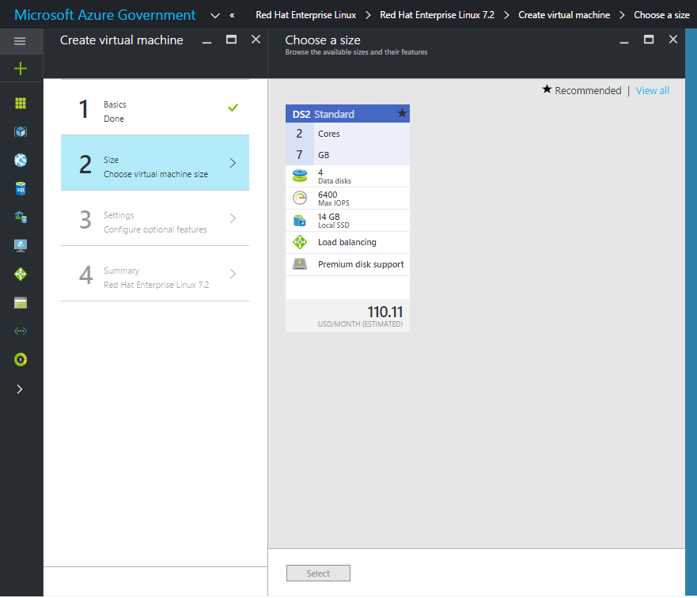

<properties
	pageTitle="Azure Government documentation | Microsoft Azure"
	description="This provides a comparison of features and guidance on developing applications for Azure Government."
	services="Azure-Government"
	cloud="gov"
	documentationCenter=""
	authors="ryansoc"
	manager="zakramer"
	editor=""/>

<tags	ms.service="multiple"
	ms.devlang="na"
	ms.topic="article"
	ms.tgt_pltfrm="na"
	ms.workload="azure-government"
	ms.date="10/20/2016"
	ms.author="ryansoc"/>

# Azure Government Marketplace
## Image Availability
For on available images please see [Azure Government Marketplace Images](../azure-government-image-gallery.md)

##  Customers
For details on this service and how to use it, see [Marketplace public documentation](https://azure.microsoft.com/documentation/xxxxxxxxxxxx).

### Variations
The Marketplace Service is available to the Azure Government with ISV provided images. These images have the below attributes.
- Only Bring Your Own License (BYOL) SKUs are available. This means you cannot access any images that require purchase transaction through Azure Marketplace
- Only a subset of images are currently available as compared to the public marketplace. You can find the list of available images here -> point to image page from here

The provisioning experience in the Azure Portal will be similar to the Marketplace experience on public Azure. The provisioning flow is detailed below.

#### Step 1
Launch the Marketplace

  

#### Step 2
Browse through different products to find the right one.

The ISVs provides a list of certificates as part of the product description to help you make the right choice. The certification information is provided by the ISV.

#### Step 3
Choose an ISV product\image

#### Step 4
Launch the create flow and enter the required parameters for deployment

>[AZURE.NOTE] In the Location dropdown, only Azure Government locations will be visible

#### Step 5
Observe pricing

#### Step 6
Complete all steps and click Ok to start the provisioning process

## Partners

>[AZURE.NOTE] Azure Marketplace ISV Partners:
If you are interested in making your product available to the Azure Government customers, please reach out to the Azure Global Ecosystem Team. <Need alias>

### Publish your Image on Azure Government 
 
>[AZURE.NOTE] : If you are a new Marketplace partner and are not Azure Government Certified, please see the steps [here](../marketplace-publishing-getting-started.md) before proceeding.

#### Step 1 	
Log onto [https://publish.windowsazure.com](https://publish.windowsazure.com)

#### Step 2
Click on the offer you want to publish

#### Step 3
Click on “Skus” and click the Azure Government Cloud box

#### Step 4
Click the + Add Certification link to add links to any certifications for your offer.

#### Step 5
Click on Publish and click Push to Staging.

#### Step 6
After pushing your image to staging, you can put in a request for a trial account in Microsoft Azure Government cloud to enable you to test your image at this portal: [https://azuregov.microsoft.com/trial/azuregovtrial](https://azuregov.microsoft.com/trial/azuregovtrial)

Azure Government will verify your eligibility as a partner who serves U.S. federal, state, local, or tribal entities, and contact you via email and process your trial account within is 3-5 business days.

#### Step 7
Once you have your test account, you can test your image by logging into [https://portal.azure.us](https://portal.azure.us) using your new Azure Government Trial account.

#### Step 8
Need this from the team - DOES THE PUBLISHER ACTUALLY GET THEIR IMAGE IN PROD>

## Next steps

For supplemental information and updates, subscribe to the [Microsoft Azure Government Blog](https://blogs.msdn.microsoft.com/azuregov/).
