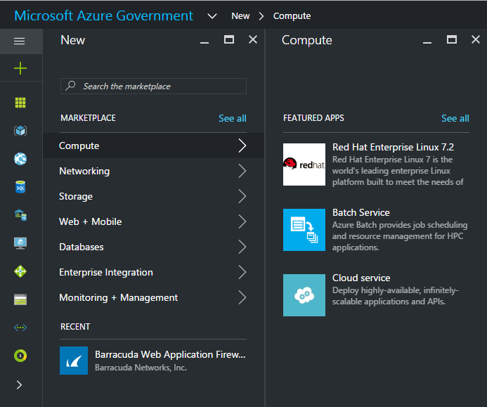
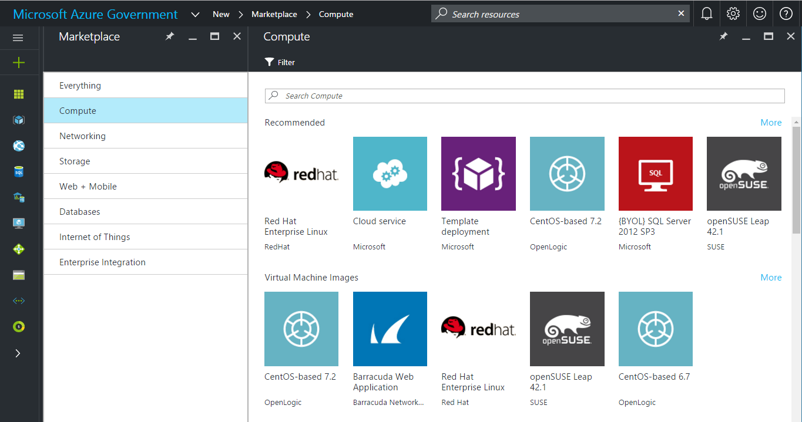
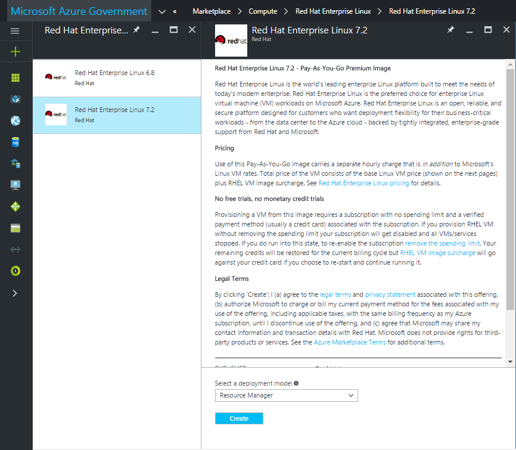
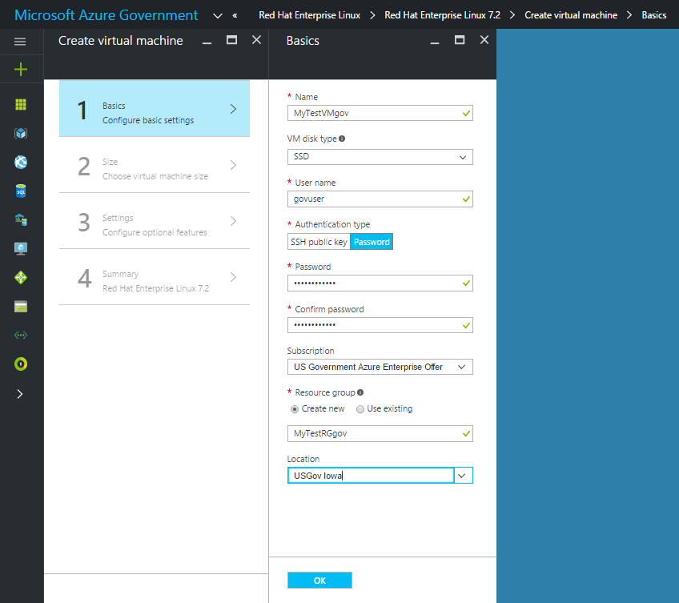

# Azure Government Marketplace

Azure Government Marketplace helps connect government agencies and partners with independent software vendors (ISVs) and start-ups that are offering their solutions in Azure Government.

> [!NOTE]
> For information on making your images available in Azure Government, see the [partner onboarding guidelines](./documentation-government-manage-marketplace-partners.md).

## Variations

Azure Government Marketplace differs from Azure Marketplace in the following ways:

- Only Bring Your Own License (BYOL) and Pay-as-you-Go (PayGo) images are available.
- A different set of images is available. For a list of available images, see [Azure Government Marketplace images](./documentation-government-image-gallery.md).

> [!NOTE]
> Red Hat Enterprise Linux is available in Azure Government with Azure Marketplace billing. This offering is a special case exception to the above statement about license options in Azure Government.

## Enable the Azure Government Marketplace

If your subscription is under an Enterprise Agreement (EA), the Azure Government Marketplace must be enabled before you can deploy a Marketplace solution to your subscription.

1. Log in to the [Enterprise Account Portal](https://ea.azure.com) as an Enterprise Administrator
1. Navigate to **Manage**
1. Under **Enrollment Details**, click the pencil icon next to the **Azure Marketplace** line item
1. Toggle **Enabled/Disabled** as appropriate
1. Click **Save**

> [!NOTE]
> It can take up to 24 hours for the change to take effect.  

## Deploy a Solution to your Subscription

1. **Log in** to the [Azure Government portal](https://portal.azure.us).

1. Click on **+New**.

     

1. Browse through different products to find the right one. The marketplace publisher provides a list of certifications as part of the product description to help you make the right choice.

   

1. Choose a product/image and click **Create**.

   

1. Enter the required parameters for deployment.

   > [!NOTE]
   > In the Location dropdown, only Azure Government locations are visible
  
   

1. To start the provisioning process, click **Ok**.

## Next steps

- Subscribe to the [Azure Government blog](https://blogs.msdn.microsoft.com/azuregov/)
- Get help on Stack Overflow by using the [azure-gov](https://stackoverflow.com/questions/tagged/azure-gov) tag
