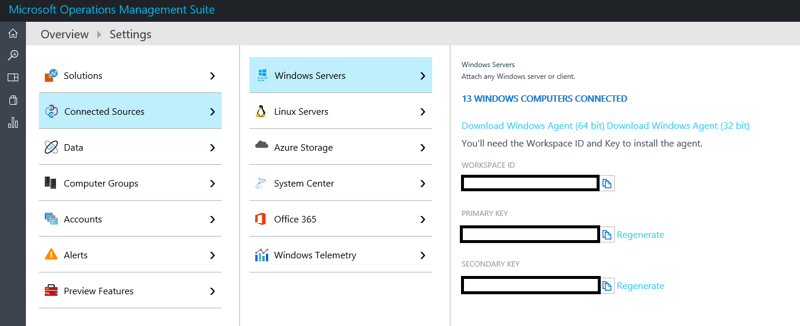
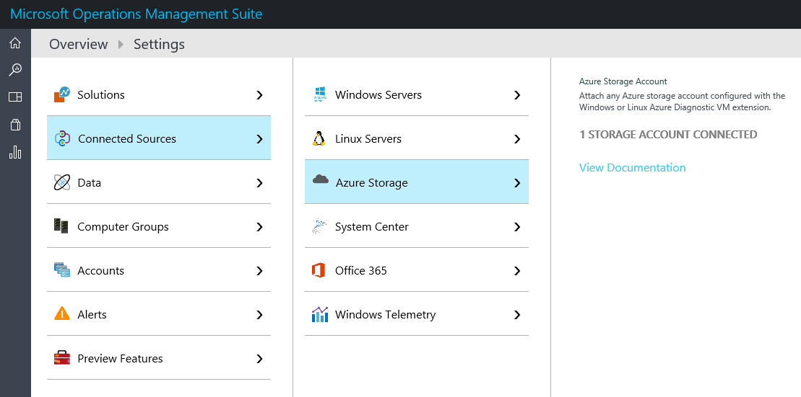
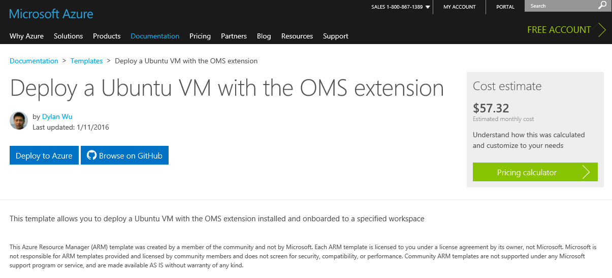
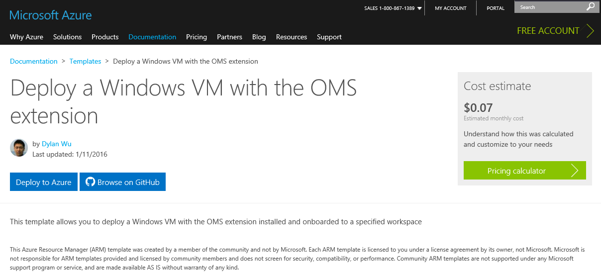
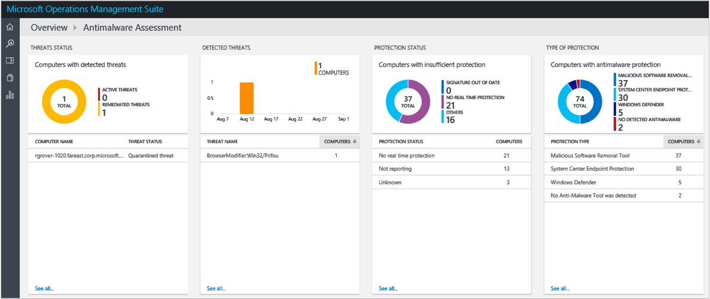
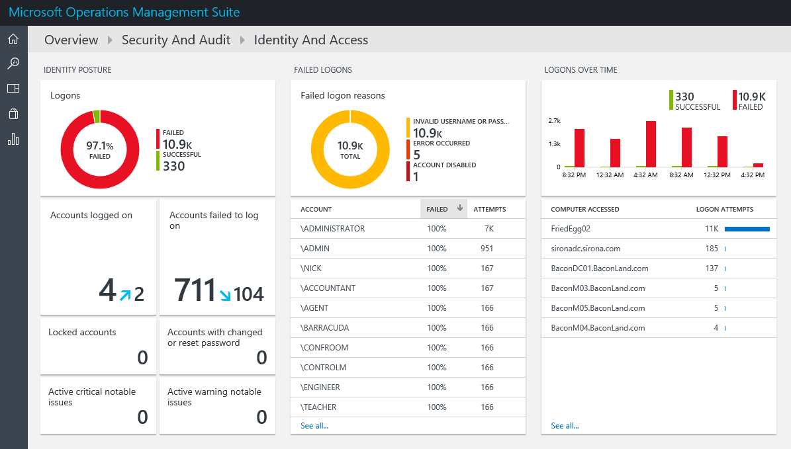
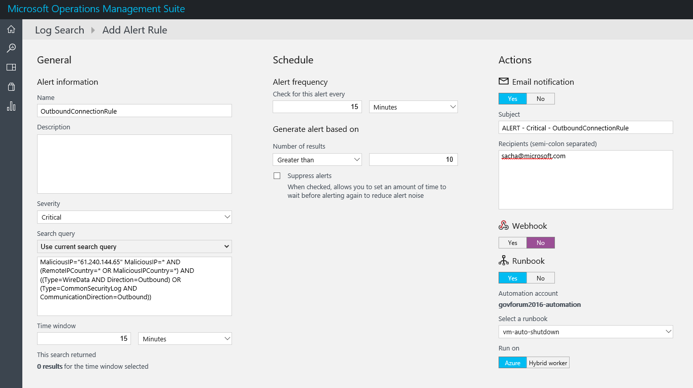

# Azure Government cybersecurity: Monitoring and securing your assets with Azure Monitor logs

## Cybersecurity in the cloud
A crucial concern for our customers who are moving to the cloud is retaining asset management and security of the Azure Government services that they've deployed to the cloud. Virtual machine firewalls need to be configured correctly. Virtual networks need to have the right network security groups applied to them. Access to your assets needs to be locked down at the right time. All these necessary work streams need to be planned, designed, and provisioned to enable a secure infrastructure for your agency to use.

Setting up this kind of environment can be challenging. Onboarding your fleet of servers to any monitoring service is a hard operation to scale, and it can also be challenging to update the monitoring service. Monitoring infrastructure on different cloud providers, and across the cloud and on-premises is difficult. Finally, keeping your monitoring up-to-date and enabling Azure Application Insights to monitor, detect, alert, and counter cybersecurity threats require time, resources, and computing power.

## Azure Monitor logs
Azure Monitor logs, now available in Azure Government, uses hyperscale log search to quickly analyze your data and expose threats in your environment. This article focuses on using Azure Monitor logs that uses hyperscale log search to quickly analyze your data and expose threats in your environment.

[!INCLUDE [azure-monitor-log-analytics-rebrand](../../includes/azure-monitor-log-analytics-rebrand.md)]

Azure Monitor logs can:

* Deploy agents to individual VMs (Linux and Windows) on Azure, other cloud providers, and on-premises.
* Connect your existing logs via an Azure Government storage account or System Center Operations Manager endpoint with existing logging data.

Let's explore how we can get Azure Monitor logs integrated into your fleet and look at some of the out-of-box solutions that address the concerns that we've described here.

## Onboarding servers to Azure Monitor logs
The first step in integrating your cloud assets with Azure Monitor logs is installing the Log Analytics agent across log sources. For virtual machines, this is simple because you can manually download the agent from the Azure Monitor logs portal.

Figure 1: Windows servers connected to Azure Monitor logs

You can connect Azure VMs to Azure Monitor logs directly through the Azure portal. For instructions, see [New ways to enable Azure Monitor logs on your Azure VMs](https://blogs.technet.microsoft.com/momteam/2016/02/10/new-ways-to-enable-log-analytics-oms-on-your-azure-vms/).

You can also connect them programmatically or configure the Azure Monitor virtual machine extension right into your Azure Resource Manager templates. See the instructions for Windows-based machines at [Connect Windows computers to Azure Monitor logs](https://docs.microsoft.com/azure/log-analytics/log-analytics-windows-agents) and for Linux-based machines at [Connect Linux computers to Azure Monitor logs](https://docs.microsoft.com/azure/log-analytics/log-analytics-linux-agents).

## Onboarding storage accounts and Operations Manager to Azure Monitor logs
Azure Monitor logs can also connect to your storage account and/or existing System Center Operations Manager deployments to offer you operations management in hybrid scenarios (across cloud providers or in cloud/on-premises infrastructures).

Figure 2: Connecting Azure Storage and Operations Manager to Azure Monitor logs

Azure Monitor logs also supports collecting logging information from other monitoring services like Chef or Puppet. Furthermore, for Azure deployments, we have VMs with Azure Monitor logs-enabled Azure Resource Manager templates so you can deploy compute and onboard to your Log Analytics workspace at the same time.

Figure 3: Azure Resource Manager templates for Azure VMs with Azure Monitor VM extension

Information about setting up Azure Monitor logs with your existing Operations Manager implementation on-premises can be found in [Connect Operations Manager to Azure Monitor logs](https://docs.microsoft.com/azure/log-analytics/log-analytics-om-agents).

## Applying intelligence through management solutions
Now that you have various sources for logging data, you have to make sense of all this data.

Azure Monitor logs, at its core, is a log search service that lets you write powerful queries to quickly search across thousands or even millions of logs. However, discovering the issues that you need to write queries can be difficult.

Enter Azure Monitor logs solutions. These are packs of queries that are natively integrated with Azure Monitor logs to proactively give you insights into your Azure Monitor logs-managed fleet.

On the theme of cyber security, I briefly discuss three cybersecurity scenarios that Azure Monitor logs can solve out of the box for you.

### Antimalware assessment
Antimalware assessments give you a canned set of queries, notifications, and monitoring dashboards to tell you at a glance how well your fleet is protected against malware.

This dashboard gives you a list of four things:
* Any servers that have active and/or remediated threats.
* Currently detected threats.
* Computers that aren’t being sufficiently protected. Azure Monitor logs finds this information by crawling the logs of your computers to look for any site of FWs that are being opened, or for improperly configured rules in common web browsers.
* Analysis of how your protected servers are being protected, for example by native Windows OS virus protection or a solution such as System Center Endpoint Protection.

For example, you can see that the following threat was caught and automatically triaged by System Center:

Figure 4: Azure Monitor logs antimalware assessment solution

More information about antimalware assessment can be found in the article [Malware assessment solution in Azure Monitor logs](https://azure.microsoft.com/documentation/articles/log-analytics-malware/).

### Identity and access
Another common cybersecurity scenario in the cloud revolves around credential compromise. Not only does your cloud subscription have credentials, but each individual VM has a user and/or secret (usually a certificate or password) that's associated with it.

Azure Monitor logs organizes all sign-in attempts in your fleet and buckets them depending on type (remote, local, username, and so on). For example, in the following example, I can see a large amount of unsuccessful sign-in attempts from largely random strings as usernames. This indicates that it's highly likely that my computers have been exposed and not properly protected by firewalls and access control lists.

Figure 5: 97.3% sign-ins failed in the last 24 hours

### Threat intelligence
Azure Monitor logs also provides protection against malicious insider scenarios, when there’s a security compromise inside your organization and a malicious user is trying to exfiltrate data.

Azure Monitor logs threat intelligence looks at all the network logs on your computer and automatically searches for and notifies you about inbound/outbound network connections to known malicious IPs (for example, IP addresses on the unindexed dark net).

For example, in the following screenshot, I can see that there are both inbound and outbound network connections to the People’s Republic of China.

By double-clicking the inbound tag, I discover that a Linux VM that is being managed by Azure Monitor logs is making outbound connections to a known dark net IP address in China.

You can also set up alerts to Azure Monitor logs solutions like threat intelligence. In the following screenshot, I've set up an alert so that if Azure Monitor logs detects more than 10 outbound connections to a known malicious IP address, it sends an alert out to me via email. I then configure that alert to fire an Azure Automation job, which is set up to automatically shut down that VM.

Figure 6: Azure Monitor logs alerts and automation

This is just one example of an out-of-box Azure Monitor logs solution that can be applied to your fleet, whether it’s running on Azure, another cloud service provider, or on-premises.

Azure Monitor continues to update its machine learning to fight the latest threats automatically for you, and we continue to roll out new solutions to the Azure marketplace as well.

For more information about Azure Monitor logs, see [our documentation page](https://azure.microsoft.com/documentation/articles/documentation-government-overview/).
