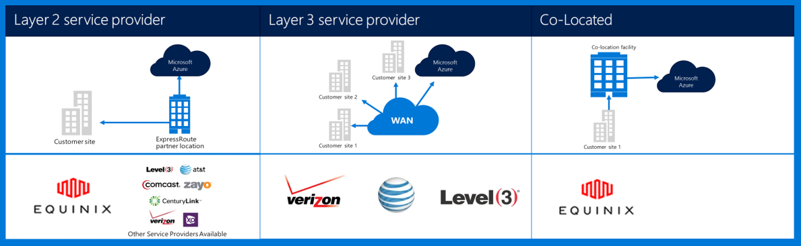

# Azure Government Networking
## ExpressRoute (Private Connectivity)
ExpressRoute is generally available in Azure Government. For more information (including partners and peering locations), see the [ExpressRoute public documentation](../expressroute/index.yml).

### Variations
ExpressRoute is generally available (GA) in Azure Government. 

* Government customers connect to a physically isolated capacity over a dedicated Azure Government (Gov)  ExpressRoute (ER) connection
* Azure Gov provides Increased availability & durability by leveraging multiple region pairs located a minimum of 500 miles apart 
* By default all Azure Gov ER connectivity is configured active-active redundant with support for bursting and delivers up to 10G circuit capacity (smallest is 50 MB)
* Azure Gov ER locations provide optimized pathways (shortest hops, low latency, high performance, etc.) for customers and Azure Gov geo-redundant regions
* The Azure Gov ER private connection does not utilize, traverse, or depend on the Internet
* Azure Gov physical and logical infrastructure are physically dedicated and separated, and access is restricted to U.S. persons
* Microsoft owns and operates all fiber infrastructure between Azure Gov Regions and Azure Gov ER Meet-Me locations
* Azure Gov ER provides connectivity to Microsoft Azure, O365, and CRM cloud services

### Considerations
There are two basic services that provide private network connectivity into Azure Government: VPN (site-to-site for a typical organization) and ExpressRoute.

Azure ExpressRoute is used to create private connections between Azure Government datacenters, and your on-premises infrastructure, or in a colocation environment. ExpressRoute connections do not go over the public Internet—they offer more reliability, faster speeds, and lower latencies than typical Internet connections. In some cases, using ExpressRoute connections to transfer data between on-premises systems and Azure yields significant cost benefits.   

With ExpressRoute, you establish connections to Azure at an ExpressRoute location (such as an Exchange provider facility), or you directly connect to Azure from your existing WAN network (such as a multiprotocol label switching (MPLS) VPN, supplied by a network service provider).

    

For network services to support Azure Government customer applications and solutions, it is strongly recommended that ExpressRoute (private connectivity) is implemented to connect to Azure Government. If VPN connections are used, the following should be considered:

* Customers should contact their authorizing official/agency to determine whether private connectivity or other secure connection mechanism is required and to identify any additional restrictions to consider.
* Customers should decide whether to mandate that the site-to-site VPN is routed through a private connectivity zone.
* Customers should obtain either an MPLS circuit or VPN with a licensed private connectivity access provider.

All customers who utilize a private connectivity architecture should validate that an appropriate implementation is established and maintained for the customer connection to the Gateway Network/Internet (GN/I) edge router demarcation point for Azure Government. Similarly, your organization must establish network connectivity between your on-premises environment and Gateway Network/Customer (GN/C) edge router demarcation point for Azure Government.

### Data Considerations
The following information identifies the Azure Government International Traffic in Arms Regulations (ITAR) boundary for Azure ExpressRoute:

| **Regulated/controlled data permitted**| **Regulated/controlled data not permitted** |
| --- | --- |
| Data entered, transmitted, and processed within ExpressRoute dedicated connections can contain export-controlled data. | Azure ExpressRoute metadata is not permitted to contain export-controlled data. This metadata includes configuration data entered when creating and maintaining your ExpressRoute circuit. Do not enter regulated/controlled data into the Circuit name field when configuring the initial ExpressRoute circuit. |

## Support for BGP communities
This section provides an overview of how BGP communities will be used with ExpressRoute in AzureGov. Microsoft will advertise routes in the public and Microsoft peering paths with routes tagged with appropriate community values. The rationale for doing so and the details on community values are described below. Microsoft, however, will not honor any community values tagged to routes advertised to Microsoft.

If you are connecting to Microsoft through ExpressRoute at any one peering location within the AzureGov region, you will have access to all Microsoft cloud services across all regions within the government boundary. 

For example, if you connected to Microsoft in Washington D.C. through ExpressRoute, you will have access to all Microsoft cloud services hosted in AzureGov.

Refer to the "Overview" tab on [ExpressRoute public documentation](../expressroute/index.yml) for details on locations and partners, and a detailed list of ExpressRoute for AzureGov peering locations.

You can purchase more than one ExpressRoute circuit. Having multiple connections offers you significant benefits on high availability due to geo-redundancy. In cases where you have multiple ExpressRoute circuits, you will receive the same set of prefixes advertised from Microsoft on the public peering and Microsoft peering paths. This means you will have multiple paths from your network into Microsoft. This can potentially cause sub-optimal routing decisions to be made within your network. As a result, you may experience sub-optimal connectivity experiences to different services. 

Microsoft will tag prefixes advertised through public peering and Microsoft peering with appropriate BGP community values indicating the region the prefixes are hosted in. You can rely on the community values to make appropriate routing decisions to offer optimal routing to customers.  For additional details, refer to the "How-to guides > Best practices" tab on [ExpressRoute public documentation](../expressroute/index.yml) and click on "Optimize routing."

| **National Clouds Azure Region**| **BGP community value** |
| --- | --- |
| **US Government** |  |
| US Gov Arizona | 12076:51106 |
| US Gov Iowa | 12076:51109 |
| US Gov Virginia | 12076:51105 |
| US Gov Texas | 12076:51108 |
| US DoD Central | 12076:51209 |
| US DoD East | 12076:51205 |

All routes advertised from Microsoft will be tagged with the appropriate community value. 

In addition to the above, Microsoft will also tag prefixes based on the service they belong to. This applies only to the Microsoft peering. The table below provides a mapping of service to BGP community value.

| **Service in National Clouds** | **BGP community value** |
| --- | --- |
| **US Government** |  |
| Exchange Online |12076:5110 |
| SharePoint Online |12076:5120 |
| Skype For Business Online |12076:5130 |
| Dynamics 365 |12076:5140 |
| Other Office 365 Online services |12076:5200 |

> [!NOTE]
> Microsoft does not honor any BGP community values that you set on the routes advertised to Microsoft.

## Support for Virtual Network
Virtual Network is generally available in Azure Government. For more information, see the [Virtual Network public documentation](../virtual-network/virtual-networks-overview.md). 

## Support for Load Balancer
Load Balancer is generally available in Azure Government. For more information, see the [Load Balancer public documentation](../load-balancer/load-balancer-overview.md). 

## Support for DNS
DNS is generally available in Azure Government. For more information, see the [DNS public documentation](../dns/dns-overview.md). 

## Support for Traffic Manager
Traffic Manager is generally available in Azure Government. For more information, see the [Traffic Manager public documentation](../traffic-manager/traffic-manager-overview.md).

The **IP addresses for Azure Government from which Traffic Manager health checks can originate are [here](https://azuretrafficmanagerdata.blob.core.windows.net/probes/azure-gov/probe-ip-ranges.json)**. Review the IPs listed in the JSON file to ensure that incoming connections from these IP addresses are allowed at the endpoints to check its health status.

## Support for VNet Peering 
VNet Peering is generally available in Azure Government. For more information, see the [VNet Peering public documentation](../virtual-network/virtual-network-peering-overview.md). 

## Support for VPN Gateway 
VPN Gateway is generally available in Azure Government. For more information, see the [VPN Gateway public documentation](../vpn-gateway/vpn-gateway-about-vpngateways.md). 

## Support for Application Gateway 
Application Gateway is generally available in Azure Government. For more information, see the [Application Gateway public documentation](../application-gateway/application-gateway-introduction.md). 

## Support for Network Watcher
Network Watcher is generally available in Azure Government. For more information, see the [Network Watcher public documentation](../network-watcher/network-watcher-monitoring-overview.md). 

## Support for Service Bus
Service Bus is generally available in Azure Government. For more information, see the [Service Bus public documentation](../service-bus/index.md).

### Variations
The URLs for accessing and managing the Service Bus service are different:

| Service Type | Azure Public | Azure Government |
| --- | --- | --- |
| Service Bus | *.servicebus.windows.net | *.servicebus.usgovcloudapi.net |

## Support for Azure Firewall

Azure Firewall is available in Azure Government in the following regions:
- usgovarizona
- usgovtexas
- usgovvirginia

The associated portal configuration user interface is being added to regions incrementally, and will be available in all regions in the near future.

### Limitations

- Traffic Manager service tags do not work, by design.
- App Service Environment FQDN tags currently do not work.

For more information about Azure Firewall, see [What is Azure Firewall?](../firewall/overview.md)

## Next Steps
For supplemental information and updates please subscribe to the
<a href="https://blogs.msdn.microsoft.com/azuregov/">Microsoft Azure Government Blog. </a>

