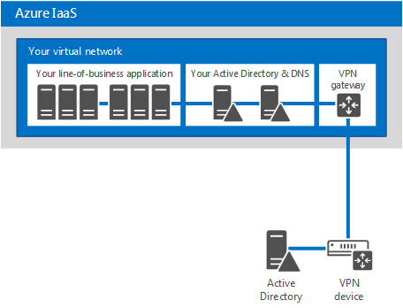
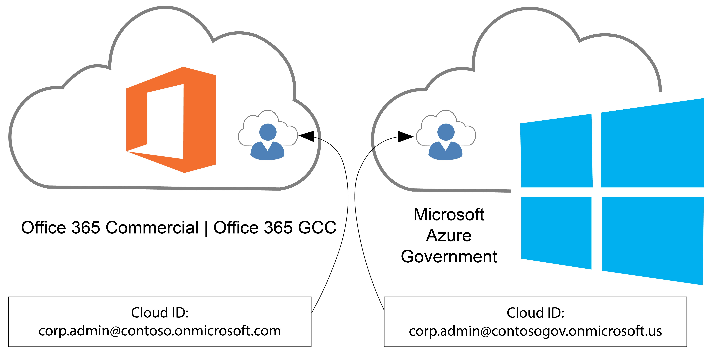
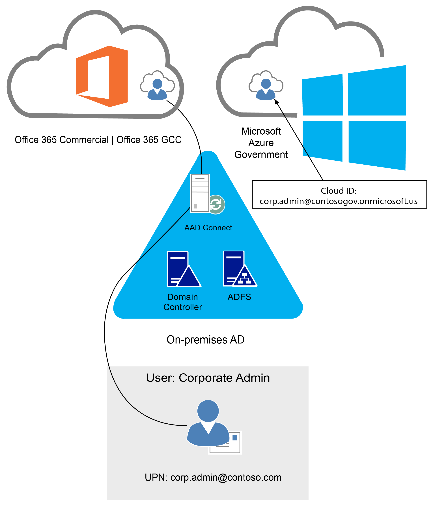
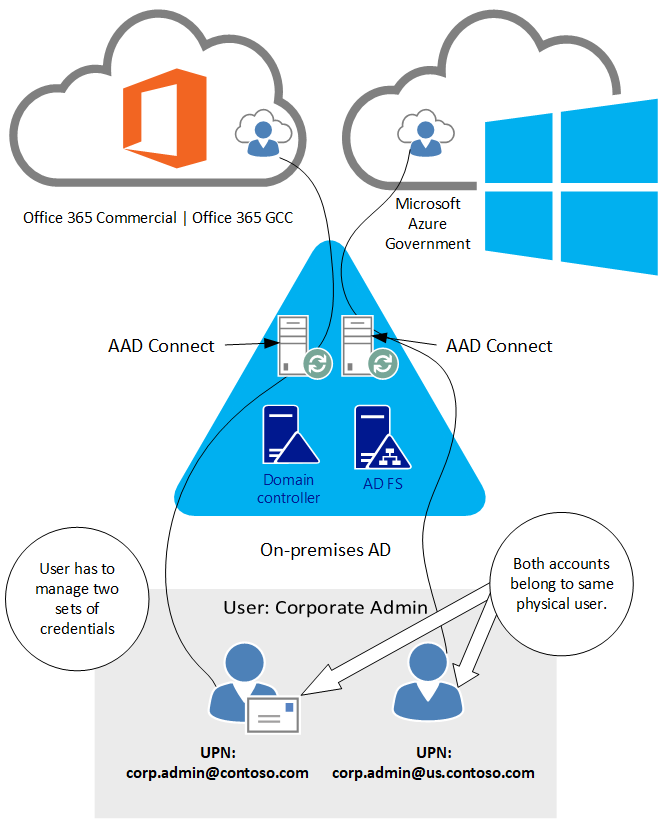

# Planning identity for Azure Government applications

Microsoft Azure Government provides the same ways to build applications and manage identities as Azure Public. Azure Government customers may already have an Azure Active Directory (Azure AD) Public tenant or may create a tenant in Azure AD Government. This article provides guidance on identity decisions based on the application and location of your identity.

## Identity models
Before determining the identity approach for your application, you need to know what identity types are available to you. There are three types: On-Premises Identity, Cloud Identity, and Hybrid Identity.


|On-Premises Identity|Cloud Identity|Hybrid Identity
|---|---|---|
|On-Premises Identities belong to on-premises Active Directory environments that most customers use today.|Cloud identities originate, only exist, and are managed in Azure AD.|Hybrid identities originate as on-premises identities, but become hybrid through directory synchronization to Azure AD. After directory synchronization they exist both on-premises and in the cloud, hence hybrid.|

>[!NOTE]
>Hybrid comes with deployment options (Synchronized Identity, Federated Identity, etc.) that all rely on directory synchronization and mostly define how identities are authenticated as discussed in [Choose a Hybrid Identity Solution](../active-directory/choose-hybrid-identity-solution.md).
>

## Selecting identity for an Azure Government application
When building any Azure application, a developer must first decide on the authentication technology:

- **Applications using modern authentication** – Applications using OAuth, OpenID Connect, and/or other modern authentication protocols supported by Azure Active Directory.  An example is a newly developed application built using PaaS technologies (**for example**, Web Sites, Cloud Database as a Service, etc.)
- **Apps using legacy authentication protocols (Kerberos/NTLM)** – Applications typically migrated from on-premises (**for example**, Lift-n-Shift).

Based on this decision there are different considerations when building in Azure Government.

### Applications using modern authentication in Azure Government
[Integrating Applications with Azure Active Directory](../active-directory/develop/quickstart-v1-integrate-apps-with-azure-ad.md) shows how you can use Azure AD to provide secure sign-in and authorization to your applications.  This process is the same for Azure Public and Azure Government once you choose your identity authority.

#### Choosing your identity authority
Azure Government applications can use Azure AD Government identities, but can you use Azure AD Public identities to authenticate to an application hosted in Azure Government?  Yes!  Since you can use either identity authority, you need to choose which to use:

-	**Azure AD Public** – Commonly used if your organization already has an Azure AD Public tenant to support Office 365 (Public or GCC) or another application.
-	**Azure AD Government** - Commonly used if your organization already has an Azure AD Government tenant to support Office 365 (GCC High or DoD) or are creating a new tenant in Azure AD Government.

Once decided, the special consideration is where you perform your app registration. If you choose Azure AD Public identities for your Azure Government application, you must register the application in your Azure AD Public tenant. Otherwise, if you perform the app registration in the directory the subscription trusts (Azure Government) the intended set of users cannot authenticate.

>[!NOTE]
> Applications registered with Azure AD only allow sign-in from users in the Azure AD tenant the application was registered in. If you have multiple Azure AD Public tenants, it’s important to know which is intended to allow sign-ins from. If you intend to allow users to authenticate to the application from multiple Azure AD tenants the application must be registered in each tenant.
>

The other consideration is the identity authority URL.  You need the correct URL based on your chosen authority:

-	**Azure AD Public** = login.microsoftonline.com
-	**Azure AD Government** = login.microsoftonline.us

### Applications using legacy authentication protocols (Kerberos/NTLM)
Supporting IaaS cloud-based applications dependent on NTLM/Kerberos authentication requires On-Premises Identity. The aim is to support logins for line-of-business application and other apps that require Windows Integrated authentication. Adding Active Directory domain controllers as virtual machines in Azure IaaS is the typical method to support these types of apps, shown in the following figure: 

<div id="imagecontainer">
<div></div>
<div align="center">



</div>
<div></div>
</div>

>[!NOTE]
>The preceding figure is a simple connectivity example, using site-to-site VPN. Azure ExpressRoute is another and more preferred connectivity option.
>

The type of domain controller to place in Azure is also a consideration based on application requirements for directory access. If applications require directory write access, deploy a standard domain controller with a writable copy of the Active Directory database. If applications only require directory read access, we recommend deploying a RODC (Read-Only Domain Controller) to Azure instead. Specifically, for RODCs we recommend following the guidance available at [Deployment Decisions and Factors for Read-Only DCs](/windows-server/identity/ad-ds/introduction-to-active-directory-domain-services-ad-ds-virtualization-level-100).

We have documentation covering the guidelines for deploying AD Domain Controllers and ADFS (AD Federation Services) at these links:

- [Guidelines for Deploying Windows Server Active Directory on Azure Virtual Machines](/windows-server/identity/ad-ds/introduction-to-active-directory-domain-services-ad-ds-virtualization-level-100) 
  - Answers questions such as:
    -   Is it safe to virtualize Windows Server Active Directory Domain Controllers?
    -   Why deploy AD to Azure Virtual Machines?
    -   Can you deploy ADFS to Azure Virtual Machines?
- [Deploying Active Directory Federation Services in Azure](../active-directory/hybrid/how-to-connect-fed-azure-adfs.md)
  -   Provides guidance on how to deploy ADFS in Azure.

## Identity scenarios for subscription administration in Azure Government
First, see [Managing and connecting to your subscription in Azure Government](./documentation-government-manage-subscriptions.md), for instructions on accessing Azure Government management portals.

There are a few important points that set the foundation of this section:

 -  Azure subscriptions only trust one directory, therefore subscription administration must be performed by an identity from that directory.
 -  Azure Public subscriptions trust directories in Azure AD Public and Azure Government subscriptions trust directories in Azure AD Government.
 -  If you have both Azure Public and Azure Government subscriptions, separate identities for both are required.

The currently supported identity scenarios to simultaneously manage Azure Public and Azure Government subscriptions are:

- Cloud identities - Cloud identities are used to manage both subscriptions
- Hybrid and cloud identities - Hybrid identity for one subscription, cloud identity for the other
- Hybrid identities - Hybrid identities are used to manage both subscriptions.

A common scenario, having both Office 365 and Azure subscriptions, is conveyed in each of the following scenarios.

### Using cloud identities for multi-cloud subscription administration

The following diagram is the simplest of the scenarios to implement.

<div id="imagecontainer">
<div></div>
<div align="center">



</div>
<div></div>
</div>

While using cloud identities is the simplest approach, it is also the least secure because passwords are used as an authentication factor. We recommend [Azure Multi-Factor Authentication](../active-directory/authentication/multi-factor-authentication.md), Microsoft's two-step verification solution, to add a critical second layer of security to secure access to Azure subscriptions when using cloud identities.

See [How Azure Multi-Factor Authentication works](../active-directory/authentication/concept-mfa-howitworks.md) to learn more about the available methods for two-step verification.

### Using hybrid and cloud identities for multi-cloud subscription administration

In this scenario, we include administrator identities through directory synchronization to the Public tenant while cloud identities are still used in the government tenant:

<div id="imagecontainer">
<div></div>
<div align="center">



</div>
<div></div>
</div>

Using hybrid identities for administrative accounts allows the use of smartcards (physical or virtual). Government agencies using Common Access Cards (CACs) or Personal Identity Verification (PIV) cards benefit from this approach. In this scenario ADFS serves as the identity provider and implements the two-step verification (**for example**, smart card + PIN).

### Using hybrid identities for multi-cloud subscription administration

In this scenario, hybrid identities are used to administrator subscriptions in both clouds:

<div id="imagecontainer">
<div></div>
<div align="center">



</div>
<div></div>
</div>

## Frequently asked questions

**Why does Office 365 GCC use Azure AD Public?**

The first Office 365 US Government environment, Government Community Cloud (GCC), was created when Microsoft had a single cloud directory. The Office 365 GCC environment was designed to use Azure AD Public while still adhering to controls and requirements outlined in FedRAMP Moderate, CJIS (Criminal Justice Information Services), IRS 1075, and National Institute of Standards and Technology (NIST) publication 800-171. Azure Government, with its Azure AD infrastructure was created later. By that time, GCC had already secured the necessary compliance certifications (for example, FedRAMP Moderate and CJIS) to meet Federal, State, and Local government requirements while serving hundreds of thousands of customers. Now, many Office 365 GCC customers have two Azure AD tenants: one from the Azure AD subscription that supports Office 365 GCC and the other from their Azure Government subscription with identities in both.


**How do I identify an Azure Government tenant?**  
Here’s a way to find out using your browser of choice:

   - Obtain your tenant name (**for example**, contoso.onmicrosoft.com) or a domain name registered to your Azure AD tenant (**for example**, contoso.gov).  
   - Navigate to https:\//login.microsoftonline.com/\<domainname\>/.well-known/openid-configuration  
     - \<domainname\> can either be the tenant name or domain name you gathered in step 1.
     - **An example URL**: https://login.microsoftonline.com/contoso.onmicrosoft.com/.well-known/openid-configuration
   - The result posts back to the page in attribute/value pairs using Java Script Object Notation (JSON) format that resembles:

     ```json
     {
       "authorization_endpoint":"https://login.microsoftonline.com/b552ff1c-edad-4b6f-b301-5963a979bc4d/oauth2/authorize",
       "tenant_region_scope":"USG"
     }
     ```
     
   - If the **tenant_region_scope** attribute’s value is **USG** as shown, you have yourself an Azure Government tenant.
     - The result is a JSON file that’s natively rendered by more modern browsers such as Microsoft Edge, Mozilla Firefox, and Google Chrome. Internet Explorer doesn’t natively render the JSON format so instead prompts you to open or save the file. If you must use Internet Explorer, choose the save option and open it with another browser or plain text reader.
     - The tenant_region_scope property is exactly how it sounds, regional. If you have a tenant in Azure Public in North America, the value would be **NA**.

**If I’m an Office 365 GCC customer and want to build solutions in Azure Government do I need to have two tenants?**  
Yes, the Azure AD Government tenant is required for your Azure Government Subscription administration.

**If I’m an Office 365 GCC customer that has built workloads in Azure Government, where should I authenticate from, Public or Government?**  
See “Choosing your Identity Authority” earlier in this article.

**I’m an Office 365 customer and have chosen hybrid identity as my identity model. I also have several Azure subscriptions. Is it possible to use the same Azure AD tenant to handle sign-in for Office 365, applications built in my Azure subscriptions, and/or applications reconfigured to use Azure AD for sign-in?**

Yes, see [How Azure subscriptions are associated with Azure Active Directory](../active-directory/fundamentals/active-directory-how-subscriptions-associated-directory.md) to learn more about the relationship between Azure subscriptions and Azure AD. It also contains instructions on how to associate subscriptions to the common directory of your choosing.

**Can an Azure Government subscription be associated with a directory in Azure AD Public?**

No, the ability to manage Azure Government subscriptions requires identities sourced from a directory in Azure AD Government.

## Next steps

- Check out the [Azure Government developer guide](../azure-government/documentation-government-developer-guide.md) and build your first application!
- For supplemental information and updates, subscribe to the [Microsoft Azure Government blog.](https://blogs.msdn.microsoft.com/azuregov/)

