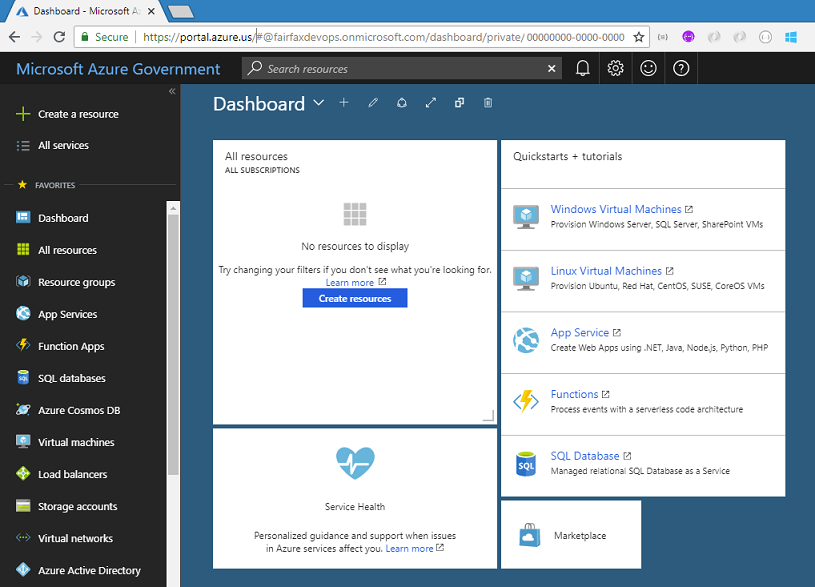
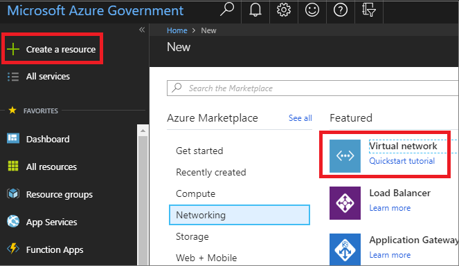
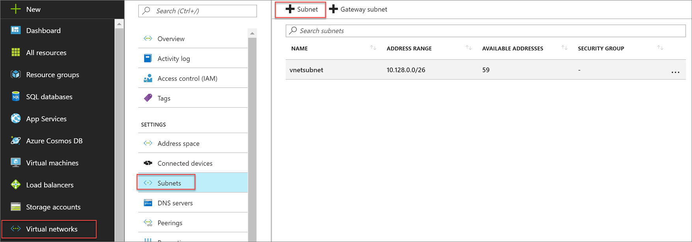
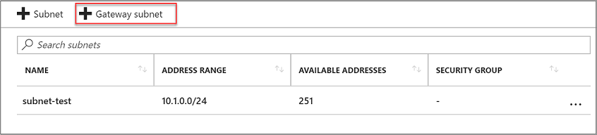
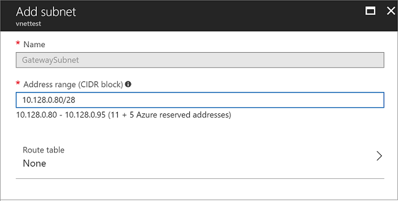
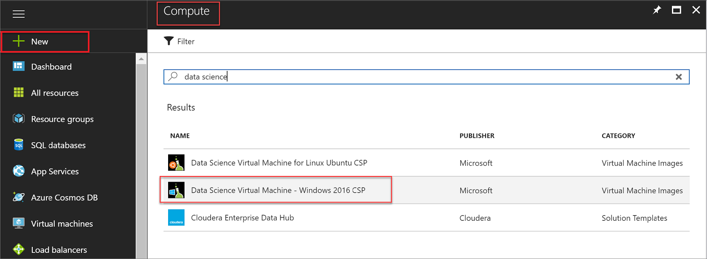
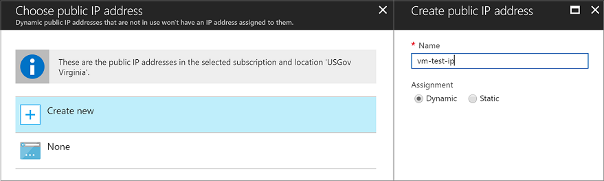

# Tutorial: Create Virtual Machines 

Microsoft Azure Government delivers a dedicated cloud with world-class security and compliance, enabling US government agencies and their partners to transform their workloads to the cloud. For example, your workload may include using virtual machines. Before provisioning a VM, you need to create and configure a virtual network for your environment. A virtual network enables resources to securely communicate with each other (within Azure and with servers accessing Azure).

This tutorial shows how to connect to Azure Government, create a virtual network and a virtual machine on this network in Azure Government cloud. The Azure Government marketplace provides a VM library, in this tutorial we use "Data Science Virtual Machine - Windows 2016 CSP". To learn more about Azure Virtual Machines and see end-to-end scenarios, see [Virtual Machines Documentation](../virtual-machines/index.yml).

In this tutorial, you learn how to:

> [!div class="checklist"]
> * Connect to Azure Government
> * Create a Virtual Network
> * Create a Virtual Machine

> [!VIDEO https://www.youtube.com/embed/cyucpJXKMRs]

If you don't have an Azure Government subscription, create a [free account](https://azure.microsoft.com/global-infrastructure/government/request/) before you begin.

## Prerequisites

* Review [Guidance for developers](documentation-government-developer-guide.md).  This article discusses Azure Government's unique URLs and endpoints for managing your environment. You must know about these endpoints in order to connect to Azure Government. 
* Review [Compare Azure Government and global Azure](compare-azure-government-global-azure.md) and click on a service of interest to see variations between Azure Government and global Azure.

## Sign in to Azure Government 

To connect, browse to the portal at [https://portal.azure.us](https://portal.azure.us) and sign in with your Azure Government credentials. 

Once you sign in, you should see "Microsoft Azure Government" in the upper left of the main navigation bar.

## Create a new Virtual Network
 
Click on **Create a resource** in the upper left corner on the portal and click on **Networking** > **Virtual Network**. 

In the **Create Virtual Network** dialog, use the following settings.

| Setting | Suggested Value | Description |
|-|-|-|
| Name| vnettest | Name of the Virtual Network. |
| Address space | 10.128.0.0/24 | The Virtual Network address range. |
| Subscription | Azure Government Free Trial | |
| Resource group|vnettestgroup|Create a new resource group.|
| Location | USGov Virginia |Choose one of the Azure Government locations.|
| Subnet | vnetsubnet||
| Address range |10.128.0.0/26|The subnet's address range in CIDR notation (for example, 192.168.1.0/24). It must be contained by the address space of the virtual network. The address range of a subnet, which is in use can't be edited.|

Navigate to **Virtual networks** from the menu on the left and click on the Virtual Network you created. Under **Settings** click **Subnets**.

On the top left-hand corner of the page choose **Subnet**. In the **Add subnet** dialog, use the following settings.

| Setting | Suggested Value | Description |
|-|-|-|
|Name|subnet-vnet|The name of the virtual network.|
|Address range|10.128.0.64/28|The subnet's address range in CIDR notation (for example, 192.168.1.0/24). It must be contained by the address space of the virtual network. The address range of a subnet, which is in use can't be edited.|
|Network security group|None||
|Route table|None||

Click **Ok**. When finished select **Gateway Subnet** from the top of the window. 

You will have address range shown below. Press **Ok**.  

  
At the end of this step, you should have the Virtual Network running on Azure Government.

## Create a new Virtual Machine

In the Azure Government portal, select **Create a resource** in the upper left corner and click on **Compute**. 

Search for "Data science" and then click on "Data Science Virtual Machine - Windows 2016 CSP". 

Scroll to the bottom of the window on the right and click **Create**. In the **Basics** dialog, use the following settings and click **Ok**.

| Setting | Suggested Value | Description |
|-|-|-|
|Name|vm-test|The name of the VM.|
|VM disk type|HDD|The type of physical hard disk type to use for the VM storage. This would be the same as installing HDD or SSD disks in your server on-premises.|
|User name |vmtest||
|Password|A password| Choose a password that you will remember!|
|Subscription|Your subscription||
|Resource group|vnettestgroup|Choose existing resource, same group as you created earlier.|
|Location|USGov Virginia|Our virtual network is hosted in Virginia, so this VM has to be in the US Virginia region as well.||

Open the Supported disk type dropdown box and select HDD. Click **View All** in the options at the top right corner. Scroll down the A4_v2 size and select it. Click on Select.

On the left hand of settings box click on **Network** and select the **vnettest** virtual network.

Click on **Subnet** and choose the subnet that you created. 

Click on **Public IP address** and then click **Ok**.

Click **Ok** to create the VM.

The VM will now be provisioned. It will take several minutes to complete, but afterwards you will be able to connect to the VM with RDP using the public IP address.

## Clean up resources

In the preceding steps, you created Azure resources in a resource group. If you don't expect to need these resources in the future, you can delete them by deleting the resource group.

From the left menu in the Azure Government portal, select Resource groups and then select **vnettestgroup**.

On the resource group page, make sure that the listed resources are the ones you want to delete.

Select **Delete**, type **vnettestgroup** in the text box, and then select **Delete**.

## Next steps

This tutorial showed you how to create Virtual Machines in Azure Government. To see the latest information and insights on building cloud solution for the Azure Government Cloud, check out Azure Government blog.

> [!div class="nextstepaction"]
> [Microsoft Azure Government Blog](https://blogs.msdn.microsoft.com/azuregov/).

