# Virtual Machines on Azure Government
This quickstart will help you get started using Virtual Machines on Azure Government. Using VMs with Azure Government is similar to using it with the Azure commercial platform, with a [few exceptions](documentation-government-compute.md#virtual-machines).

To learn more about Azure Virtual Machines, click [here](../virtual-machines/index.md).

## Part 1: Virtual Network

### Prerequisites
Before completing this section, you must have:

+ An active Azure Government subscription.
If you don't have an Azure Government subscription, create a [free account](https://azure.microsoft.com/overview/clouds/government/) before you begin.

### Create a new Virtual Network
1. Navigate to the [Azure Government portal](https://portal.azure.us) and login with your Azure Government credentials.
2. Click on the green + New in the upper left blade and click on Networking | Virtual Network. 

  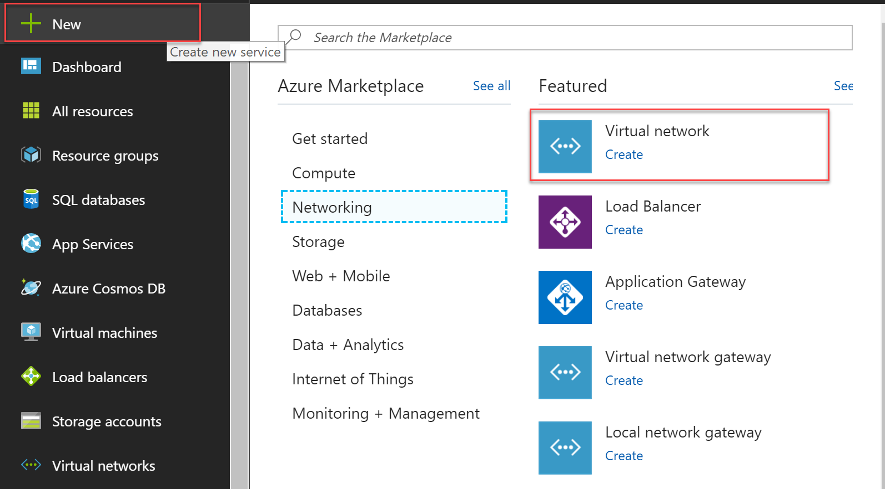
3. Make sure the deployment model is set to "Resource Manager" and click Create.
4. Fill out the following fields and click Create.

  >[!Note]
  > Your Subscription box will look different from below.
  >
  >

   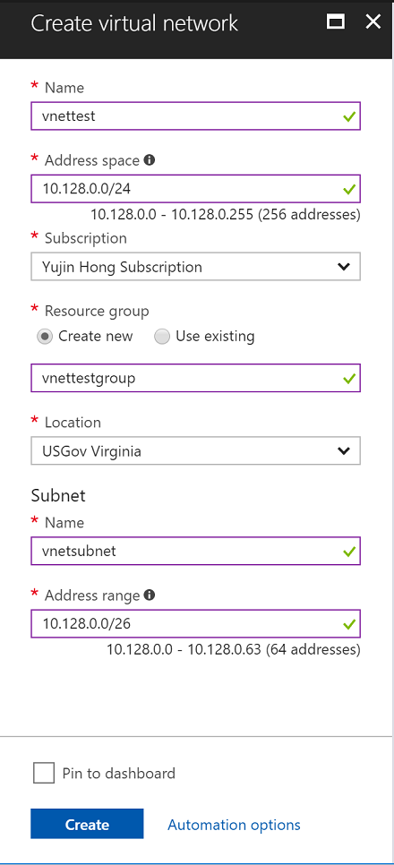
  
5. Navigate to "Virtual networks" from the menu on the left and click on the Virtual Network you just created. Under "Settings" click on "Subnets".

  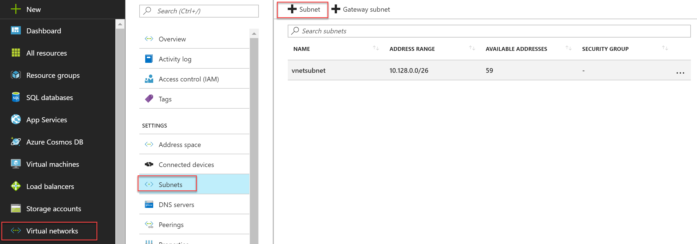
6. On the top left-hand corner of the page choose "Subnet" and fill out the following fields.

  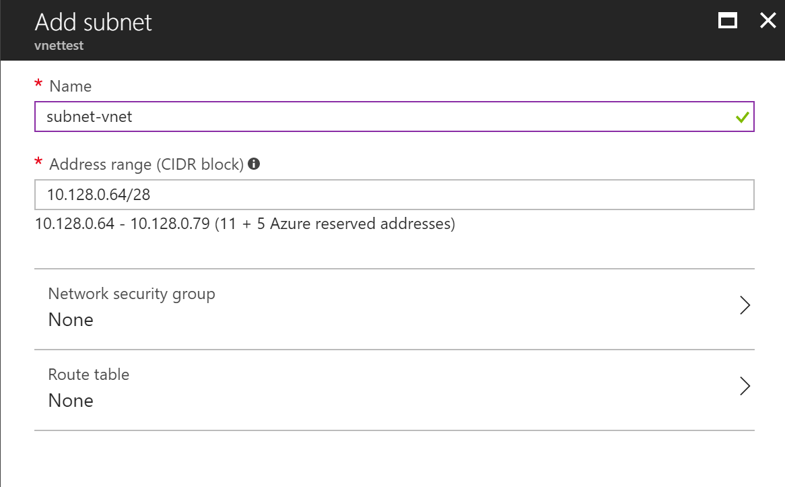
7. Click "Ok" when finished and navigate to the top left hand corner again. Click on "Gateway Subnet".

  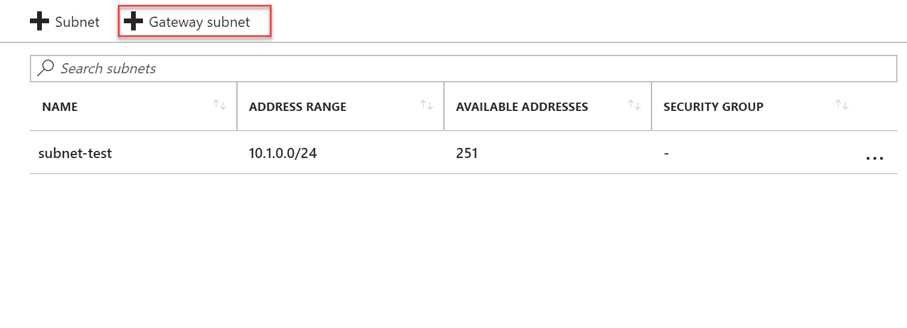
8. Enter the address range shown below ad click "Ok". You have now created a Virtual Network on Azure Government.

  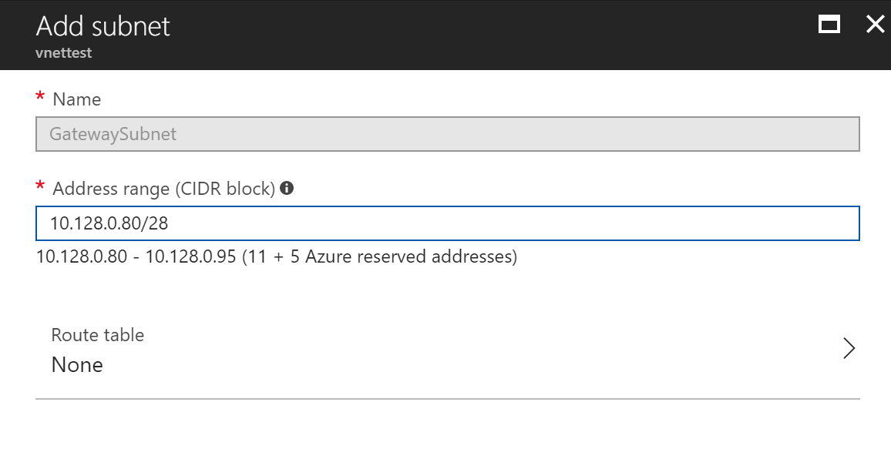
  
## Part 2: Virtual Machine

### Prerequisites
Before completing this section you must have:

+ An active Azure Government subscription.
If you don't have an Azure Government subscription, create a [free account](https://azure.microsoft.com/overview/clouds/government/) before you begin.
+ A Virtual Network running on Azure Government.
If you don't already have a Virtual Network, complete the "Create a new Virtual Network" section above.

### Create a new Virtual Machine

1. Navigate to the [Azure Government portal](https://portal.azure.us) and login with your Azure Government credentials.

2. Click on the green + New in the upper left corner and click on "Compute". 

3. Search for "Data science" and then click on "Data Science Virtual Machine - Windows 2016 CSP". 

  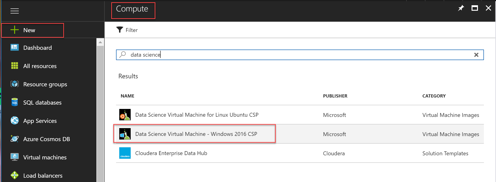
4. Click on "Create". Then fill out the fields and click "Ok".

  >[!Note]
  > Choose a password that you will remember!
  >
  >

  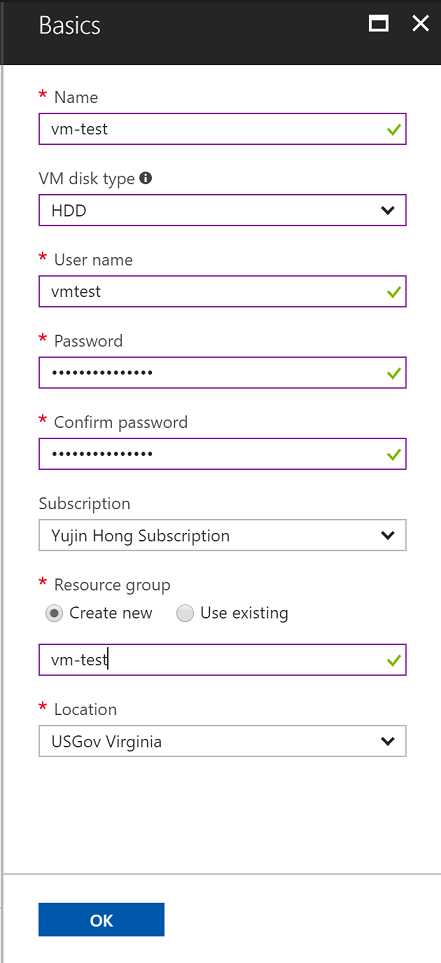
5. Open the Supported disk type dropdown box and select HDD. Click on "View All" in the options at the top right corner. Scroll down the A4_v2 size and select it. Click on Select.

  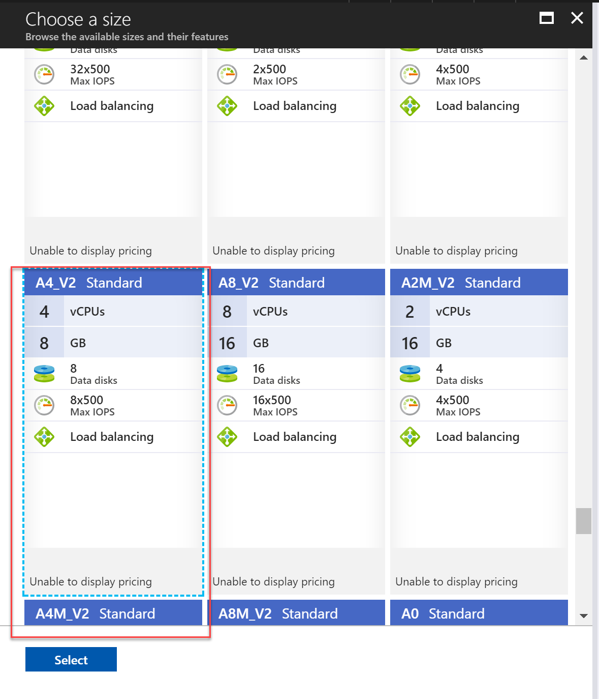
6. On the left hand "Settings" box click on "Network" and select your Virtual Network.

  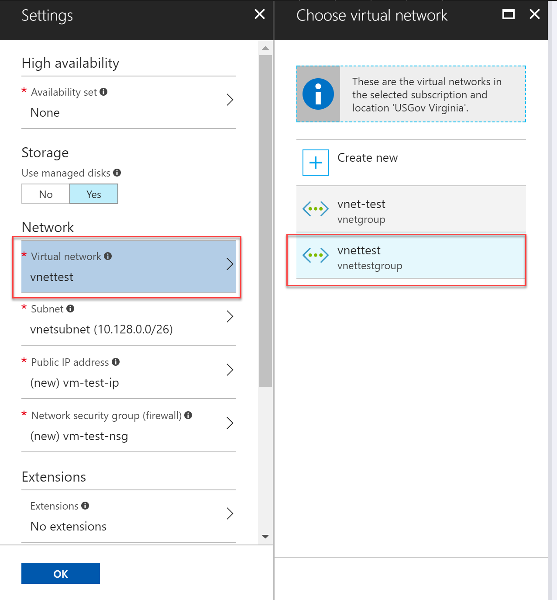
7. Click on "Subnet" and choose the subnet that you just created. 

  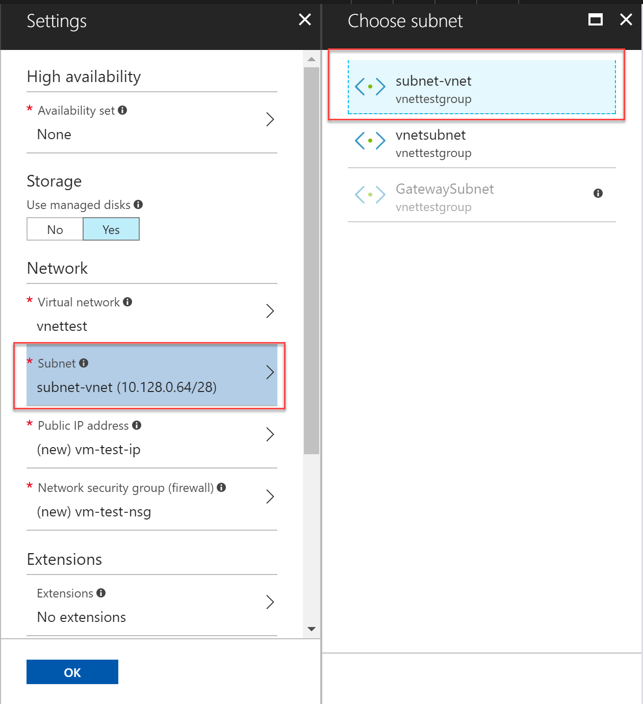
8. Click on "Public IP address" and then click on "Ok".

  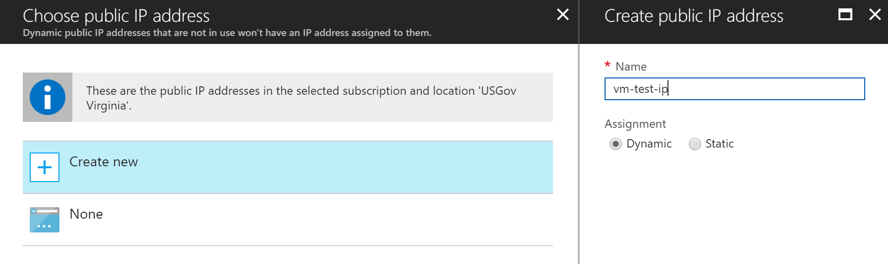
9. Now we can create the VM by clicking "Ok".

10. Once the validation step has completed click "Ok" and you should see the following screen.

  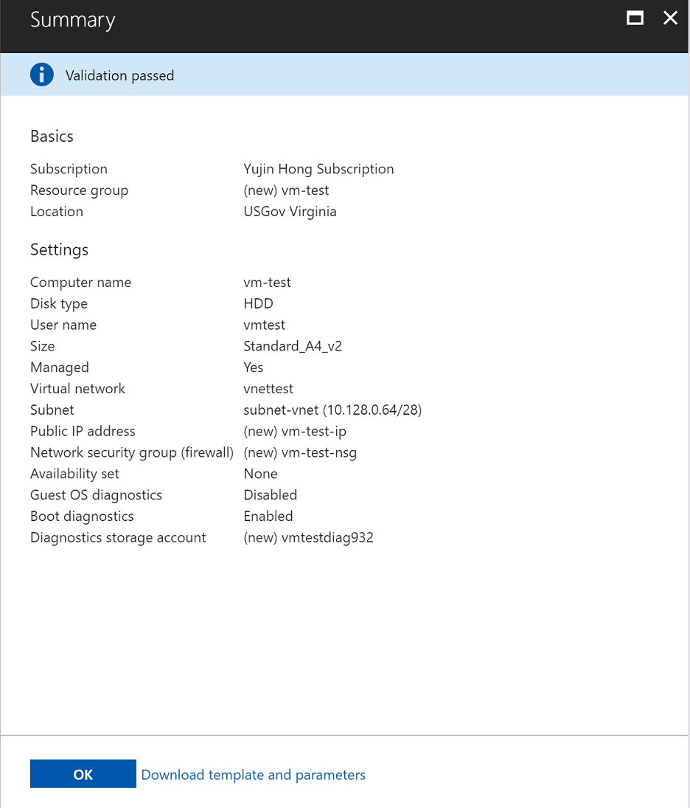
  
The VM will now be provisioned. It will take several minutes to complete, but afterwards you will be able to connect to the VM with RDP using the public IP address.
## Next steps
For supplemental information and updates, subscribe to the [Microsoft Azure Government Blog](https://blogs.msdn.microsoft.com/azuregov/).
