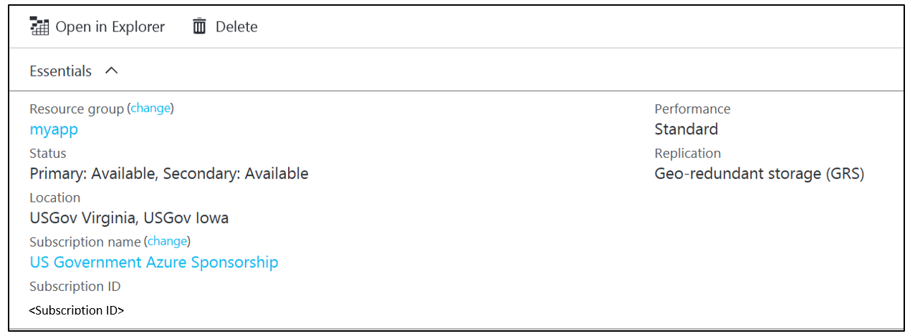

# Azure Government storage

## Azure Storage
Azure Storage is generally available in Azure Government. For a Quickstart that will help you get started with Storage in Azure Government, [click here](documentation-government-get-started-connect-to-storage.md). For general details on Azure Storage, see [Azure Storage public documentation](../storage/index.yml).

### Storage pairing in Azure Government
The following map shows the primary and secondary region pairings used for geo-redundant storage and read-access geo-redundant storage accounts in Azure Government.

> [!NOTE]
> The USGov Virginia secondary region is USGov Texas. Previously, USGov Virginia used USGov Iowa as a secondary region. Storage accounts with USGov Iowa as a secondary region are being migrated to USGov Texas as a secondary region.
>
>

### Checking the secondary region for a storage account
To view the current secondary region of your geo-redundant storage or read-access geo-redundant storage account through the Azure portal, select the storage account on the left. Select the name of the storage account to bring up the storage account overview that lists the primary and secondary regions.

### Storage service and feature availability by Azure Government region

| Service or feature | USGov Virginia | USGov Iowa | USGov Arizona | USGov Texas | USDoD East | USDoD Central| 
| --- | --- | --- | --- | --- | --- | --- |
| [Blob storage](../storage/common/storage-introduction.md#blob-storage) |GA |GA |GA |GA |GA |GA |
| [Azure Files](../storage/common/storage-introduction.md#azure-files) |GA |GA |GA |GA |GA |GA |
| [Table storage](../storage/common/storage-introduction.md#table-storage) |GA  |GA |GA |GA |GA |GA |
| [Queue storage](../storage/common/storage-introduction.md#queue-storage) |GA |GA |GA |GA |GA |GA |
| [Hot/cool blob storage](../storage/blobs/storage-blob-storage-tiers.md) |GA |- |GA |GA |- |- |
| [Locally redundant storage](../storage/common/storage-redundancy-lrs.md) |GA |GA |GA |GA |GA |GA |
| [Geo-redundant storage](../storage/common/storage-redundancy-grs.md) |GA |GA |GA |GA |GA |GA |
| [Read-access geo-redundant storage](../storage/common/storage-redundancy-grs.md#read-access-geo-redundant-storage) |GA |GA |GA |GA |GA |GA |
| [Zone-redundant storage](../storage/common/storage-redundancy-zrs.md) |- |GA |GA |GA |GA |GA |
| [Storage Service Encryption](../storage/common/storage-service-encryption.md) |GA |GA |GA |GA |GA |GA |
| [Premium Storage](../virtual-machines/windows/premium-storage.md) |GA |- |GA |GA |GA |GA | 
| [StorSimple](../storsimple/storsimple-ova-overview.md) |GA |GA |GA |GA |GA |GA |

### Variations
These are the URLs for storage accounts in Azure Government:

| Service type | Azure public | Azure Government |
| --- | --- | --- |
| Blob storage |*.blob.core.windows.net |*.blob.core.usgovcloudapi.net |
| Queue storage |*.queue.core.windows.net |*.queue.core.usgovcloudapi.net |
| Table storage |*.table.core.windows.net |*.table.core.usgovcloudapi.net |
| File storage |*.file.core.windows.net |*.file.core.usgovcloudapi.net | 

> [!NOTE]
> All your scripts and code need to account for the appropriate endpoints. See [Configure Azure Storage Connection Strings](../storage/common/storage-configure-connection-string.md). 
>
>

For more information on APIs, see the [Cloud Storage Account Constructor](/dotnet/api/microsoft.windowsazure.storage.cloudstorageaccount.-ctor).

The endpoint suffix to use in these overloads is *core.usgovcloudapi.net*.

> [!NOTE]
> If error 53 ("The network path was not found") is returned while you're [mounting the file share](../storage/storage-dotnet-how-to-use-files.md), a firewall might be blocking the outbound port. Try mounting the file share on VM that's in the same Azure subscription as the storage account.
>
>

When you're deploying the StorSimple Manager service, use the https://portal.azure.us/ URL for the Azure Government portal. For deployment instructions for StorSimple Virtual Array, see [StorSimple Virtual Array system requirements](../storsimple/storsimple-ova-system-requirements.md). For the StorSimple 8000 series, see [StorSimple software, high availability, and networking requirements](../storsimple/storsimple-system-requirements.md) and go to the **Deploy** section from the left menu. For more information on StorSimple, see the [StorSimple documentation](../storsimple/index.md).

### Considerations
The following information identifies the Azure Government boundary for Azure Storage:

| Regulated/controlled data permitted | Regulated/controlled data not permitted |
| --- | --- |
| Data that's entered, stored, and processed within an Azure Storage product can contain export-controlled data. This data includes static authenticators, such as passwords and smartcard PINs for access to Azure platform components. It also includes private keys of certificates used to manage Azure platform components. And it includes other security information/secrets, such as certificates, encryption keys, master keys, and storage keys stored in Azure services. |Azure Storage metadata cannot contain controlled data. This metadata includes all configuration data that's entered when you're creating and maintaining your storage product. Do not enter regulated/controlled data in the following fields: **Resource groups**, **Deployment names**, **Resource names**, **Resource tags**. |

## Azure Import/Export

Azure Import/Export is generally available for Azure Government. All Azure Government regions are supported.  To create Import/Export jobs, see the [Azure Import/Export documentation](../storage/storage-import-export-service.md).

### Variations

With Import/Export jobs for USGov Arizona or USGov Texas, the mailing address is for USGov Virginia. The data is loaded into selected storage accounts from the USGov Virginia region.

### Considerations

For DoD L5 data, use a DoD region storage account to ensure that data is loaded directly into the DoD regions. 

For all jobs, we recommend that you rotate your storage account keys after the job is complete to remove any access granted during the process. For more information, see [Managing storage accounts](../storage/common/storage-account-manage.md#access-keys).

| Regulated/controlled data permitted | Regulated/controlled data not permitted |
| --- | --- |
| Data copied to the media for transport and the keys used to encrypt that data. | Azure Import/Export metadata cannot contain controlled data. This metadata includes all configuration data that's entered when you're creating your Import/Export job and shipping information that's used to transport your media. Do not enter regulated/controlled data in the following fields:  **Job name**, **Carrier name**, **Tracking number**, **Description**, **Return information (Name, Address, Phone, E-Mail)**, **Export Blob URI**, **Drive list**, **Package list**, **Storage account name**, **Container name**. |

## Azure Backup Service
For detailed documentation on using the Azure Backup Service in Azure Government, [click here](documentation-government-services-backup.md). 
## Next steps
For supplemental information and updates, subscribe to the
<a href="https://blogs.msdn.microsoft.com/azuregov/">Microsoft Azure Government blog. </a>
