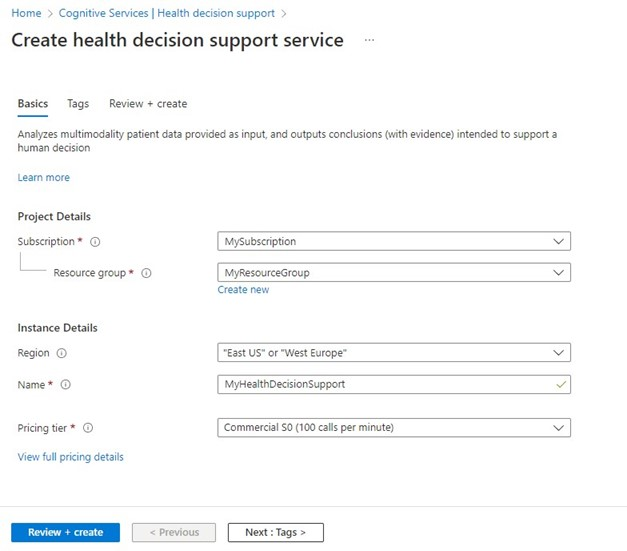
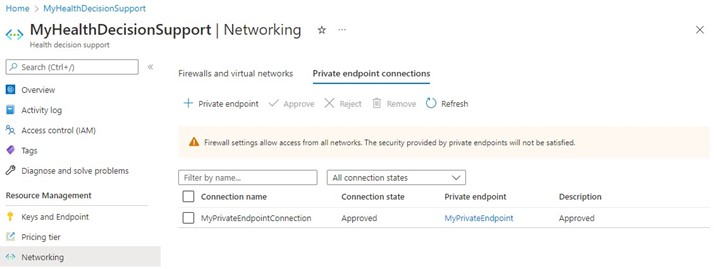

# Deploy Azure Health Insights using the Azure portal

In this quickstart, you'll learn how to deploy Azure Health Insights using the Azure portal.

Once deployment is complete, you can use the Azure portal to navigate to the newly created Azure Health Insights to see the details including your Service URL, Keys and manage your Access Controls.

## Prerequisite 
To deploy Azure Health Insight  you must register your subscription. Please let us know the Azure subscription ID you plan to use for Azure Health Insights so that we can register necessary feature flags on our end.

## Deploying Azure Health Insights

1. Sign in to the [Azure portal](https://portal.azure.com/).
2. Create a new **Resource group**
3. Add a new Cognitive Services account to your Resource group and search for **Azure Health Insights** 
 

    or Use this [link](https://ms.portal.azure.com/?microsoft_azure_marketplace_ItemHideKey=microsoft_azure_cognitiveservices_healthdecisionsupportpreview&feature.healthdecisionsupportpreview=true#create/Microsoft.CognitiveServicesHealthDecisionSupport) to create a new Cognitive Services account.

4. Enter the following values:
- Resource group: Select your resource group name.
- Region: Select an Azure location, such as West Europe.
- Name: Enter a Cognitive Services account name
- Pricing tier: select your pricing tier

     

5. Navigate to your newly created service

     

## Configuring private endpoints

With private endpoints, the network traffic between the clients on the VNet and the Cognitive Services account traverses over the VNet and a private link on the Microsoft backbone network, eliminating exposure from the public Internet.

Once the Cognitive Services account is successfully created, you can configure private endpoints from the Networking page under Resource Management. 

 

## Next steps

To get started using the Azure Health Insights, you can test one of the following models

>[!div class="nextstepaction"]
> [OncoPhenotype](oncophenotype/index.yml) 

>[!div class="nextstepaction"]
> [Trial Matcher](trial-matcher/index.yml) 