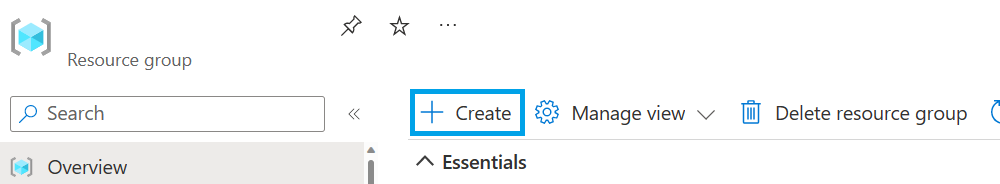
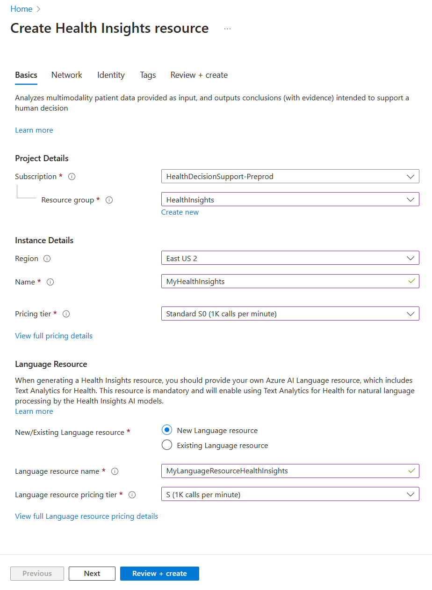
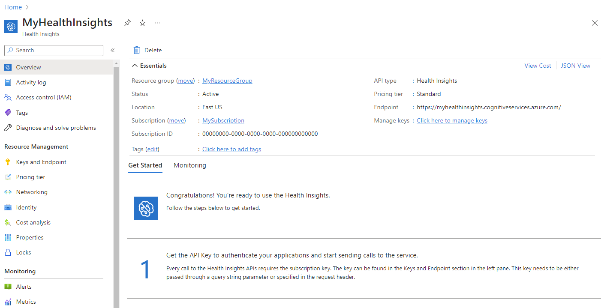
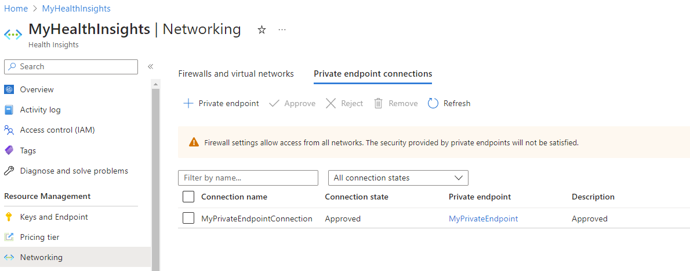

# Quickstart: Deploy Project Health Insights using the Azure portal

In this quickstart, you learn how to deploy Project Health Insights using the Azure portal.

Once deployment is complete, you can use the Azure portal to navigate to the newly created Project Health Insights, and retrieve the needed details  such your service URL, keys and manage your access controls.

## Deploy Project Health Insights

1. Sign in to the [Azure portal](https://portal.azure.com/).
2. Create a new **Resource group**.
3. Add a new Azure AI services account to your Resource group and search for **Health Insights**.

     

    or Use this [link](https://portal.azure.com/#create/Microsoft.CognitiveServicesHealthInsights) to create a new Azure AI services account.

4. Enter the following values:
    - **Resource group**: Select or create your Resource group name.
    - **Region**: Select an Azure location, such as West Europe.
    - **Name**: Enter an Azure AI services account name.
    - **Pricing tier**: Select your pricing tier.

     

5. Navigate to your newly created service.
    
     

## Configure private endpoints

With private endpoints, the network traffic between the clients on the VNet and the Azure AI services account run over the VNet and a private link on the Microsoft backbone network. This eliminates exposure from the public internet.

Once the Azure AI services account is successfully created, configure private endpoints from the Networking page under Resource Management. 

 

## Next steps

To get started using Project Health Insights, get started with one of the following models:

>[!div class="nextstepaction"]
> [Onco Phenotype](oncophenotype/index.yml) 

>[!div class="nextstepaction"]
> [Trial Matcher](trial-matcher/index.yml) 
