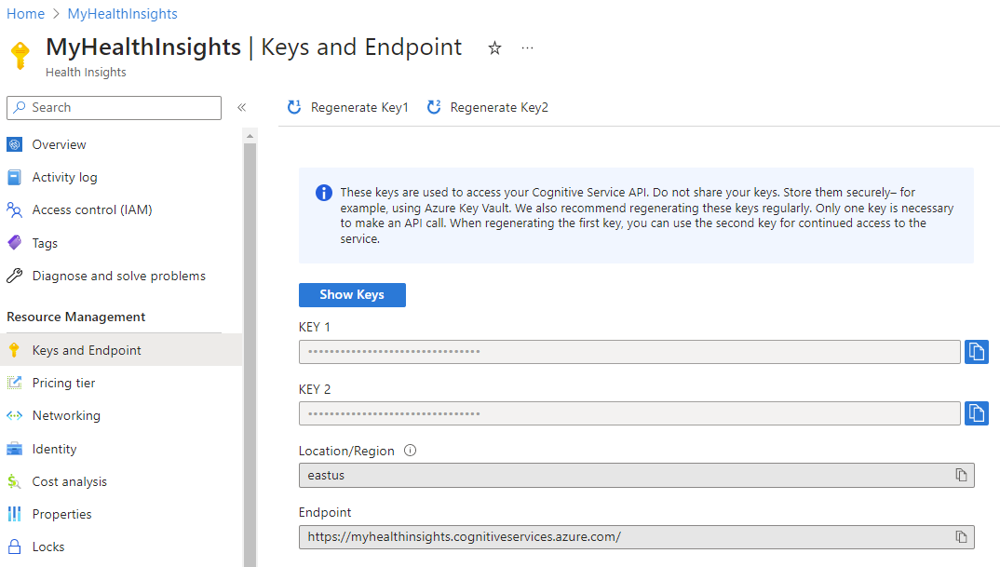

# Quickstart: Use the Onco Phenotype model

This quickstart provides an overview on how to use the Onco Phenotype.

## Prerequisites
To use the Onco Phenotype model, you must have an Azure AI services account created. If you haven't already created an Azure AI services account, see [Deploy Project Health Insights using the Azure portal.](../deploy-portal.md)

Once deployment is complete, you use the Azure portal to navigate to the newly created Azure AI services account to see the details, including your Service URL. The Service URL to access your service is: https://```YOUR-NAME```.cognitiveservices.azure.com/. 


## Example request and results

To send an API request, you need your Azure AI services account endpoint and key. You can also find a full view on the [request parameters here](../request-info.md)

 

> [!IMPORTANT]
> Prediction is performed upon receipt of the API request and the results will be returned asynchronously. The API results are available for 24 hours from the time the request was ingested, and is indicated in the response. After this time period, the results are purged and are no longer available for retrieval.

## Example request

### Starting with a request that contains a case

You can use the data from this example, to test your first request to the Onco Phenotype model.

```url
POST http://{cognitive-services-account-endpoint}/healthinsights/oncophenotype/jobs?api-version=2023-03-01-preview
Content-Type: application/json
Ocp-Apim-Subscription-Key: {cognitive-services-account-key}
```
```json
{
  "configuration": {
    "checkForCancerCase": true,
    "includeEvidence": false
  },
  "patients": [
    {
      "id": "patient1",
      "data": [
        {
          "kind": "note",
          "clinicalType": "pathology",
          "id": "document1",
          "language": "en",
          "createdDateTime": "2022-01-01T00:00:00",
          "content": {
            "sourceType": "inline",
            "value": "Laterality:  Left \n   Tumor type present:  Invasive duct carcinoma; duct carcinoma in situ \n   Tumor site:  Upper inner quadrant \n   Invasive carcinoma \n   Histologic type:  Ductal \n   Size of invasive component:  0.9 cm \n   Histologic Grade - Nottingham combined histologic score:  1 out of 3 \n   In situ carcinoma (DCIS) \n   Histologic type of DCIS:  Cribriform and solid \n   Necrosis in DCIS:  Yes \n   DCIS component of invasive carcinoma:  Extensive \n"
          }
        }
      ]
    }
  ]
}
```
### Evaluating a response that contains a case

You get the status of the job by sending a request to the Onco Phenotype model and adding the job ID from the initial request in the URL, as seen in the code snippet:

```url 
GET http://{cognitive-services-account-endpoint}/healthinsights/oncophenotype/jobs/385903b2-ab21-4f9e-a011-43b01f78f04e?api-version=2023-03-01-preview
```

```json
{
  "results": {
    "patients": [
      {
        "id": "patient1",
        "inferences": [
          {
            "kind": "tumorSite",
            "value": "C50.2",
            "description": "BREAST",
            "confidenceScore": 0.9214
          },
          {
            "kind": "histology",
            "value": "8500",
            "confidenceScore": 0.9973
          },
          {
            "kind": "clinicalStageT",
            "value": "T1",
            "confidenceScore": 0.9956
          },
          {
            "kind": "clinicalStageN",
            "value": "N0",
            "confidenceScore": 0.9931
          },
          {
            "kind": "clinicalStageM",
            "value": "None",
            "confidenceScore": 0.5217
          },
          {
            "kind": "pathologicStageT",
            "value": "T1",
            "confidenceScore": 0.9477
          },
          {
            "kind": "pathologicStageN",
            "value": "N0",
            "confidenceScore": 0.7927
          },
          {
            "kind": "pathologicStageM",
            "value": "M0",
            "confidenceScore": 0.9208
          }
        ]
      }
    ],
    "modelVersion": "2023-03-01-preview"
  },
  "jobId": "385903b2-ab21-4f9e-a011-43b01f78f04e",
  "createdDateTime": "2023-03-08T17:02:46Z",
  "expirationDateTime": "2023-03-08T17:19:26Z",
  "lastUpdateDateTime": "2023-03-08T17:02:53Z",
  "status": "succeeded"
}
```

More information on the [response information can be found here](../response-info.md)

## Request validation

Every request has required and optional fields that should be provided to the Onco Phenotype model.
When you're sending data to the model, make sure that you take the following properties into account:

Within a request:
- ```patients``` should be set
- ```patients``` should contain at least one entry
- ```id``` in patients entries should be unique

For each patient:
- ```data``` should be set
- ```data``` should contain at least one document of clinical type ```pathology```
- ```id```  in data entries should be unique

For each clinical document within a patient:
- ```createdDateTime``` should be set
- if set, ```language``` should be ```en``` (default is ```en``` if not set)
- ```documentType``` should be set to ```Note```
- ```clinicalType``` should be set to one of ```imaging```, ```pathology```, ```procedure```, ```progress```
- content ```sourceType``` should be set to ```inline```

## Data limits

| **Limit**  | **Value**  |
| ---------- | ----------- |
| Maximum # patients per request  | 1  |
| Maximum # characters per patient | 50,000 for data[i].content.value all combined |


## Next steps

To get better insights into the request and responses, you can read more on following pages:

>[!div class="nextstepaction"]
> [Model configuration](model-configuration.md) 

>[!div class="nextstepaction"]
> [Inference information](inferences.md) 
