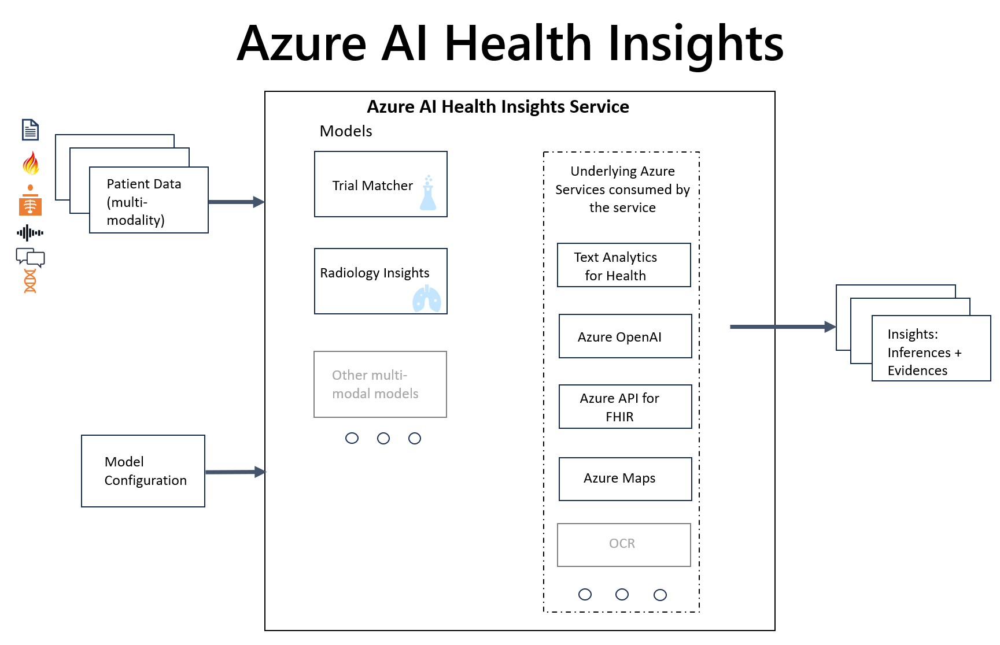

# What is Azure Health Insights?

The Azure Health Insights is an Azure Applied AI Service built with the Azure Cognitive Services Framework, that uses multiple Cognitive Services, Healthcare API services and other Azure resources. 

The Azure Health Insights provides an API that that serves insight models, specific for Health & Life Sciences, that performs analysis and provide inferences to be used by a human. 

The models can receive input in different modalities, from one or more patients, and return an insight inferences as a result, with potential reasoning. 

> [!IMPORTANT] 
> Azure Health Insights is a capability provided “AS IS” and “WITH ALL FAULTS.” Azure Health Insights is not intended or made available for use as a medical device, clinical support, diagnostic tool, or other technology intended to be used in the diagnosis, cure, mitigation, treatment, or prevention of disease or other conditions, and no license or right is granted by Microsoft to use this capability for such purposes. This capability is not designed or intended to be implemented or deployed as a substitute for professional medical advice or healthcare opinion, diagnosis, treatment, or the clinical judgment of a healthcare professional, and should not be used as such. The customer is solely responsible for any use of Azure Health Insights. 

## Why use the Azure Health Insights?

Health and Life Sciences organizations have multiple high-value business problems that require clinical insights inferences that are based on clinical data. 
Azure Health Insights is an Applied AI service that provides prebuilt models that assist on solving those business problems, reducing time to value.

## Available Decision Support Models

There are currently two models available in Azure Health Insights: 

The [Trial Matcher](./trial-matcher/overview.md) model receives patients data and clinical trials protocols, and provides relevant clinical trials based on eligibility criteria.

The [OncoPhenotye](./oncophenotype/overview.md) receives clinical records of oncology patients and outputs cancer staging, such as  **clinical stage TNM** categories and **pathologic stage TNM categories** as well as **tumor site**, **histology**.

## Architecture

 

## Next steps

To find more info on the models, you can read further via the next steps below.

>[!div class="nextstepaction"]
> [OncoPhenoType](oncophenotype/overview.md) 

>[!div class="nextstepaction"]
> [Trial Matcher](trial-matcher//overview.md) 
