# Transparency Note for Radiology Insights

## What is a Transparency Note?

An AI system includes technology and the people who use it are affected by it, and the environment in which it's deployed. Creating a system that is fit for its intended purpose requires an understanding of how the technology works, what its capabilities and limitations are, and how to achieve the best performance. Microsoft’s Transparency Notes are intended to help you understand how our AI technology works, the choices system owners can make that influence system performance and behavior, and the importance of thinking about the whole system, including the technology, the people, and the environment. You can use Transparency Notes when developing or deploying your own system, or share them with the people who will use or be affected by your system.
Microsoft’s Transparency Notes are part of a broader effort at Microsoft to put our AI Principles into practice. To find out more, see the Microsoft AI principles.

## The basics of Radiology Insights

### Introduction

**Radiology Insights** (RI) is a model that aims to provide quality checks as feedback on errors and inconsistencies (mismatches) and  helps identify and communicate critical findings using the full context of the report. Follow-up recommendations and clinical findings with measurements (sizes) documented by the radiologist are also identified.

- Radiology Insights is a built-in AI software model, delivered within Project Health Insights Azure AI service
- Radiology Insights doesn't provide external references. As a Health Insights model, Radiology Insights provides inferences to the provided input, to be used as reference for profound understanding of the conclusions of the model.

The Radiology Insights feature of Azure Health Insights uses natural language processing techniques to process unstructured medical radiology documents. It adds several types of inferences that help the user to effectively monitor, understand, and improve financial and clinical outcomes in a radiology workflow context.
The types of inferences currently supported by the system are: AgeMismatch, SexMismatch, LateralityDiscrepancy, CompleteOrderDiscrepancy, LimitedOrderDiscrepancy, Finding, CriticalResult, FollowupRecommendation, RadiologyProcedure, Communication.

These inferences can be used to both to support clinical analytics or to provide real time assistance during the document creation process.
- RI enables slice and dice of the radiology workflow data and create insights that matter, leading to actionable information.
- RI enables analysis of the past and improves the future by generating meaningful insights that reveal strengths and pinpoint areas needing intervention.        
- RI enables creation of quality checks and automated, in‑line alerts for mismatches and possible critical findings.
- RI improves follow‑up recommendation consistency with AI‑driven, automated guidance support, and quality checks that drive evidence‑based clinical decisions.

Radiology Insights can receive unstructured text in English as part of its current offering, and uses Text Analytics for Health (TA4H) for Named Entity Recognition (NER), extraction of relations between identified entities, to surface assertions such as negation and conditionality, and to link detected entities to common vocabularies.

### Key terms

|Term | Definition                                                                |
|-----|---------------------------------------------------------------------------|
|Document| The input of the RI model is a Radiology Clinical document, which next to the narrative information also contains meta-data containing patient info and procedure order specifications.|
|Modality| Modality refers to the specific type of imaging technique or technology used to capture medical images of the body. Each modality employs different physical principles (such as X-rays, sound waves, or magnetic fields) to generate images that assist in diagnosis and treatment.|
|Inference| The output of the RI model is a list of inferences or annotations added to the document processed.|
|AgeMismatch| Annotation triggered when there's a discrepancy between age information in meta-data and narrative text.|
|SexMismatch| Annotation triggered when there's a discrepancy between sex information in meta-data and narrative text (includes patient references, sex specific findings, and sex specific body parts).|
|LateralityDiscrepancy| Annotation triggered when there's a discrepancy between laterality information in meta-data and narrative text or between findings and impression section in report text.
|CompleteOrderDiscrepancy| Annotation triggered when report text doesn't contain all relevant body parts according to information in the meta-data that a complete study is ordered.
|LimitedOrderDiscrepancy| Annotation triggered when limited selection of body parts, according to the procedure order present in meta-data, should be checked, but report text includes all relevant body parts.
|Finding| Annotation that identifies and highlights an assembly of clinical information pertaining to a, clinically relevant, notion found in the report text.
|CriticalResult| Annotation that identifies and highlights findings in report text that should be communicated within a certain time limit according to regulatory compliance.
|FollowupRecommendation| Annotation that identifies and highlights one or more recommendations in the report text and provides a normalization of each recommendation to a set of structured data fields.
|RadiologyProcedure| Normalization of procedure order information present in meta-data using Loinc/Radlex codes.
|Communication| Annotation that identifies and highlights when noted in report text that the findings are strict or nonstrictly communicated with the recipient.
|Clinical Guidance| Clinical guidance can be considered as a decision tree, providing a structured approach of evidence-based guidelines (ACR Guidelines1 and Fleischner Society Guidelines2) to help healthcare providers make the most appropriate imaging or treatment decisions for clinical conditions. The model surfaces the key information from the documentation to feed the decision tree, as such to propose one or more candidate recommendations.|
|Quality Measures| The model evaluates if quality measure performance was met or not when executing a medical procedure. The quality measure performance is explained by surfacing evidence from the document and/or lack of evidence from the document.|
|Risk Scoring and Assessment| Risk scoring and assessment systems are used in medical imaging and diagnostics to standardize the evaluation and reporting of clinical findings. The model surfaces key scoring and assessment risks with values the radiologist dictates in a radiology note or report.|

## Capabilities

### System behavior

The Radiology Insight adds several types of inferences/annotations to the original radiology clinical document. A document can trigger one or more annotations. Several instances of the same annotation in one document are possible.

- AgeMismatch
- SexMismatch
- LateralityDiscrepancy
- CompleteOrderDiscrepancy
- LimitedOrderDiscrepancy
- Finding
- CriticalResult
- FollowupRecommendation
- RadiologyProcedure
- Communication
- Clinical Guidance
- Scoring and Assessment
- Quality Measures

Example of a Clinical Radiology document with inferences:

[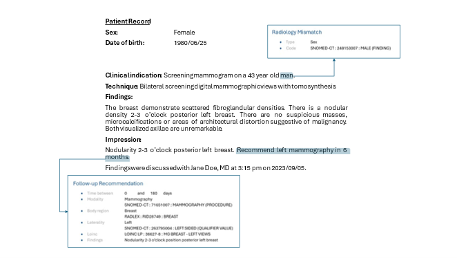](../media/radiology-insights/radiology-with-inferences.png#lightbox)

### Functional description of the inferences in scope and examples

**Age Mismatch**

Age mismatches are identified based on comparison of available Patient age information within Patient’s demographic meta-data and the report text. Conflicting age information are tagged in the text.

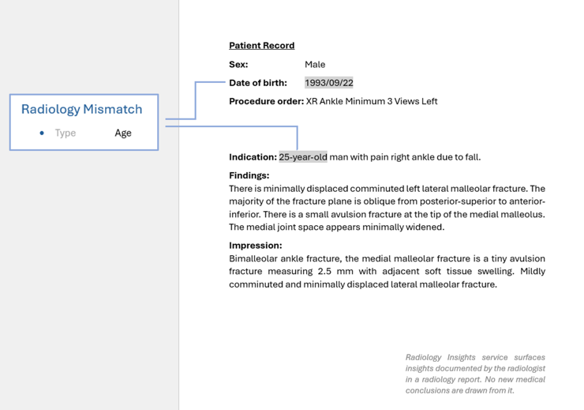](../media/radiology-insights/radiology-age-mismatch.png#lightbox)

**Sex Mismatch**

Sex mismatches identification is based on a comparison of the patient sex information within patient’s demographic meta-data on the one hand and on the other hand patient references, sex specific findings, and sex specific body parts in the text.
Conflicting sex information are tagged in the text.

[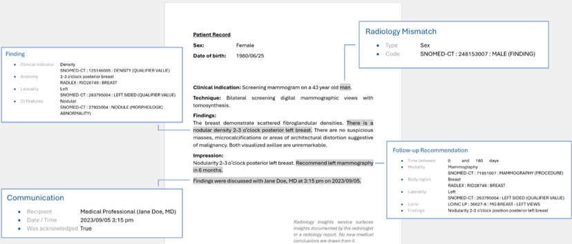](../media/radiology-insights/radiology-sex-mismatch.png#lightbox)

**Laterality Discrepancy**

A laterality, defined as "Left" (Lt, lft) and "Right" (rt, rght), along with an Anatomy (body parts) in the Procedure Description of the meta-data Procedure Order is used to create Laterality mismatches in the report.
No Mismatches on past content.
If only Laterality and no Anatomy is available in the Procedure Description, all opposite laterality in the text is tagged. For example: "left views" in Procedure Description will list all "right" words in the report text.

[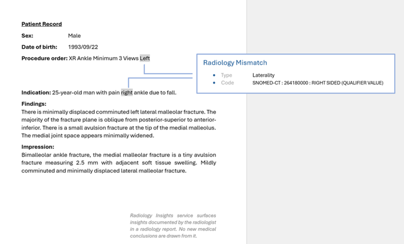](../media/radiology-insights/radiology-laterality-mismatch.png#lightbox)

**CompleteOrder Discrepancy**

Completeness mismatches can be made if the ordered procedure is an ultrasound for the ABDOMEN, RETROPERITONEAL, PELVIS, or US BREAST.
A completeness mismatch is made if either the order is complete and the text isn't, or vice versa.

[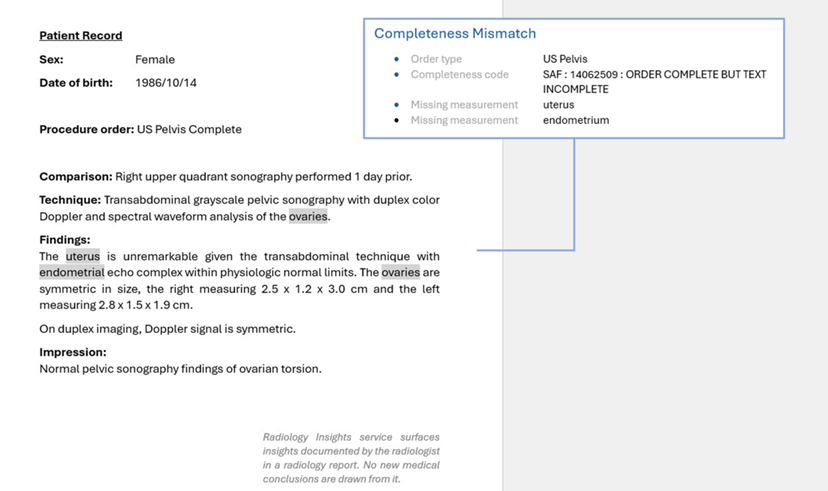](../media/radiology-insights/radiology-completeness-mismatch.png#lightbox)

**LimitedOrder Discrepancy**

Completeness mismatches can be made if the ordered procedure is an ultrasound for the ABDOMEN, RETROPERITONEAL, PELVIS, or US BREAST.
A completeness mismatch is made if either the order is complete and the text isn't, or vice versa.

[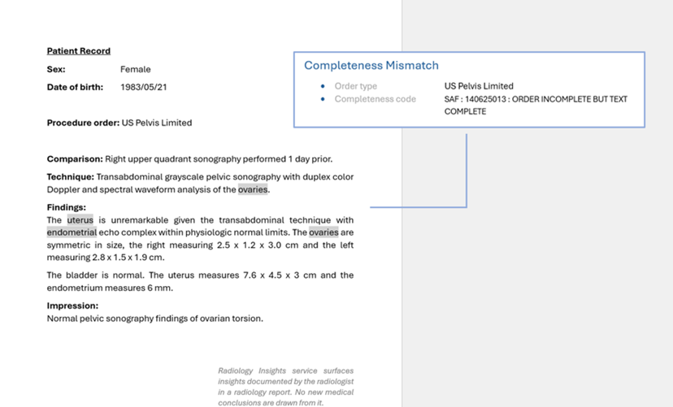](../media/radiology-insights/radiology-completeness-limited-mismatch.png#lightbox)

**Finding**

A  Finding is an NLU-based assembly of clinical information pertaining to a, clinically relevant, notion found in medical records. It's created as such that it's application-independent.
A Finding inference consists out of different fields, all containing pieces to assemble a complete overview of what the Finding is.  
A Finding can consist out of the following fields:
Clinical Indicator, AnatomyLateralityInfo about Size, Acuity, Severity, Cause, Status, Multiple – check, RegionFeatures, Timing

**Critical Result**

Identifies and highlights potential critical results dictated in a report.
Identifies and highlights potential ACR Actionable Findings dictated in a report.
Only Identifies Critical Result in the report text (not in meta-data)
The terms are based on Mass Coalition for the Prevention of Medical Errors: 
<http://www.macoalition.org/Initiatives/docs/CTRstarterSet.xls>.

[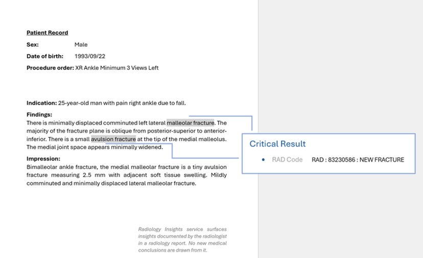](../media/radiology-insights/radiology-critical-result.png#lightbox)

**FollowupRecommendation**

This inference surfaces a potential visit that needs to be scheduled. Each recommendation contains one modality and one body part. In addition, it contains a time, a laterality, one or multiple findings and an indication that a conditional phrase is present (true or false).

Cfr Sex Mismatch example

**RadiologyProcedure**

Radiology Insights extracts information such as modality, body part, laterality, view, and contrast from the procedure order. Ordered procedures are normalized using the Loinc codes using the LOINC/RSNA Radiology Playbook that is developed and maintained by the LOINC/RadLex Committee: 
<http://playbook.radlex.org/playbook/SearchRadlexAction>.

[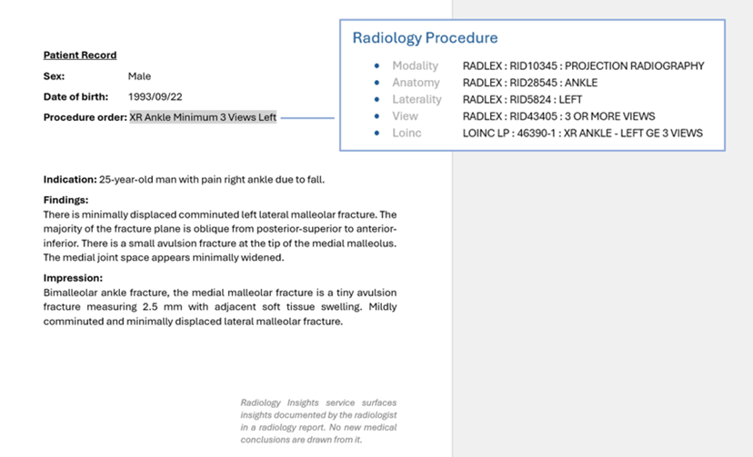](../media/radiology-insights/radiology-procedure.png#lightbox)

**Communication**

RI captures language in the text, typically a verb indicating communication in combination with a proper name (typical First and Last Name) or a reference to a clinician or nurse. There can be several such recipients.
Communication to nonmedical staff (secretary, clerks, etc.) isn't tagged as communication unless the proper name of this person is mentioned. 
Language identified as past communication (for example in history sections) or future communication (for example "will be communicated") isn't tagged as communication.

Cfr SexMismatch example

**Clinical Guidance**

Clinical Guidance can be considered as a decision tree, providing a structured approach of evidence-based guidelines (ACR Guidelines1-4 and Fleischner Society Guidelines5) to help radiologists make the most appropriate decisions for future actions, such as selecting a specific imaging study and its timing.

The model extracts clinical finding information from the documentation to retrieve the required key information to feed the decision tree. Completion of the tree nodes can result in a proposal of one or more candidate recommendations. Multiple clinical finding instances can trigger the same clinical guidance. In such cases, clinical findings are ranked from high to low according to the amount of required key information present.

The model proposes candidate recommendations derived from the guidance tree logic for the guideline it identified from the finding in the report. These recommendations are standardized in terms of modality, anatomy, laterality, and timeframe. If the found tree nodes lead to multiple procedures, the model will provide separate candidate recommendations for each procedure (e.g., recommendations for CT, PET CT, or tissue sampling). The model will also provide missing information regarding the clinical finding in case no candidate recommendations could be proposed by the model. If the radiologist chooses to document these missing details, additional recommendations will be provided by the model.

Besides candidate recommendations, ACR clinical guidelines can also suggest a score or stage indicating the severity or progression of certain clinical conditions. As example each of the required key information of the Thyroid Imaging Report and Data System (TI-RADS) guideline5 is assigned to a score, and the total score determines the category. Based on the category, candidate recommendations can be suggested.

In the findings section of the sample below:

"An 8 mm nodule in the right upper lobe, image #15 series 4. New posterior right upper lobe nodule measuring 6 mm, image #28 series 4. New 1.2-cm pulmonary nodule, right upper lobe, image #33 series 4."

The Radiology Insight model extracts from this information guidance values present in the document and surfaces candidate recommendations based on the clinical guideline for Pulmonary Nodule (Fleishner Society Guideline5). In this case the model will suggest different recommendations for the same lung structure using different modalities: Computerized Axial Tomography, Positron Emission Tomography, and Imaging Guided Biopsy.  

Additionally, the sample documents in the impression section: 

"Previously identified small pulmonary nodules in the right upper lobe have resolved, but multiple new small nodules are scattered throughout both lungs."

The observation in the right upper lobe will also be surfaced by the model as present guidance values. However, the model will also surface guidance values that are missed and not documented in the report. If these values are documented, the model could propose other candidate recommendations according to the clinical guideline for Pulmonary Nodule. This allows the radiologist to propose a candidate recommendation and/or enhance the documentation to include additional recommendations as part of the options.  

[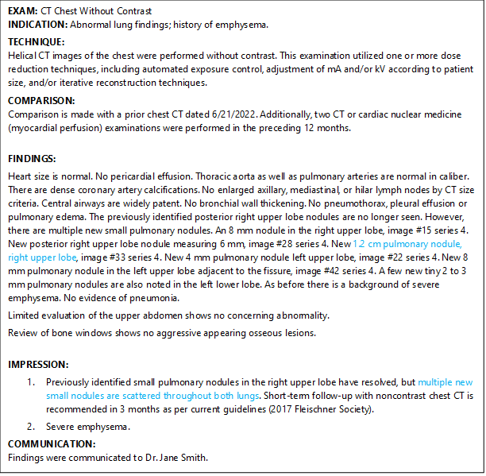](../media/radiology-insights/radiology-clinical-guidance.png#lightbox)

  
From the finding in the findings section (blue), the model proposes two recommendation candidates: Positron Emission Tomography and Imaging Guided Biopsy, both of the Lung. The guidance values surfaced for this finding are for the Lobe, Right Upper Lobe and for the Size, 12 mm. From the finding in the Impression section, the guidance value for the Lobe is returned, but the Size is missing and hence returned as a missing guidance value. No recommendations candidates are proposed.    

***Table ACR Clinical Guidelines supported by the model***

|Clinical Guidance|	Code|
|-----|---------------------------------------------------------------------------|
|ADNEXAL MASS|	SNAF:  445039006: MASS OF UTERINE ADNEXA (FINDING)|
|ADRENAL NODULE|	SNAF: 237783006: MASS OF ADRENAL GLAND (FINDING)|
|HEPATIC TRAUMA|	SNAF: 39400004: INJURY OF LIVER (DISORDER)|
|LIVER LESION|	SNAF: 300331000: LESION OF LIVER (FINDING)|
|LUNG CANCER STAGING|	SNAF: 258319005: LUNG INVOLVEMENT STAGES (TUMOR STAGING)|
|PANCREATIC INJURY GRADING|	SNAF: 61823004: INJURY OF PANCREAS (DISORDER)|
|RENAL LESION|	SNAF: 79131000119100: KIDNEY LESION (FINDING)|
|SPLENIC INJURY GRADING|	SNAF: 23589004: INJURY OF SPLEEN (DISORDER)|
|RENAL INJURY GRADING|	SNAF: 40095003: INJURY OF KIDNEY (DISORDER)|
|THYROID NODULE|	SNAF: 237495005: THYROID NODULE (DISORDER)|
|ABDOMINAL AORTIC ANEURYSM|	SNAF: 233985008: ABDOMINAL AORTIC ANEURYSM (DISORDER)|
|PREGNANCY LOCATION|	SNAF: 858901000000108: PREGNANCY OF UNKNOWN LOCATION (DISORDER)|
|PREGNANCY VIABILITY INITIAL|	SNAF: 289208006: FINDING OF VIABILITY OF PREGNANCY (FINDING)|
|RECTAL CANCER STAGING|	SNAF: 254310002: TUMOR-NODE-METASTASIS (TNM) COLON AND RECTUM TUMOR STAGING (TUMOR STAGING)|
|PREGNANCY VIABILITY FOLLOW-UP|	SNAF: 364327007: VIABILITY OF PREGNANCY (OBSERVABLE ENTITY)|
|ADNEXAL CYST|	SNAF: 97171000119100: CYST OF UTERINE ADNEXA (DISORDER)|
|PANCREATIC CYST|	SNAF: 31258000: CYST OF PANCREAS (DISORDER)|
|GERMINAL MATRIX HEMORRHAGE|	SNAF: 276650005: PERINATAL SUBEPENDYMAL HEMORRHAGE (DISORDER)|
|GALLBLADDER AND BILIARY TRACT|	SNAF: 300346007: LESION OF GALLBLADDER (FINDING)|
|PITUITARY|	SNAF: 399244003: DISORDER OF PITUITARY GLAND (DISORDER)|
|O-RADS|	SNAF: 289840004: LESION OF OVARY (FINDING)|
|PULMONARY NODULE|	RADLEX: RID50149: PULMONARY NODULE|
|TI-RADS|	RADLEX: RID50503: TI-RADS ASSESSMENT|
|LUNG-RADS|	RADLEX: RID50134: LUNG-RADS ASSESSMENT|

**Quality Measures**

Quality Measures play a crucial role in advancing the quality of healthcare by providing frameworks for quality measurements, quality reporting, and continuous improvement. The Quality Measures7 supported by the model are listed in tables below. [MIPS Qualified Clinical Data Registry | American College of Radiology](https://www.acr.org/Practice-Management-Quality-Informatics/Registries/Qualified-Clinical-Data-Registry).

The model captures Quality Measure criteria documented in the report and determines whether the documentation is complete by checking if all criteria necessary to meet quality standards are included.

In case the documentation is compliant with required Quality Measure criteria, then the Quality Measure performance is "met". In cases where the documentation doesn't comply with the criteria, the performance is "not met". The model will label a Quality Measure as an "exception" in case the documentation has findings that don't require the Quality Measure performance to be met (for example, a patient is allergic to Chlorhexidine, a criteria to meet quality measures for CVC insert).

In the sample below, a CVC or Central Venous Catheter needs to be inserted into a patient. It's crucial in clinical settings to avoid serious complications such as bloodstream infections. Therefore, the procedure must adhere to CVC insertion standards, proper hand hygiene using conventional techniques, and maximal sterile barrier practices such as the use of sterile gloves, a cap, a mask, a sterile gown, and a sterile full-body drape. Additionally, the procedure requires proper skin preparation using Chlorhexidine and the application of sterile ultrasound techniques, including the use of ultrasound, sterile gel, and a sterile probe cover. However, in this sample, the performance isn't "met" due to missing information regarding the use of a sterile probe cover, which is a critical component of the sterile ultrasound technique. As a result, the documentation isn't compliant with the Quality Measure CVC Infection Prevention.

In the case of missing criteria, the documentation could be updated to also cover for the missing documented but executed criteria or a retrospect could be organized to understand why these important criteria weren't included in the procedure executed.

[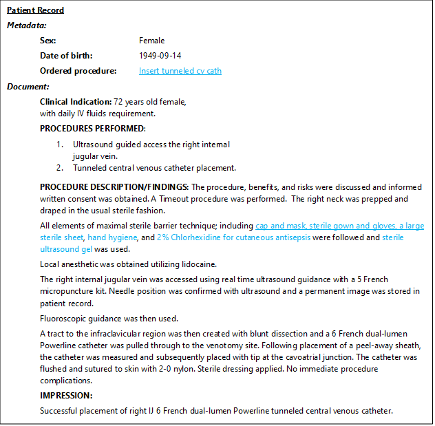](../media/radiology-insights/radiology-quality-measure.png#lightbox)

Figure Quality Measures: The model reports that for the Quality Measure CVC INSERTION, the documentation doesn't comply with its quality criteria and classifies the type of compliance as "performance not met" in the model response. There's missing information regarding the use of a sterile probe cover.   

***Table Quality Measures – MIPS implemented***

|MIPS Nr  |	MIPS    |
|----------|---------------------------------------------------------------------------|
|76        |	Prevention of central venous catheter - related bloodstream infections.|
|145  |	Exposure dose indices or exposure time and number of images reported for procedures using fluoroscopy.|
|147  |	Correlation with existing imaging studies for all patients undergoing bone scintigraphy.|
|360  |	Optimizing patient exposure to ionizing radiation: count of potential high dose radiation imaging studies: computed tomography (CT) and cardiac nuclear medicine studies.|
|364  |	Appropriateness: follow-up CT imaging for incidentally detected pulmonary nodules according to recommended guidelines.|
|405  |	Appropriate follow-up imaging for incidental abdominal lesions.|
|406  |	Appropriate follow-up imaging for incidental thyroid nodules in patients.|
|436  |	Utilization of dose lowering techniques.|

|ACRad No  |	ACRad|
|--------|---------------------------------------------------------------------------|
|36|	Incidental Coronary Artery Calcification Reported on Chest CT|
|37|	Interpretation of CT Pulmonary Angiography (CTPA) for Pulmonary Embolism|
|38|	Use of Low Dose Cranial CT or MRI Examinations for Patients with Ventricular Shunts|
|40|	Use of Structured Reporting in Prostate MRI|
|41|	Use of Quantitative Criteria for Oncologic FDG PET Imaging|
|42|	Surveillance Imaging for Liver Nodules <10 mm in Patients at Risk for Hepatocellular Carcinoma (HCC)|

|MSDN QCDR No  |	MSN QCDR|
|--------|---------------------------------------------------------------------------|
|MEDNAX55      |	Use of ASPECTS (Alberta Stroke Program Early CT Score) for noncontrast CT Head performed for suspected acute stroke|
|MSN13|	Screening Coronary Calcium Scoring for Cardiovascular Risk Assessment Including Coronary Artery Calcification Regional Distribution Scoring|
|MSN15|	Use of Thyroid Imaging Reporting & Data System (TI-RADS) in Final Report to Stratify Thyroid Nodule Risk |
|QMM26|	Screening Abdominal Aortic Aneurysm Reporting with Recommendations |
|QMM17|	Appropriate Follow-up Recommendations for Ovarian Adnexal Lesions using the Ovarian-Adnexal Reporting and Data System (O-RADS)|
|QMM18|Use of Breast Cancer Risk Score on Mammography|
|QMM19|	DEXA/DXA and Fracture Risk Assessment for Patients with Osteopenia|

**Scoring and Assessment**

Risk Scoring and Assessment systems are used in medical imaging and diagnostics to standardize the evaluation and reporting of findings. These systems provide a structured approach to interpreting imaging studies, assessing the risk of disease, and guiding clinical management. The Risk Scoring and Assessment systems8 implemented are listed in table below. 

The Model surfaces and highlights Risks, Scorings and Assessments with classifications or values the radiologist dictates in a radiology note or report.

In the sample below the model identifies two inferences: the ASCVD (Atherosclerotic Cardiovascular Disease) risk with value 17.6% and the Agatston Score (measure used to quantify the amount of calcium in the coronary arteries) with value zero. The 10-year ASCVD (Atherosclerotic Cardiovascular Disease) risk score is an estimate of the likelihood that a person will experience a cardiovascular event (like a heart attack or stroke) within the next 10 years. This score is calculated (not by the model) based on various risk factors, including age, cholesterol levels, blood pressure, smoking status, diabetes, and others. In this case, a risk score of 17.6% means that, based on the person's risk factors, there's a 17.6% chance of experiencing a cardiovascular event in the next 10 years.

[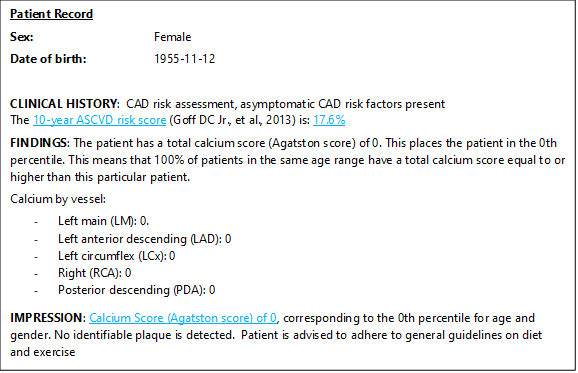](../media/radiology-insights/radiology-scoring-assessment.png#lightbox)

Figure Risk Scoring and Assessment: The model identifies two Scoring and Assessment instances (blue), one of category ASCVD Risk with value 17.6% and one of category Calcium Score with value 0.

***Table Risk or Assessment categories implemented***

|Risk or Assessment category|	Value/Classification|	Unit|
|---------------------------|-----------------------|---------|
|BIRADS|	0, 1, 2, 3, 4, 4a, 4b, 4c, 5, 6	 ||
|C-RADS Colonic Findings|	C0, C1, C2, C3, C4	|| 
|C-RADS Extracolonic Findings|	E0, E1, E2, E3, E4	|| 
|CAD-RADS|	0, 1, 2, 3, 4, 4a, 4b, 5, N	||
|LI-RADS|	NC, 1, 2, 3, 4, 5, M, TIV	||
|US LI-RADS Visualization Score|	A, B, C	||
|Lung-RADS|	0, 1, 2, 3, 4a, 4b, 4x, S, C	||
|NI-RADS|	0, 1, 2, 2a, 2b, 3, 4	||
|O-RADS|	0, 1, 2, 3, 4, 5	||
|PI-RADS|	0, 1, 2, 3, 4, 5	||
|TI-RADS|	0, 1, 2, 3, 4, 5	||
|Kellgren-Lawrence Grading Scale|	0, 1, 2, 3, 4	||
|Tonnis Classification|	1, 2, 3, 4	||
|Calcium Score|	Numeric value (usually between 1-1000)	||
|ASPECTS (Alberta Stroke Program Early CT Score)|	0, 1, 2, 3, 4, 5, 6, 7, 8, 9, 10	||
|Z-Score|	-4 to 4	||
|T-Score|	-4 to 4	||
|Lifetime Breast Cancer Risk|	Numeric 0-100|	%|
|ASCVD Risk|	Numeric 0-100	|%|
|Modified Gail Model Risk|	Numeric 0-100|	%|
|Tyrer Cusick Model Risk|	Numeric 0-100|	%|
|10 Year CHD Risk|	Numeric 0-100|	%|
|Risk of Malignancy Index (RMI)|	Numeric	||
|HNPCC Mutation Risk|	Numeric 0-100|	%|

## Use cases

Healthcare organizations and radiology teams must have visibility into trends and outcomes specific to radiology operations and performance, with constant attention to quality.
The Radiology Insights model extracts valuable information from radiology documents for a radiologist.

The scope of each of these use cases is always the current document the radiologist is dictating. There's no image analysis nor patient record information involved. The meta-data provides administrative context for the current report and is limited to patient age, patient sex, and the procedure that was ordered. (for example: CT of abdomen, MRI of the brain,…)

Microsoft is providing this functionality as an API with the model that allows for the information in scope to be identified or extracted. The customer would incorporate the model into their own or third-party radiology reporting software and would determine the user interface for the information. Customers could be an ISV or a health system developing or modifying radiology reporting software for use within the health system.  

Thus, the specific use cases by customers and how the information would be presented or used by a radiologist can vary slightly from that described, but the descriptions illustrate the intended purpose of the API functionality.

**Use Case 1 – Identifying Mismatches**: A radiologist is provided with possible mismatches that are identified by the model between what the radiologist has documented in the radiology report and the information that was present in the meta-data of the report. Mismatches can be identified for sex, age, and body site laterality. Mismatches identify potential discrepancies between the dictated text and the provided meta-data. They also identify potential inconsistencies within the dictated/written text. Inconsistencies are limited to gender, age, laterality, and type of imaging. This is only to allow the radiologist to rectify any potential inconsistencies during reporting. The system isn't aware of the image the radiologist is reporting on. In no way does this model provides any clinical judgment of the radiologist's interpretation of the image. The radiologist is responsible for the diagnosis and treatment of patient and the correct documentation thereof.

**Use Case 2 – Providing Clinical Findings**: The model extracts as structured data two types of clinical findings: critical findings and actionable findings. Only clinical findings that are explicitly documented in the report by the radiologist are extracted by the model. Clinical findings produced by the model aren't deduced from pieces of information in the report nor from the image. These merely serve as a potential reminder for the radiologist to communicate with the provider.
The model produces two categories of clinical findings, Actionable Finding and Critical Result, and is based on the clinical finding, explicitly stated in the report, and criteria formulated by ACR (American College of Radiology). The model always extracts all findings explicitly documented by the radiologist. The extracted findings can be used to alert a radiologist of possible clinical findings that need to be clearly communicated and acted on in a timely fashion by a healthcare professional. Customers can also utilize the extracted findings to populate downstream or related systems (such as EHRs or autoschedule functions).

**Use Case 3 – Communicating Follow-up Recommendations**: A radiologist uncovers findings for which in some cases a follow-up is recommended. The documented recommendation is extracted and normalized by the model for communication to a healthcare professional (physician).
Follow-up recommendations aren't generated, deduced, or proposed. The model merely extracts follow-up recommendation statements documented explicitly by the radiologist. Follow-up recommendations are normalized by coding to SNOMED.

**Use Case 4 – Reporting Measurements**: A radiologist documents clinical findings with measurements. The model extracts clinically relevant information pertaining to the finding. The model extracts measurements the radiologist explicitly stated in the report. The model is searching for measurements that have already been taken and reviewed by the radiologist. Extracting these measurements from the relevant text-based record and structures them. The extracted and structured measurement data can be used to see trends in measurements for a particular patient over time. A customer could search a set of patients based on the measurement data extracted by the model.

**Use Case 5 - Reports on Productivity and Key Quality Metrics**: The Radiology Insights model extracted information (information extracted in use cases 1 to 5) can be used to generate reports and support analytics for a team of radiologists. Based on the extracted information, dashboards and retrospective analyses can provide updates on productivity and key quality metrics to guide improvement efforts, minimize errors, and improve report quality and consistency.
The RI model isn't creating dashboards but delivers extracted information, not deduced, that a user could aggregate for research and administrative purposes. The model is stateless.

**Use Case 6 – Quality Measures: Compliance with Reimbursement Criteria in Healthcare Programs**
Scenario: A healthcare organization needs to ensure compliance with evolving reimbursement programs, such as the Merit-based Incentive Payment System (MIPS) established under the MACRA act. The organization must meet specific performance criteria to qualify for reimbursement incentives or avoid penalties.
Solution: The organization aggregates the appropriate Quality Measure criteria from its clinical and administrative data. Automating the tracking and reporting of these criteria, the system supports compliance with reimbursement requirements, reducing manual effort and ensuring accurate reporting to Medicare. The RI model isn't creating dashboards but delivers extracted information, not deduced, that a customer could aggregate. The model is stateless.

**Use Case 7 – Scoring and Assessment: Population Health Management through Radiology Insights**
Scenario: A healthcare provider seeks to improve population health management by identifying individuals or patient groups in need of more screening or preventative services. The organization wants to extract valuable insights from radiology reports to improve patient outcomes.
Solution:
Scores and values are then aggregated to identify trends, establish baselines, and flag individuals or groups that could benefit from further screening or preventative care. The system helps clinicians proactively manage patient populations, improving preventative care while reducing the likelihood of future complications.

**Use Case 8 – Clinical Guidance for the Radiologist**
Scenario:
Radiologists frequently need to reference specific clinical guidelines when documenting findings in their reports. However, missing or incomplete information can delay access to these guidelines and its recommendations, potentially impacting the accuracy of their reports.
Solution:
Radiology Insights automatically highlights documented findings in the radiology report that are relevant to the applicable clinical guidelines and its candidate recommendations. If key information is missing, which could affect the recommendation outcome of a clinical guideline, the system flags these gaps. This proactive approach ensures that radiologists have immediate access to the necessary guidelines information, enhancing the accuracy and completeness of their reports.

### Considerations when choosing other use cases

Radiology Insights is a valuable tool to extract knowledge from unstructured medical text and support the radiology documentation workflow. However, given the sensitive nature of health-related data, it's important to consider your use cases carefully. In all cases, a human should be making decisions assisted by the information the system returns, and in all cases, you should have a way to review the source data and correct errors. Here are some considerations when choosing a use case:

- Avoid scenarios that use this service as a medical device, to provide clinical support, or as a diagnostic tool to be used in the diagnosis, cure, mitigation, treatment, or prevention of disease or other conditions without human intervention. A qualified medical professional should always do due diligence and verify source data that might influence patient care decisions and make decisions.

- Avoid scenarios related to automatically granting or denying medical services or health insurance without human intervention. Because decisions that affect coverage levels are impactful, source data should always be verified in these scenarios.

- Avoid scenarios that use personal health information for a purpose not permitted by patient consent or applicable law. Health information has special protections regarding privacy and consent. Make sure that all data you use has patient consent for the way you use the data in your system or you're otherwise compliant with applicable law as it relates to the use of health information.

- Carefully consider using detected inferences to update patient records without human intervention. Make sure that there's always a way to report, trace, and correct any errors to avoid propagating incorrect data to other systems. Ensure that any updates to patient records are reviewed and approved by qualified professionals.

- Carefully consider using detected inferences in patient billing without human intervention. Make sure that providers and patients always have a way to report, trace, and correct data that generates incorrect billing.

### Limitations

The specific characteristics of the input radiology document are crucial to get actionable, accurate output from the RI model. Some of the items playing an important role in this are:

- Languages: Currently RI capabilities are enabled for English text only.
- Unknown words: radiology documents sometimes contain unknown abbreviations/words or out of context homonyms or spelling mistakes.
- Input meta-data: RI expects for certain types of inferences that input information is available in the document or in the meta data of the document.
- Templates and formatting: RI is developed using a real world, representative set of documents, but it's possible that specific use cases and/or document templates can cause challenges for the RI logic to be accurate. As an example, nested tables or complicated structures can cause suboptimal parsing.
- Vocabulary & descriptions: RI is developed and tested on real world documents. However, natural language is rich and description of certain clinical facts can vary over time possibly impacting the output of the logic.

### System performance

The performance of the system is assessed by computing statistics based on true positive, true negative, false positive, and false negative instances. In order to do so, a representative set of documents has to build, eventually annotated with the expected outcomes. Output of RI can be compared with the desired output to determine the accuracy numbers.

The main reasons for Radiology Insights to trigger False Positive / False Negative output are:

- Input document not containing all necessary meta information
- Input document format and formatting (Section headings, Punctuation, ...)
- Non English text (partial)
- Unknown words (abbreviations, misspellings, …)
- Issues with parsing complex formatting (nested tables, …)

## Evaluation of Radiology Insights

### Evaluation methods

Radiology insight logic is developed and evaluated using a large set of real world clinical radiology documents. A train set of 5000+ docs  annotated by human experts and is used to implement and refine the logic triggering the RI inferences. Part of this set is randomly sampled from a corpus provided by a US medical center and focused mostly on adult patients.

The set used provides almost equal representation of US based male and female patients, and adequate representation of every age group.   It should be noted that no further analysis of the training data representativeness (for example, geographic, demographic, or ethnographic representation) is done since the data doesn't includes that type of meta data. The train set and other evaluation sets used are constructed making sure that all types of inferences are present for different types of patient characteristics (Age, Sex).
Accuracy or regression of the logic is tested using unit and functional tests covering the complete logic scope. Generalization of RI models is assessed by using left-out sets of documents sharing the same characteristics of the train set.

Targeted minimum performance levels for each inference across the complete population are evaluated, tracked, and reviewed with Subject matter experts.
All underlying core NLP & NLU components are separately checked and reviewed using specific test sets.

### Evaluation results

Evaluation metrics used are precision, recall, and f1 scoring when manual golden truth annotations from human experts are present. Regression testing is done via discrepancy analysis and human expert feedback cycles.

The evaluation on unseen sets and training sets of radiology documents demonstrates that Radiology Insights achieves strong and consistent performance across datasets annotated for all the Radiology Insights annotations.

The training sets, totaling over 15,000 documents, include comprehensive annotations. They were curated by medical experts for all areas such as findings, critical results, communications, mismatches, recommendations, scoring and assessment, and clinical guidance. These sets provide a solid foundation for the model's capabilities by covering diverse use cases. 

The unseen sets, totaling more than 6,000 documents, serve as a rigorous test for generalizability, confirming that the model performs even on data it hasn't encountered during training.

In summary, while the evaluation demonstrates strong and consistent performance across both seen and unseen sets, ongoing validation and exploration of more scenarios, including edge cases and untested conditions, remain crucial and is ongoing to ensure comprehensive coverage and sustained quality in real-world applications.

## Evaluating and integrating Radiology Insights for your use
When you're getting ready to deploy Radiology Insights, the following activities help set you up for success:

- Understand what it can do: Fully assess the capabilities of RI to understand its capabilities and limitations. Understand how it performs in your scenario and context.

- Test with real, diverse data: Understand RI how performs in your scenario by thoroughly testing it by using real-life conditions and data that reflect the diversity in your users, geography, and deployment contexts. Small datasets, synthetic data, and tests that don't reflect your end-to-end scenario are unlikely to sufficiently represent your production performance.

- Respect an individual's right to privacy: Only collect or use data and information from individuals for lawful and justifiable purposes. Use only the data and information that you have consent to use or are legally permitted to use.

- Legal review: Obtain appropriate legal review of your solution, particularly if you use it in sensitive or high-risk applications. Understand what restrictions you might need to work within and any risks that need to be mitigated prior to use. It's your responsibility to mitigate such risks and resolve any issues that might come up.

- System review: If you plan to integrate and responsibly use an AI-powered product or feature into an existing system for software or customer or organizational processes, take time to understand how each part of your system is affected. Consider how your AI solution aligns with Microsoft Responsible AI principles.

- Human in the loop: Keep a human in the loop and include human oversight as a consistent pattern area to explore. This means constant human oversight of the AI-powered product or feature and ensuring humans making any decisions that are based on the model’s output. To prevent harm and to manage how the AI model performs, ensure that humans have a way to intervene in the solution in real time.

- Security: Ensure that your solution is secure and that it has adequate controls to preserve the integrity of your content and prevent unauthorized access.

- Customer feedback loop: Provide a feedback channel that users and individuals can use to report issues with the service after  deployment. After you deploy an AI-powered product or feature, it requires ongoing monitoring and improvement. Have a plan and be ready to implement feedback and suggestions for improvement.

## References

1.	American College of Radiology. "ACR Appropriateness Criteria." American College of Radiology, n.d. Web. 29 January 2025. https://www.acr.org/Clinical-Resources/Clinical-Tools-and-Reference/Appropriateness-Criteria
2.	American College of Radiology. "Incidental Findings." American College of Radiology, n.d. Web. 29 January 2025. https://www.acr.org/Clinical-Resources/Clinical-Tools-and-Reference/Incidental-Findings
3.	American College of Radiology. "Reporting and Data Systems (RADS)." American College of Radiology, n.d. Web. 29 January 2025. https://www.acr.org/Clinical-Resources/Clinical-Tools-and-Reference/Reporting-and-Data-Systems
4.	American Association for the Surgery of Trauma. "Injury Scoring Scale." American Association for the Surgery of Trauma, n.d. Web. 29 January 2025. https://www.aast.org/resources-detail/injury-scoring-scale
5.	MacMahon H, Naidich D, Goo J, and others. Guidelines for Management of Incidental Pulmonary Nodules Detected on CT Images: From the Fleischner Society 2017. Radiology. 2017;284(1):228-43. [doi:10.1148/radiol.2017161659](https://doi.org/10.1148/radiol.2017161659) - [Pubmed](https://www.ncbi.nlm.nih.gov/pubmed/28240562)
6.	Tessler, Franklin N., and others. "ACR Thyroid Imaging, Reporting, and Data System (TI-RADS): White Paper of the ACR TI-RADS Committee." Journal of the American College of Radiology, 2017. 
7.	MIPS Qualified Clinical Data Registry | American College of Radiology
8.	References to Risk Scoring and Assessment system resources  
        a.	[Risk of malignancy index in ovarian tumors | Radiology Reference Article | Radiopaedia.org](https://radiopaedia.org/articles/risk-of-malignancy-index-in-ovarian-tumours-1?lang=us)  
        b.	[BI-RADS, C-RADS, CAD-RADS, LI-RADS, Lung-RADS, NI-RADS, O-RADS, PI-RADS, TI-RADS:Reporting and Data Systems - PubMed](https://pubmed.ncbi.nlm.nih.gov/31498744/)  

