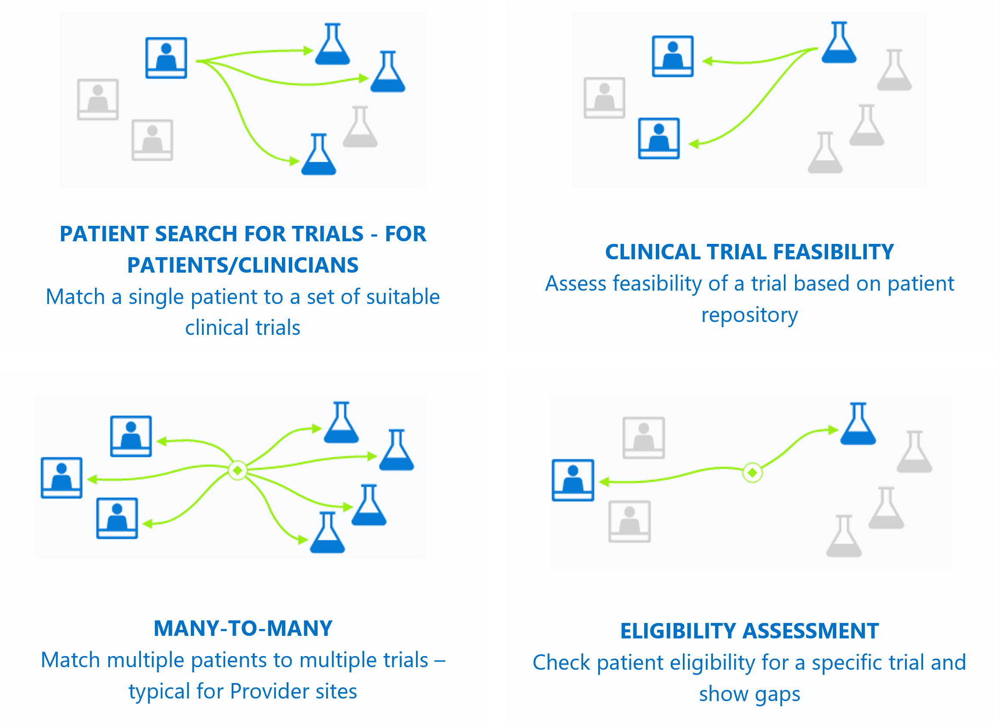

# Trial Matcher modes

Trial Matcher provides two main modes of operation to users of the service: a **patient centric** mode and a **clinical trial centric** mode.

On the diagram, you can see how patients' or clinical trials can be found through the two different modes.
 

## Patient centric

**Patient centric** is when the Trial Matcher model matches a single patient to a set of relevant clinical trials, the patient appears to be qualified for. Patient centric is also known as **one-to-many** use case. 

The Trial Matcher logic is based on the patient **clinical health information**, **location**, **priorities**, **trial eligibility criteria**, and **other criteria** that the patient and/or service users may choose to prioritize. 

Typically, when using Trial Matcher in **patient centric** the service user provides the patient data in one of the following data formats:
- Gradual matching
- Key-Value structure 
- FHIR bundle
- Unstructured clinical note

### Gradual matching
Trial Matcher can be used to match patients with known structured medical information, or it can be used to collect the required medical information during the qualification process, which is known as Gradual matching. 

Gradual matching can be utilized through any client application. One common implementation is by using the [Azure Health Bot](/azure/health-bot/) to create a conversational mechanism for collecting information and qualifying patients.

When performing gradual matching, the response of each call to the Trial Matcher includes the needed [clinical info](patient-info.md) – health information derived from the subset of clinical trials found that is required to qualify the patient. This information should be captured from the user (for example, by generating a question and waiting for user input) and sent back to the Trial Matcher in the following request, to perform a more accurate qualification.

## Clinical trial centric

**Clinical trial centric** is when the Trial Matcher model finds potentially eligible group of patients to a clinical trial.
The user should provide patient data and the relevant clinical trials to match against. The Trial Matcher then analyzes the data and provides the results per patient, both if they're eligible or ineligible. 

Clinical Trial Centric is also known as **many-to-one** use case, and the extension of it's **many-to-many** when there's a list of clinical trials to match the patients to.
The process of matching patients is typically done in two phases. 
- The first phase, done by the service user, starts with all patients in the data repository. The goal is to match all patients that meet a baseline criteria, like a clinical condition. 
- In the second phase, the service user  uses the Trial Matcher to input a subset group of patients (the outcome of the first phase) to match only those patients to the detailed exclusion and inclusion criteria of a clinical trial.

Typically, when using Trial Matcher in clinical trial centric the service user provides the patient data in one of the following data formats:
- Key-Value structure 
- FHIR bundle
- Unstructured clinical note

## Next steps

For more information, see

>[!div class="nextstepaction"]
> [Patient info](patient-info.md) 

>[!div class="nextstepaction"]
> [Model configuration](model-configuration.md) 

>[!div class="nextstepaction"]
> [Inference information](inferences.md) 