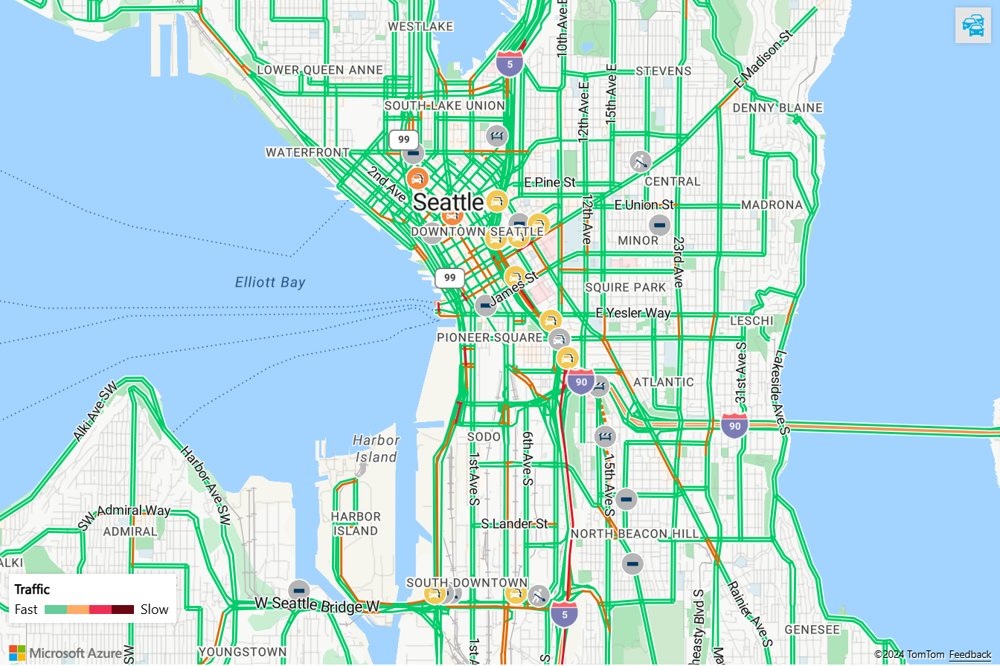
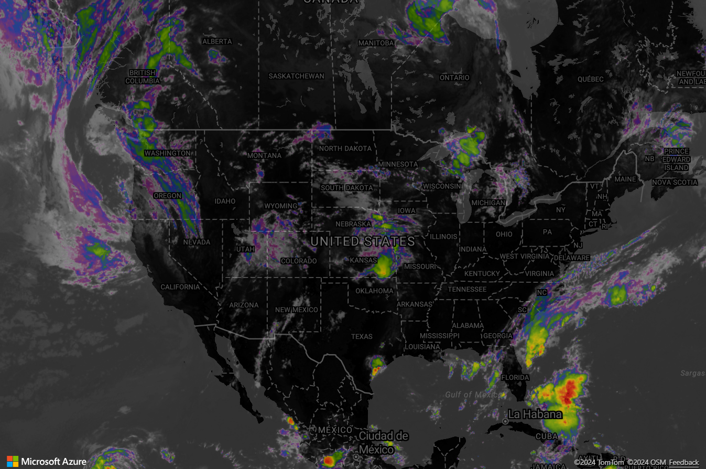

# What is Azure Maps?

Azure Maps is a collection of geospatial services and SDKs that use fresh mapping data to provide geographic context to web and mobile applications. Azure Maps provides:

* REST APIs to render vector and raster maps in multiple styles and satellite imagery.
* Creator services to create and render maps based on private indoor map data.
* Search services to locate addresses, places, and points of interest around the world.
* Various routing options; such as point-to-point, multipoint, multipoint optimization, isochrone, electric vehicle, commercial vehicle, traffic influenced, and matrix routing.
* Traffic flow view and incidents view, for applications that require real-time traffic information.
* Time zone and Geolocation services.
* Geofencing service and mapping data storage, with location information hosted in Azure.
* Location intelligence through geospatial analytics.

Additionally, Azure Maps services are available through the Web SDK and the Android SDK. These tools help developers quickly develop and scale solutions that integrate location information into Azure solutions.

You can sign up for a free [Azure Maps account] and start developing.

The following video explains Azure Maps in depth:

</br>

> [!VIDEO https://learn.microsoft.com/Shows/Internet-of-Things-Show/Azure-Maps/player?format=ny]

## Map controls

### Web SDK

The Azure Maps Web SDK lets you customize interactive maps with your own content and imagery. You can use this interactive map for both your web or mobile applications. The map control makes use of WebGL, so you can render large data sets with high performance. You can develop with the SDK by using JavaScript or TypeScript.

:::image type="content" source="./media/about-azure-maps/intro_web_map_control.png" alt-text="Example map of population change created by using Azure Maps Web SDK":::

### Android SDK

Use the Azure Maps Android SDK to create mobile mapping applications.

:::image type="content" source="./media/about-azure-maps/android_sdk.png" border="false" alt-text="Map examples on a mobile device":::

## Services in Azure Maps

Azure Maps consists of the following services that can provide geographic context to your Azure applications.

### Data service

Data is imperative for maps. Use the Data service to upload and store geospatial data for use with spatial operations or image composition.  Bringing customer data closer to the Azure Maps service will reduce latency, increase productivity, and create new scenarios in your applications. For details on this service, see [Data service].

### Geolocation service

Use the Geolocation service to retrieve the two-letter country/region code for an IP address. This service can help you enhance user experience by providing customized application content based on geographic location.

For more details, read the [Geolocation service documentation](/rest/api/maps/geolocation).

### Render service

[Render service V2](/rest/api/maps/render-v2) introduces a new version of the [Get Map Tile V2 API](/rest/api/maps/render-v2/get-map-tile) that supports using Azure Maps tiles not only in the Azure Maps SDKs but other map controls as well. It includes raster and vector tile formats, 256x256 or 512x512 (where applicable) tile sizes and numerous map types such as road, weather, contour, or map tiles created using Azure Maps Creator. For a complete list, see [TilesetID] in the REST API documentation. It's recommended that you use Render service V2 instead of Render service V1. You're required to display the appropriate copyright attribution on the map anytime you use the Azure Maps Render service V2, either as basemaps or layers, in any third-party map control. For more information, see [How to use the Get Map Attribution API](how-to-show-attribution.md).

:::image type="content" source="./media/about-azure-maps/intro_map.png" border="false" alt-text="Example of a map from the Render service V2":::

### Route service

The route services can be used to calculate the estimated arrival times (ETAs) for each requested route. Route APIs consider factors, such as real-time traffic information and historic traffic data, like the typical road speeds on the requested day of the week and time of day. The APIs return the shortest or fastest routes available to multiple destinations at a time in sequence or in optimized order, based on time or distance. The service allows developers to calculate directions across several travel modes, such as car, truck, bicycle, or walking, and electric vehicle. The service also considers inputs, such as departure time, weight restrictions, or hazardous material transport.

:::image type="content" source="./media/about-azure-maps/intro_route.png" border="false" alt-text="Example of a map from the Route service":::

The Route service offers advanced set features, such as:

* Batch processing of multiple route requests.
* Matrices of travel time and distance between a set of origins and destinations.
* Finding routes or distances that users can travel based on time or fuel requirements.

For details on the routing capabilities, read the [Route service documentation](/rest/api/maps/route).

### Search service

The Search service helps developers search for addresses, places, business listings by name or category, and other geographic information. Also, services can [reverse geocode](https://en.wikipedia.org/wiki/Reverse_geocoding) addresses and cross streets based on latitudes and longitudes.

:::image type="content" source="./media/about-azure-maps/intro_search.png" border="false" alt-text="Example of a search on a map":::

The Search service also provides advanced features such as:

* Search along a route.
* Search inside a wider area.
* Batch a group of search requests.
* Search electric vehicle charging stations and Point of Interest (POI) data by brand name.

For more details on search capabilities, read the [Search service documentation](/rest/api/maps/search).

### Spatial service

The Spatial service quickly analyzes location information to help inform customers of ongoing events happening in time and space. It enables near real-time analysis and predictive modeling of events.

The service enables customers to enhance their location intelligence with a library of common geospatial mathematical calculations. Common calculations include closest point, great circle distance, and buffers. To learn more about the service and the various features, read the [Spatial service documentation](/rest/api/maps/spatial).

### Timezone service

The Time zone service enables you to query current, historical, and future time zone information. You can use either latitude and longitude pairs or an [IANA ID](https://www.iana.org/) as an input. The Time zone service also allows for:

* Converting Microsoft Windows time-zone IDs to IANA time zones.
* Fetching a time-zone offset to UTC.
* Getting the current time in a chosen time zone.

A typical JSON response for a query to the Time zone service looks like the following sample:

```JSON
{
  "Version": "2020a",
  "ReferenceUtcTimestamp": "2020-07-31T19:15:14.4570053Z",
  "TimeZones": [
    {
      "Id": "America/Los_Angeles",
      "Names": {
        "ISO6391LanguageCode": "en",
        "Generic": "Pacific Time",
        "Standard": "Pacific Standard Time",
        "Daylight": "Pacific Daylight Time"
      },
      "ReferenceTime": {
        "Tag": "PDT",
        "StandardOffset": "-08:00:00",
        "DaylightSavings": "01:00:00",
        "WallTime": "2020-07-31T12:15:14.4570053-07:00",
        "PosixTzValidYear": 2020,
        "PosixTz": "PST+8PDT,M3.2.0,M11.1.0"
      }
    }
  ]
}
```

For details on this service, read the [Time zone service documentation](/rest/api/maps/timezone).

### Traffic service

The Traffic service is a suite of web services that developers can use for web or mobile applications that require traffic information. The service provides two data types:

* Traffic flow: Real-time observed speeds and travel times for all key roads in the network.
* Traffic incidents: An up-to-date view of traffic jams and incidents around the road network.



For more information, see the [Traffic service documentation](/rest/api/maps/traffic).

### Weather services

Weather services offer APIs that developers can use to retrieve weather information for a particular location. The information contains details such as observation date and time, brief description of the weather conditions, weather icon, precipitation indicator flags, temperature, and wind speed information. Other details such as RealFeel™ Temperature and UV index are also returned.

Developers can use the [Get Weather along route API](/rest/api/maps/weather/getweatheralongroute) to retrieve weather information along a particular route. Also, the service supports the generation of weather notifications for waypoints that are affected by weather hazards, such as flooding or heavy rain.

The [Get Map Tile V2 API](/rest/api/maps/render-v2/get-map-tile) allows you to request past, current, and future radar and satellite tiles.



### Maps Creator service

Maps Creator service is a suite of web services that developers can use to create applications with map features based on indoor map data.

Maps Creator provides the following services:

* [Dataset service]. Use the Dataset service to create a dataset from a converted drawing package data. For information about drawing package requirements, see drawing package requirements.

* [Conversion service]. Use the Conversion service to convert a DWG design file into drawing package data for indoor maps.

* [Tileset service]. Use the Tileset service to create a vector-based representation of a dataset. Applications can use a tileset to present a visual tile-based view of the dataset.

* [Custom styling service] (preview). Use the [style service] or [visual style editor] to customize the visual elements of an indoor map.

* [Feature State service]. Use the Feature State service to support dynamic map styling. Dynamic map styling allows applications to reflect real-time events on spaces provided by IoT systems.

* [WFS service]. Use the WFS service to query your indoor map data. The WFS service follows the [Open Geospatial Consortium API] standards for querying a single dataset.

* [Wayfinding service] (preview). Use the [wayfinding API] to generate a path between two points within a facility. Use the [routeset API] to create the data that the wayfinding service needs to generate paths.

## Programming model

Azure Maps is built for mobility and can help you develop cross-platform applications. It uses a programming model that's language agnostic and supports JSON output through [REST APIs](/rest/api/maps/).

Also, Azure Maps offers a convenient [JavaScript map control](/javascript/api/azure-maps-control) with a simple programming model. The development is quick and easy for both web and mobile applications.

## Power BI visual

The Azure Maps Power BI visual provides a rich set of data visualizations for spatial data on top of a map. It's estimated that over 80% of business data has a location context. The Azure Maps Power BI visual offers a no-code solution for gaining insights into how this location context relates to and influences your business data.

:::image type="content" source="./media/about-azure-maps/intro-power-bi.png" border="false" alt-text="Power BI desktop with the Azure Maps Power BI visual displaying business data":::

For more information, see the [Get started with Azure Maps Power BI visual](power-bi-visual-get-started.md) article.

## Usage

To access Azure Maps services, go to the [Azure portal] and create an Azure Maps account.

Azure Maps uses a key-based authentication scheme. When you create your account, two keys are generated. To authenticate for Azure Maps services, you can use either key.

> [!NOTE]
> Azure Maps shares customer-provided address/location queries with third-party TomTom for mapping functionality purposes. These queries aren't linked to any customer or end user when shared with TomTom and can't be used to identify individuals.
>
> TomTom is a subprocessor that is authorized to subprocess Azure Maps customer data. For more information, see the Microsoft Online Services [Subprocessor List] located in the [Microsoft Trust Center].

## Supported regions

Azure Maps services are currently available except in the following countries/regions:

* China
* South Korea

Verify that the location of your current IP address is in a supported country/region.

## Next steps

Try a sample app that showcases Azure Maps:

[Quickstart: Create a web app](quick-demo-map-app.md)

Stay up to date on Azure Maps:

[Azure Maps blog]

[Data service]: /rest/api/maps/data-v2
[Dataset service]: creator-indoor-maps.md#datasets
[Conversion service]: creator-indoor-maps.md#convert-a-drawing-package
[Tileset service]: creator-indoor-maps.md#tilesets
[Custom styling service]: creator-indoor-maps.md#custom-styling-preview
[style service]: /rest/api/maps/v20220901preview/style
[visual style editor]: https://azure.github.io/Azure-Maps-Style-Editor
[Feature State service]: creator-indoor-maps.md#feature-statesets
[WFS service]: creator-indoor-maps.md#web-feature-service-api
[Wayfinding service]: creator-indoor-maps.md#wayfinding-preview
[wayfinding API]: /rest/api/maps/v20220901preview/wayfinding
[routeset API]: /rest/api/maps/v20220901preview/routeset
[Open Geospatial Consortium API]: https://docs.opengeospatial.org/is/17-069r3/17-069r3.html
[Azure portal]: https://portal.azure.com
[Azure Maps account]: https://azure.microsoft.com/services/azure-maps/
[TilesetID]: /rest/api/maps/render-v2/get-map-tile#tilesetid
[Azure Maps blog]: https://azure.microsoft.com/blog/topics/azure-maps/
[Microsoft Trust Center]: https://www.microsoft.com/trust-center/privacy
[Subprocessor List]: https://servicetrust.microsoft.com/DocumentPage/aead9e68-1190-4d90-ad93-36418de5c594
