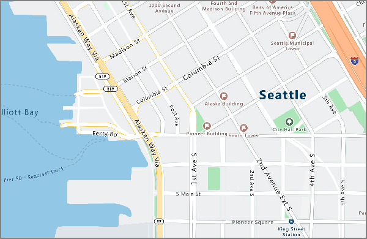
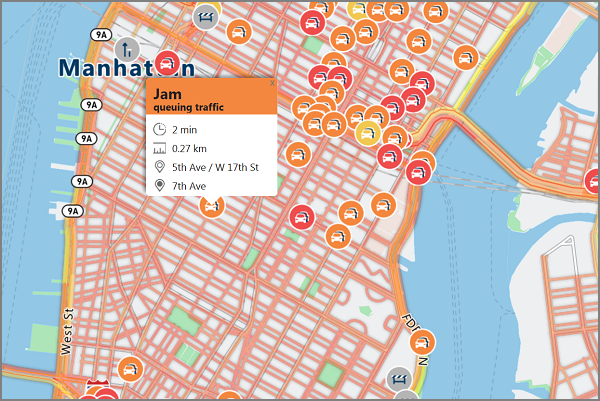

# What is Azure Maps?

Azure Maps is a collection of geospatial services, backed by fresh mapping data so you can provide accurate geographic context to your web and mobile applications. It contains REST APIs for rendering maps and searching points of interest. The APIs can also find routes to points of interest, traffic conditions, time zones, and a location from an IP address. The APIs work with familiar tools to quickly develop and scale solutions that integrate location information into your Azure solutions. In addition to its REST APIs, the web-based [JavaScript map control](https://docs.microsoft.com/javascript/api/azure-maps-control) is provided to make development easy, flexible, and portable across multiple mediums.

The following video explains Azure Maps in depth:

<iframe src="https://channel9.msdn.com/Shows/Azure-Friday/Azure-Location-Based-Services/player" width="960" height="540" allowFullScreen frameBorder="0"></iframe>

## Map Controls

### Web Control

The Azure Maps Web Control lets you customize interactive maps with your own content and imagery for display in your web or mobile applications. This control makes use of WebGL, allowing you to render large data sets with high performance. Develop with the control using JavaScript or TypeScript.


## Services in Azure Maps

Azure Maps consists of the following six services that can provide geographic context to your Azure applications.

### Render service

The Render service is designed for developers to create web and mobile applications around mapping. The service uses either high-quality raster graphic images, available in 19 zoom levels, or fully customizable vector format map images.



The Render service now offers preview APIs to allow developers to work with satellite imagery. For more details, read the [Azure Maps Render APIs](https://docs.microsoft.com/rest/api/maps/render).

### Route service

The Route service contains robust geometry calculations for real-world infrastructure and directions for multiple transportation modes. The service allows for developers to calculate directions across a number of travel modes such as car, truck, bicycle, or walking. The service can also consider inputs such as traffic conditions, weight restrictions, or hazardous material transport.


The Route service now offers a preview of advanced features such as batch processing of multiple route requests, matrices of travel time and distance between a set of origins and destinations, and finding routes or distances you can travel based on your time or fuel requirements. For details on the routing capabilities, read the [Azure Maps Route APIs](https://docs.microsoft.com/rest/api/maps/route).

### Search service

The Search service is designed for developers to search for addresses, places, business listings by name or category, and other geographic information. The Search Service can also [reverse geocode](https://en.wikipedia.org/wiki/Reverse_geocoding) addresses and cross streets based on latitudes and longitudes.


The Search service also provides advanced features such as search along a route, search inside a wider area, batch a group of search requests, as well as search for larger area instead of a location point. APIs for batch and area search are currently in preview. For more details on the search capabilities, read the [Azure Maps Search APIs](https://docs.microsoft.com/rest/api/maps/search) page.

### Time Zone service

The Time Zone service allows you to query current, historical, and future time zone information using either latitude-longitude pairs or an [IANA ID](http://www.iana.org/). The Time Zone service also allows for converting Microsoft Windows time zone IDs to IANA time zones, fetching a time zone offset to UTC and getting the current time in a respective time zone. A typical JSON response for a query to the Time Zone Service looks like the following sample:

```JSON
{
    "Version": "2017c",
    "ReferenceUtcTimestamp": "2017-11-20T23:09:48.686173Z",
    "TimeZones": [{
        "Id": "America/Los_Angeles",
        "ReferenceTime": {
            "Tag": "PST",
            "StandardOffset": "-08:00:00",
            "DaylightSavings": "00:00:00",
            "WallTime": "2017-11-20T15:09:48.686173-08:00",
            "PosixTzValidYear": 2017,
            "PosixTz": "PST+8PDT,M3.2.0,M11.1.0"
        }
    }]
}
```

For details on this service, visit the [Azure Maps Timezone APIs](https://docs.microsoft.com/rest/api/maps/timezone) page.

### Traffic service

The Traffic service is a suite of web services designed for developers to create web and mobile applications requiring traffic. The service provides two data types:

* Traffic flow - real-time observed speeds and travel times for all key roads in the network.
* Traffic incidents - an accurate view about the traffic jams and incidents around the road network.



Visit the [Azure Maps Traffic APIs](https://docs.microsoft.com/rest/api/maps/traffic) page for more details.

### IP to Location

The IP to Location service allows you to preview the retrieved two letter country code for a given IP address. This service can help you to tailor and enhance the user experience by powering customized application content based on geographic location.

For information on the REST APIs for IP to Location service, visit the [Azure Maps Geolocation APIs](https://docs.microsoft.com/rest/api/maps/geolocation) page.

## Programming model

Azure Maps is built for mobility and can power cross-platform applications. It uses a programming model that is language agnostic and supports JSON output through [REST APIs](https://docs.microsoft.com/rest/api/maps/).

Additionally, Azure Maps offers a convenient [JavaScript map control](https://docs.microsoft.com/javascript/api/azure-maps-control) with a simple programming model for quick and easy development of both web and mobile applications.

## Usage

Accessing the Maps services is a matter of navigating to the [Azure portal](http://portal.azure.com) and creating an Azure Maps account.

Azure Maps uses a key-based authentication scheme. Your account comes with two keys pre-generated for you. Start integrating these location capabilities into your application by using either key and making a request to the Azure Maps service.

## Supported regions

The Azure Maps API is currently available in all countries except for the following:

* Argentina
* China
* India
* Morocco
* Pakistan
* South Korea

Verify that the location of your current IP address is not in one of the unsupported countries above.

## Next steps

For more information on the new features of Azure Maps:

> [!div class="nextstepaction"]
> [Route Matrix, Isochrones, IP lookup, and more](https://azure.microsoft.com/blog/route-matrix-isochrones-ip-lookup-and-more-added-to-azure-maps/)

Proceed to trying out a sample app showcasing the service:

> [!div class="nextstepaction"]
> [Launch a demo interactive search map](quick-demo-map-app.md)
