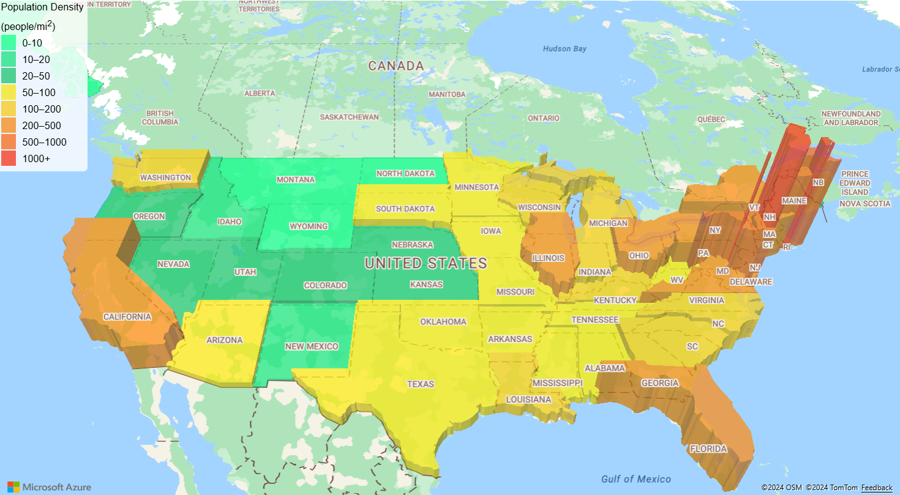
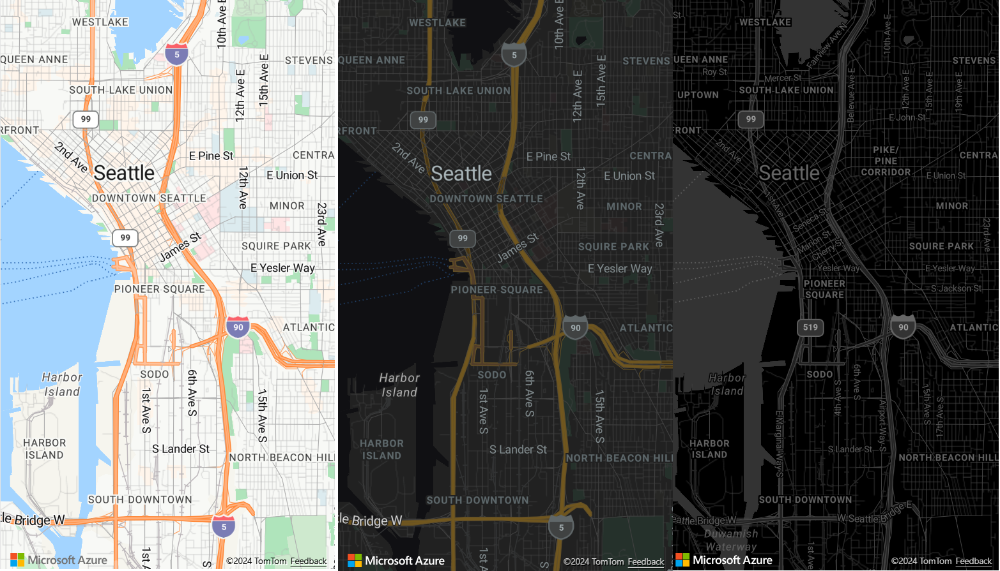
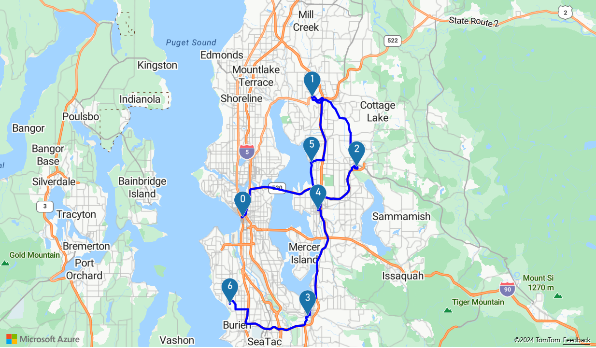
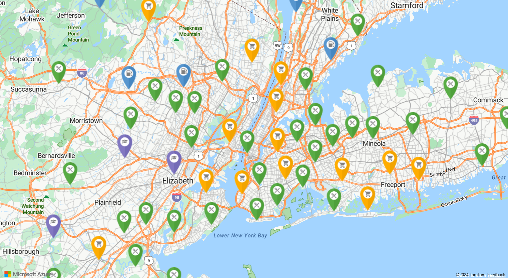

# What is Azure Maps?

Azure Maps is a collection of geospatial services that use fresh mapping data to provide geographic context to web and mobile applications. Azure Maps provides:

* REST APIs to render maps in multiple styles and in satellite imagery.''
* Search services to locate addresses, places, and points of interest around the world.
* Various routing options; such as point-to-point, multipoint, multipoint optimization, isochrone, commercial vehicle, traffic influenced, and matrix routing.
* Traffic flow view and incidents view, for applications that require traffic information.
* Mobility service to request public transit logistics, plan routes in real time, and  request information for alternative modes of transportation.
* Time zone and geolocation services and converting a location to time zones.
* Geofencing service and mapping data storage, with location information hosted in Azure. 
* Location intelligence through geospatial analytics. 

Additionally, Azure Maps services are available through the Web SDK or the Android SDK. These tools help developers quickly develop and scale solutions that integrate location information into Azure solutions. 

You can sign up for a free [Azure Maps account](https://azure.microsoft.com/services/azure-maps/) and start developing.

The following video explains Azure Maps in depth:

<br/>

<iframe src="https://channel9.msdn.com/Shows/Internet-of-Things-Show/Azure-Maps/player?format=ny" width="960" height="540" allowFullScreen frameBorder="0"></iframe>

## Map controls

### Web SDK

The Azure Maps Web SDK lets you customize interactive maps with your own content and imagery. You can use this interactive map for both your web or mobile applications. The map control makes use of WebGL, so you can render large data sets with high performance. Develop with the SDK by using JavaScript or TypeScript.



### Android SDK

Use the Azure Maps Android SDK to create mobile mapping applications. 


## Services in Azure Maps

Azure Maps consists of the following nine services that can provide geographic context to your Azure applications.

### Data Service

Data is imperative for maps. Use Data Service to upload and store geospatial data for use with spatial operations or image composition.  Bringing customer data closer to the Azure Maps service will reduce latency, increase productivity, and create new scenarios in your applications. For details on this service, see the [Data Service API documentation](https://docs.microsoft.com/rest/api/maps/data).

### Mobility service

The Azure Maps Mobility service allows real-time trip planning. It returns the best possible route options and provides different kinds of travel modes. For metro (city) areas, these modes can include walking, biking, and public transit. You can request transit itinerary, line geometry, lists of stops, scheduled arrivals, real-time arrivals, and service alerts.

The service also allows searches for specific object types around a location. Users can search for shared bikes, scooters, or cars around a location. Users can request the number of available bikes in the closest dock and search available vehicles for ride-sharing. And, users can find details like future availability of vehicles and current fuel level.

To learn more about the service, see the [Mobility API documentation](https://docs.microsoft.com/rest/api/maps/mobility).

### Render service

The Render service helps developers create web and mobile applications with mapping features. The service uses either high-quality raster graphic images, available in 19 zoom levels, or fully customizable vector format map images.



The Render service now offers preview APIs to allow developers to work with satellite imagery. For more details, read the [Render API documentation](https://docs.microsoft.com/rest/api/maps/render).

### Route service

The Route service contains robust geometry calculations for real-world infrastructure and directions for multiple transportation modes. The service allows developers to calculate directions across a number of travel modes such as car, truck, bicycle, or walking. The service also considers inputs such as traffic conditions, weight restrictions, or hazardous material transport.



The Route service offers a preview of advanced features, such as: 

* Batch processing of multiple route requests.
* Matrices of travel time and distance between a set of origins and destinations.
* Finding routes or distances that users can travel based on time or fuel requirements. 

For details on the routing capabilities, read the [Route API documentation](https://docs.microsoft.com/rest/api/maps/route).

### Search service

The Search service helps developers search for addresses, places, business listings by name or category, and other geographic information. The Search service can [reverse geocode](https://en.wikipedia.org/wiki/Reverse_geocoding) addresses and cross streets based on latitudes and longitudes.



The Search service also provides advanced features such as:

* Search along a route.
* Search inside a wider area.
* Batch a group of search requests.
* Search for larger area instead of a location point. 

APIs for batch and area search are currently in preview. For more details on the search capabilities, read the [Search API documentation](https://docs.microsoft.com/rest/api/maps/search).

### Spatial Operations service

The Azure Maps Spatial Operations service takes location information. It quickly analyzes location information to help inform customers of ongoing events happening in time and space. It enables near real-time analysis and predictive modeling of events. 

The service enables customers to enhance their location intelligence with a library of common geospatial mathematical calculations. Common calculations include closest point, great circle distance, and buffers. To learn more about the service and the various features, read the [Spatial Operations API documentation](https://docs.microsoft.com/rest/api/maps/spatial).

### Time Zone service

The Time Zone service enables you to query current, historical, and future time zone information. You can use either latitude and longitude pairs or an [IANA ID](https://www.iana.org/). The Time Zone service also allows for:

* Converting Microsoft Windows time-zone IDs to IANA time zones.
* Fetching a time-zone offset to UTC.
* Getting the current time in a chosen time zone. 

A typical JSON response for a query to the Time Zone service looks like the following sample:

```JSON
{
    "Version": "2017c",
    "ReferenceUtcTimestamp": "2017-11-20T23:09:48.686173Z",
    "TimeZones": [{
        "Id": "America/Los_Angeles",
        "ReferenceTime": {
            "Tag": "PST",
            "StandardOffset": "-08:00:00",
            "DaylightSavings": "00:00:00",
            "WallTime": "2017-11-20T15:09:48.686173-08:00",
            "PosixTzValidYear": 2017,
            "PosixTz": "PST+8PDT,M3.2.0,M11.1.0"
        }
    }]
}
```

For details on this service, read the [Time Zone API documentation](https://docs.microsoft.com/rest/api/maps/timezone).

### Traffic service

The Traffic service is a suite of web services that developers can use for web or mobile applications that require traffic information. The service provides two data types:

* Traffic flow: Real-time observed speeds and travel times for all key roads in the network.
* Traffic incidents: An up-to-date view of traffic jams and incidents around the road network.


For more information, see the [Traffic API documentation](https://docs.microsoft.com/rest/api/maps/traffic).

### IP to Location service

Use the IP to Location service to preview the retrieved two-letter country/region code for an IP address. This service can help you enhance user experience by providing customized application content based on geographic location.

For more details on the IP to Location service in the REST API, read the [Azure Maps Geolocation API documentation](https://docs.microsoft.com/rest/api/maps/geolocation).

## Programming model

Azure Maps is built for mobility and can help you develop cross-platform applications. It uses a programming model that's language agnostic and supports JSON output through [REST APIs](https://docs.microsoft.com/rest/api/maps/).

Also, Azure Maps offers a convenient [JavaScript map control](https://docs.microsoft.com/javascript/api/azure-maps-control) with a simple programming model. The development is quick and easy for both web and mobile applications.

## Usage

Accessing the Azure Maps services is a matter of going to the [Azure portal](https://portal.azure.com) and creating an Azure Maps account.

Azure Maps uses a key-based authentication scheme. Your account comes with two keys already generated for you, use either keys. Start integrating these location capabilities in your application and make requests to the Azure Maps services.

Note - Azure Maps shares customer-provided address/location queries ("Queries") with third party TomTom for mapping functionality purposes. Queries are not linked to any customer or end-user when shared with TomTom and cannot be used to identify individuals. Microsoft is currently in the process of adding TomTom to the Online Services Subcontractor List. Note that the Mobility and Weather Services which include integration with Moovit and AccuWeather are currently in [PREVIEW](https://azure.microsoft.com/support/legal/preview-supplemental-terms/).

## Supported regions

The Azure Maps APIs are currently available in all countries and regions except these:

* China
* South Korea

Verify that the location of your current IP address is in a supported country/region.

## Next steps

Try a sample app that showcases Azure Maps:

> [!div class="nextstepaction"]
> [Quickstart: Create a web app](quick-demo-map-app.md)

Stay up to date on Azure Maps: 

> [!div class="nextstepaction"]
> [Azure Maps blog](https://azure.microsoft.com/blog/topics/azure-maps/)
